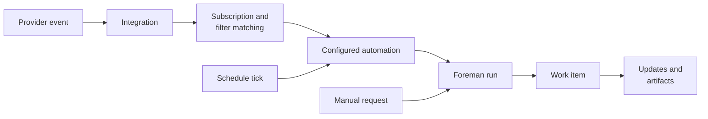

Connect a factory to the tools where work is discussed, tracked, and reviewed. Each intake path preserves source context and returns results.

## Choose a source

| Source | Best for | Context continuity | Typical outputs |
| --- | --- | --- | --- |
| Slack | Chat and support requests | Thread or DM | Summary and issue or pull request links |
| GitHub | Issues, pull requests, reviews, and CI | Issue, pull request, or review thread | Comments, branches, and pull request links |
| Linear | Planned issues | Issue and agent session | Plans, updates, and pull request links |
| Jira | Rovo assignment | Rovo agent session | Task status and text result |
| Factory MCP | Local-agent handoffs | Work item | Notes and artifacts |
| Direct or scheduled automation | One-off or recurring work | Work item | Summaries and code changes |

## Connect and verify intake

1. Select a factory. Follow the [Warp Factories quickstart](./quickstart) if needed.
2. Authorize the provider at its narrowest scope, or configure the Factory MCP, a direct run, or a schedule.
3. For provider events, configure the automation's agent, run settings, subscriptions, and filters. Configure recurring work with a schedule; manual requests start the foreman directly.
4. Trigger the path, then confirm the expected work item and source updates.

## How intake works

Provider events pass through integration and subscription/filter matching. Schedule ticks invoke their configured automation; manual requests start a foreman run. Every path creates a work item. See [how Warp Factories work](./how-factories-work) for later stages.

## Intake boundaries

| Concern | Boundary and behavior |
| --- | --- |
| Authorization | Slack uses one app per factory. GitHub uses a GitHub App installation and repository grants. Linear uses an OAuth workspace connection. Jira uses a site connection. Grant the narrowest provider-supported scope. |
| Tracker selection | A factory can use Linear, Jira, or no issue tracker, but its definition can declare only one tracker. The selection changes the seeded tracker skill and prompt appendix. The setup wizard currently offers Linear; configure Jira after setup or through factory definitions. |
| Routing | Subscriptions and filters select an automation for provider events. A schedule tick invokes its configured automation directly. A manual request starts a foreman run directly. Filters can select repository, channel, team, project, label, author, or status when available; they do not reduce integration access. |
| Duplicate delivery | Providers can retry events. Warp avoids duplicate work when the source identifies a repeated delivery, but receiving workflows must remain safe to retry, especially for Jira. |
| Continuation | A new reply is not a duplicate. Slack threads; GitHub issues, pull requests, and review threads; and Linear issues and agent sessions can continue an existing work item. Jira continues through follow-ups in the same Rovo agent session. |
| Output policy | Writeback follows provider grants and separately configured repository credentials. Branch protection and review still apply; humans decide what merges. |

## Integration guides

* [Slack](./integrations/slack) - Route chat requests, direct messages, and thread follow-ups through a dedicated factory app.
* [GitHub](./integrations/github) - Route repository events with issue, pull request, review, or CI context.
* [Linear](./integrations/linear) - Route planned issues through issue activity and agent sessions.
* [Jira](./integrations/jira) - Route Jira Rovo assignments through an agent-session automation.

## Factory MCP

The Factory MCP connects local coding agents and other MCP clients to a factory. Use it to find work, inspect context, coordinate with the foreman, and return notes or completed artifacts to the same work item. See the [Factory MCP guide](./factory-mcp).

## Direct and scheduled automation

Start a manual factory run for one-off work without an external source. Use a scheduled automation for recurring maintenance or reports. Event-driven automations use a connected provider instead. See the [triggers overview](../platform/triggers/).

Next, define the receiving agents and intake rules with [factory definitions as code](./factory-as-code).
