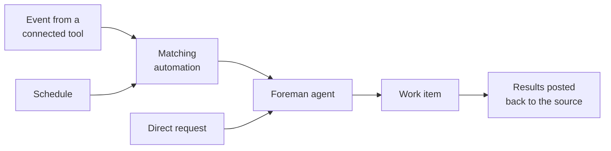

Connect your factory to the tools where your team already discusses, tracks, and reviews work. Wherever work starts, the factory keeps the original context from that source (the thread, issue, or pull request), and posts results in the same place.

Each source feeds into this factory's repositories. If the work belongs to a different product surface, [start a new factory](/factories/#sizing-a-factory) for it instead.

## Choose a source

Pick the sources that match where work starts for your team. You can connect multiple sources, but not both Linear and Jira at the same time. The setup wizard currently offers Linear; to use Jira, connect it after setup or in your [factory definition](/factories/factory-as-code/).

Once a source is connected, here's the concrete action that hands it work — each links to that integration's full instructions rather than repeating them.

| Source | Best for | Start work by | Continues in |
| --- | --- | --- | --- |
| [Slack](/factories/integrations/slack/) | Chat and support requests | [Mentioning the app in a channel, thread, or DM](/factories/integrations/slack/#start-and-continue-work-from-slack) | The Slack thread or DM |
| [GitHub](/factories/integrations/github/) | Issues, pull requests, reviews, and CI | [Adding the factory's label and mentioning **@warp-factory**](/factories/integrations/github/#mention-the-factory) | The issue, pull request, or review thread |
| [GitLab](/factories/integrations/gitlab/) | Merge request activity and bot mentions | [Mentioning the factory's bot in a merge request comment](/factories/integrations/gitlab/#mention-the-factory) | The merge request thread |
| [Linear](/factories/integrations/linear/) | Planned issues | [Assigning the issue to the factory, or mentioning the Warp app in a comment](/factories/integrations/linear/#route-agent-sessions) | The Linear issue and its agent session |
| [Jira](/factories/integrations/jira/) | Work items assigned to Warp | [Assigning or mentioning **Warp** on a work item](/factories/integrations/jira/#connect-jira-and-add-an-automation) | The Jira agent session |
| [Custom webhooks](/factories/webhooks/) | Any system that can POST JSON: CI, monitoring, alerting, and internal tools | [Posting JSON to the webhook's URL from the external system](/factories/webhooks/#configure-the-sender) | The factory work item |
| [Factory API](/factories/factory-api/) | Custom integrations and scripts that dispatch by factory UID | [Calling `POST /factory/{uid}/runs` with a prompt](/factories/factory-api/#dispatch-a-run-to-a-factory) | The factory work item |
| [Factory MCP](/factories/factory-mcp/) | Exchanging work with a local coding agent, in both directions | [Calling `send_task` from a connected coding agent](/factories/factory-mcp/#send-new-work-to-a-factory) | The factory work item |
| Direct runs and schedules | One-off or recurring work | [Clicking **New** on the factory's Runs page, or adding a schedule trigger](#direct-runs-and-schedules) | The factory work item |

## Connect a source

Each integration guide walks through authorizing access — grant only what the factory needs. New connections add default automations, so events start working right away. Review the [automations](/factories/automations/) and adjust their filters and run settings to fit your workflow.

After connecting, send a test request, such as mentioning the factory in Slack or assigning it an issue, and confirm it picks up the work and replies at the source.

{/* VISUAL: The factory's Integrations settings connect screen, to ground the abstract source table above in the actual setup flow. */}

## How work reaches your factory



An event from a connected tool starts the automation based on filter matching, such as a specific repository, channel, or label. Schedules start their automation on a timer, and direct requests go straight to the factory.

Every request lands with the foreman agent, which turns it into a work item and dispatches the agents each stage needs. A reply in the same thread, issue, or pull request continues that work item instead of starting a new one, and repeated event deliveries don't create duplicates. See [how Warp Factories work](/factories/how-factories-work/) for the full lifecycle, including where people stay in the loop.

## Review the default automations

When you create a factory through the setup wizard, Warp adds default automations for each tool you connect, so common requests work immediately:

* **GitHub** - Starts work when the factory is mentioned or assigned, and follows up when pull requests close or merge, completing a linked tracker issue when it can. See the [GitHub integration guide](/factories/integrations/github/).
* **GitLab** - Starts work when someone mentions the factory's bot in a merge request comment. See the [GitLab integration guide](/factories/integrations/gitlab/).
* **Jira** - Starts work when someone assigns or mentions Warp on a work item in one of the Jira projects you selected. See the [Jira integration guide](/factories/integrations/jira/).
* **Linear** - Starts work when a new agent session arrives from one of the Linear teams you selected. See the [Linear integration guide](/factories/integrations/linear/).
* **Slack** - Starts work from mentions and messages, as described in the [Slack integration guide](/factories/integrations/slack/).

These defaults are starting points. Review each automation's filters, agent, and run settings, and adjust them to match your workflow. For automation files you can adapt, such as CI failure triage, a scheduled dependency audit, and Slack reaction intake, see [`06-common-automations`](https://github.com/warpdotdev/warp-factory-examples/tree/main/examples/06-common-automations) in the [warp-factory-examples](https://github.com/warpdotdev/warp-factory-examples) repository.

## Custom webhooks

A [custom webhook](/factories/webhooks/) gives the factory an authenticated URL that any system can POST JSON to, and an automation decides which deliveries start work by filtering on the payload. Use it for tools Warp doesn't connect to directly, such as your CI system, PagerDuty, Sentry, or Stripe, without writing any code on your side.

## Factory API

The [factory API](/factories/factory-api/) lets your own code discover a factory and dispatch a task to it by UID, without knowing which agent handles the work. Use it to build a custom integration for a tool Warp doesn't connect to directly - see [Build a Mattermost bot for Warp Factories](/guides/external-tools/build-a-mattermost-bot-for-warp-factories/) for a worked example.

## Factory MCP

The Factory MCP connects local coding agents and other MCP clients to your factory, and it works in both directions. Send work to the factory, or take work over from it by pulling a task down to your machine, iterating on it locally, and handing it back to the same work item. See the [Factory MCP guide](/factories/factory-mcp/).

## Direct runs and schedules

Not every task starts in an external tool:

* Start a direct run for one-off work. Click **New** on the factory's Runs page and describe the task to the foreman, the same way you would from Slack or an issue tracker.
* Create a scheduled automation for recurring work, such as maintenance or reports. See the [triggers overview](/platform/triggers/) for how schedules and other triggers work across the platform.

This automation from [`06-common-automations`](https://github.com/warpdotdev/warp-factory-examples/tree/main/examples/06-common-automations) runs a dependency audit every Monday:

```markdown title="automations/weekly-dependency-audit/automation.md"
---
triggers:
  - provider: schedule
    event: cron_fired
    schedule:
      name: weekly-dependency-audit
      cron: "0 9 * * 1"
---
Run the weekly dependency audit. List outdated and vulnerable dependencies,
apply safe minor and patch upgrades on a branch, run the tests, and open a
PR with the changes and a summary of anything that needs a human decision.
```
