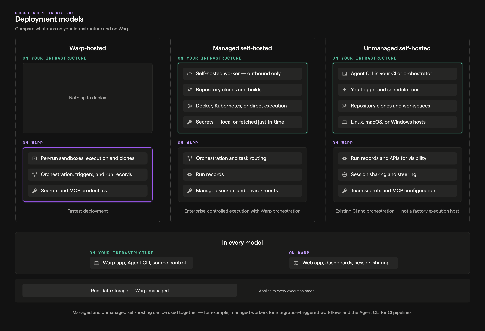
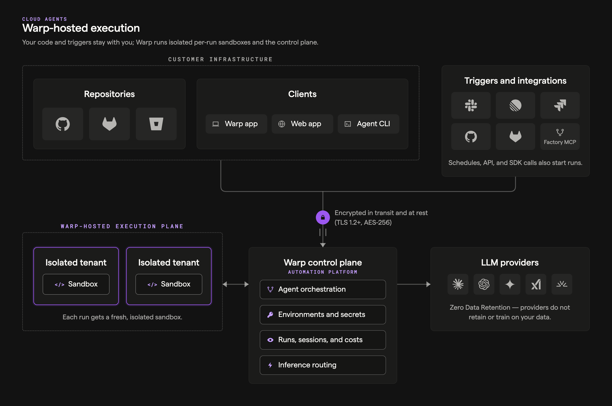

import { VARS } from '@data/vars';

Choose an execution model for your factory based on where its code must run and who operates the compute. Warp-hosted execution is the default. Managed self-hosting keeps checkout and command execution in your network while Warp coordinates the work.

## Choose an execution model

| If your factory needs to... | Choose |
| --- | --- |
| Run public repositories and services without operating workers | [Warp-hosted execution](#warp-hosted-execution) |
| Reach private repositories or services behind your network boundary | [Managed self-hosting](#managed-self-hosting) |
| Run standalone agents from CI or developer infrastructure, without a factory | [Unmanaged execution](/platform/unmanaged-execution/) |

Both factory options use the same [factory definition](/factories/factory-as-code/), [runners](/factories/runners/), and [factory dashboard](/factories/factory-dashboard/). The execution host changes the location of checkout, command execution, and the sandbox filesystem.

## Warp-hosted execution

Use this when your factory can reach its repositories and services over the public internet. The {VARS.WARP_AUTOMATION_PLATFORM} runs the work on Warp-managed infrastructure while your factory definition selects the agents, runner, workspace, and credentials.

See the [cloud agent run lifecycle](/platform/architecture/#cloud-agent-run-lifecycle) reference for a description of each component in the architecture.

### What it looks like

* **Work intake**: Factory automations, configured integrations, Factory MCP, or factory endpoints
* **Execution**: {VARS.WARP_AUTOMATION_PLATFORM}-hosted environments (Docker-based)
* **Visibility**: Factory dashboard, session sharing, and APIs

### Why teams choose it

* You want the simplest path to reproducible, scalable cloud execution.
* You want to run many tasks in parallel without building your own sandboxing and scaling layer.
* You want a consistent "production" setup with standardized environments and centralized configuration.

### Send work to a factory

* [Factory automations](/factories/automations/) route integration events, schedules, and webhooks to agents in the factory.
* [Factory integrations](/factories/connect-your-factory/) let teammates send work from Slack, Linear, Jira, GitHub, and GitLab.
* [Factory endpoints](/factories/factory-api/) let your service find a factory and dispatch work by UID.
* [Factory MCP](/factories/factory-mcp/) lets a coding agent hand work to a factory.

For standalone cloud-agent triggers, see [cloud agents](/platform/).

## Managed self-hosting

Use this when a factory must run checkout and execution on your infrastructure while the {VARS.WARP_AUTOMATION_PLATFORM} coordinates the work and records its results. Managed workers support Docker, Kubernetes, Direct, and external command backends. See [managed self-hosting](/factories/self-hosting/) for requirements and setup.

For standalone agents that you orchestrate directly from CI, Kubernetes, or developer infrastructure, use [unmanaged execution](/platform/unmanaged-execution/). See [execution security](/platform/execution-security/) for the data and network boundaries shared by both architectures.

## Related pages

* [Infrastructure and security](/factories/infrastructure-and-security/) - Choose execution, inference, storage, and credential boundaries for a factory.
* [Warp-hosted execution](/factories/warp-hosting/) - Review hosted execution capacity, networking, and supported environments.
* [Managed self-hosting](/factories/self-hosting/) - Install and operate a factory worker on your infrastructure.
* [Unmanaged execution](/platform/unmanaged-execution/) - Run standalone agents outside a factory.
