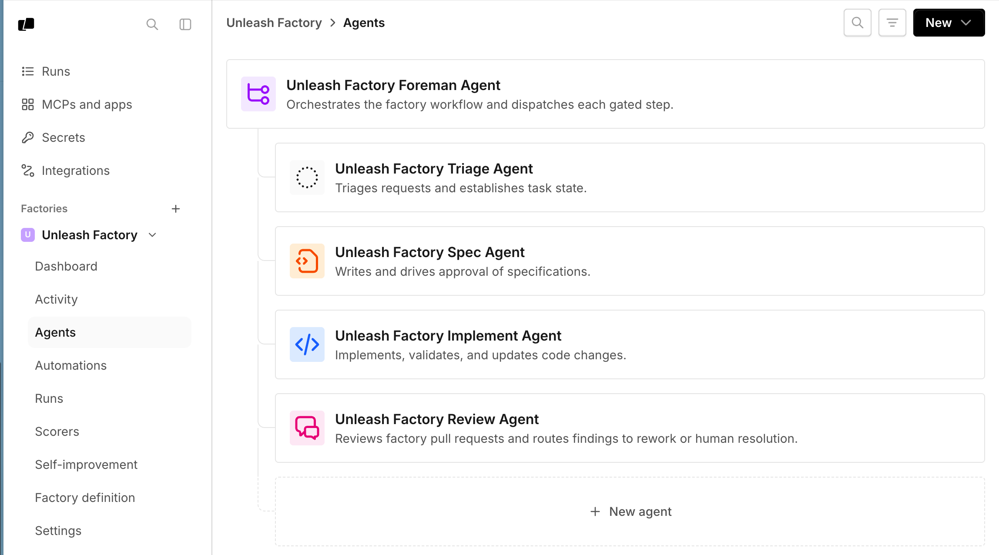
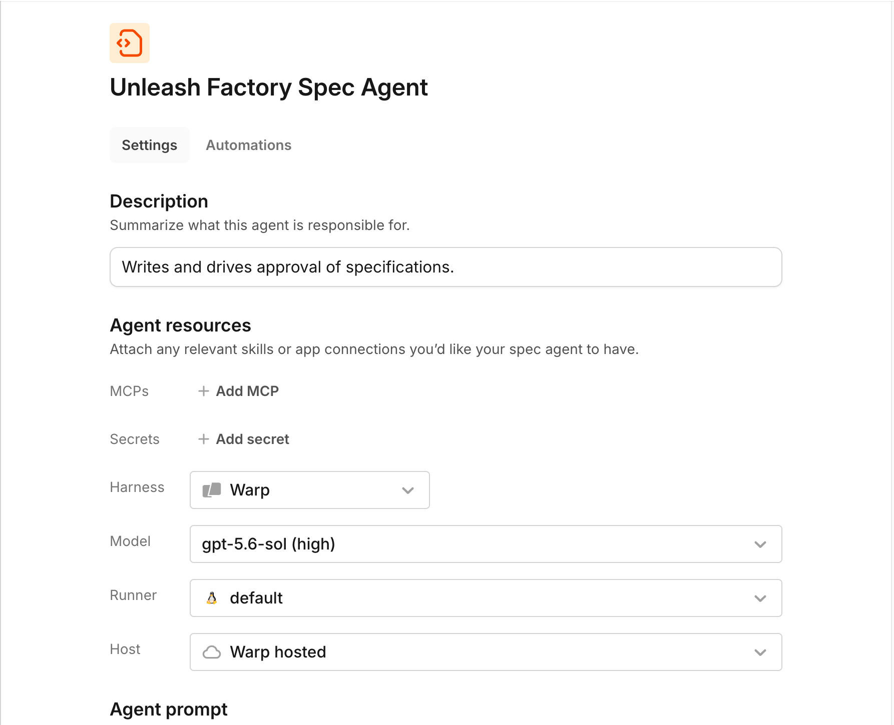

:::note
Warp Factories is in **Early Access** and available to a limited set of teams. [Request access](https://www.warp.dev/factories/request-access) to use it with your team.
:::

Every factory has a **foreman**, the agent you talk to from the tool that sends the request, such as Slack or Linear. Four other default agents each cover one part of the software development lifecycle: triage scopes the request, spec writes the plan, implement writes the code, and review checks it. Together they take a work item from the moment it reaches your factory to a pull request ready for review.

## The default agents

Every factory gets a foreman, and you choose one to four other agents to go with it. These defaults are a starting point — you can [add custom agents and automations](#add-custom-agents-and-automations) for work they don't cover. The default agents' prompts, descriptions, and models are reproduced as files in [`00-warp-default-agents`](https://github.com/warpdotdev/warp-factory-examples/tree/main/examples/00-warp-default-agents) in the [warp-factory-examples](https://github.com/warpdotdev/warp-factory-examples) repository.

| Agent | What it does | What it produces |
| --- | --- | --- |
| Foreman | Coordinates the work and talks to the requester | Decisions, questions, status updates, and the final handoff |
| Triage | Investigates the request and establishes scope | Evidence, issue context, complexity, and open questions |
| Spec | Turns requirements into a concrete plan with validation criteria | Product and technical specs in a draft pull request |
| Implement | Makes and validates the code change | Code, tests, validation results, and visual evidence |
| Review | Independently checks the finished change | Findings and a recommendation |

These are responsibilities, not a fixed pipeline. A small, well-understood change can skip the Planning stage entirely, and review can send work back for another pass. By default, work that goes through Planning needs a human to approve the spec before the Building stage starts.

For the complete lifecycle, see [how Warp Factories work](/factories/how-factories-work/).

### Foreman

The **foreman agent** runs the factory floor. It decides which agent a work item goes to next, hands the work over, and keeps the requester informed. It's the only default agent that talks to the requester directly. When another agent needs a human answer, the foreman asks the question and routes the answer back. For revisions and follow-ups, the foreman goes back to the same agent and continues its existing conversation instead of starting a new one, so no context is lost.

When the work is done, the foreman presents the final pull request and its supporting evidence, then marks the work item complete. Complete means the work was handed to a human, not that the change was merged or deployed. Merging stays with your team.

#### Foreman name

The foreman answers to a handle your team @-mentions in Slack and Linear, labeled **Foreman name** under **Settings** > **Identity** in the [factory dashboard](/factories/factory-dashboard/) and written as [`alias`](/factories/factory-as-code/#alias) in the definition. Factory setup copies it from the factory's name, so unless you change one of them, `payments` is the factory's name and `@payments` reaches its foreman.

They are still two things: the handle addresses the foreman, and the foreman speaks for the factory. Give them different names if the overlap causes confusion on your team.

### Triage

Triage researches the codebase and related issues first, and reproduces a problem only when research can't establish the cause. It reports context, scope, complexity, and open questions that the foreman uses to decide whether to ask the requester for clarification, request a spec, or go straight to implementation.

### Spec

Spec works through the foreman to define requirements, then writes product and technical specifications in a draft pull request with criteria for validating the change. The implement agent later continues that pull request. By default, the foreman waits for a person to approve the spec before implementation starts. Change that in the foreman's instructions.

### Implement

Implement continues the spec's branch and draft pull request rather than starting over. It adds tests, runs the repository's validation, and, when [computer use](/agents/capabilities/computer-use/) is available, captures visual evidence of user-facing changes. If review finds problems, implement revises. It never merges.

### Review

Review independently examines the change for unmet requirements, broken conventions, missing or failing tests, security issues, and evidence that doesn't hold up. It reruns or extends validation where the evidence is thin, then recommends accepting, revising, or asking a human to decide. The recommendation is advice — review doesn't approve or merge the pull request.

## Built-in skills

Every default agent comes with GitHub skills, and the foreman also comes with a Slack skill. The issue tracker you choose during setup adds to that baseline: choosing Linear or Jira gives the agents that tracker's skill and instructions. If you don't choose a tracker, the agents get only the baseline skills. Define custom procedures with [factory skills](/factories/factory-skills/) to extend what an agent can do beyond the built-in set.

## Configure agent behavior

1. In the [factory dashboard](/factories/factory-dashboard/), select your factory and click **Agents** in the sidebar.

   <figure style={{ maxWidth: "563px" }}>
   
   <figcaption>The Agents page lists a factory's foreman and default agents.</figcaption>
   </figure>

2. Click an agent to open its settings page. From here, you can edit the agent description, harness, model, runner, host, [MCP servers](/platform/mcp/), [secrets](/platform/secrets/), and instructions.

   <figure style={{ maxWidth: "563px" }}>
   
   <figcaption>An agent's settings page, where you configure its model, harness, runner, and host.</figcaption>
   </figure>

You can also manage the whole factory as version-controlled code, with [factory definition files](/factories/factory-as-code/) in a Git repository. A factory's settings live in one of two places: a **Warp-managed factory** lets you edit everything, including harness, auth, and credential strategy, from the dashboard. A **GitHub-backed factory** keeps those settings in its definition files instead, so the dashboard shows them read-only and you edit the files to make changes. See [where the definition lives](/factories/factory-as-code/#where-the-definition-lives) for the full difference.

Factory setup doesn't choose models for you. To change the model an agent uses, edit that agent.

## Choose models and harnesses per agent

Each agent can run on its own model and harness. Supported harnesses include the Warp Agent harness, Claude Code, and Codex, and any agent can use any of them. A foreman running on Claude Code or Codex can still dispatch the factory's other agents, and the runs it starts are still tracked as its children.

:::note
Third-party harnesses require a Build plan or higher; on the Free plan every agent runs on the Warp Agent harness. See [Warp pricing](https://www.warp.dev/pricing) for what each plan includes.
:::

Default model IDs change over time, so choose based on what each agent has to do well:

| Agent | What to optimize for |
| --- | --- |
| Foreman | Orchestration, instruction following, and long-running conversations |
| Triage | Research, evidence gathering, and working with connected tools |
| Spec | Synthesizing requirements, technical reasoning, and precise writing |
| Implement | Coding strength, with a harness that fits your repositories and toolchain |
| Review | A different model or harness from the implement agent, so the two don't share blind spots |

See [model choice for agents](/agents/inference/model-choice/) and [harnesses for cloud agents](/platform/harnesses/) for available options.

### Configuring a third-party harness

Switch an agent onto Claude Code or Codex to run it with that provider's own coding tool instead of the Warp Agent.

1. Open the agent's settings (see [Configure agent behavior](#configure-agent-behavior)) and choose **Claude Code** or **Codex** in the **Harness** field. Third-party harnesses require a Build plan or higher; without one, you can only use the Warp Agent harness until your team upgrades or an admin enables it.
2. Choose or create a credential in the **Auth** field that appears below **Harness**. The dropdown lists compatible, team-owned secrets: Claude Code accepts an Anthropic API key, an Anthropic Bedrock API key, or an Anthropic Bedrock access key; Codex accepts an OpenAI API key. Pick an existing secret, or choose **New auth secret** to store one without leaving the page. See [connecting Claude Code credentials](/platform/harnesses/authentication/#connecting-claude-code-credentials) and [connecting Codex credentials](/platform/harnesses/authentication/#connecting-codex-credentials) for how to obtain each key.
3. Choose a **Model** from that harness's own catalog. Changing harness clears any previously selected model and auth, so reselect both. A Codex model option pairs a model with a reasoning level (for example, `gpt-5.5 (high)`).
4. Click **Save changes** to confirm the agent's new **Harness**, **Auth**, and **Model**.

With a Warp-managed factory, you can edit harness, auth, and model from the dashboard. A GitHub-backed factory sets them through [`agentDefaults.harness` or a per-agent `harness` override](/factories/factory-as-code/#agentdefaultsharness) in the definition files. For an example, see [`03-multi-harness`](https://github.com/warpdotdev/warp-factory-examples/tree/main/examples/03-multi-harness).

## Add custom agents and automations

Add custom agents for jobs the default agents don't handle, such as documentation, security analysis, migrations, or release checks. A custom agent doesn't have to be a required step for every work item.

Automations start a chosen agent on a [schedule](/factories/factory-as-code/#triggersschedule) or when an event fires. They're one more way for work to enter your factory; the foreman still coordinates whatever they start. For all the ways to route work into a factory, see [connect your factory](/factories/connect-your-factory/).

## Human decision points and permissions

| Decision | Default behavior | What enforces it |
| --- | --- | --- |
| Spec approval | The foreman asks a human to clarify ambiguity and approve every spec | Workflow policy in the foreman's instructions, which your team can change |
| Merging | Agents never merge; the foreman hands the finished pull request to a human | Your repository's permissions decide who can approve and merge |
| Runtime access | Each agent reaches only the repositories, secrets, and MCP servers in its configuration | Platform configuration and the permissions of the connected providers |

The first two rows are conventions: they live in the foreman's instructions and your repository settings, and your team can change them. Access is different. What an agent can reach comes from its configuration and the permissions of the connected providers, never from its instructions — changing what an agent is told to do doesn't change what it's able to do.

So enforce with the real controls: branch protection and repository permissions decide who merges, and each agent's configuration decides what it can reach.

Next, capture these choices in [factory definitions as code](/factories/factory-as-code/).
