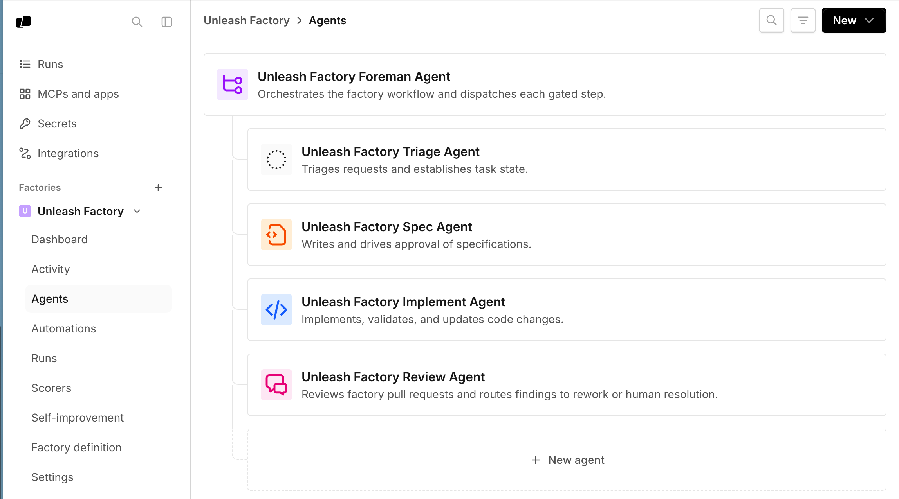
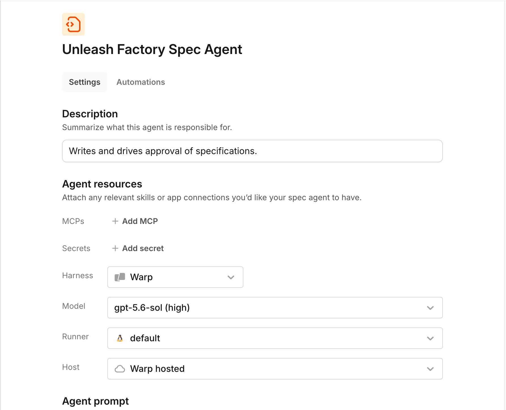
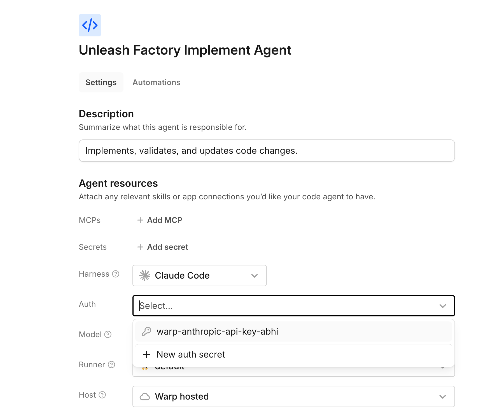

Every factory has a **foreman**, the agent you talk to from the tool that sends the request, such as Slack or Linear. Four other default agents each cover one part of the software development lifecycle: triage scopes the request, spec writes the plan, implement writes the code, and review checks it. Together they take a work item from the moment it reaches your factory to a pull request ready for review.

## The default agents

Every factory gets a foreman, and you choose one to four other agents to go with it. These defaults are a starting point; [add custom agents](#add-custom-agents) for work they don't cover. The default agents' prompts, descriptions, and models are reproduced as files in [`00-warp-default-agents`](https://github.com/warpdotdev/warp-factory-examples/tree/main/examples/00-warp-default-agents) in the [warp-factory-examples](https://github.com/warpdotdev/warp-factory-examples) repository.

| Agent | What it does | What it produces |
| --- | --- | --- |
| Foreman | Coordinates the work and talks to the requester | Decisions, questions, status updates, and the final handoff |
| Triage | Investigates the request and establishes scope | Evidence, issue context, complexity, and open questions |
| Spec | Turns requirements into a concrete plan with validation criteria | Product and technical specs in a draft pull request |
| Implement | Makes and validates the code change | Code, tests, validation results, and visual evidence |
| Review | Independently checks the finished change | Findings and a recommendation |

These are responsibilities, not a fixed pipeline. A small, well-understood change can skip the Planning stage entirely, and review can send work back for another pass. By default, work that goes through Planning needs a human to approve the spec before the Building stage starts.

For the complete lifecycle, see [how Warp Factories work](/factories/how-factories-work/).

### Foreman

The **foreman agent** runs the factory floor. It decides which agent a work item goes to next, hands the work over, and keeps the requester informed. It's the only default agent that talks to the requester directly. When another agent needs a human answer, the foreman asks the question and routes the answer back. For revisions and follow-ups, the foreman goes back to the same agent and continues its existing conversation instead of starting a new one.

When the work is done, the foreman presents the final pull request and its supporting evidence, then marks the work item complete. Complete means the work was handed to a human, not that the change was merged or deployed. Merging stays with your team.

#### Foreman name

The foreman answers to a handle your team @-mentions in Slack and Linear, labeled **Foreman name** under **Settings** > **Identity** in the [factory dashboard](/factories/factory-dashboard/) and written as [`alias`](/factories/factory-as-code/#alias) in the definition. Factory setup copies it from the factory's name, so unless you change one of them, `payments` is the factory's name and `@payments` reaches its foreman.

They are still two things: the handle addresses the foreman, and the foreman speaks for the factory. Give them different names if the overlap causes confusion on your team.

### Triage

Triage researches the codebase and related issues first, and reproduces a problem only when research can't establish the cause. It reports context, scope, complexity, and open questions that the foreman uses to decide whether to ask the requester for clarification, request a spec, or go straight to implementation.

### Spec

Spec works through the foreman to define requirements, then writes product and technical specifications in a draft pull request with criteria for validating the change. The implement agent later continues that pull request. By default, the foreman waits for a person to approve the spec before implementation starts. Change that in the foreman's instructions.

### Implement

Implement continues the spec's branch and draft pull request rather than starting over. It adds tests, runs the repository's validation, and, when [computer use](/agents/capabilities/computer-use/) is available, captures visual evidence of user-facing changes. If review finds problems, implement revises. It never merges.

### Review

Review independently examines the change for unmet requirements, broken conventions, missing or failing tests, security issues, and evidence that doesn't hold up. It reruns or extends validation where the evidence is thin, then recommends accepting, revising, or asking a human to decide. The recommendation is advice — review doesn't approve or merge the pull request.

## Built-in skills

A new factory's definition includes skills for code quality, code review, and UI verification, plus one for each tool you connect: your code host, Slack or Microsoft Teams, and Linear or Jira. They live in the definition's `skills/` directory, so every agent can use them. See [factory skills](/factories/factory-skills/) for what each one covers and how to add your own.

## Configure agent behavior

1. From the [factory dashboard](/factories/factory-dashboard/) sidebar, select your factory and click **Agents**.

   <figure style={{ maxWidth: "563px" }}>
   
   <figcaption>The Agents page lists a factory's foreman and default agents.</figcaption>
   </figure>

2. Click an agent to open its settings page. From here, you can edit the agent description, harness, model, runner, host, [MCP servers](/platform/mcp/), [secrets](/platform/secrets/), and instructions.

   <figure style={{ maxWidth: "563px" }}>
   
   <figcaption>An agent's settings page, where you configure its model, harness, runner, and host.</figcaption>
   </figure>

Where you make these changes depends on [where the factory's definition lives](/factories/factory-as-code/#where-the-definition-lives):

* **Warp-managed factory** - Edit everything, including harness, auth, and credential strategy, from the dashboard.
* **GitHub-backed factory** - The settings live in the definition files. The dashboard shows them read-only, and you change them by editing the files.

Setup assigns each default agent a model suited to its role. To change it, edit the agent.

## Choose models and harnesses per agent

Each agent can run on its own model and harness. Supported harnesses include the Warp Agent harness, Claude Code, and Codex, and any agent can use any of them. A foreman running on Claude Code or Codex can still dispatch the factory's other agents, and the runs it starts are still tracked as its children.

Third-party harnesses require a paid plan; on the Free plan every agent runs on the Warp Agent harness. See [Warp pricing](https://www.warp.dev/pricing) for what each plan includes.

Default model IDs change over time, so choose based on what each agent has to do well:

| Agent | What to optimize for |
| --- | --- |
| Foreman | Orchestration, instruction following, and long-running conversations |
| Triage | Research, evidence gathering, and working with connected tools |
| Spec | Synthesizing requirements, technical reasoning, and precise writing |
| Implement | Coding strength, with a harness that fits your repositories and toolchain |
| Review | A different model or harness from the implement agent, so the two don't share blind spots |

The model picker also includes custom routers from factories you can access. See [model choice for agents](/agents/inference/model-choice/), [custom model routers](/agents/inference/custom-routers/), and [harnesses for cloud agents](/platform/harnesses/) for available options.

### Configuring a third-party harness

Change an agent's harness to Claude Code or Codex to run it with that provider's own coding tool instead of the Warp Agent.

1. From the [factory dashboard](/factories/factory-dashboard/) sidebar, select your factory and click **Agents**.
2. Click an agent to open its settings page. In the "Harness" dropdown, select **Claude Code** or **Codex**.
3. In the **Auth** field, choose a compatible, team-owned secret from the list or click **New auth secret** to create one.

   <figure style={{ maxWidth: "563px" }}>
   
   <figcaption>The Auth field's dropdown, showing a team-owned secret and the option to add a new one.</figcaption>
   </figure>

   :::note
   * Claude Code accepts an Anthropic API key, Anthropic Bedrock API key, or Anthropic Bedrock access key.
   * Codex accepts an OpenAI API key.

   See [connecting Claude Code credentials](/platform/harnesses/authentication/#connecting-claude-code-credentials) and [connecting Codex credentials](/platform/harnesses/authentication/#connecting-codex-credentials) for how to obtain each key.
   :::

4. Choose a **Model** from that harness's own catalog.
5. In the top-right corner, click **Save**.

With a Warp-managed factory, you can edit harness, auth, and model from the dashboard. A GitHub-backed factory sets them through [`agentDefaults.harness` or a per-agent `harness` override](/factories/factory-as-code/#agentdefaultsharness) in the definition files. For an example, see [`03-multi-harness`](https://github.com/warpdotdev/warp-factory-examples/tree/main/examples/03-multi-harness).

## Add custom agents

Add a custom agent for a role that needs separate instructions, configuration, and runs.

For a Warp-managed factory, open **Agents** in the [factory dashboard](/factories/factory-dashboard/), click **New**, then click **Custom agent**. For a GitHub-backed factory, add `agents/<name>/agent.md`. See the [`agent.md` configuration keys](/factories/factory-as-code/#agentsnameagentmd).

A custom agent gets the factory-wide skills under `skills/` but no role instructions of its own, so write its job into `agent.md`. For procedures only that agent needs, add a skill under `agents/<name>/skills/`. See [factory skills](/factories/factory-skills/).

### How the foreman dispatches agents

The foreman starts the factory's other agents as child runs with the `run_agents` tool, selecting each one by its UID in `agent_run_configs[].agent_identity_uid`. A child run started this way inherits that agent's environment, runner, host, harness, and model unless the call overrides them; a child started without a factory agent's UID runs with no factory configuration, as in [multi-agent orchestration](/platform/orchestration/) from any Warp conversation. Keep that dispatch step if you rewrite the foreman's instructions or add a custom coordinating agent.

### Automations

[Automations](/factories/automations/) start a chosen agent on a [schedule](/factories/factory-as-code/#triggersschedule) or when an event arrives from a connected tool. They're one more way for work to enter the factory; the foreman still coordinates whatever they start. For every way to route work into a factory, see [connect your factory](/factories/connect-your-factory/).

## Human decision points and permissions

| Decision | Default behavior | What enforces it |
| --- | --- | --- |
| Spec approval | The foreman asks a human to clarify ambiguity and approve every spec | Workflow policy in the foreman's instructions, which your team can change |
| Merging | Agents never merge; the foreman hands the finished pull request to a human | Your repository's permissions decide who can approve and merge |
| Runtime access | Each agent reaches only the repositories, secrets, and MCP servers in its configuration | Platform configuration and the permissions of the connected providers |

Instructions decide what an agent is told to do; configuration and provider permissions decide what it can reach. Enforce merge policy with branch protection and repository permissions, and enforce access with each agent's configuration.

## Related pages

* [How Warp Factories work](/factories/how-factories-work/) - The stages a work item moves through and where people decide.
* [Factory skills](/factories/factory-skills/) - The built-in skills every agent starts with, and how to add your own.
* [Factory definition syntax](/factories/factory-as-code/) - Every `agent.md` key, including per-agent model, harness, and runner overrides.
* [Harnesses for cloud agents](/platform/harnesses/) - What each harness supports and how to authenticate it.
* [Connect your factory](/factories/connect-your-factory/) - The sources that send work to the foreman.
