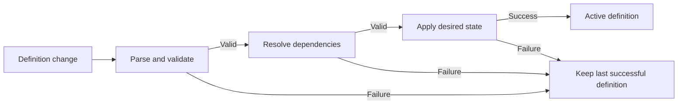

Factory definitions as code make a Git repo the desired state for a file-managed factory's repositories, agents, automations, runners, skills, and execution settings.

## Configuration source modes

A factory can be created live-managed or file-managed. A live-managed factory becomes file-managed after you link a definition source.

| Mode | Source of truth | Edit surface | Review and synchronization |
| --- | --- | --- | --- |
| Live-managed | Control-room state | Control room | No file sync until a definition source is linked. |
| GitHub-backed | Registered production-branch directory | Customer GitHub repo; read-only control-room links | Pull requests receive checks, and production pushes sync. An admin can unlink to return to live-managed mode. |
| Warp-managed | Warp-managed factory repo | **Code** tab and supported control-room editors | Edits validate, commit, and sync directly. The source cannot be unlinked or switched; failures keep the last successful definition active. |

For a Warp-managed source, the **Code** tab edits the tree. Compare-and-swap saves use the loaded head, report conflicts instead of overwriting newer commits, and validate the whole tree with file and line diagnostics. GitHub-backed sources link to the registered directory.

Operational state remains in the control room.

## Directory structure

Resource names come from directory and file paths. There are no `kind` or `apiVersion` fields.

```text
factory.yaml
agents/
  foreman/
    agent.md
    skills/
      incident-triage/
        SKILL.md
  reviewer/
    agent.md
automations/
  labeled-issue/
    automation.md
runners/
  linux-build.yaml
skills/
  repository-conventions/
    SKILL.md
```

Paths provide resource names. `skills/` is factory-wide, while `agents/<name>/skills/` is role-specific. Skills are directories, not YAML fields; see [Skills for agents](../agents/capabilities/skills).

## Resource reference

YAML keys are case-sensitive.

### `factory.yaml`


| Field | Purpose | Inheritance or constraint |
| --- | --- | --- |
| `schemaVersion` | Selects the definition schema. | Required. Must be `v1alpha1`. |
| `name` | Names the factory. | Required. |
| `description` | Describes the factory's purpose. | Optional. |
| `alias` | Sets a display alias. | Optional. Unique per workspace using a case-insensitive comparison. |
| `credentialStrategy` | Selects which principal supplies minted credentials. | `EXECUTOR` uses the execution principal; `CREATOR` uses the run creator. Defaults to `EXECUTOR`. |
| `repositories` | Lists working GitHub repositories as `owner` and `name`. | Required and non-empty. |
| `secrets` | Lists Warp-managed secret names. | Optional. Added to every agent's effective access. |
| `mcpServers` | Maps names to Warp MCP server `warpId` values. | Optional. Added to every agent's effective access. |
| `cloudProviders` | Configures GCP or AWS access. | GCP accepts `projectNumber`, `workloadIdentityFederationPoolId`, `workloadIdentityFederationProviderId`, and `serviceAccountEmail`; AWS accepts `roleArn`. |
| `integrations` | Declares connected factory integrations. | Optional. `type` accepts `slack`, `linear`, or `jira`. Declare at most one issue tracker: `linear` and `jira` are mutually exclusive, and omitting a tracker is also valid. GitHub access comes from `repositories` and the connected GitHub App. |
| `agentDefaults` | Sets shared `model` or `harness`, `runner`, `environmentId`, `secrets`, `mcpServers`, and `workerHost`. | Required. Agents inherit omitted execution fields. |
| `agentDefaults.workerHost` | Selects the default execution host. | A non-empty value becomes the factory default. Omit or clear it to defer to the workspace default. |

Warp still parses the legacy `providers` key. After a later Warp-managed edit, Warp writes the configuration as `cloudProviders`.

In the control room, **Settings** lets you edit cloud providers for Warp-managed sources. For GitHub-backed sources, cloud provider settings are read-only and link to `factory.yaml` in the registered repository directory.

Factory-level access and agent defaults have different inheritance rules. Top-level `secrets` and `mcpServers` are mandatory additions to every agent. An agent's `secrets` or `mcpServers` replaces the corresponding value from `agentDefaults`, but it does not remove the top-level entries. Other omitted execution fields inherit from `agentDefaults`.

Set `workerHost` to `warp` for Warp-hosted execution or to the ID of a connected self-hosted worker. An empty or `null` value clears the file-owned selection and defers to the workspace default.

Fields that accept a model or harness use one of two mutually exclusive forms. `model` selects the Warp Agent harness, serialized as type `oz`:

```yaml
model: auto
```

The shorthand is equivalent to:

```yaml
harness:
  type: oz
  model: auto
```

Use `harness` for a third-party harness or advanced settings:

```yaml
harness:
  type: codex
  model: gpt-5.3-codex
  reasoningLevel: high
  auth:
    source: managedSecret
    secretName: CODEX_API_KEY
```

The mapping accepts `type`, `model`, `reasoningLevel`, and `auth`. Authentication uses `managedSecret` with `secretName` or `workerEnvironment` without `secretName`. `workerEnvironment` requires an effective self-hosted `workerHost`. Type `oz` does not accept explicit `auth` or `reasoningLevel`. See [supported harnesses](../platform/harnesses/) and [cloud agent secrets](../platform/secrets).

### `agents/<name>/agent.md`

An agent file combines YAML frontmatter with a Markdown prompt body containing the role's durable instructions.

| Field | Purpose | Inheritance or constraint |
| --- | --- | --- |
| `description` | Describes the role. | Optional. |
| `agentType` | Classifies the role. | `CUSTOM`, `FOREMAN`, `TRIAGE`, `SPEC`, `IMPLEMENT`, `REVIEW`, or `VERIFY`; `MAIN` aliases `FOREMAN`. |
| `credentialStrategy` | Selects the credential principal for this agent. | Overrides the factory strategy. |
| `model` or `harness` | Selects the runtime and model. | Overrides `agentDefaults`; the fields are mutually exclusive. |
| `runner` | Names a path-defined or existing runner. | Overrides `agentDefaults.runner`. |
| `environmentId` | References an existing environment. | Overrides `agentDefaults.environmentId`. |
| `secrets` | Selects role-specific secrets. | Replaces `agentDefaults.secrets`; top-level `factory.yaml.secrets` still apply. |
| `mcpServers` | Selects role-specific MCP servers. | Replaces `agentDefaults.mcpServers`; top-level `factory.yaml.mcpServers` still apply. |
| `workerHost` | Selects the agent's execution host. | Omit to inherit `agentDefaults.workerHost`; clear to defer to the workspace default; set a value to override. |

A valid tree contains exactly one agent with `agentType: FOREMAN` or `agentType: MAIN`. Warp uses that agent as the factory's entry point and as the default target for automations that omit `agent`. Definitions with no foreman or more than one foreman fail validation.


### `automations/<name>/automation.md`

An automation file uses YAML frontmatter and a Markdown run prompt.

| Field | Purpose | Inheritance or constraint |
| --- | --- | --- |
| `enabled` | Enables or disables the automation. | Optional. |
| `agent` | Names a declared target agent. | Defaults to the foreman. |
| `model` or `harness` | Selects execution for automation runs. | Overrides the target agent; the fields are mutually exclusive. |
| `runner` | Selects compute. | Overrides the target agent's runner. |
| `environmentId` | Selects an environment. | Overrides the target agent's environment. |
| `secrets` | Selects secrets for automation runs. | Overrides the target agent's secret list. |
| `mcpServers` | Selects MCP servers for automation runs. | Overrides the target agent's MCP map. |
| `workerHost` | Selects execution for automation runs. | Omit to inherit the target agent; clear to defer to the workspace default; set a value to override. |
| `triggers` | Declares events or schedules that start runs. | Required and non-empty. Entries use `provider`, `event`, optional `filter`, and optional `schedule` with `name` and `cron`. |

See [triggers](../platform/triggers/) and [integrations](../platform/integrations/) for event sources.

### `runners/<name>.yaml`

A runner file defines compute rather than agent behavior.

| Field | Purpose | Inheritance or constraint |
| --- | --- | --- |
| `description` | Describes the supported workload. | Optional. |
| `setupCommands` | Initializes the sandbox. | Ordered list. |
| `instanceShape` | Sets compute capacity. | Uses `vcpus` and `memoryGb`. |
| `platform` | Sets the operating system and architecture. | Uses `os` and `arch`; Linux adds `linux.dockerImage`, while macOS adds `mac.version`. |

In the control room, **Runners** lists effective runners for every source mode. For a Warp-managed source, creating or editing a runner updates `runners/*.yaml`. For a GitHub-backed source, runner controls are read-only and link to that directory in the repository. See [cloud agent runners](../platform/runners) and [cloud agent environments](../platform/environments) for execution behavior.

## Example factory definition

This example combines one repository, foreman, GitHub-label automation, and Linux runner.

```yaml title="factory.yaml"
schemaVersion: v1alpha1
name: payments-factory
description: Processes approved work for the payments service
alias: payments
credentialStrategy: EXECUTOR
repositories:
  - owner: ACME
    name: PAYMENTS_SERVICE
agentDefaults:
  model: auto
  runner: linux-build
  environmentId: PAYMENTS_ENVIRONMENT_ID
```

`ACME` is the GitHub organization, `PAYMENTS_SERVICE` is the repository name, and `PAYMENTS_ENVIRONMENT_ID` is the ID of an existing environment.

```markdown title="agents/foreman/agent.md"
---
description: Routes approved payments work through the factory
agentType: FOREMAN
secrets:
  - SENTRY_AUTH_TOKEN
mcpServers:
  sentry:
    warpId: SENTRY_MCP_SERVER_ID
---

Own each work item from intake through human handoff.

Confirm the request is ready before dispatching implementation. Require
repository validation and independent review before marking work complete.
```

The foreman inherits `model`, `runner`, and `environmentId`. Its Sentry secret and MCP server are role-specific; moving them to `factory.yaml` would grant them to every agent.

```markdown title="automations/labeled-issue/automation.md"
---
enabled: true
agent: foreman
triggers:
  - provider: github
    event: issue_labeled
    filter:
      repos: [ACME/PAYMENTS_SERVICE]
      labels: [factory-ready]
---

Review the labeled issue and decide the next required stage. Preserve the
issue's acceptance criteria and return unresolved product questions to a human.
```

```yaml title="runners/linux-build.yaml"
description: Linux runner for payments builds and tests
setupCommands:
  - corepack enable
instanceShape:
  vcpus: 4
  memoryGb: 8
platform:
  os: linux
  arch: x86_64
  linux:
    dockerImage: ubuntu:22.04
```


## Validation and synchronization

Warp applies only a complete, resolved tree.



Validation rejects:

* Unknown fields, duplicate YAML keys, unsupported paths, and malformed frontmatter.
* YAML anchors, aliases, and explicit tags.
* A `schemaVersion` other than `v1alpha1`.
* Missing repositories, agent defaults, or automation triggers, and a roster without exactly one foreman.
* References to agents, runners, environments, secrets, MCP servers, models, or harness settings that do not resolve.

Diagnostics identify the source path and line. Warp does not partially apply an invalid tree.

### GitHub pull request checks

Pull requests targeting the production branch receive a `warp/factory-config (<directory>)` check for registered paths. The check annotates invalid fields or references and summarizes planned changes. A production push starts synchronization.

### Warp-managed direct synchronization

Supported control-room edits commit directly to the Warp-managed repo without a separate pull request, then validate and sync. Branch-based review gating is limited and is not a general workflow for these edits. If synchronization fails, the commit remains and the last successful definition stays active during repair.
