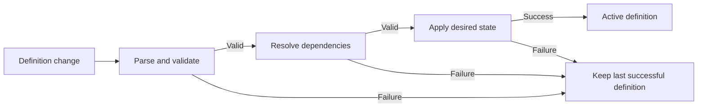

Factory definitions as code let you manage a factory's entire configuration as files in a Git repository. The files describe the factory's repositories, agents, automations, runners, skills, and execution defaults, and they are the source of truth: when the files change, Warp updates the factory to match. Because the definition is version-controlled, every change to the factory gets the same treatment as a code change, with review, history, and rollback.

## Live-managed and file-managed factories

Every factory manages its configuration in one of two ways:

* **Live-managed** - You edit the factory directly in the [control room](/factories/control-room/), the web app for operating a factory. There are no definition files.
* **File-managed** - Definition files in a Git repository are the source of truth, and the control room reflects them.

A file-managed definition lives in one of two places:

* **GitHub-backed** - A directory you register in a GitHub repository you own. You change the factory the way you change code: open a pull request, pass the validation check, and merge. In the control room, the file-owned settings are read-only and link to the files. An admin can unlink the source to return the factory to live-managed.
* **Warp-managed** - A repository Warp hosts for you. You edit the files in the control room's **Code** tab, and each save validates, commits, and syncs in one step. The source cannot be unlinked or switched.

A factory can be created in either mode, and a live-managed factory becomes file-managed once you link a definition source. The mode determines only where you edit configuration. Definition files describe how the factory is set up, not what it is doing: the work items, runs, and metrics the factory produces live in the control room in every mode and are never written to the files.

## Directory structure

A definition is a small tree of YAML and Markdown files. Each resource takes its name from its path: `agents/reviewer/agent.md` defines an agent named `reviewer`. There are no `kind` or `apiVersion` fields.

```text
factory.yaml
agents/
  foreman/
    agent.md
    skills/
      incident-triage/
        SKILL.md
  reviewer/
    agent.md
automations/
  labeled-issue/
    automation.md
runners/
  linux-build.yaml
skills/
  repository-conventions/
    SKILL.md
```

Skills live in two places: `skills/` applies to the whole factory, while `agents/<name>/skills/` applies only to that agent. A skill is a directory containing a `SKILL.md`, not a YAML field; see [Skills for agents](../agents/capabilities/skills).

## Resource reference

YAML keys are case-sensitive.

### `factory.yaml`

`factory.yaml` names the factory and sets everything shared across it: the repositories it works in, factory-wide access, and the execution defaults agents inherit.

| Field | Purpose | Rules |
| --- | --- | --- |
| `schemaVersion` | Declares the definition schema. | Required. Must be `v1alpha1`. |
| `name` | Names the factory. | Required. |
| `description` | Describes the factory's purpose. | Optional. |
| `alias` | Sets a display alias. | Optional. Must be unique in the workspace (case-insensitive). |
| `credentialStrategy` | Chooses whose credentials runs receive. | `EXECUTOR` uses the principal executing the run; `CREATOR` uses the user who created the run. Defaults to `EXECUTOR`. |
| `repositories` | Lists the GitHub repositories the factory works in, as `owner` and `name` pairs. | Required and non-empty. |
| `secrets` | Lists Warp-managed secret names granted to every agent. | Optional. |
| `mcpServers` | Maps server names to Warp MCP server `warpId` values, granted to every agent. | Optional. |
| `cloudProviders` | Configures GCP or AWS access. | GCP accepts `projectNumber`, `workloadIdentityFederationPoolId`, `workloadIdentityFederationProviderId`, and `serviceAccountEmail`; AWS accepts `roleArn`. |
| `integrations` | Declares connected factory integrations. | Optional. `type` accepts `slack`, `linear`, or `jira`. Declare at most one issue tracker: `linear` and `jira` are mutually exclusive, and omitting a tracker is valid. GitHub is not declared here; repository access comes from `repositories` and the connected GitHub App. |
| `agentDefaults` | Sets the execution defaults agents inherit: shared `model` or `harness`, `runner`, `environmentId`, `secrets`, `mcpServers`, and `workerHost`. | Required. Agents inherit any execution field they omit. |

Warp still parses the legacy `providers` key and saves it back as `cloudProviders`.

#### How access and defaults combine

Two different rules decide what an agent ends up with:

* **Factory-wide access is additive.** Top-level `secrets` and `mcpServers` in `factory.yaml` are granted to every agent. An agent cannot opt out of them.
* **Defaults are replaceable.** Values in `agentDefaults` apply only when an agent omits the field. An agent that sets its own `secrets` or `mcpServers` replaces the `agentDefaults` value, but the factory-wide entries still apply.

#### How `workerHost` resolves

`workerHost` follows the same three-way rule wherever it appears:

* **Set a value** to choose a host: `warp` for Warp-hosted execution, or the ID of a connected self-hosted worker.
* **Omit the field** to inherit from the level above.
* **Set an empty or `null` value** to skip inheritance and use the workspace default.

#### Choosing a model or harness

Fields that accept a model or harness take one of two mutually exclusive forms. `model` on its own selects the Warp Agent harness:

```yaml
model: auto
```

The shorthand is equivalent to:

```yaml
harness:
  type: oz
  model: auto
```

Use the `harness` form for a third-party harness or advanced settings:

```yaml
harness:
  type: codex
  model: gpt-5.3-codex
  reasoningLevel: high
  auth:
    source: managedSecret
    secretName: CODEX_API_KEY
```

A `harness` mapping accepts `type`, `model`, `reasoningLevel`, and `auth`. For `auth`, set `source: managedSecret` with a `secretName`, or `source: workerEnvironment` with no `secretName`; `workerEnvironment` requires that the effective `workerHost` is a self-hosted worker. Type `oz` does not accept explicit `auth` or `reasoningLevel`. See [supported harnesses](../platform/harnesses/) and [cloud agent secrets](../platform/secrets).

### `agents/<name>/agent.md`

An agent file combines YAML frontmatter with a Markdown body. The frontmatter configures how the agent runs; the body is the prompt that carries the role's durable instructions.

| Field | Purpose | Rules |
| --- | --- | --- |
| `description` | Describes the role. | Optional. |
| `agentType` | Classifies the role. | `CUSTOM`, `FOREMAN`, `TRIAGE`, `SPEC`, `IMPLEMENT`, `REVIEW`, or `VERIFY`. `MAIN` is an alias for `FOREMAN`. |
| `credentialStrategy` | Chooses whose credentials this agent's runs receive. | Overrides the factory-level strategy. |
| `model` or `harness` | Selects the runtime and model. | Mutually exclusive. Overrides `agentDefaults`. |
| `runner` | Names a runner defined under `runners/` or an existing runner. | Overrides `agentDefaults.runner`. |
| `environmentId` | References an existing environment. | Overrides `agentDefaults.environmentId`. |
| `secrets` | Grants role-specific secrets. | Replaces `agentDefaults.secrets`. Factory-wide secrets from `factory.yaml` still apply. |
| `mcpServers` | Grants role-specific MCP servers. | Replaces `agentDefaults.mcpServers`. Factory-wide servers from `factory.yaml` still apply. |
| `workerHost` | Selects this agent's execution host. | Overrides `agentDefaults.workerHost`. |

A valid definition contains exactly one foreman: an agent with `agentType: FOREMAN` or its alias `MAIN`. The foreman is the factory's entry point and the default target for automations that omit `agent`.

### `automations/<name>/automation.md`

An automation file also combines YAML frontmatter with a Markdown body. The frontmatter declares when runs start and how they execute; the body is the run prompt.

| Field | Purpose | Rules |
| --- | --- | --- |
| `enabled` | Turns the automation on or off. | Optional. |
| `agent` | Names the agent that handles runs. | Optional. Must name a declared agent. Defaults to the foreman. |
| `model` or `harness` | Selects execution for automation runs. | Mutually exclusive. Overrides the target agent. |
| `runner` | Selects compute for automation runs. | Overrides the target agent's runner. |
| `environmentId` | Selects the environment for automation runs. | Overrides the target agent's environment. |
| `secrets` | Selects secrets for automation runs. | Overrides the target agent's secret list. |
| `mcpServers` | Selects MCP servers for automation runs. | Overrides the target agent's MCP map. |
| `workerHost` | Selects the execution host for automation runs. | Overrides the target agent's `workerHost`. |
| `triggers` | Declares the events or schedules that start runs. | Required and non-empty. Each entry uses `provider`, `event`, an optional `filter`, and an optional `schedule` with `name` and `cron`. |

See [triggers](../platform/triggers/) and [integrations](../platform/integrations/) for event sources.

### `runners/<name>.yaml`

A runner file defines compute, not agent behavior.

| Field | Purpose | Rules |
| --- | --- | --- |
| `description` | Describes the workload the runner supports. | Optional. |
| `setupCommands` | Commands that initialize the sandbox. | Ordered list. |
| `instanceShape` | Sets compute capacity. | Uses `vcpus` and `memoryGb`. |
| `platform` | Sets the operating system and architecture. | Uses `os` and `arch`. Linux adds `linux.dockerImage`; macOS adds `mac.version`. |

See [cloud agent runners](../platform/runners) and [cloud agent environments](../platform/environments) for execution behavior.

## Example factory definition

This example defines a small factory: one repository, a foreman, an automation triggered by a GitHub label, and a Linux runner.

```yaml title="factory.yaml"
schemaVersion: v1alpha1
name: payments-factory
description: Processes approved work for the payments service
alias: payments
credentialStrategy: EXECUTOR
repositories:
  - owner: ACME
    name: PAYMENTS_SERVICE
agentDefaults:
  model: auto
  runner: linux-build
  environmentId: PAYMENTS_ENVIRONMENT_ID
```

`ACME` is the GitHub organization, `PAYMENTS_SERVICE` is the repository name, and `PAYMENTS_ENVIRONMENT_ID` is the ID of an existing environment.

```markdown title="agents/foreman/agent.md"
---
description: Routes approved payments work through the factory
agentType: FOREMAN
secrets:
  - SENTRY_AUTH_TOKEN
mcpServers:
  sentry:
    warpId: SENTRY_MCP_SERVER_ID
---

Own each work item from intake through human handoff.

Confirm the request is ready before dispatching implementation. Require
repository validation and independent review before marking work complete.
```

The foreman inherits `model`, `runner`, and `environmentId` from `agentDefaults`. Its Sentry secret and MCP server are role-specific; moving them to `factory.yaml` would grant them to every agent in the factory.

```markdown title="automations/labeled-issue/automation.md"
---
enabled: true
agent: foreman
triggers:
  - provider: github
    event: issue_labeled
    filter:
      repos: [ACME/PAYMENTS_SERVICE]
      labels: [factory-ready]
---

Review the labeled issue and decide the next required stage. Preserve the
issue's acceptance criteria and return unresolved product questions to a human.
```

```yaml title="runners/linux-build.yaml"
description: Linux runner for payments builds and tests
setupCommands:
  - corepack enable
instanceShape:
  vcpus: 4
  memoryGb: 8
platform:
  os: linux
  arch: x86_64
  linux:
    dockerImage: ubuntu:22.04
```

## Validation and synchronization

Warp applies a change as a whole: only a fully valid definition becomes active. If any step fails, the factory keeps running on the last successful definition, and nothing partially applies.



Validation rejects:

* Unknown fields, duplicate YAML keys, unsupported file paths, and malformed frontmatter.
* YAML anchors, aliases, and explicit tags.
* A `schemaVersion` other than `v1alpha1`.
* A missing `repositories` list or `agentDefaults` block, an automation without `triggers`, or a definition without exactly one foreman.
* References that do not resolve, including agents, runners, environments, secrets, MCP servers, models, and harness settings.

Every diagnostic identifies the source file and line that caused it.

### GitHub pull request checks

For GitHub-backed sources, every pull request that targets the production branch receives a `warp/factory-config (<directory>)` check for each registered path. The check annotates invalid fields or references and summarizes the changes it would apply. A push to the production branch starts synchronization.

### Warp-managed direct synchronization

For Warp-managed sources, you edit the definition in the control room's **Code** tab. Each save commits directly to the Warp-hosted repository, then validates and syncs; there is no pull request step. If someone else committed first, Warp reports a conflict instead of overwriting the newer commit. If synchronization fails, the commit remains in the repository, and the factory keeps running on the last successful definition while you repair it.
