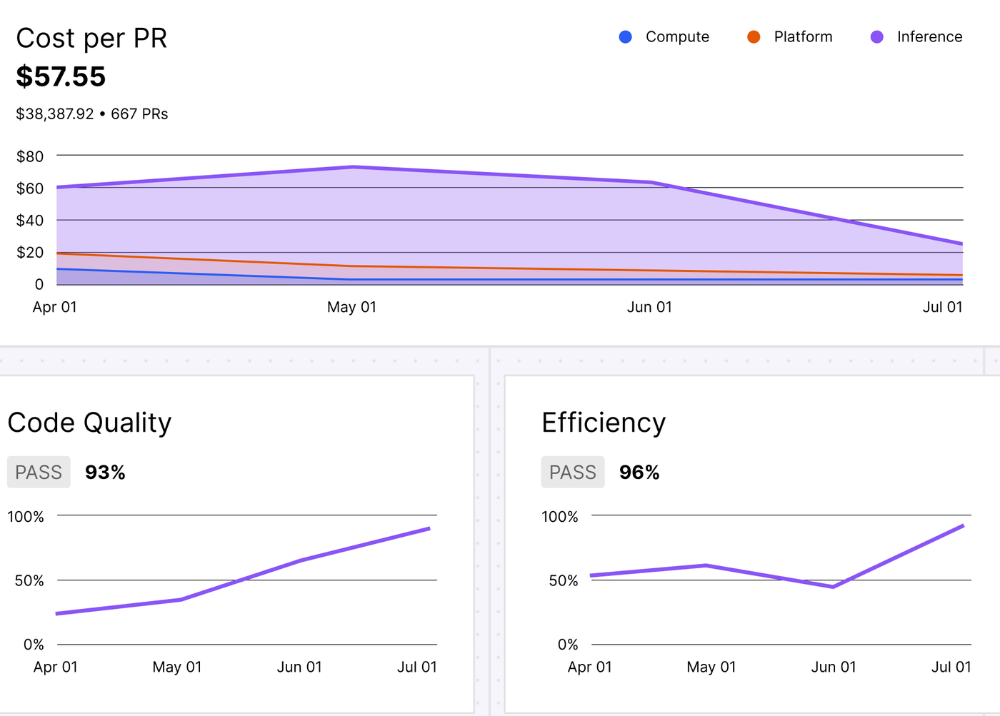
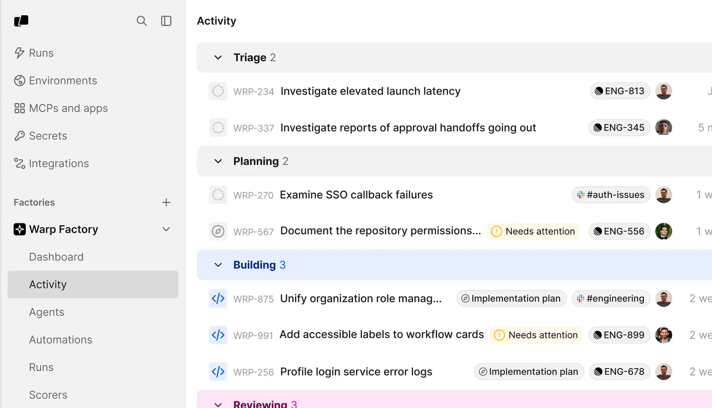
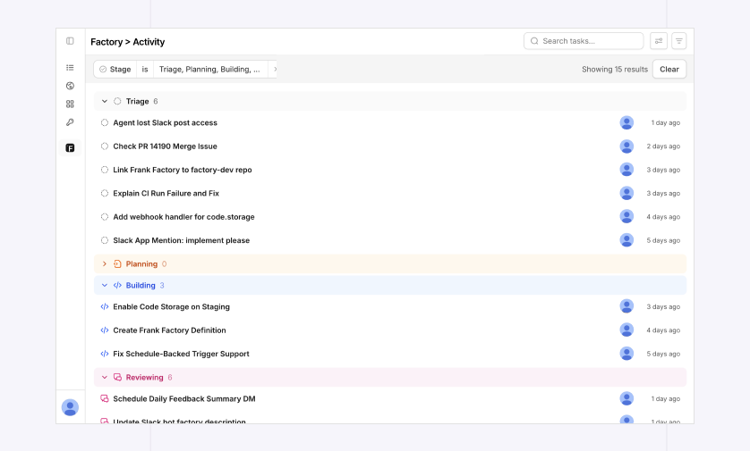

The factory dashboard is the web app for operating a single factory. Use it to track the work your agents are doing, inspect the runs and pull requests they produce, and manage the agents, automations, and settings the factory owns.

:::note
"Factory dashboard" names the whole surface. **Dashboard**, in bold, is one page inside it: the metrics page you land on when you open a factory.
:::

## Getting oriented

Select a factory in the sidebar to open its pages. **Runs**, **MCPs and apps**, **Secrets**, and **Integrations** sit above the factory list and cover your whole team, not a single factory; everything else on this page is scoped to the factory you select.

A factory opens on its **Dashboard** page, covered next. **Factory definition** appears only on Warp-managed factories, since a factory whose definition lives in your own repository is edited there instead.

## Read metrics on the Dashboard page

**Dashboard** is the factory's landing page. It summarizes the factory over a date range you choose:

* **Autonomy** - The share of the factory's merged PRs that needed no human input beyond an approving review and the merge itself. A PR counts as autonomous only if no person added commits, requested changes, or otherwise edited it before merge.
* **PR cycle time** - The median time the factory's merged PRs took from run kickoff through PR, first review, and merge, with a median for each stage.
* **Cost per PR** - The median cost of PRs opened in the range. Treat it as a lower-bound estimate: it can miss some run usage and does not match billing. See [Measure and improve a factory](/factories/measure-and-improve/) for its limitations.

The page also charts opened versus merged PRs and a breakdown of runs, and the **Cost per PR** card expands to list the most expensive PRs in the range. When Scorers are set up, Scorer cards summarize recent classification results.

<figure style={{ maxWidth: "563px" }}>

<figcaption>Cost per PR and example Scorer cards on the Dashboard page.</figcaption>
</figure>

## Track work items on Activity

**Activity** shows the factory's work items grouped by stage: Triage, Planning, Building, and Reviewing. Finished work items move to two terminal stages, Complete and Cancelled.

<figure style={{ maxWidth: "563px" }}>

<figcaption>Activity groups work items by stage, with counts for each.</figcaption>
</figure>

By default, Activity shows only work items you created, and only the four active stages. Change the **Created by** filter to see a teammate's work, and add a **Stage** filter for **Complete** or **Cancelled** to see finished work.

<figure style={{ maxWidth: "563px" }}>

<figcaption>Filter Activity by stage, creator, or a text search.</figcaption>
</figure>

Click a work item to open its detail pane, which includes the prompt that started it, the ticket or thread it came from, the pull requests it produced, and its cost. **View agent** opens the agent's session, **Event history** lists the runs behind the work item, and **Stop task** cancels the current run.

:::caution
**Stop task** takes effect immediately, with no confirmation prompt.
:::

## Inspect runs

A run is a single agent execution. A work item on **Activity** tracks one piece of work through the factory's stages and can span several runs as different agents pick it up. The team-level **Runs** page lists every run you have access to; a factory's **Runs** page lists only runs from that factory's agents.

Click **New** on a factory's **Runs** page to send a prompt to the factory's foreman agent. Open a run to see its timeline and cost, plus a **Sub-agents** tab for an orchestrator run's child runs. From there you can view the agent's full session, stop or score the run, or turn it into a benchmark task.

{/* VISUAL: The Runs page with the New button, showing an empty or sample run list. */}

:::note
Run pages don't include a chat input, but you can still steer a run: **View session** opens its [shared agent session](/platform/viewing-cloud-agent-runs/), where you follow the agent in real time and send follow-up instructions while the run's sandbox is active. After it shuts down, the same button opens the conversation transcript.
:::

## Manage agents and automations

**Agents** lists the factory's agents. Create agents and edit their instructions, model or harness, runner, host, secrets, and MCP servers. **Automations** defines the triggers that start runs: a schedule (including custom cron expressions) or a GitHub, Linear, Slack, or Jira event.

{/* VISUAL: The Automations editor, to complement the Agents list already shown in Configure agent behavior on the factory agents page. */}

The automation editor doesn't change execution settings; an automation only overrides them through [execution overrides in the definition files](/factories/factory-as-code/#execution-overrides). When the factory's definition lives in an external repository, Agents, Automations, and Scorers are read-only; make changes there through pull requests.

## Edit definitions in the Factory definition tab

**Factory definition** is the factory dashboard's view of the definition files that [definitions as code](/factories/factory-as-code/) describes in full. Where the definition lives decides what you get:

* **Warp-managed** - Browse and edit the definition files. Saving validates the definition and commits all changes together.
* **Managed in GitHub** - The tab doesn't appear. Edit the definition through pull requests in your repository, and **Settings** links back to it.
* **Live-managed** - The factory is managed through the API, so there are no definition files to browse.

When an agent proposes a change to a Warp-managed definition, its work item on **Activity** links to a review of the branch inside the factory dashboard. From there, comment on the diff, use **Request changes** to send feedback back to the agent, or **Approve & merge**.

## Score and benchmark

**Scorers** is where you create Scorers and read their results. **Self-improvement** lists the pull requests the self-improvement flow opens after analyzing runs your Scorers mark as failing, and **Benchmarks** compares harness, model, and runner configurations against a fixed set of tasks. See [Configure Scorers](/factories/measure-and-improve/#configure-scorers), [Configure and review Self-improvement](/factories/measure-and-improve/#configure-and-review-self-improvement), and [Compare configurations with benchmarks](/factories/measure-and-improve/#compare-configurations-with-benchmarks) for what each one is and how to set it up.

## Change factory settings

**Settings** holds the configuration the factory owns:

* **Identity** - The factory's name, avatar, and [**Foreman name**](/factories/factory-as-code/#alias), the handle your team @-mentions.
* **Repositories** - The repos the factory works in.
* **Pull request authorship** - Whether pull requests are authored by the agent or the run creator (the definition's [`credentialStrategy`](/factories/factory-as-code/#credentialstrategy)).
* **Analysis model** - The model [Self-improvement](/factories/measure-and-improve/#configure-and-review-self-improvement) uses to analyze failed runs.
* **Runners** - The compute the factory's runs execute on.
* **Integrations** - The integrations this factory can access.
* **Deletion** - Deletes the factory. This cannot be undone.

For a file-managed factory, `runners/*.yaml` in the repository is the source of truth. Anything managed in an external repository is read-only in Settings.

## Next steps

* [How Warp Factories work](/factories/how-factories-work/) - The lifecycle behind Activity's stages and where humans stay in the loop.
* [Definitions as code](/factories/factory-as-code/) - Define agents, automations, runners, and source ownership in code.
* [Factory agents](/factories/factory-agents/) - What each default agent does and how to configure it.
* [Measure and improve a factory](/factories/measure-and-improve/) - Configure the Scorers and benchmarks behind the **Dashboard** page.
* [Troubleshooting Warp Factories](/factories/troubleshooting/) - Fixes for setup problems, work that doesn't start, and stuck runs.
