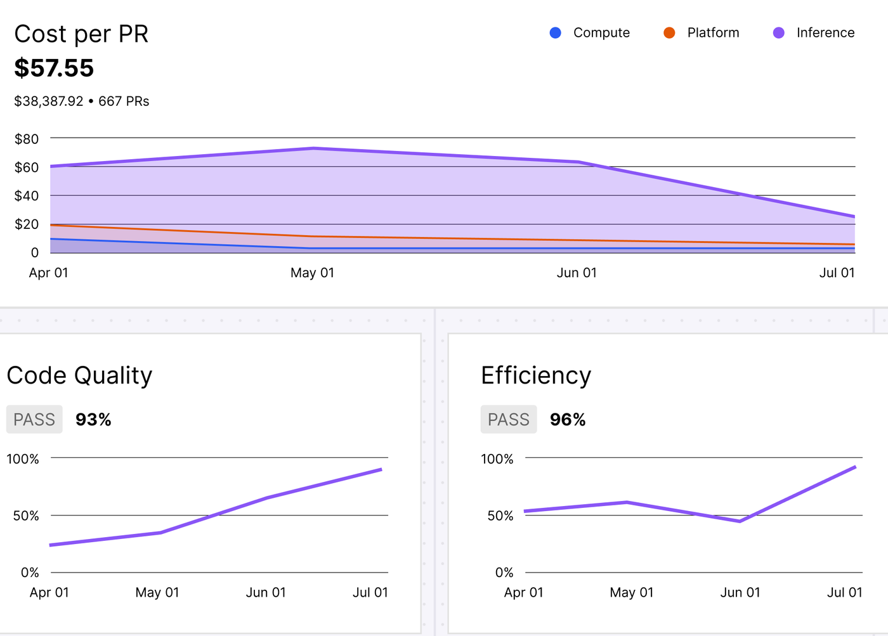

import { VARS } from '@data/vars';

The factory dashboard is the web app for operating a single factory. Open the <a href={VARS.FACTORY_WEB_APP_URL}>{VARS.FACTORY_WEB_APP}</a>, then select a factory to track its work, inspect its runs and pull requests, and manage its agents, automations, and settings. The factory opens on its **Dashboard** page, the metrics view described below.

## Getting oriented

Select a factory in the sidebar to open its pages. **Runs**, **MCPs and apps**, **Secrets**, and **Integrations** sit above the factory list and cover your whole team, not a single factory. **Inbox** sits there too, but it's personal rather than team-wide: one page lists the items waiting on you across every factory you can access. Everything else on this page is scoped to the factory you select.

**Factory definition** appears only on Warp-managed factories. A factory whose definition lives in your own repository is edited there instead.

## Read metrics on the Dashboard page

**Dashboard** summarizes the factory over a date range you choose: runs, pull requests opened and merged, **Autonomy** (the share of merged PRs that needed no human code push), **PR cycle time**, and **Cost per PR**, which expands to list the most expensive PRs in the range. When Scorers are set up, Scorer cards summarize recent classification results. For how each metric is calculated and what it leaves out, see [measure and improve a factory](/factories/measure-and-improve/#read-metrics-on-the-dashboard-page).

<figure style={{ maxWidth: "563px" }}>

<figcaption>Cost per PR and example Scorer cards on the Dashboard page.</figcaption>
</figure>

## Find what needs you in Inbox

**Inbox** collects the questions, spec approvals, and pull request reviews waiting on you across every factory, so you don't have to check each factory's Runs page for stalled work. See the [factory inbox](/factories/factory-inbox/) page for the kinds of items it shows and how to resolve them.

## Inspect runs

A run is a single agent execution. A single request can span several runs as different agents pick it up, and related runs group under their parent in the list. The team-level **Runs** page lists every run you have access to; a factory's **Runs** page lists only runs from that factory's agents.

Click **New** on a factory's **Runs** page to send a prompt to the factory's foreman agent. Open a run to see its timeline and cost, plus a **Sub-agents** tab for child runs when the agent used [multi-agent orchestration](/platform/orchestration/). From there you can view the agent's full session, stop or score the run, or turn it into a benchmark task.

{/* VISUAL: The Runs page with the New button, showing an empty or sample run list. */}

:::note
Run pages don't include a chat input, but you can still steer a run: **View session** opens its [shared agent session](/platform/viewing-cloud-agent-runs/), where you follow the agent in real time and send follow-up instructions while the run's sandbox is active. After it shuts down, the same button opens the conversation transcript.
:::

## Manage agents and automations

**Agents** lists the factory's agents. Create agents and edit their instructions, model or harness, runner, host, secrets, and MCP servers. **Automations** defines the triggers that start runs: a schedule (including custom cron expressions), an event from a connected tool such as GitHub or Slack, or a delivery to a custom webhook. **Webhooks** is a tab within **Automations** that lists the factory's [custom webhooks](/factories/webhooks/), where you create them, copy their URLs, rotate secrets, and read the delivery log.

{/* VISUAL: The Automations editor, to complement the Agents list already shown in Configure agent behavior on the factory agents page. */}

The automation editor doesn't change execution settings; an automation only overrides them through [execution overrides in the definition files](/factories/factory-as-code/#execution-overrides). On a GitHub-backed factory, Agents, Automations, and Scorers are read-only; make changes through pull requests to the definition repository.

## Edit definitions in the Factory definition tab

**Factory definition** is the factory dashboard's view of the definition files that the [factory definition syntax](/factories/factory-as-code/) describes in full. Where the definition lives decides what you get:

* **Warp-managed** - Browse and edit the definition files. Saving validates the definition and commits all changes together.
* **GitHub-backed** - The tab doesn't appear. Edit the definition through pull requests in your repository, and **Settings** links back to it.
* **Live-managed** - The factory is managed through the API, so there are no definition files to browse.

When an agent proposes a change to a Warp-managed definition, a spec review for the branch appears in your [inbox](/factories/factory-inbox/). Open it to comment on the diff, use **Request changes** to send feedback back to the agent, or **Approve & merge**.

## Score and benchmark

**Scorers** is where you create Scorers and read their results. **Self-improvement** lists the pull requests Self-improvement opens after analyzing runs your Scorers mark as failing, and **Benchmarks** compares model, harness, and runner configurations against a fixed set of tasks. See [configuring Scorers](/factories/measure-and-improve/scorers/), [configuring and reviewing Self-improvement](/factories/measure-and-improve/self-improvement/), and [factory benchmarks](/factories/benchmarks/).

## Change factory settings

**Settings** holds the configuration the factory owns:

* **Identity** - The factory's name, avatar, and [**Foreman name**](/factories/factory-as-code/#alias), the handle your team @-mentions.
* **Repositories** - The repos the factory works in.
* **Pull request authorship** - Whether pull requests are authored by the agent or the run creator (the definition's [`credentialStrategy`](/factories/factory-as-code/#credentialstrategy)).
* **Analysis model** - The model [Self-improvement](/factories/measure-and-improve/self-improvement/) uses to analyze failed runs.
* **Runners** - The compute the factory's runs execute on. See [factory runners](/factories/runners/) to choose runner configuration or [managed self-hosting](/factories/self-hosting/) to run factory work on your infrastructure.
* **Integrations** - The integrations this factory can access.
* **Deletion** - Deletes the factory. This cannot be undone.

On a GitHub-backed factory, `runners/*.yaml` in the repository is the source of truth, and anything defined there is read-only in Settings.

## Related pages

* [Factory inbox](/factories/factory-inbox/) - See and resolve the questions, spec approvals, and PR reviews waiting on you.
* [How Warp Factories work](/factories/how-factories-work/) - The stages work moves through and where humans stay in the loop.
* [Factory definition syntax](/factories/factory-as-code/) - Define agents, automations, runners, and source ownership in code.
* [Factory agents](/factories/factory-agents/) - What each default agent does and how to configure it.
* [Measure and improve a factory](/factories/measure-and-improve/) - What each dashboard metric means, and how to use Scorers in an improvement loop.
* [Factory benchmarks](/factories/benchmarks/) - Create a benchmark suite and compare configurations on fixed tasks.
* [Troubleshooting Warp Factories](/factories/troubleshooting/) - Fixes for setup problems, work that doesn't start, and stuck runs.
