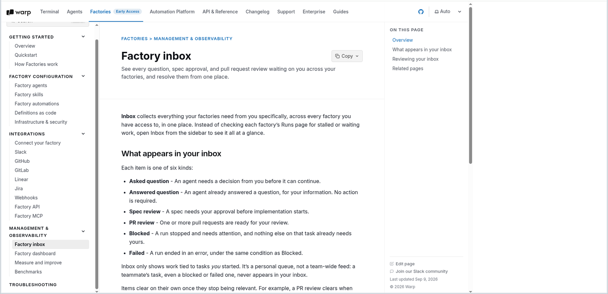

**Inbox** collects everything your factories need from you specifically, across every factory you have access to, in one place. Instead of checking each factory's Runs page for stalled or waiting work, open Inbox from the sidebar to see it all at a glance.

<figure style={{ maxWidth: "563px" }}>

<figcaption>The Inbox page and its item kinds.</figcaption>
</figure>

## What appears in your inbox

Each item is one of six kinds:

* **Asked question** - An agent needs a decision from you before it can continue.
* **Answered question** - An agent already answered a question, for your information. No action is required.
* **Spec review** - A spec needs your approval before implementation starts.
* **PR review** - One or more pull requests are ready for your review.
* **Blocked** - A run stopped and needs attention, and nothing else on that task already needs yours.
* **Failed** - A run ended in an error, under the same condition as Blocked.

Inbox only shows work tied to tasks *you* started. It's a personal queue, not a team-wide feed: a teammate's task, even a blocked or failed one, never appears in your inbox.

Items clear on their own once they stop being relevant. For example, a PR review clears when someone reviews or merges the pull request, and a question clears once it's answered. You can also resolve any item yourself.

## Reviewing your inbox

1. Click a row to open its details in a side pane. From there, click a chip or the primary action, like **View run**, to open the underlying resource: the run, pull request, spec, or originating thread or ticket.
2. Once you've handled an item, mark it **resolved**. Click **Undo** in the confirmation to bring it back if you resolved it by mistake.
3. Mark items **read** or **unread** to track what you've reviewed without resolving them.
4. Filter by factory, read state, or kind, or search titles and descriptions, to narrow a long inbox.

## Related pages

* [Factory dashboard](/factories/factory-dashboard/) - Track runs, manage agents, and change factory settings.
* [How Warp Factories work](/factories/how-factories-work/) - Where a factory pauses for a person to decide something.
* [Cloud agent session sharing](/platform/viewing-cloud-agent-runs/) - Follow and steer a run in real time from its session.
