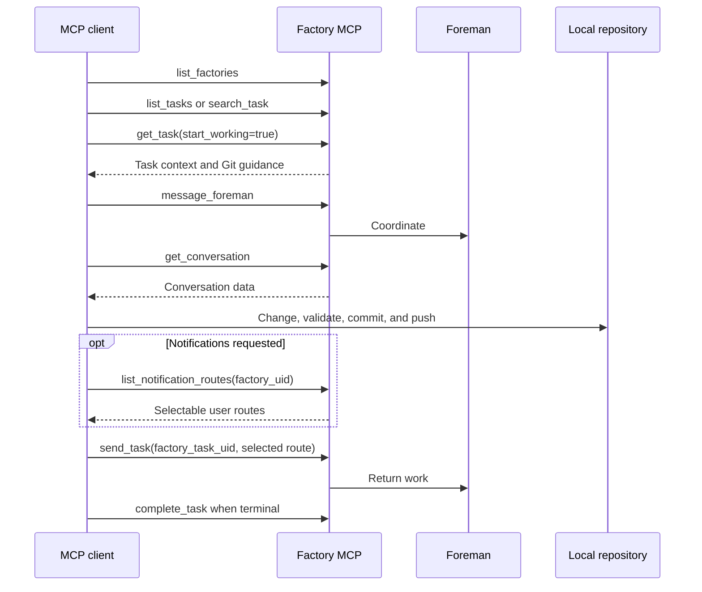

Factory MCP connects compatible coding agents and Model Context Protocol (MCP) clients to Warp Factories. It lets a local agent find work, inspect context, coordinate with the foreman, and return changes to the same work item.

Use Factory MCP when work moves between a cloud factory and an interactive coding session. The factory retains its workflow and task history, while the local agent uses the developer's checkout and tools.

## When to use Factory MCP

* **Send work** - Create a work item from context available to an MCP client.
* **Continue locally** - Pull an existing work item's context and Git guidance, then return the pushed result.
* **Inspect and coordinate** - Find work, inspect outputs, message the foreman, and read its conversation.
* **Create a factory** - Create one when the team, repository, and source-control details are known.

Factory MCP complements integrations from Slack, issue trackers, and GitHub. See [connect your factory](./connect-your-factory) for the available intake paths and [how Warp Factories work](./how-factories-work) for the work-item lifecycle.

## Connect and authenticate

When Factory MCP is available for your account, Warp attaches the built-in server to supported agent sessions and supplies the authenticated connection. This path needs no vendor-specific configuration.

Claude Code, Codex, Cursor, and other public MCP clients connect through remote MCP support. Follow the client's setup instructions, then authenticate with one of these methods:

| Method | How it works |
| --- | --- |
| Browser OAuth | The client opens a browser so you can sign in and authorize the client. Public clients use Proof Key for Code Exchange (PKCE), and authorization requires your consent. |
| [API key](../reference/cli/api-keys/) | Clients that support bearer-token authentication can use a Warp API key. Store the key in the client's secret or credential mechanism rather than committing it to a repository. |

Factory MCP currently has no factory-specific or read-only OAuth scopes. It acts with the existing permissions of the user or cloud agent it authenticates as. Use user credentials for supervised sessions. For third-party clients and unattended automation, use a least-privilege cloud agent; its API key inherits that agent's permissions. Repository access follows user permissions or the team's GitHub App installation. Restrict access to team credentials separately.

Use connection information from Warp or your factory administrator. For client configuration, authentication, and security guidance, see [Model Context Protocol in Warp](../agents/capabilities/mcp/).

## Read the server guidance first

Factory MCP serves a canonical skill, workflow guidance, factory configuration guidance, and tool contracts as MCP resources. Before operating, read `skill://warp/factory-mcp/SKILL.md`. Treat served resources as the source of truth instead of copied schemas or older prompts.

## Work locally and return a task

1. **List factories** - Call `list_factories`. Use an explicit or validated saved default factory. If neither exists, ask the user. Never fan `list_tasks` or `get_task` out across factories.
2. **Find the task** - Use `list_tasks` for one factory or `search_task` across factories. Retain `factory_task_uid` for every later operation.
3. **Start local work** - Call `get_task` with `start_working=true`. Set `workspace_dir` to an absolute path to an existing local clone. The server returns Git and [worktree](../code/git-worktrees/) guidance but does not change files.
4. **Conversation** - Use `message_foreman` for progress, questions, and blockers. Use the read-only `get_conversation` for responses. Messaging does not return work or change its stage.
5. **Implement and push** - Validate the change, then commit and push. Factory workers cannot inspect changes only in a local checkout.
6. **Return the task** - Call `send_task` with the same `factory_task_uid`, a handback note, and the pushed branch or pull request URL. Optionally pass a selectable `notification_route_uid`. The foreman can override `stage_hint`.
7. **Complete terminal work** - Call `complete_task` only when no factory work remains. Handback alone does not complete the task.

:::caution
Pulling a task locally does not claim, lock, or pause it. Factory runs can continue after `get_task(start_working=true)`. Check active runs and coordinate with the foreman to avoid duplicate changes.
:::

`get_task` also accepts an exact task or run UUID, run or activity URL from the Factory app, GitHub pull request, Slack permalink, Linear issue URL or key, Jira issue URL or key, or branch. A bare issue key such as `ENG-123` resolves Linear first and falls back to Jira when no usable Linear integration is available. Prefix the key with `linear:` or `jira:` to force a provider. External references and branches require factory scope; a bare branch also requires its repository. On `requires_scope`, select an explicit or validated default factory, or ask the user. On `not_found`, report the searched factory and ask before trying another. On `ambiguous`, use a returned candidate's `factory_task_uid`.

The `task_url` and `run_url` values returned by Factory MCP tools open the corresponding task and run pages in the Factory control room.

## Send new work or hand back existing work

`send_task` selects its operation from the identifier you provide:

| Operation | Identifier | Note | Artifacts | Effect |
| --- | --- | --- | --- | --- |
| New intake | `factory_uid` and `title`; optional ticket reference and URL | Requested outcome and constraints | Initial workspace snapshot when supported | Starts a foreman workstream. Search first when the request might already exist. |
| Existing-task handback | `factory_task_uid` | What changed, validation performed, and remaining work | Pushed branch or pull request; eligible plans, confirmed files, and screenshots from a source conversation | Continues the existing foreman conversation instead of creating another work item. |

See [Handoff between local and cloud agents](../platform/handoff/) for workspace and conversation transfer outside a factory work item.

Call `list_notification_routes` before setting `send_task.notification_route_uid`. Routes are user-specific and selectable only when returned for the current caller and factory. Available routes can include a Slack self-DM or Linear issue. Delivery of attention-required and terminal updates is best-effort.

## Tool reference

Factory MCP exposes ten tools. The table lists the main purpose and key inputs, not every optional filter or response field. Read the live tool contracts for the complete schema.

| Tool | Purpose | Key inputs |
| --- | --- | --- |
| `list_factories` | Lists accessible factories and the context needed to choose one. | No required input. Optionally filter with `team_uid` or continue with `cursor`. |
| `list_notification_routes` | Lists notification destinations selectable for the caller and factory. | `factory_uid`. |
| `create_factory` | Creates a factory and returns its identifier and next actions. | `team_uid`, `name`, `code_forge`, `integrations`, and one or more `repositories` in owner/repo form. |
| `list_tasks` | Lists authoritative work items for one factory, with stages and linked outputs. | `factory_uid`; optional creator, title, stage, date, sort, and pagination filters. |
| `search_task` | Searches task titles across every factory the caller can access. | `queries`; optionally `limit` and `cursor`. |
| `get_task` | Resolves a task, then reads status, run history, outputs, and local-work guidance. | Exactly one of `factory_task_uid` or `reference`; references can also require `factory_uid` and `repository`. |
| `message_foreman` | Sends a coordination message to the task's latest foreman run. | `factory_task_uid` and `message`. |
| `get_conversation` | Reads a bounded window of the task's foreman conversation. | `factory_task_uid`; optionally `limit` and `before_index` for pagination. |
| `send_task` | Creates new intake or returns work, with optional best-effort notifications. | Always `note`; new intake needs `factory_uid` and `title`, handback needs `factory_task_uid`, and notifications use `notification_route_uid`. |
| `complete_task` | Marks a task complete. Repeated completion is idempotent, but a `CANCELLED` task is rejected. | One of `run_id` or `factory_task_uid`. |

## Next step

[Create a factory and send its first work item](./quickstart) with the Warp Factories quickstart.
