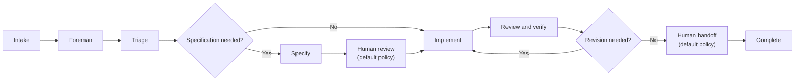

A factory runs two connected loops:

* The **inner loop** moves each work item from intake to a human handoff.
* The **outer loop** uses evidence from completed work to improve the factory itself.

A **work item** is one unit of engineering work, such as an issue, support request, pull request, or Factory MCP task. It keeps its identity while specialized agents contribute to it through separate runs.

## The inner loop: intake to handoff

The **foreman** coordinates every work item. It routes work between the specialized agents, passes each one the context it needs, and continues existing agent conversations instead of starting new ones. The specialized agents keep narrow responsibilities, and each of their runs stays distinct in run history. See [factory agents](/factories/factory-agents/) for the role definitions.

Not every work item needs every stage. The foreman picks the shortest path that still meets your quality policy. It skips stages when the work is already well defined, starts partway through when enough context exists, and sends work back to an earlier agent when revisions are needed.

### Stages

The diagram below shows the default path through a factory's stages.

* **Intake** - A work item enters from a [connected integration](/factories/connect-your-factory/), an automation, a direct run, or the [Factory MCP](/factories/factory-mcp/). It keeps its source context as it moves through later stages.
* **Triage** - The triage agent researches the request, reproduces it when needed, and defines its scope and complexity. The foreman skips this stage when the request is already well bounded.
* **Specification** - The specification agent defines product behavior, technical constraints, and validation criteria. The foreman skips this stage for localized changes.
* **Implementation** - The implementation agent makes the code change on a branch and opens a pull request with test and visual evidence.
* **Review and verification** - The review agent checks the change against the requirements, tests, and security expectations, then sends findings back to implementation. Its verdict is advisory.
* **Human handoff** - The factory presents the result, its evidence, and any findings. A person decides what happens next.
* **Complete or Cancelled** - The work item ends when the factory finishes its work, or stops early if someone cancels it.

## Work items and agent runs

A work item and an agent run track different things. The work item is the single unit of engineering work your team follows from intake to completion. An agent run is one agent's execution within that work item. The first factory-agent run creates the work item, and each later run records one stage's actions and outputs within that work item.

The work item's **stage** shows progress at a glance. It reflects the most recently active role, so it can move backward during a revision or skip ahead. Run history is the complete execution record.

In the [control room](/factories/control-room/), use the **Activity** view to find, filter, and stop work items. Activity groups these stages under its own names: Triage, Planning (specification), Building (implementation), and Reviewing.

## What humans decide

By default, a factory asks for a human decision at three points:

* **Specification review** - A person approves the specification before implementation starts.
* **Clarification** - The factory asks a person about unclear requirements, blockers, and ambiguous review findings.
* **Merge** - A person decides whether and when to merge the final pull request.

These checkpoints come from the factory's agent instructions and your repository policy, not from a platform-level approval feature. Warp Factories doesn't enforce human-only merges. If your team requires them, use branch protection and repository permissions.

## The outer loop: improving the factory

Each completed work item leaves evidence behind, including run and pull request activity, costs, [Scorer](/factories/measure-and-improve/) evaluations, and benchmarks. Teams use this evidence to spot repeated failures and compare model or harness configurations.

The factory can also act on that evidence directly. Its [self-improvement](/factories/measure-and-improve/#configure-and-review-self-improvement) capability groups the failures Scorers flag and files follow-up runs that propose changes to the application code or the factory's own definition. Nothing is adopted without your review.

Anyone on the team, or an agent, can also propose changes to the factory's instructions, skills, models, environments, or other [definitions](/factories/factory-as-code/). Definitions stored in GitHub can go through pull request review and configuration checks before a change reaches the production branch; Warp-managed definitions sync changes directly. Match your review policy to the definition source and the risk of the change.

Benchmarks organize the evidence; they don't replace your judgment about whether a change is correct. See [measure and improve](/factories/measure-and-improve/) for the evaluation workflow, or [build a self-improving agent](/guides/agent-workflows/build-a-self-improving-agent/) to apply the same outer-loop pattern to a standalone agent.
