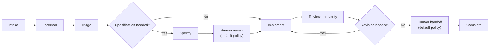

Warp Factories uses two connected loops. The **inner loop** moves a work item from intake toward a human handoff under the default seeded policy. The **outer loop** uses evidence from completed work to improve the factory.

A **work item** is one unit of engineering work, such as an issue, support request, pull request, or Factory MCP task. It retains its identity while specialized agents contribute through separate runs.

## The inner execution loop

The default path is intake, triage, specification when needed, implementation, review and verification, human handoff, and completion. Not every work item needs every stage. The foreman selects the shortest path that preserves the team's quality policy. It can enter at the stage supported by available context and return to an earlier agent when revisions are needed.

| Stage | Purpose | Skip or return | Output | Human decision |
| --- | --- | --- | --- | --- |
| Intake | Preserve context from an integration, automation, direct run, or [Factory MCP](./factory-mcp). | Starts each work item. | Work item with source context. | None. |
| Foreman | Route work and coordinate specialized agents. | Can start at a later stage or return work to an existing conversation. | Context for the next agent. | Surfaces unresolved questions. |
| Triage | Research, reproduce when needed, and define scope. | Skip when intake is already bounded; return when requirements are unclear. | Evidence, scope, and complexity. | Clarify ambiguity. |
| Specification | Define product behavior, technical constraints, and validation criteria. | Skip for localized work; return when decisions are missing. | Product and technical spec. | Review before implementation under the default policy. |
| Implementation | Change code and produce test and visual evidence. | Return from review for revisions. | Branch, pull request, and validation evidence. | Clarify blockers with a human when needed. |
| Review and verification | Check requirements, code, tests, security expectations, and evidence. | Return findings to implementation. | Advisory verdict and findings. | Resolve ambiguous findings. |
| Human handoff | Present the result, evidence, and findings. | Can return to implementation for revisions. | Pull request or completed result. | Decide whether and when to merge under the default policy. |
| Complete | Record that the factory finished its work. | Terminal stage. | Completed work item. | None. |
| Cancelled | Record that cancellable work was stopped. | Terminal stage; **Complete** cannot overwrite it. | Cancelled work item. | None. |

The foreman anchors the workstream, dispatches child runs, supplies relevant context, and continues existing agent conversations when possible. Sibling agents keep narrow responsibilities, and their runs remain distinct in run history. Verification belongs to implementation and review rather than a separate default role. See [factory agents](./factory-agents) for the role definitions.

## Work items and agent runs

| Concept | Scope | Behavior |
| --- | --- | --- |
| **Work item** | The unit a team follows through the factory. | Its stage is a progress signal based on the active or most recently launched role. Revision can move the stage backward, and the foreman can skip stages. |
| **Agent run** | One agent execution within the work item. | A top-level factory-agent run creates a work item. Child runs record stage actions and outputs inside that work item; they do not create additional work items. |

The work-item stage is not an authoritative state machine. Run history is the detailed execution record across launches, revisions, and follow-up messages.

In the [control room](./control-room), use **Activity** to locate, filter, and stop work items.

## Human decisions are workflow policy

The default seeded workflow asks for human review after a specification and expects a human merge decision. It also returns unclear requirements and ambiguous review findings to a person.

These gates come from agent instructions and repository policy, not a factory-specific platform approval role. Warp Factories does not enforce human-only merges. Teams that require them should use branch protection and repository permissions.

## The outer improvement loop

The inner loop produces software and execution evidence. Run and pull request activity, costs, evaluations, and benchmarks help teams find repeated failures and compare model or harness configurations.

A team or agent can propose changes to instructions, skills, models, environments, or other factory definitions. GitHub-backed definitions can use pull request review and factory configuration checks before changes reach the production branch. A Warp-managed definition can synchronize changes directly. Teams should set review policy according to the definition source and risk.

Benchmarks organize evidence but do not replace product judgment or guarantee that an automated change is correct. See [measure and improve](./measure-and-improve) for the evaluation workflow.
