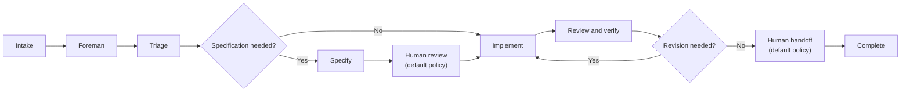

:::note
Warp Factories is in **Early Access** and available to a limited set of teams. [Request access](https://www.warp.dev/factories/request-access) to use it with your team.
:::

A factory is a team of cloud agents that ships software the way your team does: a request comes in, moves through the stages it needs, and comes back as a pull request ready for review. You talk to one agent, the **foreman**, from the tool that sends the request, such as Slack or Linear. The foreman dispatches the factory's other agents, and each one owns a part of the software development lifecycle.

Deciding which repositories belong in this factory is a separate question. See [sizing a factory](/factories/#sizing-a-factory) for that guidance.

A **work item** is a single request the factory acts on, such as an issue, support request, pull request, or Factory MCP task. It keeps its identity from intake to handoff, however many agents contribute to it along the way.

## How a work item moves through the factory

The foreman coordinates every work item. It routes work between the factory's agents, passes each one the context it needs, and continues existing agent conversations instead of starting new ones. See [factory agents](/factories/factory-agents/) for what each agent does.

Not every work item needs every stage. The foreman picks the shortest path that still meets your quality policy: it skips stages when the work is already well defined, starts partway through when enough context exists, and sends work back to an earlier agent when revisions are needed.

### Stages

The diagram below shows the default path through a factory's stages.

* **Intake** - A work item enters from a [connected integration](/factories/connect-your-factory/), an automation, a direct run, or the [Factory MCP](/factories/factory-mcp/). It keeps its source context as it moves through later stages.
* **Triage** - The triage agent researches the request, reproduces the problem when needed, and defines the scope and complexity of the change. The foreman skips this stage when the request already explains the problem and what needs to change.
* **Specification** - The specification agent defines product behavior, technical constraints, and validation criteria. The foreman skips this stage for small, well-understood changes.
* **Implementation** - The implementation agent makes the code change on a branch and opens a pull request with test and visual evidence.
* **Review and verification** - The review agent checks the change against the requirements, tests, and security expectations, then sends findings back to implementation. Its verdict is advisory.
* **Human handoff** - The factory presents the result, its evidence, and any findings. A person decides what happens next.
* **Complete or Cancelled** - The work item ends when the factory finishes its work, or stops early if someone cancels it.

In the [factory dashboard](/factories/factory-dashboard/), the **Activity** view is where you find, filter, and stop work items. It groups these stages under its own names: Triage, Planning (specification), Building (implementation), and Reviewing. Each agent's run within a work item is an ordinary [cloud agent run](/platform/) you can watch and steer.

## Where your team stays in charge

A factory is built to pause when there is a decision that needs to be made by a person. By default, that's three places:

* **Approving the spec** - When work goes through the spec stage, implementation waits until a person signs off on the plan.
* **Answering questions** - When requirements are unclear or a review finding is ambiguous, the foreman asks instead of guessing.
* **Merging** - The factory opens the pull request and hands it off. Whether and when it merges is your team's call.

The first two are workflow policy, written into the foreman's instructions; edit them to change when the factory checks in. Merging is enforced by your repository, so if you require human-only merges, use branch protection and repository permissions.

## How the factory improves itself

Your factory is self-improving, and you define what "better" means. [Scorers](/factories/measure-and-improve/) grade completed runs against criteria you write, and [Self-improvement](/factories/measure-and-improve/#configure-and-review-self-improvement) groups the failures they flag into follow-up runs that propose fixes — to the application code or to the factory's own definition. Every proposal arrives as a change for your review; nothing is adopted on its own.

The factory's definition is open to the same loop. Anyone on the team, or an agent, can propose changes to its instructions, skills, models, or other [definition files](/factories/factory-as-code/), and definitions stored in GitHub go through pull request review and [configuration checks](/factories/factory-as-code/#pull-request-checks-for-github-backed-factories) before a change reaches the production branch.

See [measure and improve](/factories/measure-and-improve/) for the evaluation workflow, or [build a self-improving agent](/guides/agent-workflows/build-a-self-improving-agent/) to apply the same pattern to a standalone agent.
