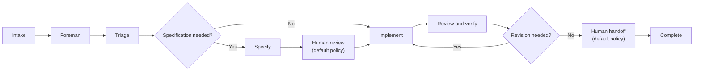

A factory runs two connected loops:

* The **inner loop** moves each work item from intake to a human handoff.
* The **outer loop** uses evidence from completed work to improve the factory itself.

A **work item** is one unit of engineering work, such as an issue, support request, pull request, or Factory MCP task. It keeps its identity while specialized agents contribute to it through separate runs.

## The inner loop: intake to handoff

The **foreman** coordinates every work item. It routes work between the specialized agents, passes each one the context it needs, and continues existing agent conversations instead of starting new ones. The specialized agents keep narrow responsibilities, and each of their runs stays distinct in run history. See [factory agents](./factory-agents) for the role definitions.

Not every work item needs every stage. The foreman picks the shortest path that still meets your quality policy: it skips stages when the work is already well defined, starts partway through when enough context exists, and sends work back to an earlier agent when revisions are needed.

### Stages

* **Intake** - A work item enters from an integration, an automation, a direct run, or the [Factory MCP](./factory-mcp), and keeps its source context.
* **Triage** - Researches the request, reproduces it when needed, and defines its scope and complexity. Skipped when the request is already well bounded.
* **Specification** - Defines product behavior, technical constraints, and validation criteria. Skipped for localized changes.
* **Implementation** - Makes the code change on a branch and opens a pull request with test and visual evidence.
* **Review and verification** - Checks the change against the requirements, tests, and security expectations, and sends findings back to implementation. Its verdict is advisory.
* **Human handoff** - The factory presents the result, its evidence, and any findings, and a person decides what happens next.
* **Complete or Cancelled** - The work item ends when the factory finishes its work, or is marked **Cancelled** when someone stops it.

## Work items and agent runs

A work item is the unit your team follows through the factory; an agent run is one agent execution inside it. The first factory-agent run creates the work item, and child runs record each stage's actions and outputs inside that same work item.

The work item's **stage** shows progress at a glance. It reflects the most recently active role, so it can move backward during a revision or skip ahead. Run history is the complete execution record.

In the [control room](./control-room), use the **Activity** view to find, filter, and stop work items.

## Where humans decide

By default, a factory asks for a human decision at three points:

* **Specification review** - A person approves the specification before implementation starts.
* **Clarification** - The factory asks a person about unclear requirements, blockers, and ambiguous review findings.
* **Merge** - A person decides whether and when to merge the final pull request.

These checkpoints come from the factory's agent instructions and your repository policy, not from a platform-level approval feature. Warp Factories doesn't enforce human-only merges: if your team requires them, use branch protection and repository permissions.

## The outer loop: improving the factory

Each completed work item leaves evidence behind: run and pull request activity, costs, evaluations, and benchmarks. Use it to spot repeated failures and compare model or harness configurations.

Anyone on the team, or an agent, can propose changes to the factory's instructions, skills, models, environments, or other definitions. Definitions stored in GitHub can go through pull request review and configuration checks before a change reaches the production branch; Warp-managed definitions sync changes directly. Match your review policy to the definition source and the risk of the change.

Benchmarks organize the evidence; they don't replace your judgment about whether a change is correct. See [measure and improve](./measure-and-improve) for the evaluation workflow.
