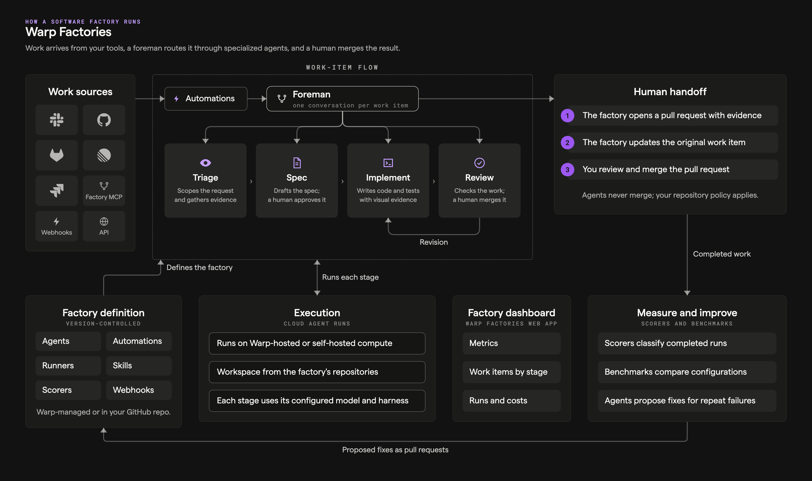
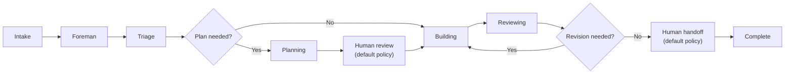

:::note
Warp Factories is in **Early Access** and available to a limited set of teams. [Request access](https://www.warp.dev/factories/request-access) to use it with your team.
:::

A factory is a team of cloud agents attached to a set of repositories. You talk to one of them, the **foreman**, from the tool that sends the request, such as Slack or Linear. The foreman dispatches the factory's other agents, each of which owns one part of the software development lifecycle, and people make the key decisions along the way.

A **work item** is a single request the factory acts on, such as an issue, support request, pull request, or Factory MCP task. It keeps its identity from intake to handoff, however many agents contribute to it along the way.

The diagram, from intake to improvement:

* **Work sources** - [Slack](/factories/integrations/slack/), [GitHub](/factories/integrations/github/), [GitLab](/factories/integrations/gitlab/), [Linear](/factories/integrations/linear/), [Jira](/factories/integrations/jira/), [custom webhooks](/factories/webhooks/), [factory endpoints](/factories/factory-api/), the [Factory MCP](/factories/factory-mcp/), direct runs, and schedules.
* **Automations** - [Automations](/factories/automations/) filter provider events and schedules and decide which agent handles them. Direct requests go straight to the foreman.
* **Foreman and stage agents** - The foreman holds one conversation per work item and dispatches the triage, spec, implement, and review agents as the work needs them. See [factory agents](/factories/factory-agents/).
* **Human handoff** - The factory opens a pull request with evidence and updates the original work item. You review and merge.
* **Factory definition** - Version-controlled agents, automations, runners, scorers, skills, and webhooks, either Warp-managed or in a GitHub repository your team owns. See [definitions as code](/factories/factory-as-code/).
* **Execution** - Every stage is a cloud agent run on Warp-hosted or [managed self-hosted](/factories/self-hosting/) compute, using the factory's repositories and each stage's configured model and [harness](/platform/harnesses/).
* **Factory dashboard** - Metrics, work items by stage, runs, and costs. See the [factory dashboard](/factories/factory-dashboard/).
* **Measure and improve** - [Scorers](/factories/measure-and-improve/) classify completed runs, benchmarks compare configurations, and Self-improvement turns repeat failures into pull requests for your review.

## How a work item moves through the factory

The foreman coordinates every work item. It routes work between the factory's agents, passes each one the context it needs, and continues existing agent conversations instead of starting new ones. See [factory agents](/factories/factory-agents/) for what each agent does.

Not every work item needs every stage. The foreman picks the shortest path that still meets your quality policy: it skips stages when the work is already well defined, starts partway through when enough context exists, and sends work back to an earlier agent when revisions are needed.

### Stages

The diagram below shows the default path through a factory's stages.

```mermaid
flowchart LR
  Intake[Intake] --> Foreman[Foreman]
  Foreman --> Triage[Triage]
  Triage --> Decision{Plan needed?}
  Decision -->|Yes| Planning[Planning]
  Decision -->|No| Building[Building]
  Planning --> Approval["Human review<br/>(default policy)"]
  Approval --> Building
  Building --> Reviewing[Reviewing]
  Reviewing --> Revision{Revision needed?}
  Revision -->|Yes| Building
  Revision -->|No| Handoff["Human handoff<br/>(default policy)"]
  Handoff --> Complete[Complete]
```

* **Intake** - A work item enters from a [connected integration](/factories/connect-your-factory/), an automation, a direct run, or the [Factory MCP](/factories/factory-mcp/). It keeps its source context as it moves through later stages.
* **Triage** - The triage agent researches the request, reproduces the problem when needed, and defines the scope and complexity of the change. The foreman skips this stage when the request already explains the problem and what needs to change.
* **Planning** - The spec agent defines product behavior, technical constraints, and validation criteria. The foreman skips this stage for small, well-understood changes.
* **Building** - The implement agent makes the code change on a branch and opens a pull request with test and visual evidence.
* **Reviewing** - The review agent checks the change against the requirements, tests, and security expectations, then sends findings back for another pass. Its verdict is advisory.
* **Human handoff** - The factory presents the result, its evidence, and any findings. A person decides what happens next.
* **Complete or Cancelled** - The work item ends when the factory finishes its work, or stops early if someone cancels it.

Stages and agents are named separately, so the spec agent works the Planning stage, the implement agent works the Building stage, and the review agent works the Reviewing stage. Each agent's run within a work item is an ordinary [cloud agent run](/platform/) you can watch and steer from the factory's [Runs page](/factories/factory-dashboard/#inspect-runs), and any stage that needs your input surfaces in your [inbox](/factories/factory-inbox/).

## Where your team stays in charge

A factory pauses when a person needs to decide. By default, that's three places:

* **Approving the spec** - When work goes through the Planning stage, the Building stage waits until a person signs off on the plan.
* **Answering questions** - When requirements are unclear or a review finding is ambiguous, the foreman asks instead of guessing.
* **Merging** - The factory opens the pull request and hands it off. Whether and when it merges is your team's call.

The first two are workflow policy, written into the foreman's instructions; edit them to change when the factory checks in. Merging is enforced by your repository, so if you require human-only merges, use branch protection and repository permissions.

## How the factory improves itself

[Scorers](/factories/measure-and-improve/scorers/) classify completed runs against criteria you write, and [Self-improvement](/factories/measure-and-improve/self-improvement/) groups the failures they flag into follow-up runs that propose fixes to the application code or to the factory's own definition. Every proposal arrives as a pull request for your review; nothing is adopted on its own.

The factory's definition is open to the same loop. Anyone on the team, or an agent, can propose changes to its instructions, skills, models, or other [definition files](/factories/factory-as-code/), and definitions stored in GitHub go through pull request review and [configuration checks](/factories/factory-as-code/#pull-request-checks) before a change reaches the production branch.

## Related pages

* [Sizing a factory](/factories/#sizing-a-factory) - Which repositories belong in one factory.
* [Factory agents](/factories/factory-agents/) - What each default agent does and how to configure it.
* [Connect your factory](/factories/connect-your-factory/) - Every way work can enter a factory.
* [Measure and improve](/factories/measure-and-improve/) - Scorers, benchmarks, and Self-improvement.
* [Build a self-improving agent](/guides/agent-workflows/build-a-self-improving-agent/) - Apply the same loop to a standalone agent.
