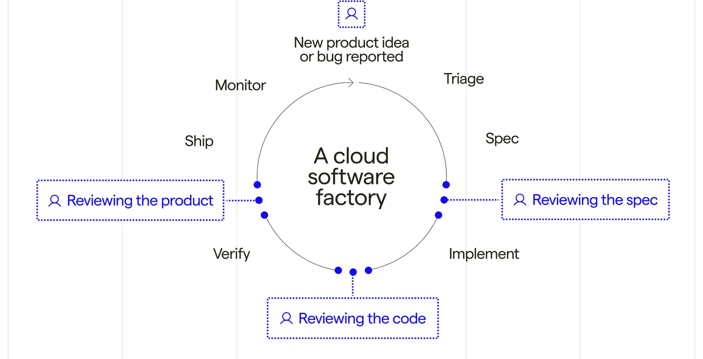
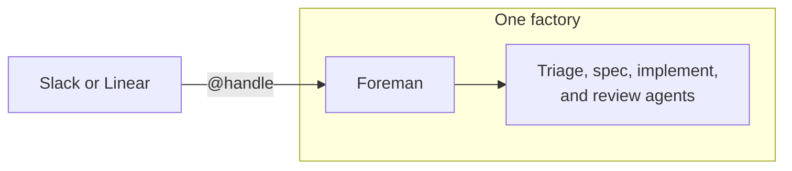

import { VARS } from '@data/vars';
import VideoEmbed from '@components/VideoEmbed.astro';

:::note
Warp Factories is in **Early Access** and available to a limited set of teams. [Request access](https://www.warp.dev/factories/request-access) to use it with your team.
:::

A software factory takes in requests (bug reports, feature specs, support escalations), and a coordinated fleet of agents works them into a stream of mergeable pull requests instead of a growing backlog. Warp Factories gives you the building blocks, so your team stays in the loop where it matters, approving specs when needed and merging every pull request.

<VideoEmbed url="https://www.youtube.com/watch?v=0WBk4ai8y1A" title="Introducing Warp Factories" />

## What is a software factory?

In practice, that means tracking each request as a work item, such as an issue, ticket, or triggered task, and moving it through specialized agents that triage it, write a specification when one is needed, implement the change, and review the result.

A factory is one deployed instance of that pattern, connecting your repositories and engineering tools to a team of agents, execution infrastructure, and a measurable workflow. Each factory applies a single policy across all of its work sources, so deploy separate factories for repository groups that need different policies.

### Sizing a factory

Size factories by product surface, not by workflow. Group the repositories that ship together into one factory. For example:

* One factory for your main application
* One factory for your marketing site
* One factory for your data pipelines

Don't split those same repositories across multiple factories by team or task (frontend vs. platform, for example). Add [agents](/factories/factory-agents/) and [skills](/factories/factory-skills/) to specialize instead.

<figure style={{ maxWidth: "563px" }}>

<figcaption>The general software factory loop. Warp Factories' default agents cover triage through review; add custom agents for the rest.</figcaption>
</figure>

## Who benefits from Warp Factories

Warp Factories is designed for engineering teams with repeatable work that extends beyond one coding session. Here's where it helps most:

* Process a backlog of issues with a consistent triage and delivery policy.
* Fix defects reported through support channels.
* Review incoming pull requests or maintain services across repositories.

## What you get with Warp Factories

* **Coordinated specialist agents** - A team of [factory agents](/factories/factory-agents/) handles each work item. A coordinating foreman routes it through the triage, spec, implement, and review agents, skipping stages that don't apply. You can add custom agents and automations to handle work the defaults don't cover.
* **Definitions as code** - [Version-controlled definition files](/factories/factory-as-code/) describe your repositories, agents, automations, runners, [skills](/factories/factory-skills/), and MCP servers, so factory changes get the same review, history, and rollback as code changes.
* **Integrations and the Factory MCP** - Work flows in from [Slack](/factories/integrations/slack/), [GitHub](/factories/integrations/github/), [GitLab](/factories/integrations/gitlab/), [Linear](/factories/integrations/linear/), and [Jira](/factories/integrations/jira/), plus [custom webhooks](/factories/webhooks/), direct runs, and schedules. The [Factory MCP](/factories/factory-mcp/) connects coding agents and other MCP clients.
* **Model and harness choice** - Each agent can use a different model and [supported harness](/platform/harnesses/), including the Warp Agent, Claude Code, and Codex.
* **Measurement and self-improvement** - The [factory dashboard](/factories/factory-dashboard/) shows work-item status, runs, automations, costs, and benchmarks. [Scorers](/factories/measure-and-improve/) classify completed runs, [Benchmarks](/factories/benchmarks/) compare fixed tasks across configurations, and [Self-improvement](/factories/measure-and-improve/#configure-and-review-self-improvement) turns repeated failures into follow-up work the factory proposes for review.
* **Infrastructure control** - Run on Warp-hosted infrastructure, or self-host execution on an eligible Enterprise plan. Teams can also connect supported inference providers, scope secrets, and (if eligible) store transcripts, artifacts, and run attachments in their own S3 or GCS buckets. See [infrastructure and security](/factories/infrastructure-and-security/) for the available controls.

## How Warp Factories relates to other Warp products

| Product | How it relates |
| --- | --- |
| **Warp** | The interactive terminal where you develop locally with agents and code review. A factory runs independently in the cloud. |
| **Warp Agent** | Warp's built-in agent harness. A factory's agents can run on it or on another supported harness. |
| **{VARS.WARP_CLI}** | Runs the Warp Agent in any terminal and exchanges work with a factory through the Factory MCP. |
| **{VARS.WARP_AUTOMATION_PLATFORM}** | Provides the cloud runs, runners, integrations, secrets, [multi-agent orchestration](/platform/orchestration/), and APIs that a factory assembles into one workflow. |

## The platform behind a factory

Warp Factories is built on the [{VARS.WARP_AUTOMATION_PLATFORM}](/platform/overview/), Warp's programmable system for running and coordinating agents at scale. A factory doesn't replace the platform; it assembles the platform's primitives into one standing workflow, so what you already know about cloud agents carries over:

* **Runs** - Every factory agent executes as a [cloud agent run](/platform/), with the same run records and [session sharing](/platform/viewing-cloud-agent-runs/) as any other cloud agent.
* **Execution** - [Runners](/platform/runners/) provide the compute each agent works on, and eligible Enterprise teams can route execution to [managed self-hosted workers](/platform/self-hosting/).
* **Agent configuration** - Each agent runs on a supported [harness](/platform/harnesses/) and model, with [secrets](/platform/secrets/) and [MCP servers](/platform/mcp/) scoping what it can reach.
* **Billing** - A factory's runs consume [platform credits](/support-and-community/plans-and-billing/platform-credits/) the same way as any other cloud agent run.

The factory layer adds the workflow on top: the foreman and its agents, work items that carry each request across runs, definitions as code, default automations for connected tools, and the Scorer and Self-improvement loop.

A standalone [cloud agent](/platform/) remains the right tool for a single task or a one-trigger automation. Reach for a factory when the work is a standing, multi-stage process your team wants to route, measure, and improve in one place.

## Key terms

Setup gives a factory and its foreman the same name by default, so it's easy to mistake one for the other. Here's how the terms differ:

* **factory** - An individual deployed software factory, built on Warp Factories infrastructure and connecting your repositories and tools to a team of agents. Distinct from Warp Factories, the product, and from the foreman, its coordinating agent.
* **foreman** - The coordinating agent inside a factory, and the only one you talk to. It dispatches the other [factory agents](/factories/factory-agents/) and reports back. Every factory has exactly one.
* **Foreman name** - The handle your team @-mentions in Slack and Linear to reach the foreman. Setup copies it from the factory's name, so the two usually match even though they're different things. See [Foreman name](/factories/factory-agents/#foreman-name).

## Next steps

* [**Set up a factory**](/factories/quickstart/) - Create a factory and send its first work item.
* [**Understand the execution model**](/factories/how-factories-work/) - See how the foreman coordinates stages, runs, and human decisions.
* [**Meet the factory agents**](/factories/factory-agents/) - See what each agent does and how to configure its model, harness, and instructions.
* **Adapt the system** - [Define the factory as code](/factories/factory-as-code/) and [connect its work sources](/factories/connect-your-factory/), or start from a working definition in [warp-factory-examples](https://github.com/warpdotdev/warp-factory-examples).
