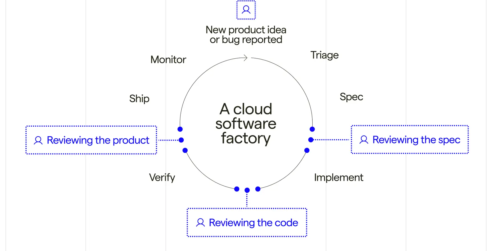

import { VARS } from '@data/vars';
import VideoEmbed from '@components/VideoEmbed.astro';

:::note
Warp Factories is in **Early Access** and available to a limited set of teams. [Request access](https://www.warp.dev/factories/request-access) to use it with your team. If your team already has access, sign in to the <a href={VARS.FACTORY_WEB_APP_URL}>{VARS.FACTORY_WEB_APP}</a>.
:::

A factory is a team of cloud agents attached to a set of repositories. Work arrives from the tools your team already uses: a Slack message, a GitHub issue, a Linear or Jira ticket, or a schedule. A coordinating agent called the foreman routes each request through triage, spec, implementation, and review, and the result comes back where the work started, usually as a pull request. For example, a factory can work through a backlog of issues, fix defects reported in a support channel, or review incoming pull requests across several repositories.

People stay in the loop at the points that matter: approving a spec, answering the foreman's questions, and merging.

<VideoEmbed url="https://www.youtube.com/watch?v=0WBk4ai8y1A" title="Introducing Warp Factories" />

<figure style={{ maxWidth: "563px" }}>

<figcaption>The software factory loop. The default agents cover triage through review.</figcaption>
</figure>

## The parts of a factory

### Work items

A work item is one request the factory acts on: an issue, a support thread, a pull request, or a scheduled job. It keeps its source context from intake to handoff, however many agents contribute along the way.

### The foreman and factory agents

Every factory has one foreman, the agent you talk to. It decides which agent a work item goes to next, asks you when it needs a decision, and hands back the finished pull request. Behind it are the default triage, spec, implement, and review agents; add custom agents for work they don't cover. Each agent can run on its own model and harness, including the Warp Agent, Claude Code, and Codex. See [factory agents](/factories/factory-agents/).

Setup gives the foreman the same handle as the factory, so `payments` is the factory and `@payments` reaches its foreman from Slack or Linear. See [Foreman name](/factories/factory-agents/#foreman-name).

### Stages and checkpoints

The foreman moves a work item through the Triage, Planning, Building, and Reviewing stages, skipping the ones a well-defined request doesn't need and sending work back when review finds problems. Spec approval and the foreman's questions are written into its instructions, which your team can edit. Merging is enforced by your repository's branch protection. See [how Warp Factories work](/factories/how-factories-work/).

### The factory definition

A factory's repositories, agents, automations, runners, skills, and MCP servers are declared in definition files, either managed by Warp or stored in a GitHub repository your team owns. Changes to a GitHub-backed factory go through pull request review like any other code. See [definitions as code](/factories/factory-as-code/).

### Work sources

Connect [Slack](/factories/integrations/slack/), [Microsoft Teams](/factories/integrations/teams/), [GitHub](/factories/integrations/github/), [GitLab](/factories/integrations/gitlab/), [Azure DevOps](/factories/integrations/azure-devops/), [Linear](/factories/integrations/linear/), or [Jira](/factories/integrations/jira/), and the factory posts results back in the same thread, issue, or pull request. [Custom webhooks](/factories/webhooks/) and [factory endpoints](/factories/factory-api/) cover other systems, schedules start recurring work, and the [Factory MCP](/factories/factory-mcp/) lets a local coding agent hand work to a factory and take it back. See [connect your factory](/factories/connect-your-factory/).

### Execution

Every agent run in a factory is an ordinary [cloud agent run](/platform/) on the {VARS.WARP_AUTOMATION_PLATFORM}, so the same runners, models, APIs, and security controls apply. Runs execute on Warp-hosted compute by default. Enterprise teams can keep checkout and execution on their own infrastructure with [managed self-hosting](/factories/self-hosting/). See [infrastructure and security](/factories/infrastructure-and-security/).

### Measurement

The [factory dashboard](/factories/factory-dashboard/) shows work items by stage, runs, and cost per pull request. [Scorers](/factories/measure-and-improve/scorers/) classify completed runs against criteria you write, [benchmarks](/factories/benchmarks/) compare models and runners on the same tasks, and [Self-improvement](/factories/measure-and-improve/self-improvement/) turns repeated failures into pull requests for your review. See [measure and improve](/factories/measure-and-improve/).

## Sizing a factory

Group the repositories that ship together into one factory, and keep separate products in separate factories. For example:

* One factory for your main application
* One factory for your marketing site
* One factory for your data pipelines

Don't split the same repositories across factories by team or task, such as frontend and platform. Add [agents](/factories/factory-agents/) and [skills](/factories/factory-skills/) to specialize instead.

## Related pages

* [Warp Factories quickstart](/factories/quickstart/) - Create a factory and send its first work item.
* [How Warp Factories work](/factories/how-factories-work/) - The work-item lifecycle, stage by stage.
* [Factory agents](/factories/factory-agents/) - What each default agent does and how to configure its model and harness.
* [Definitions as code](/factories/factory-as-code/) - The definition file format, with working examples in [warp-factory-examples](https://github.com/warpdotdev/warp-factory-examples).
