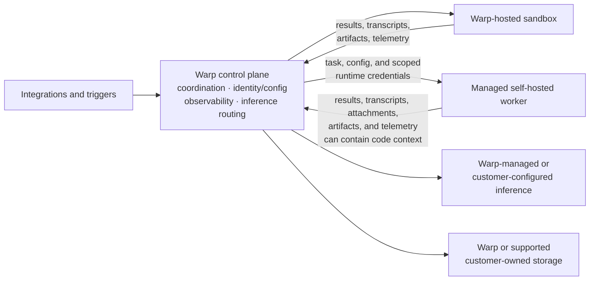

Warp Factories runs on the infrastructure your team chooses. You decide where a factory runs code, which model providers serve its inference requests, where run data such as transcripts and artifacts is stored, and which credentials each agent receives. Warp coordinates the work the same way regardless of these choices.

## Control plane and execution plane

Every factory splits responsibilities across two planes:

* **Control plane** - Warp coordinates runs, identity and configuration, observability, integrations, storage, and inference routing.
* **Execution plane** - A Warp-hosted sandbox or a managed self-hosted worker checks out code, runs setup, invokes tools, builds the project, and executes commands.

Self-hosting moves only the execution plane: with a managed self-hosted worker, repository checkouts, command execution, and the sandbox filesystem stay on machines you control, but content that enters prompts, results, transcripts, attachments, artifacts, or telemetry still flows through Warp and the providers you configure. See [deployment patterns](/platform/deployment-patterns/) and [self-hosting security and networking](/platform/self-hosting/security-and-networking/) for the broader data model.

The diagram below maps those boundaries for self-hosted execution; factory runs follow the same data model. See the [data security and boundaries](/platform/architecture/#data-security-and-boundaries) reference for a description of each data class.

## Runners

A runner defines the operating system, architecture, sandbox image, and instance shape (vCPUs and memory) for a factory agent. The factory's [definition](/factories/factory-as-code/) supplies its repositories, setup commands, and secrets; the execution host determines whether that runner uses Warp-hosted or self-hosted compute.

Declare runners as `runners/*.yaml` files. Every agent inherits `agentDefaults.runner`, and an agent or automation can override it. A self-hosted runner must match the worker's operating system and architecture. Warp provisions hosted runners within your plan limits; your team provisions and operates self-hosted compute.

See [cloud agent runner compute options](/platform/runners/) and [factory runner syntax](/factories/factory-as-code/#runnersnameyaml).

## Choose an execution host

A factory runs its work on one of two execution hosts: Warp-hosted compute or a worker in the [managed self-hosting architecture](/platform/self-hosting/#managed-architecture).

| Decision area | Warp-hosted | Managed self-hosted |
| --- | --- | --- |
| **Compute** | Warp provisions the sandbox | Your team provisions the worker |
| **Checkout and commands** | Run on Warp-managed compute | Run on your infrastructure |
| **Control plane** | Runs through Warp | Runs through Warp |
| **Network** | Warp manages sandbox connectivity | The worker connects outbound to Warp; no inbound firewall port |
| **Private services** | Must be reachable from the hosted sandbox | Reachable through the worker's network access |
| **Operations** | Warp manages capacity and lifecycle | Your team manages capacity, isolation, updates, and availability |

To route factory work to a managed self-hosted worker (an Enterprise feature):

1. **Deploy a worker** - Use the [self-hosting overview](/platform/self-hosting/) to choose a managed backend and review its requirements, then connect a worker that authenticates to Warp with an agent API key. Workers run on `linux/amd64` and `linux/arm64`, and the worker's platform determines which workloads it can run.
2. **Pair it with a compatible runner** - Choose a runner that matches the worker's platform.
3. **Select the worker in the factory definition** - Set [`workerHost`](/factories/factory-as-code/) so the factory routes work to it.

For a working definition with `workerHost` set and a platform-matched runner, see [`07-self-hosted-worker`](https://github.com/warpdotdev/warp-factory-examples/tree/main/examples/07-self-hosted-worker).

Unmanaged self-hosted agents and other CLI agents can't serve as a factory's execution host, but they can exchange work with a factory through [Factory MCP](/factories/factory-mcp/).

### Managed self-hosting structures

Factories use managed self-hosting, so Warp still orchestrates their runs. The worker backend sets isolation and scheduling on your infrastructure:

| Structure | How factory runs execute | What your team operates | Use it when |
| --- | --- | --- | --- |
| **[Docker](/platform/self-hosting/managed-docker/)** (default) | In a separate Docker container on the worker host | The worker daemon, host, Docker daemon, images, capacity, and container policy | Docker is available and you want per-run container isolation without Kubernetes |
| **[Kubernetes](/platform/self-hosting/managed-kubernetes/)** | As a Kubernetes Job in the worker's namespace | The worker deployment, cluster, namespace RBAC, scheduling, admission policy, and capacity | Your team already operates Kubernetes or needs cluster-native policy and scheduling |
| **[Direct](/platform/self-hosting/managed-direct/)** | In a separate workspace directly on the worker host, sharing its OS and kernel | The worker daemon, host security, dependencies, capacity, and cleanup | A container runtime isn't available or runs need direct access to host resources |

All three structures keep execution on your infrastructure while Warp operates the control plane.

## Choose inference and storage independently

Execution hosting doesn't select inference or storage. Configure those boundaries separately.

### Inference options for factory runs

Factory agents execute as cloud agents, so only inference options that support cloud agent runs apply:

| Option | Support for factory runs | Team controls | Key boundary |
| --- | --- | --- | --- |
| **Warp-managed inference** | Supported | The model selected for each agent | Warp provides the provider account and bills model usage with Warp credits |
| **[Team-managed keys and endpoints](/enterprise/enterprise-features/team-managed-keys-and-endpoints/)** | Supported on Enterprise | Shared OpenAI, Anthropic, or Google keys, or an OpenAI-compatible endpoint | Warp stores the encrypted credential and uses it only at the inference boundary; it never enters the worker or run environment |
| **[BYOLLM: AWS Bedrock](/enterprise/enterprise-features/byollm-aws-bedrock/)** | Supported on Enterprise | The AWS account, IAM role, available Claude models, and provider billing | Warp assumes your IAM role through OIDC; inference runs in your AWS account |
| **[BYOLLM: Gemini Enterprise](/enterprise/enterprise-features/byollm-gemini-enterprise/)** | Not supported for factory runs | Interactive inference in your Google Cloud project | Gemini Enterprise BYOLLM currently supports interactive agent requests only |

Self-serve BYOK and custom inference endpoints are stored on an individual member's device and don't apply to factory runs. With team-managed keys and endpoints, select a specific provider model or endpoint; Auto continues to use Warp-managed inference. When you supply the provider, its retention follows your account and contract, and Warp can't enforce ZDR for that provider.

### Customer-owned storage

Enterprise teams can keep supported transcripts, artifacts, and run attachments in a customer-owned Amazon S3 or Google Cloud Storage bucket. Your team owns the bucket's access and lifecycle policies. Factory configuration, run metadata, orchestration, and other control-plane state stay with Warp.

## Credential boundaries

A factory handles four kinds of credentials, each with its own boundary:

| Credential | Used for | Boundary |
| --- | --- | --- |
| **Inference credentials** | Model provider requests | Used only at the inference boundary; never injected into the sandbox |
| **Execution secrets** | APIs, package registries, and tools an agent uses | Delivered from an explicit per-agent allowlist; factory agents that don't act as a specific user receive no managed secrets by default |
| **Harness authentication** | Third-party harnesses such as Claude Code or Codex | Configured separately from the agent's secret allowlist |
| **Repository identity** | Checking out code and pushing changes | Runs act with the creating user's authorization (changes are attributed to them) or as the agent itself for unattended work; set by the definition's [`credentialStrategy`](/factories/factory-as-code/#credentialstrategy) |

Scope each credential to the resources and actions its agent needs. Warp redacts known secret values at output boundaries, but redaction is a backstop, not a substitute for narrow external permissions and rotation. See [cloud agent secrets](/platform/secrets/), [harness authentication](/platform/harnesses/authentication/), [secret redaction](/support-and-community/privacy-and-security/secret-redaction/), and [team identity](/platform/team-access-billing-and-identity/) for the underlying controls.

## Governance and metering

Factories use your existing [team roles](/enterprise/team-management/roles-and-permissions/): Team Owners and Admins control factory definitions, runners, secrets, and provider configuration. Warp Factories doesn't add a factory-specific approval role, so who reviews specifications and who approves merges stays a workflow and repository policy decision. Treat factory-definition changes as operational code: review them like any other change, and keep merge access with the people responsible for shipping.

Warp meters hosted compute, Warp-provided inference, and platform services. Managed self-hosted execution moves compute costs to your own infrastructure, and customer-supplied inference bills model usage through your provider account. Platform services consume credits regardless of these choices. See [platform credits](/support-and-community/plans-and-billing/platform-credits/) for details.

## Deployment checklist

1. **Classify the workload** - Identify the repositories, data, internal services, and regulated systems the factory can reach.
2. **Choose execution** - Decide where checkout, commands, and the sandbox filesystem must run.
3. **Configure the factory and its runners** - Set the repositories, setup commands, secrets, and compatible runners in the factory's definition.
4. **Choose inference and storage** - Select provider routing and where supported run data persists.
5. **Scope credentials** - Set each agent's secret allowlist, harness authentication, and repository identity.
6. **Set review gates** - Decide where humans review specifications and pull requests, and enforce those gates in workflow and repository policy.
7. **Validate operations** - Test network egress, isolation, rotation, redaction, capacity, observability, and metering before increasing volume.

## Related pages

* [**Deployment patterns**](/platform/deployment-patterns/) - Compare Warp-hosted, managed self-hosted, and CLI-only execution.
* [**Self-hosting overview**](/platform/self-hosting/) - Choose a managed worker backend and follow its setup guide.
* [**Self-hosting security and networking**](/platform/self-hosting/security-and-networking/) - Review data boundaries, network egress, and backend-specific controls.
* [**Bring Your Own LLM**](/enterprise/enterprise-features/bring-your-own-llm/) - Compare customer-owned inference options and provider support.
* [**Enterprise security overview**](/enterprise/security-and-compliance/security-overview/) - Review data handling, ZDR, compliance, and access controls across Warp.
