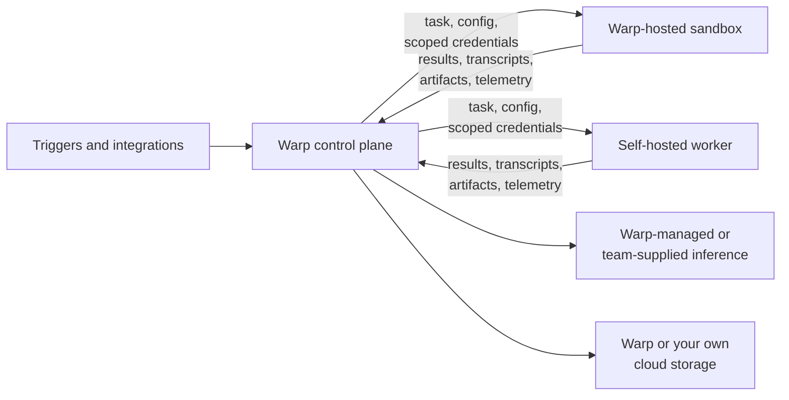

Warp Factories separates orchestration from execution: Warp coordinates the work, and the work itself runs on compute you choose. That split is what lets your team decide where a factory's code is checked out and built, which models answer its requests, where its data is stored, and what each agent can access.

:::note[Early access]
Warp Factories is in Early Access. Several controls on this page — self-hosted execution, team-supplied inference, and storage in your own cloud account — are Enterprise features that Warp enables for your team. [Contact sales](https://www.warp.dev/contact-sales) to confirm what's available on your plan.
:::

## Orchestration and execution

Two systems take part in every run:

* **Warp's control plane** - Receives triggers, coordinates runs, resolves configuration and identity, records observability data, and routes model requests.
* **The execution host** - Checks out repositories, runs setup commands, invokes tools, builds the project, and runs commands. This is either a Warp-hosted sandbox or a self-hosted worker on your own infrastructure.

Each choice on this page moves one boundary between them, and you make those choices independently. None of them takes Warp out of orchestration: run coordination, configuration, and observability always route through the control plane.

---

## Where your factory runs

A factory executes either on Warp-hosted compute or on a self-hosted worker your team operates.

| Aspect | **Warp-hosted** | **Self-hosted** |
| --- | --- | --- |
| **Compute provisioning** | Warp provisions the sandbox | Your team provisions the worker |
| **Checkout and commands** | Run on Warp-managed compute | Run on your infrastructure |
| **Run orchestration** | Warp | Warp |
| **Network access** | Warp manages sandbox connectivity | Outbound connection to Warp; no inbound ports |
| **Private services** | Must be reachable from the hosted sandbox | Reachable through the worker's network |
| **Operational burden** | Warp manages capacity and lifecycle | Your team manages capacity, isolation, updates, and availability |

Self-hosted execution is an Enterprise feature, and workers run on Linux (`amd64` or `arm64`). To route a factory to one, set `workerHost` in the [factory definition](/factories/factory-as-code/), pair it with a compatible runner, and work through the [self-hosting requirements](/platform/self-hosting/) first.

:::caution
Self-hosting gives you customer-hosted **execution**, not a guarantee that factory data stays inside your network. Repository clones, command execution, and the sandbox filesystem stay on your infrastructure, but code context still reaches Warp and your model provider through prompts, transcripts, artifacts, and telemetry, because that's how an agent does its job. See [self-hosting security and networking](/platform/self-hosting/security-and-networking/) for the full data boundary.
:::

Third-party CLI agents can't be a factory's execution host, but they can still exchange work with a factory through [Factory MCP](/factories/factory-mcp/).

---

## Environments and runners

Two pieces of reusable configuration describe every run, and a factory references both from its [definition as code](/factories/factory-as-code/):

* **[Environments](/platform/environments/)** - What the agent works on: repositories, setup commands, secrets, the toolchain image, and provider configuration.
* **[Runners](/platform/runners/)** - What it runs on: operating system, architecture, sandbox image, vCPUs, and memory.

A run can name a runner explicitly. Otherwise, Warp falls back to the environment's default runner and then to the system default. Runners appear in the control room, and when a factory's source lives in your own repository, its runner files stay the source of truth.

Hosted instance sizes are capped by your team's plan. Self-hosted runners aren't, since your team supplies the machines.

---

## Inference and storage

Factory agents are cloud agents, so they inherit the platform's inference options:

* **Warp-managed inference** - Warp routes requests to contracted providers under [Zero Data Retention (ZDR)](/enterprise/security-and-compliance/security-overview/#zero-data-retention-zdr) agreements.
* **Team-supplied inference** - Point runs at your own first-party model credentials, AWS Bedrock, or an OpenAI-compatible endpoint. See [team-managed model keys and endpoints](/enterprise/enterprise-features/team-managed-keys-and-endpoints/) and [Bring Your Own LLM](/enterprise/enterprise-features/bring-your-own-llm/).

When your team supplies the provider, model usage and retention follow your own account and contract. Warp has no retention setting for it. Gemini Enterprise through Vertex AI supports interactive sessions only, so it isn't available to factory agents.

Eligible teams can also persist transcripts, artifacts, and run attachments to their own Amazon S3 or Google Cloud Storage bucket, where your access and lifecycle policies apply. The rest of a factory's state stays with Warp.

---

## Credentials

A factory issues four kinds of credentials, each with its own boundary:

* **Inference credentials** - Authenticate model requests. They stay at the inference boundary and are never injected into the sandbox.
* **[Execution secrets](/platform/secrets/)** - Give an agent access to APIs, package registries, and tools. Each agent gets an explicit allowlist, and factory agents that don't act on behalf of a user start with no managed secrets.
* **[Harness authentication](/platform/harnesses/authentication/)** - Authenticates third-party harnesses such as Claude Code and Codex, separately from an agent's secret allowlist.
* **[Repository identity](/platform/team-access-billing-and-identity/)** - Authorizes checkout and any changes pushed to your code forge. Use a user's authorization when you want creator attribution, or a team executor identity for unattended work.

Scope each credential to the resources and actions its agent actually needs. Warp [redacts known secret values](/support-and-community/privacy-and-security/secret-redaction/) at output boundaries, but treat that as a backstop rather than a substitute for narrow permissions and regular rotation.

---

## Governance and metering

Owners and Admins control factory definitions, environments, runners, secrets, and provider configuration through your existing [team roles](/enterprise/team-management/roles-and-permissions/). Warp Factories doesn't add a factory-specific approval role: spec review and merge approval stay in your workflow and repository policy. Treat a factory definition as operational code and keep merge access with the people responsible for shipping it.

Warp meters hosted compute, Warp-provided inference, and platform services. Self-hosted compute is yours to supply, and your own model providers bill usage to your account, but platform services still consume [platform credits](/support-and-community/plans-and-billing/platform-credits/).

---

## Deployment checklist

Work through this before pointing a factory at production repositories.

1. **Classify the workload** - List the repositories, data, internal services, and regulated systems the factory can reach.
2. **Pick an execution host** - Decide whether checkout, commands, and the sandbox filesystem have to run on your infrastructure.
3. **Define the environment and runner** - Set repositories, setup commands, secrets, OS, architecture, image, and compute size.
4. **Choose inference and storage** - Select model routing and where transcripts, artifacts, and attachments are persisted.
5. **Scope credentials** - Set each agent's secret allowlist, harness authentication, and repository identity.
6. **Set the human gates** - Decide which spec and pull request reviews require a person, then enforce them in repository policy.
7. **Validate before scaling** - Test network egress, isolation, rotation, redaction, capacity, observability, and metering on low-risk work first.

---

## Related pages

* [Deployment patterns](/platform/deployment-patterns/) - How Warp-hosted, self-hosted, and CLI-only execution compare.
* [Self-hosting](/platform/self-hosting/) - Architectures, requirements, and setup for running agents on your own infrastructure.
* [Environments](/platform/environments/) - Define the repositories, image, and setup commands a factory works with.
* [Runners](/platform/runners/) - Configure the OS, architecture, and compute shape a run executes on.
* [Cloud agent secrets](/platform/secrets/) - Store and scope the credentials agents use at runtime.
* [Security overview](/enterprise/security-and-compliance/security-overview/) - Warp's data handling, ZDR, and compliance posture.
