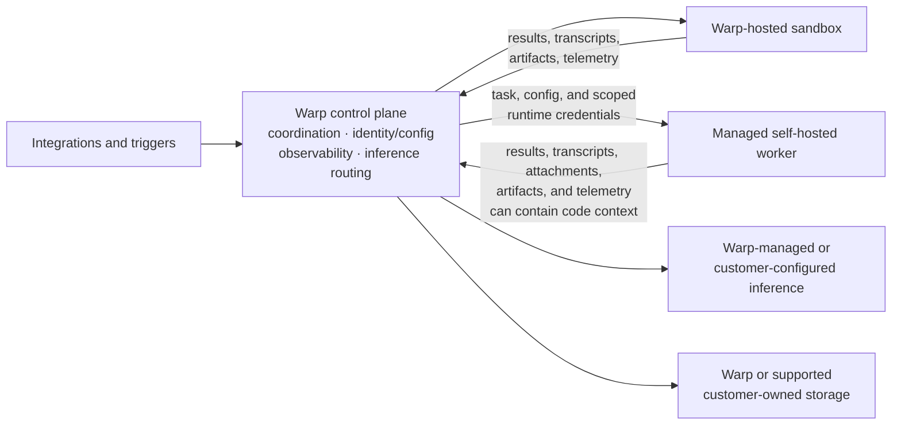
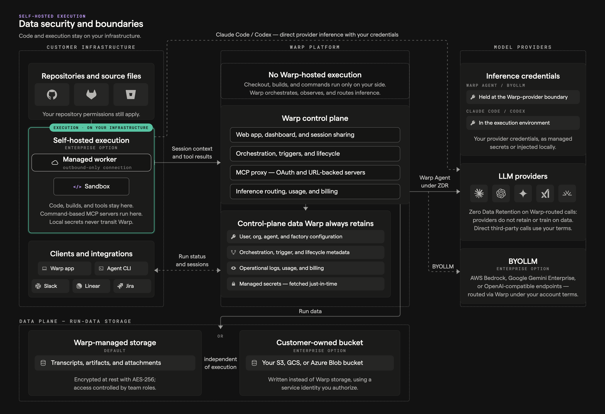

Warp Factories runs on the infrastructure your team chooses. You decide where a factory runs code, which model providers serve its inference requests, where run data such as transcripts and artifacts is stored, and which credentials each agent receives. Warp coordinates the work the same way regardless of these choices.

## Control plane and execution plane

Every factory splits responsibilities across two planes:

* **Control plane** - Warp coordinates runs, identity and configuration, observability, integrations, storage, and inference routing.
* **Execution plane** - A Warp-hosted sandbox or a managed self-hosted worker checks out code, runs setup, invokes tools, builds the project, and executes commands.

Self-hosting moves only the execution plane: with a managed self-hosted worker, repository checkouts, command execution, and the sandbox filesystem stay on machines you control, but content that enters prompts, results, transcripts, attachments, artifacts, or telemetry still flows through Warp and the providers you configure. See [deployment patterns](/platform/deployment-patterns/) and [self-hosting security and networking](/platform/self-hosting/security-and-networking/) for the broader data model.

The diagram below maps those boundaries for self-hosted execution; factory runs follow the same data model. See the [data security and boundaries](/platform/architecture/#data-security-and-boundaries) reference for a description of each data class.

## Runners

A runner defines the compute a factory's agents work on: the operating system and architecture, the sandbox image, and the instance shape (vCPUs and memory). It's the infrastructure choice you make for a factory. The workspace itself — repositories, setup commands, and secrets — comes from the factory's [definition](/factories/factory-as-code/), and Warp keeps it in step for you. See the [runner reference](/platform/runners/) for the available compute options.

Runners are declared as `runners/*.yaml` files in the definition, and you can define more than one — a Linux runner with more cores and memory for builds, a macOS runner for platform-specific work. Every agent inherits the factory's default (`agentDefaults.runner`), and any agent or automation can name its own `runner` instead, so the foreman can send implementation to a macOS runner while every other agent stays on Linux. For working runner files, see [`02-sdlc-issue-to-pr`](https://github.com/warpdotdev/warp-factory-examples/tree/main/examples/02-sdlc-issue-to-pr) (three runners selected per agent, including macOS) and [`03-multi-harness`](https://github.com/warpdotdev/warp-factory-examples/tree/main/examples/03-multi-harness) (an `x86_64` and an `aarch64` runner) in the [warp-factory-examples](https://github.com/warpdotdev/warp-factory-examples) repository.

The **Runners** section of a factory's **Settings** page in the [factory dashboard](/factories/factory-dashboard/) shows each runner's operating system and architecture, setup commands, size, and whether it's the default. Where you edit runners depends on where the factory's source lives:

* **Externally managed source** - The `runners/*.yaml` files in the connected repository are the source of truth, and edits open in that repository.
* **Warp-managed source** - Authorized users create and edit runner files directly in the factory dashboard.

Your team's plan sets the default instance shape (vCPUs and memory) for Warp-hosted runners. The same maximum shape applies on every plan, and Warp rejects hosted shapes above it. Enterprise teams that need more can request a higher maximum. Managed self-hosted runners are exempt from the hosted maximum because your team supplies the compute.

## Choose an execution host

A factory runs its work on one of two execution hosts: Warp-hosted compute or a managed self-hosted worker.

| Decision area | Warp-hosted | Managed self-hosted |
| --- | --- | --- |
| **Compute** | Warp provisions the sandbox | Your team provisions the worker |
| **Checkout and commands** | Run on Warp-managed compute | Run on your infrastructure |
| **Control plane** | Runs through Warp | Runs through Warp |
| **Network** | Warp manages sandbox connectivity | The worker connects outbound to Warp; no inbound firewall port |
| **Private services** | Must be reachable from the hosted sandbox | Reachable through the worker's network access |
| **Operations** | Warp manages capacity and lifecycle | Your team manages capacity, isolation, updates, and availability |

To route factory work to a managed self-hosted worker (an Enterprise feature):

1. **Deploy a worker** - Review the [self-hosting requirements](/platform/self-hosting/), then connect a worker that authenticates to Warp with an agent API key. Workers run on `linux/amd64` and `linux/arm64`, and the worker's platform determines which workloads it can run.
2. **Pair it with a compatible runner** - Choose a runner that matches the worker's platform.
3. **Select the worker in the factory definition** - Set [`workerHost`](/factories/factory-as-code/) so the factory routes work to it.

For a working definition with `workerHost` set and a platform-matched runner, see [`07-self-hosted-worker`](https://github.com/warpdotdev/warp-factory-examples/tree/main/examples/07-self-hosted-worker).

Unmanaged self-hosted agents and other CLI agents can't serve as a factory's execution host, but they can exchange work with a factory through [Factory MCP](/factories/factory-mcp/).

## Choose execution, inference, and storage independently

Execution, inference, and storage are independent choices: each moves one boundary and leaves the rest of the run flow with Warp.

| Team choice | What it changes | What stays with Warp |
| --- | --- | --- |
| **Execution**: Warp-hosted or managed self-hosted | Where checkout, commands, and the sandbox filesystem run | Coordination, configuration, observability, and inference routing |
| **Inference**: Warp-managed or customer-supplied | The provider account, model routing, billing, and provider-side retention | Run coordination and inference routing |
| **Storage**: Warp or customer-owned | Where supported transcripts, artifacts, and run attachments persist | Orchestration, the write path, and other factory and control-plane state |

:::note
Managed self-hosted execution, customer-supplied inference, and customer-owned storage all require an Enterprise plan.
:::

Factory runs execute as [cloud agents](/platform/), so customer-supplied inference is limited to providers that support cloud agents. See [team-managed model keys and endpoints](/enterprise/enterprise-features/team-managed-keys-and-endpoints/) and [Bring Your Own LLM](/enterprise/enterprise-features/bring-your-own-llm/) for the supported providers. When you supply the provider, provider-side retention follows your provider account and contract; Warp can't configure or enforce it for you. The [security overview](/enterprise/security-and-compliance/security-overview/) covers Warp's broader data handling.

For storage, Enterprise teams can keep the supported data classes above (transcripts, artifacts, and run attachments) in a customer-owned Amazon S3 or Google Cloud Storage bucket. Warp enables customer-owned storage for your team and writes the applicable data to the bucket you configure; your team owns the bucket's access and lifecycle policies. Customer-owned storage doesn't move all factory state into your account: configuration, run metadata, and other control-plane state stay with Warp.

## Credential boundaries

A factory handles four kinds of credentials, each with its own boundary:

| Credential | Used for | Boundary |
| --- | --- | --- |
| **Inference credentials** | Model provider requests | Used only at the inference boundary; never injected into the sandbox |
| **Execution secrets** | APIs, package registries, and tools an agent uses | Delivered from an explicit per-agent allowlist; factory agents that don't act as a specific user receive no managed secrets by default |
| **Harness authentication** | Third-party harnesses such as Claude Code or Codex | Configured separately from the agent's secret allowlist |
| **Repository identity** | Checking out code and pushing changes | Runs act with the creating user's authorization (changes are attributed to them) or as the agent itself for unattended work; set by the definition's [`credentialStrategy`](/factories/factory-as-code/#credentialstrategy) |

Scope each credential to the resources and actions its agent needs. Warp redacts known secret values at output boundaries, but redaction is a backstop, not a substitute for narrow external permissions and rotation. See [cloud agent secrets](/platform/secrets/), [harness authentication](/platform/harnesses/authentication/), [secret redaction](/support-and-community/privacy-and-security/secret-redaction/), and [team identity](/platform/team-access-billing-and-identity/) for the underlying controls.

## Governance and metering

Factories use your existing [team roles](/enterprise/team-management/roles-and-permissions/): Team Owners and Admins control factory definitions, runners, secrets, and provider configuration. Warp Factories doesn't add a factory-specific approval role, so who reviews specifications and who approves merges stays a workflow and repository policy decision. Treat factory-definition changes as operational code: review them like any other change, and keep merge access with the people responsible for shipping.

Warp meters hosted compute, Warp-provided inference, and platform services. Managed self-hosted execution moves compute costs to your own infrastructure, and customer-supplied inference bills model usage through your provider account. Platform services consume credits regardless of these choices. See [platform credits](/support-and-community/plans-and-billing/platform-credits/) for details.

## Deployment checklist

1. **Classify the workload** - Identify the repositories, data, internal services, and regulated systems the factory can reach.
2. **Choose execution** - Decide where checkout, commands, and the sandbox filesystem must run.
3. **Configure the factory and its runners** - Set the repositories, setup commands, and secrets in the factory's definition, and choose each runner's operating system, architecture, image, and compute.
4. **Choose inference and storage** - Select provider routing and where supported run data persists.
5. **Scope credentials** - Set each agent's secret allowlist, harness authentication, and repository identity.
6. **Set review gates** - Decide where humans review specifications and pull requests, and enforce those gates in workflow and repository policy.
7. **Validate operations** - Test network egress, isolation, rotation, redaction, capacity, observability, and metering before increasing volume.
