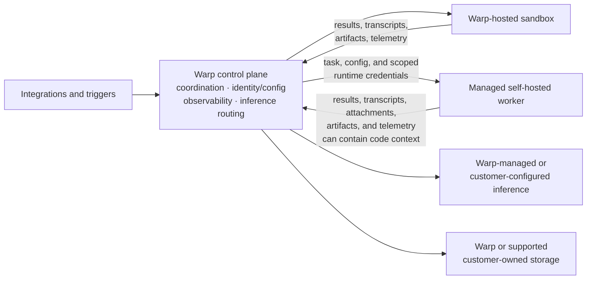

Warp Factories separate coordination from execution. Your team can choose where a factory runs code, which supported providers serve model requests, where supported factory data is stored, and which credentials each agent receives. Available controls depend on your team's configuration and agreement with Warp.

## Control plane and execution plane

* **Control plane** - Warp coordinates runs, identity and configuration, observability, integrations, storage, and inference routing.
* **Execution plane** - A Warp-hosted sandbox or managed self-hosted worker checks out code, runs setup, invokes tools, builds the project, and executes commands.

Managed self-hosting changes the execution boundary; it does not remove Warp from orchestration. On managed self-hosted compute, the repository checkout, command execution, and sandbox filesystem stay on customer infrastructure. Content included in prompts, results, transcripts, attachments, artifacts, or telemetry can still flow through Warp and configured providers. Customer-owned provider and storage options change their corresponding paths, not the existence of the control plane. See [deployment patterns](../platform/deployment-patterns) and [self-hosting security and networking](../platform/self-hosting/security-and-networking) for the broader data model.

## Environments and runners

| Configuration | Defines | Typical contents |
| --- | --- | --- |
| **Environment** | Workspace and runtime context | Repositories, setup, secrets, toolchain image, and provider configuration |
| Runner | Execution compute | Operating system, architecture, sandbox image, vCPUs, and memory |

A run can select a runner explicitly. Otherwise, Warp uses the environment's configured execution defaults and ultimately the system default. Use [environments](../platform/environments) to define the workspace and the [runner reference](../platform/runners) for compute and resolution behavior. A factory references both through its [definition as code](./factory-as-code).

In the control room, the [Runners surface](../platform/runners) shows each runner's default status, operating system and architecture, setup commands, and size. For an externally source-managed factory, `runners/*.yaml` remains the source of truth and edits open in the connected repository. With Warp-managed source, authorized users can create and edit runner files in the control room.

Warp-hosted instance shapes are limited by your team's plan. Warp rejects a hosted shape above that limit. Managed self-hosted runners are exempt from the hosted size limit because your team supplies the compute. See the [runner reference](../platform/runners) for configuration details.

## Choose an execution host

A factory can select Warp-hosted compute or a managed self-hosted worker as its execution host.

| Decision area | Warp-hosted | Managed self-hosted |
| --- | --- | --- |
| Compute | Warp provisions the sandbox | Your team provisions the worker |
| **Checkout and commands** | Run on Warp-managed compute | Run on customer-managed compute |
| **Control plane** | Runs through Warp | Runs through Warp |
| Network | Warp manages sandbox connectivity | Outbound connection to Warp; no inbound firewall port |
| **Private services** | Must be reachable from the hosted sandbox | Uses the worker's network access |
| Operations | Warp manages capacity and lifecycle | Your team manages capacity, isolation, updates, and availability |

Managed self-hosted execution is available to eligible Enterprise teams. Supported worker implementations include `linux/amd64` and `linux/arm64`; each worker implementation determines workload compatibility. Workers authenticate to Warp with a supported principal. Select a managed self-hosted worker with [`workerHost` in the factory definition](./factory-as-code), use a compatible runner, and review the [self-hosting requirements](../platform/self-hosting/) before routing factory work. Unmanaged and other CLI agents are not selectable factory execution hosts, but they can exchange work with a factory through [Factory MCP](./factory-mcp). Do not treat self-hosting as a guarantee that all factory data stays in your network.

## Choose execution, inference, and storage independently

| Team choice | Boundary changed | What remains in the Warp path |
| --- | --- | --- |
| **Warp-hosted or managed self-hosted execution** | Where checkout, commands, and the sandbox filesystem run | Coordination, configuration, observability, and inference routing |
| **Warp-managed or customer-supplied inference** | Provider account, model routing, billing, and provider-side retention | Run coordination and inference routing |
| **Warp or customer-owned storage** | Persistence for supported transcripts, artifacts, and run attachments | Orchestration, the write path, and other factory and control-plane state |

Cloud-agent inference supports team-managed first-party model credentials, AWS Bedrock, and OpenAI-compatible custom endpoints. Gemini Enterprise (Vertex AI) supports interactive sessions only and is not available to cloud agents. Provider-side retention follows your provider account and contract; Warp does not expose a retention toggle for that provider. Review [team-managed model keys and endpoints](../enterprise/enterprise-features/team-managed-keys-and-endpoints), [Bring Your Own LLM](../enterprise/enterprise-features/bring-your-own-llm), and the [security overview](../enterprise/security-and-compliance/security-overview).

Eligible teams can use customer-owned Amazon S3 or Google Cloud Storage for the supported data classes in the table. Warp writes the applicable data to the configured bucket. Your team owns its access and lifecycle policies, but customer-owned storage does not move all factory state into your account.

## Credential boundaries

| Credential | Where it applies | Boundary |
| --- | --- | --- |
| **Inference credentials** | Model provider requests | Remain at the inference boundary and are not injected into the sandbox |
| **Execution secrets** | APIs, package registries, and tools used by an agent | Explicit per-agent allowlist; non-user factory agents default to no managed secrets |
| **Harness authentication** | Third-party harnesses such as Claude Code or Codex | Separate from the agent's general secret allowlist |
| **Repository identity** | Checkout and code-forge changes | User authorization for creator attribution or a team executor identity for unattended work |

Restrict each credential to the resources and actions its agent needs. Warp redacts known secret values at output boundaries, but redaction does not replace narrow external permissions or rotation. See [cloud agent secrets](../platform/secrets), [harness authentication](../platform/harnesses/authentication), [secret redaction](../support-and-community/privacy-and-security/secret-redaction), and [team identity](../platform/team-access-billing-and-identity) for the underlying controls.

## Governance and metering

Team Owners and Admins control factory definitions, environments, runners, secrets, and provider configuration through existing [team roles](../enterprise/team-management/roles-and-permissions). Warp Factories does not add a factory-specific approval role. Specification review and merge approval remain workflow and repository policy decisions. Review factory-definition changes as operational code and keep merge access with the people responsible for shipping.

Warp meters hosted compute, Warp-provided inference, and platform services. Your team supplies managed self-hosted compute. Customer-supplied providers bill model usage through the applicable provider account, while platform services can still consume credits. See [platform credits](../support-and-community/plans-and-billing/platform-credits) for the current model.

## Deployment checklist

1. **Classify the workload** - Identify the repositories, data, internal services, and regulated systems the factory can reach.
2. **Choose execution** - Decide where checkout, commands, and the sandbox filesystem must run.
3. **Define environments and runners** - Set repositories, setup, secrets, operating system, architecture, image, and compute.
4. **Choose inference and storage** - Select provider routing and persistence for supported data.
5. **Scope credentials** - Set each agent's secret allowlist, harness authentication, and repository identity.
6. **Set human gates** - Define specification and pull request review in workflow and repository policy.
7. **Validate operations** - Test network egress, isolation, rotation, redaction, capacity, observability, and metering before increasing volume.
