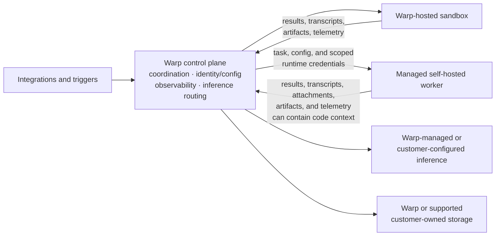

Warp Factories separates coordination from execution: Warp coordinates the work, and your team chooses the infrastructure the work runs on. You decide where a factory runs code, which model providers serve its inference requests, where run data such as transcripts and artifacts is stored, and which credentials each agent receives. Not every option is available to every team: managed self-hosted execution and customer-supplied inference require an Enterprise plan, and Warp enables customer-owned storage for eligible teams.

## Control plane and execution plane

Every factory splits responsibilities across two planes:

* **Control plane** - Warp coordinates runs, identity and configuration, observability, integrations, storage, and inference routing.
* **Execution plane** - A Warp-hosted sandbox or a managed self-hosted worker checks out code, runs setup, invokes tools, builds the project, and executes commands.

Self-hosting moves the execution plane onto your infrastructure; it does not remove Warp from coordination. With a managed self-hosted worker, repository checkouts, command execution, and the sandbox filesystem stay on machines you control, but content that enters prompts, results, transcripts, attachments, artifacts, or telemetry still flows through Warp and the providers you configure. In the same way, customer-supplied inference and customer-owned storage redirect those specific data paths without changing how runs are coordinated. See [deployment patterns](../platform/deployment-patterns) and [self-hosting security and networking](../platform/self-hosting/security-and-networking) for the broader data model.

## Environments and runners

Two configurations define where and how a factory's agents work:

| Configuration | Defines | Typical contents |
| --- | --- | --- |
| **Environment** | What an agent works on: the workspace and runtime context | Repositories, setup commands, secrets, toolchain image, and provider configuration |
| **Runner** | Where the work executes: the compute | Operating system, architecture, sandbox image, vCPUs, and memory |

When a run starts, Warp resolves its compute in a fixed order: the runner the run selects explicitly, then the environment's execution defaults, then the system default. Use [environments](../platform/environments) to define the workspace and the [runner reference](../platform/runners) for compute options and resolution behavior. A factory references both through its [definition as code](./factory-as-code).

The **Runners** page in the control room shows each runner's operating system and architecture, setup commands, size, and whether it's the default. Where you edit runners depends on where the factory's source lives:

* **Externally managed source** - The `runners/*.yaml` files in the connected repository are the source of truth, and edits open in that repository.
* **Warp-managed source** - Authorized users create and edit runner files directly in the control room.

Your team's plan sets the maximum instance shape (vCPUs and memory) for Warp-hosted runners, and Warp rejects hosted shapes above that limit. Managed self-hosted runners are exempt from the hosted size limit because your team supplies the compute. See the [runner reference](../platform/runners) for configuration details.

## Choose an execution host

A factory runs its work on one of two execution hosts: Warp-hosted compute or a managed self-hosted worker.

| Decision area | Warp-hosted | Managed self-hosted |
| --- | --- | --- |
| **Compute** | Warp provisions the sandbox | Your team provisions the worker |
| **Checkout and commands** | Run on Warp-managed compute | Run on your infrastructure |
| **Control plane** | Runs through Warp | Runs through Warp |
| **Network** | Warp manages sandbox connectivity | The worker connects outbound to Warp; no inbound firewall port |
| **Private services** | Must be reachable from the hosted sandbox | Reachable through the worker's network access |
| **Operations** | Warp manages capacity and lifecycle | Your team manages capacity, isolation, updates, and availability |

Managed self-hosted execution is available to eligible Enterprise teams. To route factory work to a worker:

1. **Deploy a worker** - Review the [self-hosting requirements](../platform/self-hosting/), then connect a worker that authenticates to Warp with an agent API key. Workers run on `linux/amd64` and `linux/arm64`, and the worker's platform determines which workloads it can run.
2. **Pair it with a compatible runner** - Choose a runner that matches the worker's platform.
3. **Select the worker in the factory definition** - Set [`workerHost`](./factory-as-code) so the factory routes work to it.

Unmanaged self-hosted agents and other CLI agents can't serve as a factory's execution host, but they can exchange work with a factory through [Factory MCP](./factory-mcp).

:::caution
Self-hosting is not a guarantee that all factory data stays in your network. Execution stays on your infrastructure, but run content still flows through Warp and your configured providers as described above.
:::

## Choose execution, inference, and storage independently

Execution, inference, and storage are three separate decisions, and choosing one does not constrain the others. Each choice moves one boundary and leaves the rest of the run flow with Warp:

| Team choice | What it changes | What stays with Warp |
| --- | --- | --- |
| **Execution**: Warp-hosted or managed self-hosted | Where checkout, commands, and the sandbox filesystem run | Coordination, configuration, observability, and inference routing |
| **Inference**: Warp-managed or customer-supplied | The provider account, model routing, billing, and provider-side retention | Run coordination and inference routing |
| **Storage**: Warp or customer-owned | Where supported transcripts, artifacts, and run attachments persist | Orchestration, the write path, and other factory and control-plane state |

Factory runs execute as cloud agents, so customer-supplied inference follows cloud-agent support: team-managed first-party model keys, AWS Bedrock, and OpenAI-compatible custom endpoints. Gemini Enterprise (Vertex AI) supports interactive sessions only and isn't available to cloud agents. When you supply the provider, provider-side retention follows your provider account and contract; Warp can't configure or enforce it for you. Review [team-managed model keys and endpoints](../enterprise/enterprise-features/team-managed-keys-and-endpoints), [Bring Your Own LLM](../enterprise/enterprise-features/bring-your-own-llm), and the [security overview](../enterprise/security-and-compliance/security-overview).

For storage, eligible teams can keep the supported data classes above (transcripts, artifacts, and run attachments) in a customer-owned Amazon S3 or Google Cloud Storage bucket. Warp writes the applicable data to the bucket you configure, and your team owns the bucket's access and lifecycle policies. Customer-owned storage doesn't move all factory state into your account: configuration, run metadata, and other control-plane state stay with Warp.

## Credential boundaries

A factory handles four kinds of credentials, each with its own boundary:

| Credential | Used for | Boundary |
| --- | --- | --- |
| **Inference credentials** | Model provider requests | Used only at the inference boundary; never injected into the sandbox |
| **Execution secrets** | APIs, package registries, and tools an agent uses | Delivered from an explicit per-agent allowlist; factory agents that don't act as a specific user receive no managed secrets by default |
| **Harness authentication** | Third-party harnesses such as Claude Code or Codex | Configured separately from the agent's secret allowlist |
| **Repository identity** | Checking out code and pushing changes | Runs act with the creating user's authorization (changes are attributed to them) or as a team executor identity for unattended work |

Scope each credential to the resources and actions its agent needs. Warp redacts known secret values at output boundaries, but redaction is a backstop, not a substitute for narrow external permissions and rotation. See [cloud agent secrets](../platform/secrets), [harness authentication](../platform/harnesses/authentication), [secret redaction](../support-and-community/privacy-and-security/secret-redaction), and [team identity](../platform/team-access-billing-and-identity) for the underlying controls.

## Governance and metering

Factories use your existing [team roles](../enterprise/team-management/roles-and-permissions): Team Owners and Admins control factory definitions, environments, runners, secrets, and provider configuration. Warp Factories doesn't add a factory-specific approval role, so who reviews specifications and who approves merges stays a workflow and repository policy decision. Treat factory-definition changes as operational code: review them like any other change, and keep merge access with the people responsible for shipping.

Warp meters hosted compute, Warp-provided inference, and platform services. Your infrastructure choices shift the corresponding bill: your team supplies managed self-hosted compute, and customer-supplied providers bill model usage through your provider account. Platform services can still consume credits regardless of those choices. See [platform credits](../support-and-community/plans-and-billing/platform-credits) for the current model.

## Deployment checklist

1. **Classify the workload** - Identify the repositories, data, internal services, and regulated systems the factory can reach.
2. **Choose execution** - Decide where checkout, commands, and the sandbox filesystem must run.
3. **Define environments and runners** - Set repositories, setup commands, secrets, operating system, architecture, image, and compute.
4. **Choose inference and storage** - Select provider routing and where supported run data persists.
5. **Scope credentials** - Set each agent's secret allowlist, harness authentication, and repository identity.
6. **Set review gates** - Decide where humans review specifications and pull requests, and enforce those gates in workflow and repository policy.
7. **Validate operations** - Test network egress, isolation, rotation, redaction, capacity, observability, and metering before increasing volume.
