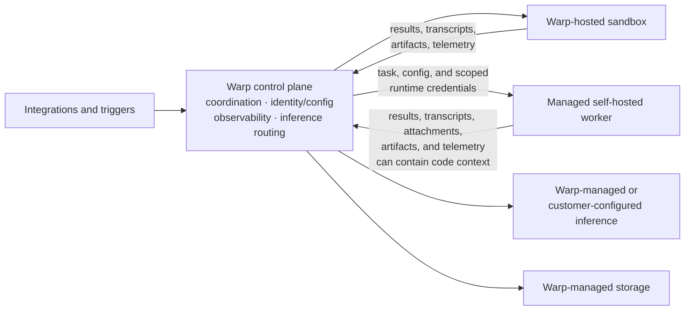
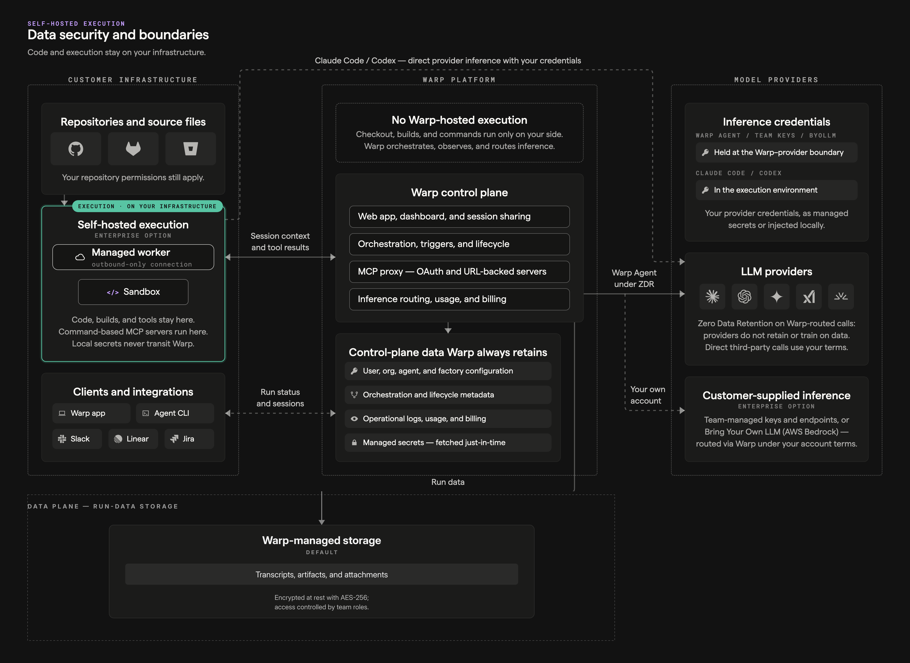

Warp Factories runs on the infrastructure your team chooses. You decide where a factory runs code, which model providers serve its inference requests, and which credentials each agent receives. Warp coordinates the work and stores run data such as transcripts and artifacts.

## Control plane and execution plane

Every factory splits responsibilities across two planes:

* **Control plane** - Warp coordinates runs, identity and configuration, observability, integrations, storage, and inference routing.
* **Execution plane** - A Warp-hosted sandbox or a managed self-hosted worker checks out code, runs setup, invokes tools, builds the project, and executes commands.

```mermaid
flowchart LR
  I["Integrations and triggers"] --> C["Warp control plane<br/>coordination · identity/config<br/>observability · inference routing"]
  C --> H["Warp-hosted sandbox"]
  C -->|"task, config, and scoped<br/>runtime credentials"| S["Managed self-hosted worker"]
  H -->|"results, transcripts,<br/>artifacts, telemetry"| C
  S -->|"results, transcripts, attachments,<br/>artifacts, and telemetry<br/>can contain code context"| C
  C --> P["Warp-managed or<br/>customer-configured inference"]
  C --> D["Warp-managed storage"]
```

With managed self-hosting, repository checkouts, commands, and sandbox files stay on machines you control. Prompts, results, transcripts, attachments, artifacts, and telemetry still flow through Warp and configured providers. See [deployment patterns](/factories/deployment-patterns/), [execution security](/platform/execution-security/), and the [data security and boundaries](/platform/architecture/#data-security-and-boundaries) reference for details.

## Runners

A runner selects the operating system, architecture, sandbox image, and vCPU and memory shape. The factory's [definition](/factories/factory-as-code/) supplies repositories, setup commands, and secrets. Define runners in `runners/*.yaml`; `agentDefaults.runner` sets the default, and agents and automations can override it. The execution host determines how each setting is used:

| Setting | Warp-hosted | Direct | Kubernetes | Docker |
| --- | --- | --- | --- | --- |
| `platform.os`, `platform.arch`, `platform.mac.version` | Selects the sandbox OS, architecture, and macOS VM version | Does not configure the host; the worker host determines the platform | Use Linux; the cluster and `pod_template` schedule nodes | Use Linux; the Docker daemon determines the architecture |
| `platform.linux.dockerImage` | Linux sandbox image | Ignored | Task and setup container image | Task container image |
| `platform.linux.registryCredentialSecretName` | Warp-managed private-registry credential | Ignored | Ignored; use `imagePullSecrets` | Ignored; configure registry credentials on the worker, such as in its Docker config |
| `instanceShape` | Sandbox size, subject to plan limits; omitted uses the workspace default | Ignored; the task uses host resources | Task-container requests and limits; overrides matching `pod_template` resources; omitted keeps template or cluster defaults | Task-container limits; omitted adds no limits |

Self-hosted runner settings do not provision worker capacity. Worker configuration controls host resources, registry authentication, volumes, node placement, and other backend policy.

## Choose an execution host

A factory runs its work on one of two execution hosts: Warp-hosted compute or a worker in the [managed self-hosting architecture](/factories/self-hosting/#managed-architecture).

| Decision area | Warp-hosted | Managed self-hosted |
| --- | --- | --- |
| **Compute** | Warp provisions the sandbox | Your team provisions the worker |
| **Checkout and commands** | Run on Warp-managed compute | Run on your infrastructure |
| **Network** | Warp manages sandbox connectivity | The worker connects outbound to Warp; no inbound firewall port |
| **Private services** | Must be reachable from the hosted sandbox | Reachable through the worker's network access |
| **Operations** | Warp manages capacity and lifecycle | Your team manages capacity, isolation, updates, and availability |

To route factory work to a managed self-hosted worker (an Enterprise feature):

1. **Deploy a worker** - Review the [self-hosting requirements](/factories/self-hosting/), then connect a worker that authenticates to Warp with a self-hosted worker API key. Workers run on `linux/amd64` and `linux/arm64`, and the worker's platform determines which workloads it can run.
2. **Pair it with a compatible runner** - Choose a runner that matches the worker's platform.
3. **Select the worker in the factory definition** - Set [`workerHost`](/factories/factory-as-code/) so the factory routes work to it.

For a working definition with `workerHost` set and a platform-matched runner, see [`07-self-hosted-worker`](https://github.com/warpdotdev/warp-factory-examples/tree/main/examples/07-self-hosted-worker).

Unmanaged self-hosted agents and other CLI agents can't serve as a factory's execution host, but they can exchange work with a factory through [Factory MCP](/factories/factory-mcp/).

### Managed self-hosting structures

Factories use managed self-hosting, so Warp still orchestrates their runs. The worker backend sets isolation and scheduling on your infrastructure:

| Structure | How factory runs execute | What your team operates | Use it when |
| --- | --- | --- | --- |
| **[Docker](/factories/self-hosting/managed-docker/)** (default) | In a separate Docker container on the worker host | The worker daemon, host, Docker daemon, images, capacity, and container policy | Docker is available and you want per-run container isolation without Kubernetes |
| **[Kubernetes](/factories/self-hosting/managed-kubernetes/)** | As a Kubernetes Job in the worker's namespace | The worker deployment, cluster, namespace RBAC, scheduling, admission policy, and capacity | Your team already operates Kubernetes or needs cluster-native policy and scheduling |
| **[Direct](/factories/self-hosting/managed-direct/)** | In a separate workspace directly on the worker host, sharing its OS and kernel | The worker daemon, host security, dependencies, capacity, and cleanup | A container runtime isn't available or runs need direct access to host resources |

## Choose inference independently

Execution hosting doesn't select inference. Configure that boundary separately.

### Inference options for factory runs

Factory agents execute as cloud agents, so only inference options that support cloud agent runs apply:

| Option | Support for factory runs | Team controls | Key boundary |
| --- | --- | --- | --- |
| **Warp-managed inference** | Supported | The model selected for each agent | Warp provides the provider account and bills model usage with Warp credits |
| **[Team-managed keys and endpoints](/enterprise/enterprise-features/team-managed-keys-and-endpoints/)** | Supported on Business and Enterprise | Shared OpenAI, Anthropic, or Google keys, or an OpenAI-compatible endpoint | Warp stores the encrypted credential and uses it only at the inference boundary; it never enters the worker or run environment |
| **[BYOLLM: AWS Bedrock](/enterprise/enterprise-features/byollm-aws-bedrock/)** | Supported on Enterprise | The AWS account, IAM role, available Claude models, and provider billing | Warp assumes your IAM role through OIDC; inference runs in your AWS account |
| **[BYOLLM: Gemini Enterprise](/enterprise/enterprise-features/byollm-gemini-enterprise/)** | Not supported for factory runs | Interactive inference in your Google Cloud project | Gemini Enterprise BYOLLM currently supports interactive agent requests only |

Self-serve BYOK and custom inference endpoints are stored on an individual member's device and don't apply to factory runs. With team-managed keys and endpoints, select a specific provider model or endpoint; Auto continues to use Warp-managed inference. When you supply the provider, its retention follows your account and contract, and Warp can't enforce ZDR for that provider.

## Credential boundaries

A factory handles four kinds of credentials, each with its own boundary:

| Credential | Used for | Boundary |
| --- | --- | --- |
| **Inference credentials** | Model provider requests | Used only at the inference boundary; never injected into the sandbox |
| **Execution secrets** | APIs, package registries, and tools an agent uses | Delivered from an explicit per-agent allowlist; factory agents that don't act as a specific user receive no managed secrets by default |
| **Harness authentication** | Third-party harnesses such as Claude Code or Codex | Configured separately from the agent's secret allowlist |
| **Repository identity** | Checking out code and pushing changes | Runs act with the creating user's authorization (changes are attributed to them) or as the agent itself for unattended work; set by the definition's [`credentialStrategy`](/factories/factory-as-code/#credentialstrategy) |

Scope each credential to the resources and actions its agent needs. Warp redacts known secret values at output boundaries, but redaction is a backstop, not a substitute for narrow external permissions and rotation. See [cloud agent secrets](/platform/secrets/), [harness authentication](/platform/harnesses/authentication/), [secret redaction](/support-and-community/privacy-and-security/secret-redaction/), and [team identity](/platform/team-access-billing-and-identity/) for the underlying controls.

## Governance and metering

Factory creation uses the team-level Warp Factories role. Team and workspace admins and members with the team-level Editor role can create factories.

Three roles govern an existing factory:

* **User** - View and run the factory, and propose definition changes.
* **Editor** - Configure the factory, its agents, repositories, automations, integrations, secrets, MCP servers, and runners.
* **Admin** - Manage members, delete the factory, and force-merge a blocked definition change.

Team and workspace admins and owners always have the Admin role. Admins for a factory manage its roles; team and workspace admins manage the team-level role.

Creating or editing shared runners and connecting team-wide integrations and providers remain team or workspace permissions. Factory roles don't determine who reviews specifications or approves pull request merges; those stay in workflow and repository policy.

Warp meters hosted compute, Warp-provided inference, and platform services. Managed self-hosted execution moves compute costs to your own infrastructure, and customer-supplied inference bills model usage through your provider account. Platform services consume credits regardless of these choices. See [platform credits](/support-and-community/plans-and-billing/platform-credits/) for details.

## Related pages

* [**Deployment patterns**](/factories/deployment-patterns/) - Compare Warp-hosted, managed self-hosted, and CLI-only execution.
* [**Managed self-hosting**](/factories/self-hosting/) - Choose a worker backend and follow its setup guide.
* [**Execution security**](/platform/execution-security/) - Review data boundaries, network egress, and backend-specific controls.
* [**Bring Your Own LLM**](/enterprise/enterprise-features/bring-your-own-llm/) - Compare customer-owned inference options and provider support.
* [**Enterprise security overview**](/enterprise/security-and-compliance/security-overview/) - Review data handling, ZDR, compliance, and access controls across Warp.
* [Team-managed model keys and endpoints](/enterprise/enterprise-features/team-managed-keys-and-endpoints/) - Configure customer-supplied inference credentials.
