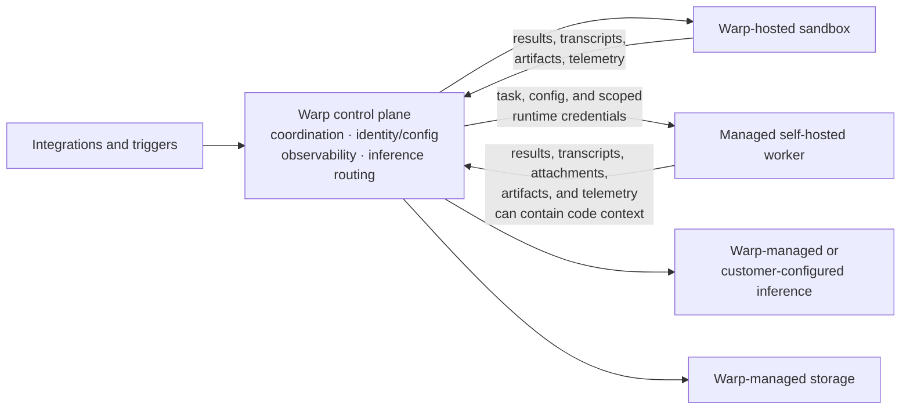
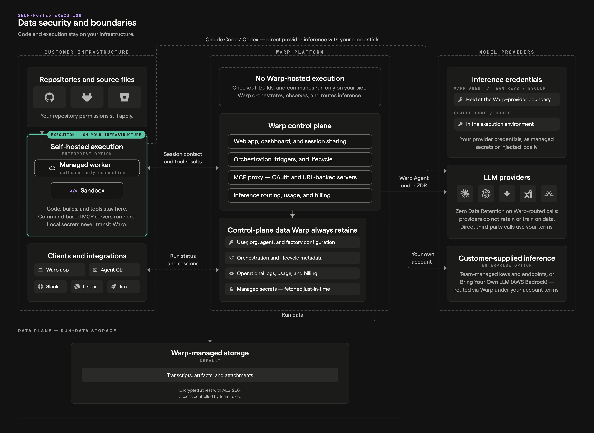

Warp Factories separates execution, inference, and credential boundaries. You choose where code runs, which providers serve inference, and which credentials each agent receives. Warp coordinates the work and stores transcripts and artifacts.

## Control plane and execution plane

Warp manages coordination, while a Warp-hosted sandbox or a worker on your infrastructure executes the work. These responsibilities form the control plane and execution plane:

* **Control plane** - Warp coordinates runs, identity and configuration, observability, integrations, storage, and inference routing.
* **Execution plane** - A Warp-hosted sandbox or a managed self-hosted worker checks out code, runs setup, invokes tools, builds the project, and executes commands.

```mermaid
flowchart LR
  I["Integrations and triggers"] --> C["Warp control plane<br/>coordination · identity/config<br/>observability · inference routing"]
  C --> H["Warp-hosted sandbox"]
  C -->|"task, config, and scoped<br/>runtime credentials"| S["Managed self-hosted worker"]
  H -->|"results, transcripts,<br/>artifacts, telemetry"| C
  S -->|"results, transcripts, attachments,<br/>artifacts, and telemetry<br/>can contain code context"| C
  C --> P["Warp-managed or<br/>customer-configured inference"]
  C --> D["Warp-managed storage"]
```

With managed self-hosting, repository checkouts, commands, and sandbox files stay on machines you control. Prompts, results, transcripts, attachments, artifacts, and telemetry still flow through Warp and can contain code context. The Warp Agent sends model requests through Warp to the configured inference provider. Claude Code and Codex call their providers directly from the execution environment. See [deployment patterns](/factories/deployment-patterns/), [execution security](/platform/execution-security/), and [data security and boundaries](/platform/architecture/#data-security-and-boundaries) for details.

## Network controls

Restrict outbound access with [`networkPolicy` in the factory definition](/factories/factory-as-code/#networkpolicy). The reference covers factory and agent scope, deny precedence, built-in policies, and pending Kubernetes support.

For failed network requests, [fetch and interpret blocked-host diagnostics](/factories/troubleshooting/#network-requests-fail-during-a-run).

## Runners

A runner selects the operating system, architecture, sandbox image, and vCPU and memory shape. The factory's [definition](/factories/factory-as-code/) supplies repositories, setup commands, and secrets. The factory definition sets the default runner with `agentDefaults.runner`. Individual agents and automations can override that default.

The execution host determines how runner settings apply. Self-hosted runner settings don't provision capacity. See [Runner settings by execution host](/factories/runners/#runner-settings-by-execution-host) for a settings comparison.

## Choose an execution host

A factory runs its work on one of two execution hosts: Warp-hosted compute, or a worker in the [managed self-hosting architecture](/factories/self-hosting/#managed-architecture).

| Decision area | Warp-hosted | Managed self-hosted |
| --- | --- | --- |
| **Compute** | Warp provisions the sandbox | Your team provisions the worker |
| **Checkout and commands** | On Warp-managed compute | On your infrastructure |
| **Network** | Warp manages sandbox connectivity | The worker connects outbound to Warp; no inbound firewall port |
| **Private services** | Must be reachable from the hosted sandbox | Reachable through the worker's network access |
| **Operations** | Warp manages capacity and lifecycle | Your team manages capacity, isolation, updates, and availability |

Managed self-hosting requires an Enterprise plan. Task platforms depend on the backend: Docker uses a `linux/amd64` or `linux/arm64` daemon, Kubernetes uses Linux task nodes, and Direct uses the worker host's OS and architecture. A native worker on macOS or Windows can connect to a Linux Docker daemon; the task still runs on Linux. See [Runner settings by execution host](/factories/runners/#runner-settings-by-execution-host).

See the [managed prerequisites](/factories/self-hosting/#managed-prerequisites) for credentials and network access, and the [Self-hosting quickstart](/factories/self-hosting/quickstart/) to connect a worker. The factory definition selects the connected worker with [`workerHost`](/factories/factory-as-code/#agentdefaultsworkerhost). For a complete configuration with a compatible runner, see [`07-self-hosted-worker`](https://github.com/warpdotdev/warp-factory-examples/tree/main/examples/07-self-hosted-worker).

Unmanaged self-hosted agents and other CLI agents can't serve as a factory's execution host, but they can exchange work with a factory through [Factory MCP](/factories/factory-mcp/).

### Managed self-hosting structures

The worker backend sets isolation and scheduling on your infrastructure:

| Backend | How factory runs execute |
| --- | --- |
| [Docker](/factories/self-hosting/managed-docker/) (default) | In a separate Docker container on the worker host |
| [Kubernetes](/factories/self-hosting/managed-kubernetes/) | As a Kubernetes Job in the worker's namespace |
| [Direct](/factories/self-hosting/managed-direct/) | In a separate workspace on the worker host, sharing its OS and kernel |

For backend selection guidance, including Command and one-shot Direct options, see [Choosing a managed backend](/factories/self-hosting/#choosing-a-managed-backend).

## Choose inference independently

Execution hosting doesn't select inference. Configure that boundary separately.

### Inference options for factory runs

Factory agents execute as cloud agents. For runs using the Warp Agent, support varies by inference option:

| Option | Support for factory runs | Team controls | Key boundary |
| --- | --- | --- | --- |
| **Warp-managed inference** | Supported | The model selected for each agent | Warp provides the provider account and charges your available usage |
| **[Team-managed keys and endpoints](/enterprise/enterprise-features/team-managed-keys-and-endpoints/)** | Supported on Business and Enterprise | Shared OpenAI, Anthropic, or Google keys, or an OpenAI-compatible endpoint | Warp encrypts stored credentials and uses them only at the inference boundary. They never enter the worker or run environment. |
| **[BYOLLM: AWS Bedrock](/enterprise/enterprise-features/byollm-aws-bedrock/)** | Supported on Enterprise | The AWS account, IAM role, available Claude models, and provider billing | Warp assumes your IAM role through OIDC; inference runs in your AWS account |
| **[BYOLLM: Gemini Enterprise](/enterprise/enterprise-features/byollm-gemini-enterprise/)** | Not supported for factory runs | Interactive inference in your Google Cloud project | Gemini Enterprise BYOLLM currently supports interactive agent requests only |

Personal BYOK and personal custom inference endpoints are stored on a member's device and don't apply to factory runs. With team-managed keys and endpoints, select a specific provider model or endpoint. Auto continues to use Warp-managed inference. Your provider's retention follows your account and contract. Warp can't enforce ZDR for that provider.

## Credential boundaries

A factory handles four kinds of credentials, each with its own boundary:

| Credential | Used for | Boundary |
| --- | --- | --- |
| **Inference credentials** | Model provider requests from the Warp Agent | Credentials are used only at the Warp–provider boundary and never injected into the sandbox. |
| **Execution secrets** | APIs, package registries, and tools an agent uses | Secrets are delivered from an explicit per-agent allowlist. Factory agents that don't act as a specific user receive no managed secrets by default. |
| **Harness authentication** | Third-party harnesses such as Claude Code or Codex | Credentials are used inside the execution environment for direct provider calls. This authentication is configured separately from the agent's secret allowlist. |
| **Repository identity** | Checking out code and pushing changes | Runs act with the creating user's authorization (changes are attributed to them) or as the agent itself for unattended work. The definition's [`credentialStrategy`](/factories/factory-as-code/#credentialstrategy) sets this behavior. |

Scope each credential to the resources and actions its agent needs. Warp redacts known secret values at output boundaries, but redaction is a backstop, not a substitute for narrow external permissions and rotation. See [factory secrets](/factories/secrets/), [harness authentication](/platform/harnesses/authentication/), [Secret Redaction](/support-and-community/privacy-and-security/secret-redaction/), and [team identity](/platform/team-access-billing-and-identity/) for the underlying controls.

## Factory roles and permissions

Assign Factory user or Editor access to control who runs and configures a factory. Team and workspace admins inherit Admin access. See [Managing factory permissions](/factories/permissions/) for role details and assignment steps.

Factory roles don't control specification or pull request review. For factory definition changes, treat the files as operational code and protect merges through repository settings.

## Metering

Warp meters hosted compute, Warp-provided inference, and [platform usage](/support-and-community/plans-and-billing/platform-credits/). Self-hosting removes Warp-hosted compute charges, and customer-supplied inference is billed directly by your provider. Platform charges still apply in both cases, and Warp's totals don't fully reflect external inference costs.

## Deployment checklist

1. **Classify access** - Inventory repositories, data, and services.
2. **Set boundaries** - Choose execution and inference hosts.
3. **Scope credentials** - Configure allowlists, harness authentication, and repository identity.
4. **Enforce review** - Protect factory-definition and pull request merges.
5. **Validate operations** - Test egress, isolation, rotation, capacity, observability, and metering.

## Related pages

* [Deployment patterns for Warp Factories](/factories/deployment-patterns/) - Compare execution models
* [Runners for Warp Factories](/factories/runners/) - Configure compute and worker compatibility
* [Self-hosting overview](/factories/self-hosting/) - Review managed backends and setup requirements
* [Security and networking](/platform/execution-security/) - Review data boundaries, egress, and backend controls
* [Team-managed LLM API keys and endpoints](/enterprise/enterprise-features/team-managed-keys-and-endpoints/) - Configure inference credentials
* [Roles and permissions](/enterprise/team-management/roles-and-permissions/) - Govern team and workspace resources
* [Platform usage](/support-and-community/plans-and-billing/platform-credits/) - Understand agent-hour charges
