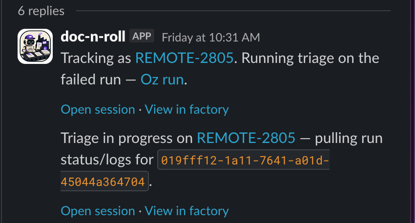

Connect a factory to Slack so your team can send work without leaving their conversations. Mention the factory in a channel or send it a direct message, and it picks up the request with the conversation as context, then posts progress and results back into the same thread.

Each factory appears in Slack as its own app with the factory's name and avatar. A channel can host several factories, and you choose which one to mention.

## Prerequisites

* **Permission to install Slack apps in the target workspace** - Workspace policy may require administrator approval before the app installs.
* **Permission to update the factory** - Connecting Slack changes the factory's configuration.

## Connect the factory

1. **Select Slack while creating a factory**, or connect it later from the factory's **Settings**. Warp installs its Slack app for you.
2. **Complete the install if it can't finish on its own.** This usually happens when your workspace requires administrator approval. Click **Add to Slack** in factory setup to finish.
3. **Invite the app to each channel it should listen in.** Private channels always need an invitation.
4. **Confirm the connection.** Mention the app in one of those channels. It reacts with 👀 to show it picked up the request.

## Configure factory automations for Slack

Use a factory automation to start work from Slack activity automatically, without anyone mentioning the app, such as on every message in a triage channel or on a specific emoji reaction. Add a **Slack** trigger to an automation and pick one of these events. To learn how to edit those filters, see [Automations](/factories/automations/#edit-filters-on-an-automation).

- **App mentioned** - Filter by joined conversations, authors, and keywords.
- **Direct message received** (`message_dm`) - Filter by direct-message conversations, authors, and keywords.
- **Message posted in channel** - Filter by joined conversations, authors, and keywords.
- **Reaction added** - Filter by conversations, reactors, keywords, emoji, and reacted-message authors.
- **Member joined channel** - Filter by conversations and members.

For the exact `event` value each of these triggers uses in a definition file, see [triggers](/factories/factory-as-code/#triggers).

The reaction-intake automation in [`06-common-automations`](https://github.com/warpdotdev/warp-factory-examples/tree/main/examples/06-common-automations) in the [warp-factory-examples](https://github.com/warpdotdev/warp-factory-examples) repository files a GitHub issue when someone reacts with `:ticket:`:

```markdown title="automations/slack-reaction-intake/automation.md"
---
triggers:
  - provider: slack
    event: reaction_added
    filter:
      channels: [your-intake-channel]
      emojis: [ticket]
---
Someone reacted with :ticket: to a Slack message. Read the thread, file a
GitHub issue that captures the request with a link back to the thread, and
reply in the thread with the issue link. Do not start the work; this
automation only files it.
```

The **Conversations** picker only shows conversations the factory's app has joined. If a channel is missing, invite the app to it; for direct messages, send the app a DM first. Then refresh the automation editor.

A single Slack message can match more than one automation. For example, if one automation triggers on **App mentioned** and another triggers on **Message posted in channel** in the same channel, a channel message that mentions the app starts two separate runs, one for each automation. To avoid duplicate runs, don't point both triggers at the same channel.

## Use integration-provided tools

When Slack is connected to a factory, Warp automatically gives its agents Slack tools during factory runs. The tools let an agent read channels and threads that the app can access, reply in a thread, and post a new top-level message to a channel. The run doesn't need to start from Slack.

Warp also automatically makes tools from a connected Linear or Jira issue tracker available to the factory's agents. These are Warp-managed, integration-provided capabilities, separate from the [MCP servers you configure for cloud agents](/platform/mcp/). They may not appear alongside user-configured MCP servers in the factory's MCP list.

You don't need to install a separate Slack MCP server to post factory output to Slack. The connected Slack app's authorization still controls which channels the tools can access, so invite the app to the destination channel first.

## Post a scheduled factory digest to Slack

A scheduled automation can compile a nightly report and post it to Slack. Put the destination's Slack channel ID directly in the automation instructions. An explicit channel ID is the most reliable way to target the intended channel.

This automation runs every night at 2:00 AM UTC and tells the agent where to post:

```markdown title="automations/nightly-factory-digest/automation.md"
---
agent: foreman
triggers:
  - provider: schedule
    event: cron_fired
    schedule:
      name: nightly-factory-digest
      cron: "0 2 * * *"
---
Summarize factory work completed or blocked in the last 24 hours.
Post the digest as a new top-level message to Slack channel ID C0123456789
using the connected Slack tools. Include links to each work item or pull
request, and report the Slack posting error if delivery fails.
```

Replace `C0123456789` with the destination's channel ID. See [factory definition syntax](/factories/factory-as-code/#automationsnameautomationmd) for the other automation fields and schedule options.

## Start and continue work from Slack

Mention the app in a channel or thread, or send it a direct message, to start work. The factory picks up the message, including available thread history and supported attachments, and replies in the same place with an acknowledgment, progress updates, and links to results.

A plain reply in a thread continues work only if that thread already has a factory work item; to start new work in a channel, mention the app instead. Slack activity that matches an automation starts work the same way, without a mention, using the event details and the automation's assigned agent.

You can attach files to a request or a follow-up. The factory includes the files it supports, and a file it can't include doesn't stop the text of your request from going through.

## Follow work and review outputs

The Slack thread where work started is also where you follow it: the factory posts progress and the final response there. Reply in the thread to add information or attachments while work is active, or to pick the same work item back up later.

<figure style={{ maxWidth: "563px" }}>

<figcaption>The factory's Slack app posting progress updates in the thread where work started.</figcaption>
</figure>

For an overview of the factory's work items, open the app's **Home** tab in Slack. It groups them by stage (Triage, Planning, Building, Reviewing, Complete, and Cancelled), offers stage and date filters, and links each work item back to its Slack thread, factory run, issue, or pull request when available.

Work that starts in Slack still ends at a pull request for a person to review — see [how Warp Factories work](/factories/how-factories-work/).

## Who can start work

To start work with a mention or direct message, your Slack account must be linked to an active member of the factory's Warp team. If it isn't, the app prompts you to connect an account instead of starting work.

Work started by an automation runs as the factory agent you chose for it, not as whoever triggered it.

## Troubleshooting and reconnection

- **The app doesn't acknowledge a request** - Confirm Slack is connected for that factory, that you mentioned the right factory's app, and that the app is in the channel.
- **A channel is missing from an automation** - Invite the app to that channel, then reload the **Conversations** picker.
- **Installation is pending** - Ask a Slack workspace administrator to approve the app, then finish the installation.
- **Two runs start for one mention** - Remove or narrow overlapping app-mention and channel-message triggers.

To disconnect Slack, either delete the factory — which removes its Slack app along with it — or [remove the app from your Slack workspace](https://slack.com/help/articles/360003125231-Remove-apps-and-custom-integrations-from-your-workspace), which stops new Slack requests reaching that factory. To reconnect afterward, click **Add to Slack** in factory setup again.

To route work into the factory from other tools, see [Connect your factory](/factories/connect-your-factory/).

## Privacy

The factory's app reads messages only where it's mentioned, directly messaged, or subscribed by an automation you configured. Message content and supported attachments are used to run the factory's work, and your Slack profile email is used to map you to your Warp account. Data is handled per the [Warp Privacy Policy](https://www.warp.dev/privacy).
