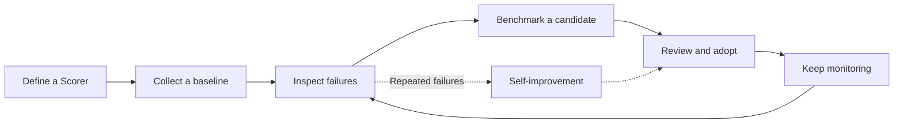

Warp Factories tracks what your factory produces and how well it performs, so you can spot a problem, test a fix, and decide whether to keep it.

| Feature | What it tells you |
| --- | --- |
| Dashboard metrics | How much work the factory produced, and what it cost. |
| Scorers | Whether completed runs meet criteria you define. |
| Benchmarks | How different configurations perform on the same tasks. |
| Self-improvement | Which repeated failures get investigated and turned into follow-up work. |

## Read metrics on the Dashboard page

The **Dashboard** page shows activity, cost, autonomy, and evaluation results:

| Metric | What it shows |
| --- | --- |
| **Total runs** | All agent runs, with breakdowns by agent type, status, source, model, and more. |
| **PRs opened** | Pull requests created from factory work, counted once, in the period they were first observed. |
| **PRs merged** | Of the PRs opened in a period, how many later merged. Opened and merged draw from different data sources, so a period's merged count can occasionally read higher than its opened count for that period. |
| **Autonomy** | The share of the factory's merged PRs that needed no human code push before merging. Opening the PR counts as a push, so a human-authored PR that a factory run later revised doesn't count as autonomous. |
| **PR cycle time** | The median time the factory's merged PRs took from run kickoff through PR, first review, and merge, with a median for each stage. |
| **Cost per PR** | The median cost of PRs opened in the range, split evenly across a run's PRs when one run produces more than one. View it broken down by cost component or by PR size (S/M/L/XL, split at 100/500/1,000 changed lines). |
| **Most expensive PRs** | The highest-cost pull requests. |
| **Scorer cards** | Results from your Scorers. |
| **Self-improvement PRs** | The three newest Self-improvement pull requests, regardless of the selected date range. |

**Cost per PR** is an estimate, not a billing figure: it counts recorded credits and can undercount actual usage.

:::caution
**PRs merged**, **Autonomy**, **PR cycle time**, and the detail in **Most expensive PRs** require a connected code host - the GitHub App, or the GitLab webhook Warp installs when you [connect GitLab](/factories/integrations/gitlab/) - and only cover activity from after you connect it. A PR's cost, creator, source, and requested model come from the run itself, so those still show without that connection.
:::

Use the **Dashboard** page to pick which runs to investigate, not to conclude what caused a change. **Total runs** includes evaluation, benchmark, and Self-improvement runs, so a higher run count with a flat PR count could mean harder tasks, retries, or measurement activity.

## Configure Scorers

A **Scorer** uses an LLM judge to classify completed runs against criteria you write — for example, "did the agent run the tests before opening a PR?" See [Configuring Scorers](/factories/measure-and-improve/scorers/) for its fields and how automatic and on-demand scoring work.

## Compare configurations with benchmarks

A benchmark compares model and runner configurations for a single agent on the same fixed tasks. Use it to test a configuration change before you apply it to production. See [benchmarking factory agent configurations](/factories/benchmarks/) for the workflow.

## Configure and review Self-improvement

**Self-improvement** turns a Scorer's repeated failures into follow-up pull requests, against application code or the factory's own definition. See [Configuring and reviewing Self-improvement](/factories/measure-and-improve/self-improvement/) for how to turn it on and review its pull requests.

## Run a practical improvement loop

Change one measurable thing at a time:

1. **Define a Scorer.** Pick one agent and one failure mode you can observe. Write the judge instructions and classifications, then score a few runs manually and compare the judge's results against your own review.
2. **Collect a baseline.** Let automatic scoring run until results reflect normal work. Record the Scorer settings, date range, and relevant costs.
3. **Inspect failures.** Read the judge's reasoning and the underlying runs. Look for causes like missing context, unclear instructions, or missing tools. Turn on Self-improvement when the same failure keeps repeating.
4. **Benchmark a candidate.** Compare configurations of that agent on the same tasks, with enough repetitions to trust the difference.
5. **Review and adopt.** If the evidence supports the change, make it. Review Self-improvement pull requests with the same standards as human-authored ones.
6. **Keep monitoring.** Leave the Scorer active and compare new results against your baseline. Revise the Scorer, or set its sample rate to 0, when its criteria no longer match what your team needs.

## Related pages

* [Configuring Scorers](/factories/measure-and-improve/scorers/) - What a Scorer is, its fields, and how it runs.
* [Configuring and reviewing Self-improvement](/factories/measure-and-improve/self-improvement/) - Turn on Self-improvement and review its pull requests.
* [Benchmarking factory agent configurations](/factories/benchmarks/) - Compare model and runner configurations on the same tasks.
* [Definitions as code](/factories/factory-as-code/) - Record an adopted change so your team can review the factory configuration.
