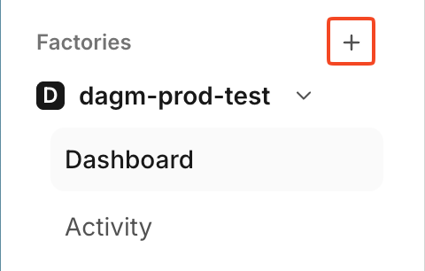
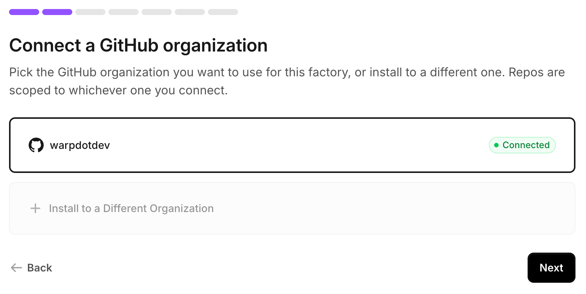
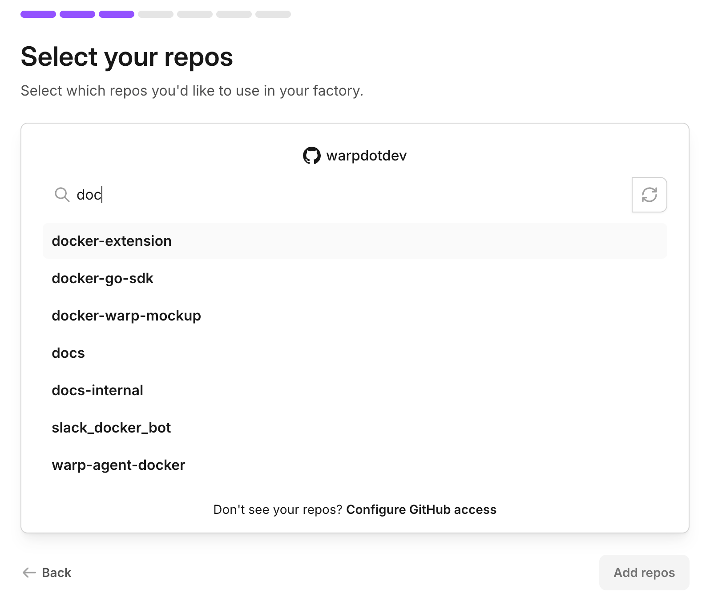
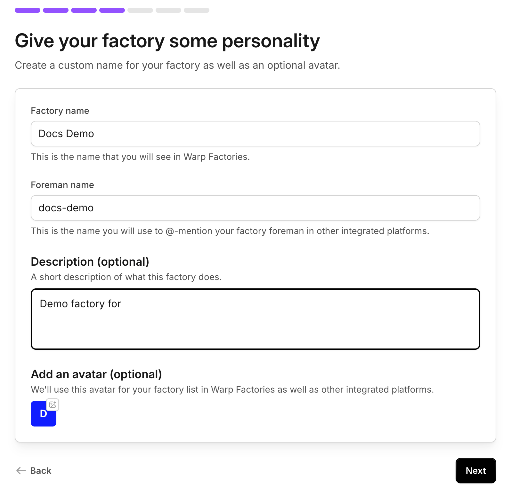
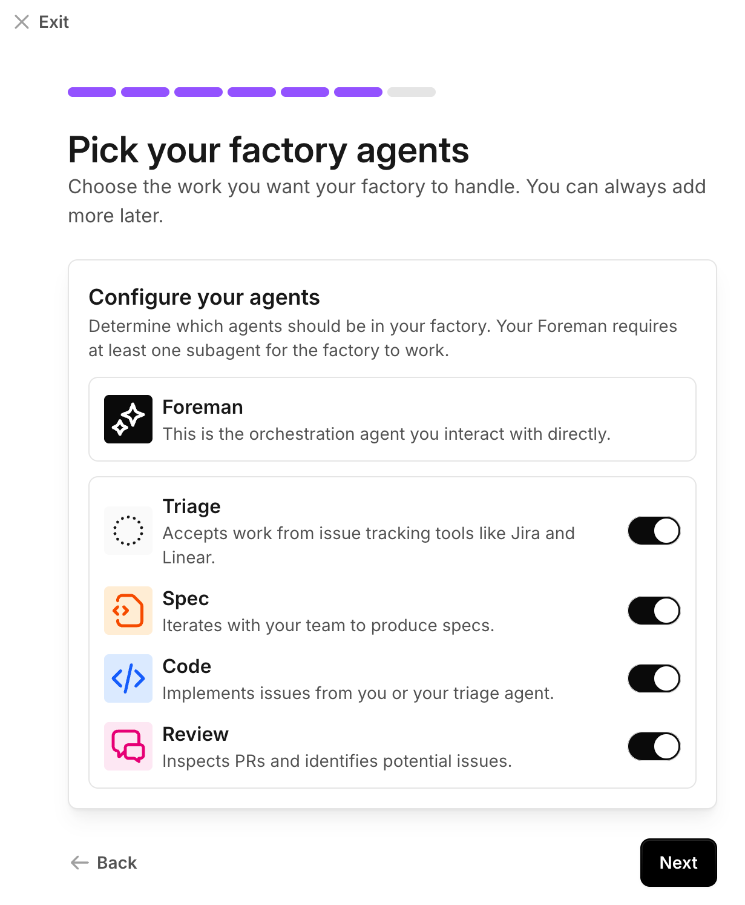

import { VARS } from '@data/vars';

:::note
Warp Factories is in **Early Access** and available to a limited set of teams. [Request access](https://www.warp.dev/factories/request-access) to use it with your team.
:::

A factory is a group of cloud agents that turns incoming requests into pull requests. You talk to one agent, the **foreman**. It picks up the request from wherever it starts, such as Slack, an issue tracker, or a code host, then dispatches the factory's other agents, each owning one part of the software development lifecycle. People stay in the loop at the points that matter: approving specs when needed and merging pull requests.

In this quickstart, you will create a factory and take one small work item from prompt to pull request in about 10 minutes.

## What you'll decide

Warp walks you through factory setup. Along the way, you decide:

* The code host and repositories the factory works on.
* The factory's name and its foreman's @-mention alias.
* Which default agents the foreman can dispatch.
* Whether to connect a chat tool and an issue tracker, or add them later.

You can change any of these after setup, so a best guess is fine for now.

## Prerequisites

* **Warp Factories access** - Warp Factories is in Early Access. [Request access](https://www.warp.dev/factories/request-access) for your team.
* **A Warp team with credits** - A factory belongs to a [Warp team](/knowledge-and-collaboration/teams/). Factory agents consume the team's [credits](/support-and-community/plans-and-billing/platform-credits/).
* **Repository access** - You authorize a code host during setup and choose which repositories the factory can reach. If your organization restricts app installations, ask an owner to approve the connection. See the [GitHub](/factories/integrations/github/) and [GitLab](/factories/integrations/gitlab/) integration guides.

## Set up your factory

_~5 minutes_

:::note
Already using an agent connected to [Factory MCP](/factories/factory-mcp/)? Ask it to run `create_factory` with the team, repositories, and factory name to create the factory directly, skipping the wizard below. Choose agents and connect your tools afterward in the factory's dashboard.
:::

Otherwise, Warp walks you through a setup wizard:

1. Sign in to the <a href={VARS.FACTORY_WEB_APP_URL}>{VARS.FACTORY_WEB_APP}</a>. Next to **Factories**, click **+**.

   <figure style={{ maxWidth: "300px" }}>
   
   <figcaption>Click + next to Factories to open the setup wizard.</figcaption>
   </figure>

2. Click **I want to use repos from GitHub** or **I want to use repos from GitLab**, then choose the organization or group you want to connect.

   <figure style={{ maxWidth: "563px" }}>
   
   <figcaption>Choose the organization or group whose repositories the factory will use. GitLab shows an equivalent screen for groups.</figcaption>
   </figure>

3. On **Select your repos**, search for and select the repositories the factory works in, then click **Add repos**. Start with one or two. Every agent in the factory shares this repo set, so a focused set keeps their context tight, and you can add more later.

   <figure style={{ maxWidth: "563px" }}>
   
   <figcaption>Search for and select the repositories the factory works in.</figcaption>
   </figure>

4. Name the factory. Warp derives a matching [**Foreman name**](/factories/factory-as-code/#alias) from it, the handle your team @-mentions to reach the factory from connected tools like Slack and Linear. Keep it short and recognizable, or set your own.

   <figure style={{ maxWidth: "563px" }}>
   
   <figcaption>Name the factory and, optionally, add a description and avatar.</figcaption>
   </figure>

5. Optionally, connect a chat tool so teammates can hand work to the factory from Slack, or skip it and add it later from [connect your factory](/factories/connect-your-factory/).
6. Toggle the subagents the foreman can dispatch: **Triage**, **Spec**, **Code**, and **Review**. All four start enabled, and at least one is required. Leave **Code** on so this quickstart can end in a pull request. See [factory agents](/factories/factory-agents/) for what each does.

   <figure style={{ maxWidth: "563px" }}>
   
   <figcaption>Toggle which default agents the foreman can dispatch.</figcaption>
   </figure>

7. Optionally, connect an issue tracker so teammates can hand work to the factory from Linear or Jira, or skip it and add one later from [connect your factory](/factories/connect-your-factory/).

Warp creates the factory and opens its [dashboard](/factories/factory-dashboard/).

## Send your first work item

_~5 minutes_

Send the request from the tool your team already works in. Mention the factory in a Slack channel, or assign it an issue in your tracker, and it replies right there. If you skipped the integrations, start a run from the **Runs** page of the factory's [dashboard](/factories/factory-dashboard/) instead.

1. Describe one small, verifiable change and send it:

   ```text title="Example first request"
   Add a "Local development" section to README.md that summarizes the setup
   steps from CONTRIBUTING.md. Keep the change to that one file, run the
   repo's lint check, and open a pull request.
   ```

   Adapt the pattern to your repository: name the file, the change you expect, and the command that verifies it. A narrow, explicit request makes the first run easy to judge.

2. The foreman picks up the request, dispatches the factory's agents as child runs, and posts progress and questions back where the request started. Follow the details in the factory's [dashboard](/factories/factory-dashboard/):

   * **Runs** - The foreman's run and the child runs it dispatches.
   * **Activity** - The work item as it moves through its stages. Open it for the event history and pull request artifacts.

3. When the Code agent finishes, the work item links to the pull request. Review and merge it the way you would any other: a factory hands off at the pull request and never merges for you.

## Next steps

* [**Connect your factory**](/factories/connect-your-factory/) - Route work in from Slack threads, Linear issues, and other intake paths.
* [**Factory MCP**](/factories/factory-mcp/) - Send work to the factory from a coding agent or MCP client.
* [**How Warp Factories work**](/factories/how-factories-work/) - The work-item lifecycle and where people stay in the loop.
* [**Troubleshooting**](/factories/troubleshooting/) - Fixes for common issues during setup and your first runs.
