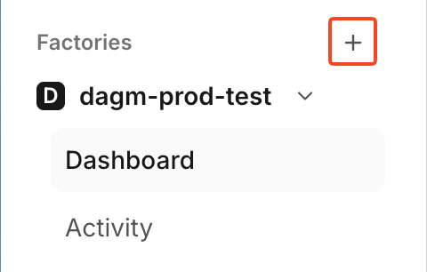
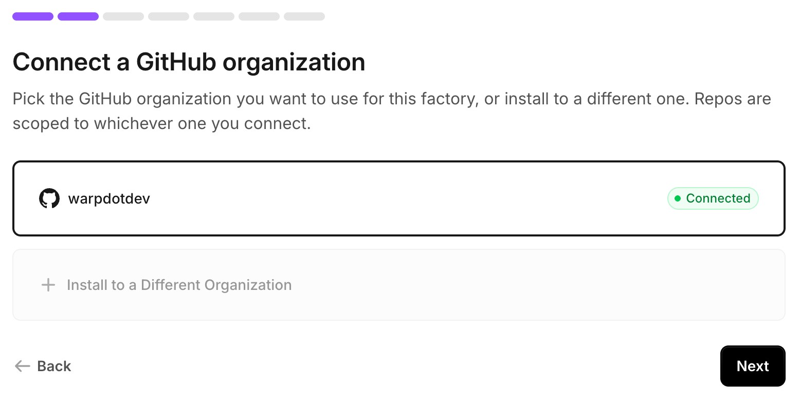
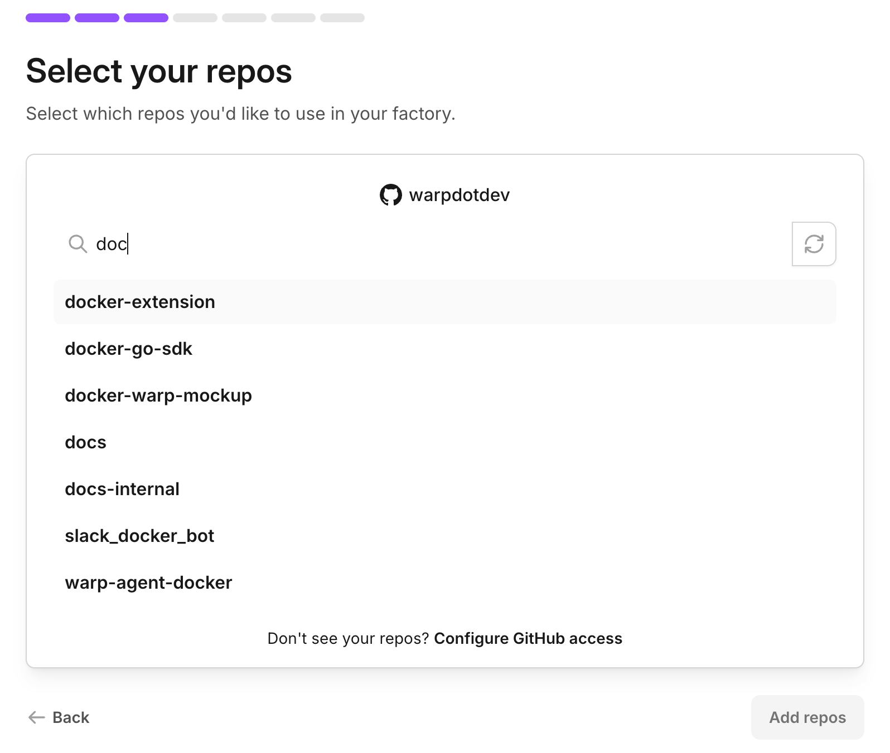
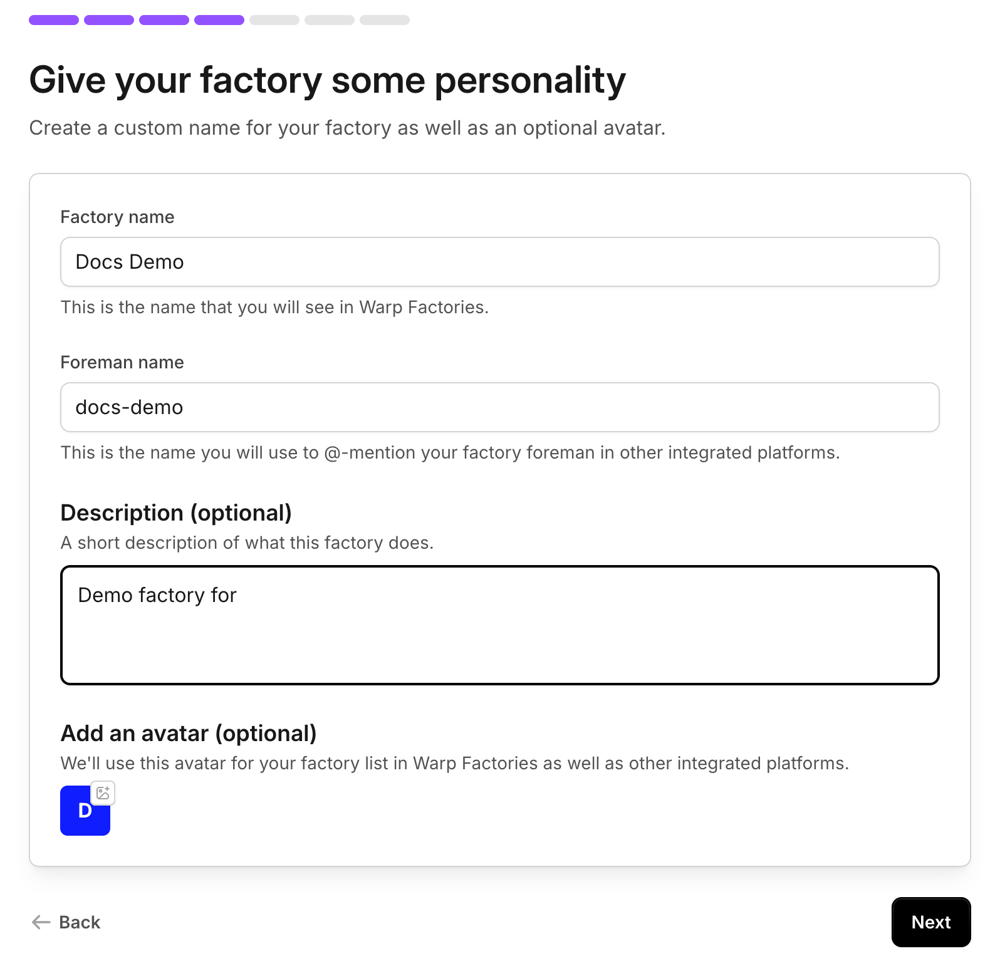
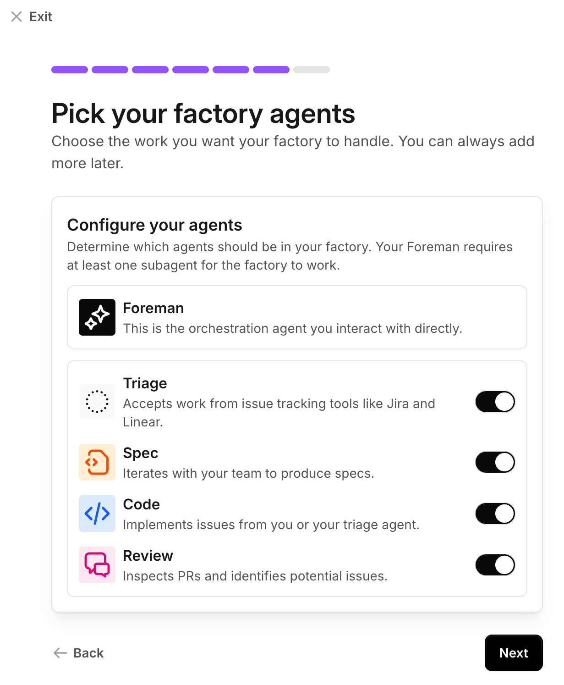
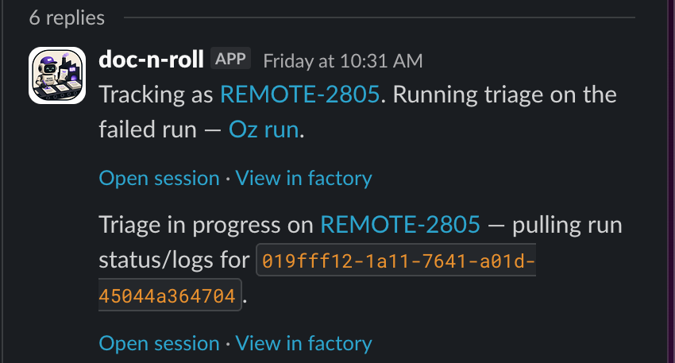

import { VARS } from '@data/vars';

Create your first factory and take one small work item from prompt to pull request. If you're new to Warp, create an account and team during setup.

## Prerequisites

* **Factory creation access** - On an existing Warp team, you need team or workspace admin access, or the team-level Warp Factories Editor role. See [factory roles and permissions](/factories/infrastructure-and-security/#factory-roles-and-permissions).
* **Credits or paid usage** - The factory's agents use your team's [credits or paid usage](/support-and-community/plans-and-billing/platform-credits/). Access and spending limits apply.
* **Repository access** - Access to the repositories you want the factory to work on. If your organization restricts connections to Warp, involve a code-host administrator.

## Set up your factory

:::note
For GitHub and GitLab repositories, an agent connected to [Factory MCP](/factories/factory-mcp/#set-up-with-your-coding-agent) can run this whole setup. Use the web setup wizard for Azure DevOps. If the wizard is still open when the agent finishes, refresh the page to see the new factory.
:::

1. Open the <a href={VARS.FACTORY_WEB_APP_URL}>{VARS.FACTORY_WEB_APP}</a> and sign in or create an account. Join or create the Warp team that will own the factory. If the team has no factories, onboarding opens automatically. Otherwise, click **+** next to **Factories**.

   <figure style={{ maxWidth: "300px" }}>
   
   <figcaption>The factory setup control in the sidebar.</figcaption>
   </figure>

2. Under **Connect your code hosts**, connect GitHub, GitLab, or Azure DevOps. Choose the GitHub organization, GitLab group, or Azure DevOps organization and project to connect.

   Azure DevOps organizations require [one-time administrator approval](/factories/integrations/azure-devops/#requirements). The setup flow lets you send the approval link to the required administrators.

   To use another code forge, select **No repo**, finish creating the factory, then [configure repository access from the default runner](/factories/code-forges/other-code-forges/).

   <figure style={{ maxWidth: "563px" }}>
   
   <figcaption>Connected GitHub organizations available during setup.</figcaption>
   </figure>

3. On **Select your repos**, select one or two repositories that ship together, then click **Add repos**. See [sizing a factory](/factories/#sizing-a-factory) before adding a repository already covered by another factory.

   <figure style={{ maxWidth: "563px" }}>
   
   <figcaption>The repository selector for factory setup.</figcaption>
   </figure>

4. Name the factory. This also sets its [**Foreman name**](/factories/factory-agents/#foreman-name), the handle your team @-mentions in Slack and Linear.

   <figure style={{ maxWidth: "563px" }}>
   
   <figcaption>Identity settings for the factory and foreman.</figcaption>
   </figure>

5. Choose which agents the foreman can dispatch. Leave **Implement** enabled so this quickstart ends in a pull request. See [factory agents](/factories/factory-agents/) for details.

   <figure style={{ maxWidth: "563px" }}>
   
   <figcaption>Default factory agents enabled during setup.</figcaption>
   </figure>

6. Optionally, connect Slack and an issue tracker. You can add either later from [connect your factory](/factories/connect-your-factory/).

Warp creates the factory and opens its [dashboard](/factories/factory-dashboard/).

## Send your first work item

Send work from Slack or an issue tracker. If you skipped integrations, start a run from the **Runs** page of the factory's [dashboard](/factories/factory-dashboard/).

1. Describe one small, verifiable change and send it:

   ```text title="Example first request"
   Add a "Local development" section to README.md that summarizes the setup
   steps from CONTRIBUTING.md. Keep the change to that one file, run the
   repo's lint check, and open a pull request.
   ```

2. The foreman dispatches the agents needed for the request and posts progress where it started. Follow the foreman and child runs on the factory's [Runs page](/factories/factory-dashboard/#inspect-runs). Requests for input also appear in your [inbox](/factories/factory-inbox/).

   If you connected Slack, you can follow along there instead:

   <figure style={{ maxWidth: "563px" }}>
   
   <figcaption>A factory Slack thread with live progress.</figcaption>
   </figure>

3. When the foreman hands back the pull request, review the changes and validation results, then merge it according to your normal process.

## Next steps

* [**Connect your factory**](/factories/connect-your-factory/) - Configure intake sources.
* [**How Warp Factories work**](/factories/how-factories-work/) - Understand the work-item lifecycle.
* [**Troubleshooting Warp Factories**](/factories/troubleshooting/) - Fix common setup and run issues.
