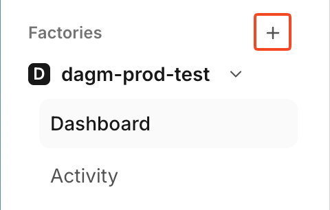
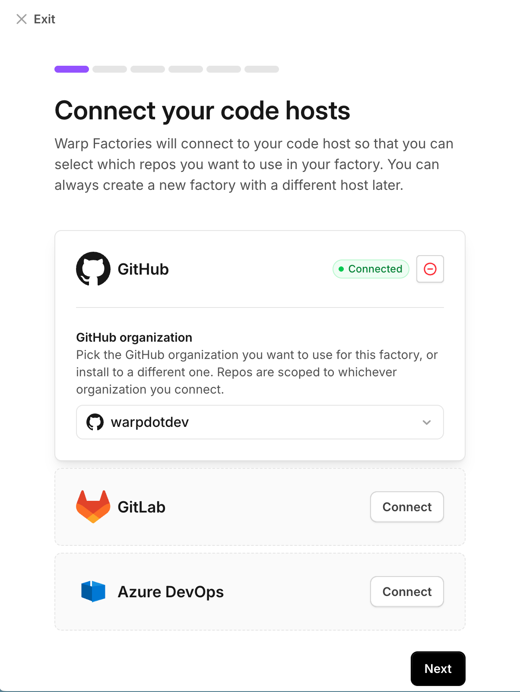
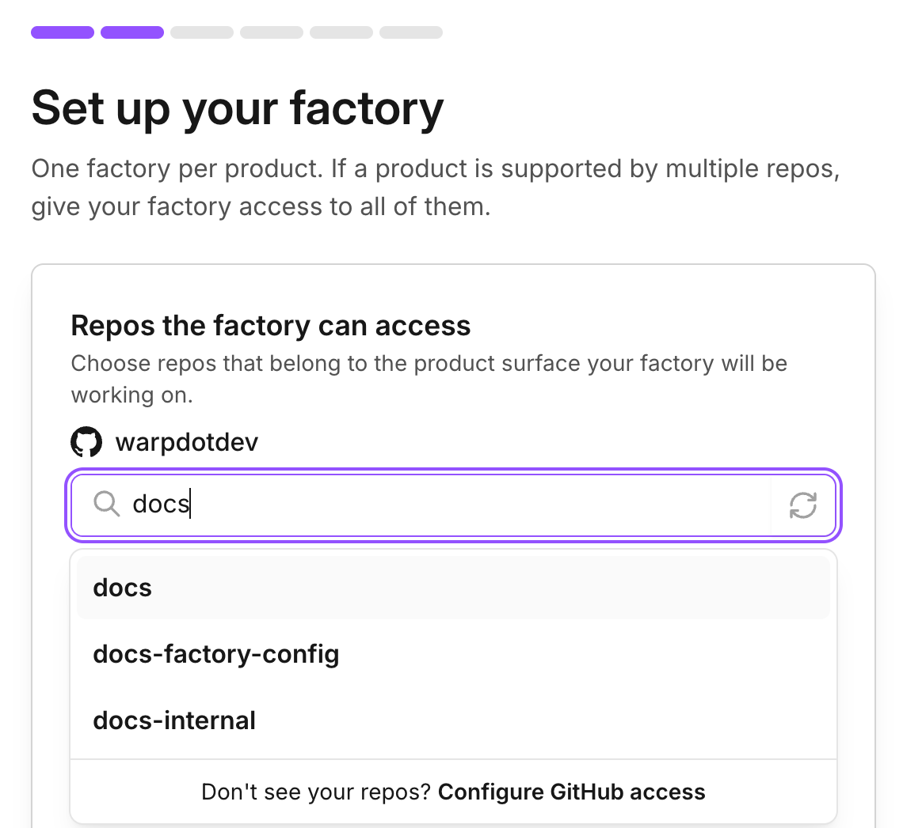
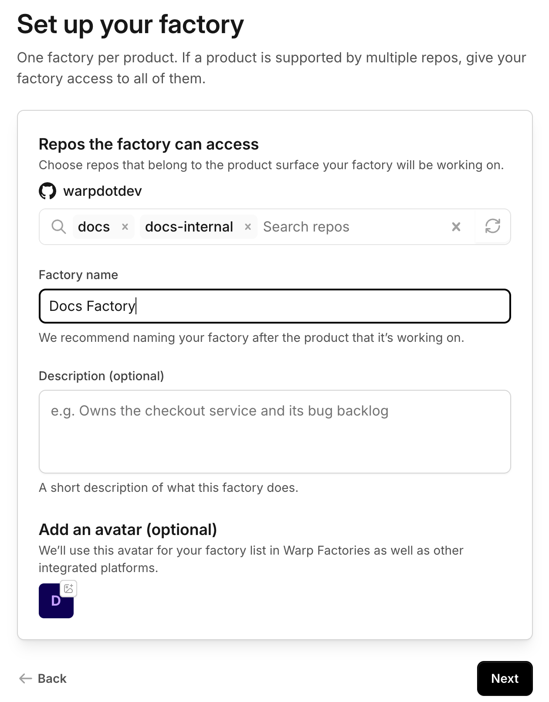
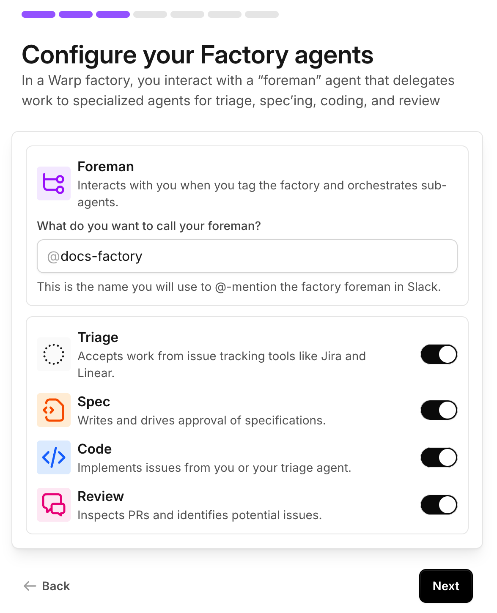
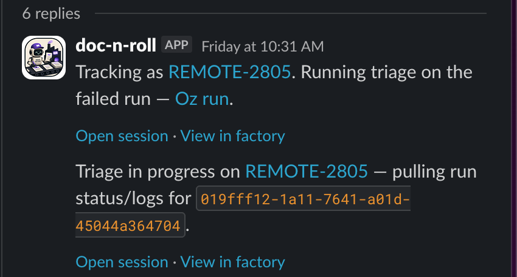

import { VARS } from '@data/vars';

Create your first factory and take one small work item from prompt to pull request.

## Prerequisites

* A [Warp account](https://app.warp.dev/signup) and membership in a [Warp team](/knowledge-and-collaboration/teams/).
* Team or workspace admin access, or the team-level [Warp Factories Editor role](/factories/infrastructure-and-security/#factory-roles-and-permissions).
* Available usage in your team's balance for factory runs. See [access and billing requirements](/platform/team-access-billing-and-identity/).
* Access to the repositories you want the factory to work on.

## Set up your factory

:::note
For GitHub and GitLab repositories, an agent connected to [Factory MCP](/factories/factory-mcp/#set-up-with-your-coding-agent) can run this setup. For Azure DevOps, follow the steps below in the {VARS.FACTORY_WEB_APP}. If the setup page is still open when the agent finishes, refresh it to see the new factory.
:::

1. Open the <a href={VARS.FACTORY_WEB_APP_URL}>{VARS.FACTORY_WEB_APP}</a> and sign in if prompted. To switch teams, click your avatar, hover over the team name, and select another team.

2. Click **+** next to **Factories**.

   <figure style={{ maxWidth: "300px" }}>
   
   <figcaption>The factory setup control in the sidebar.</figcaption>
   </figure>

3. On the "Connect your code hosts" screen, select GitHub, GitLab, or Azure DevOps, then choose the organization or group to connect. For Azure DevOps, also choose a project. Click **Next**.

   If your organization restricts connections to Warp, involve a code-host administrator.

   Azure DevOps organizations require [one-time administrator approval](/factories/integrations/azure-devops/#requirements). The setup flow lets you send the approval link to the required administrators.

   For other code forges, see [Connecting other code forges to your factory](/factories/code-forges/other-code-forges/).

   <figure style={{ maxWidth: "563px" }}>
   
   <figcaption>The GitHub organization dropdown in factory setup.</figcaption>
   </figure>

4. On the "Set up your factory" screen, select the repositories your factory will work on. See [sizing a factory](/factories/#sizing-a-factory).

   <figure style={{ maxWidth: "563px" }}>
   
   <figcaption>A repository search during factory setup.</figcaption>
   </figure>

5. Enter a "Factory name". This also sets the default [foreman name](/factories/factory-agents/#foreman-name), the handle your team @-mentions in Slack and Linear. Click **Next**.

   <figure style={{ maxWidth: "563px" }}>
   
   <figcaption>The factory name and optional details during setup.</figcaption>
   </figure>

6. Choose which agents the foreman can dispatch. Leave **Code** enabled so this quickstart ends in a pull request. See [factory agents](/factories/factory-agents/) for details.

   <figure style={{ maxWidth: "563px" }}>
   
   <figcaption>Default factory agents enabled during setup.</figcaption>
   </figure>

7. Optionally, connect Slack and an issue tracker. You can add either later from [connect your factory](/factories/connect-your-factory/).

Warp creates the factory and opens its [dashboard](/factories/factory-dashboard/).

## Send your first work item

Send a request to your factory's foreman from the {VARS.FACTORY_WEB_APP}. You can also send work from [Slack or an issue tracker](/factories/connect-your-factory/).

1. In the sidebar, click **New Chat**.

2. In the dropdown below the prompt input, choose your factory.

3. Enter one small, verifiable change, then click the send arrow:

   ```text title="Example first request"
   Add a "Local development" section to README.md that summarizes the setup
   steps from CONTRIBUTING.md. Keep the change to that one file, run the
   repo's lint check, and open a pull request.
   ```

4. The foreman dispatches the agents needed for the request and posts progress where it started. In the sidebar, click **Runs** to follow the [foreman and child runs](/factories/factory-dashboard/#inspect-runs). Requests for input also appear in your [inbox](/factories/factory-inbox/).

   If you sent the request from Slack, you can follow along in its thread:

   <figure style={{ maxWidth: "563px" }}>
   
   <figcaption>A factory Slack thread with live progress.</figcaption>
   </figure>

5. When the foreman hands back the pull request, review the changes and validation results, then merge it according to your normal process.

## Next steps

* [**Connect your factory**](/factories/connect-your-factory/) - Configure intake sources.
* [**How Warp Factories work**](/factories/how-factories-work/) - Understand the work-item lifecycle.
* [**Troubleshooting Warp Factories**](/factories/troubleshooting/) - Fix common setup and run issues.
