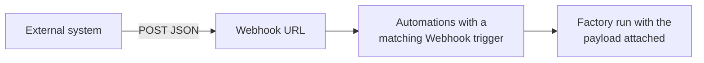
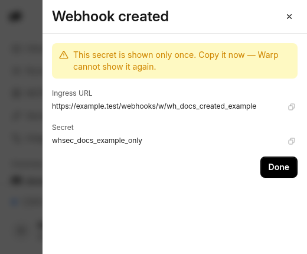
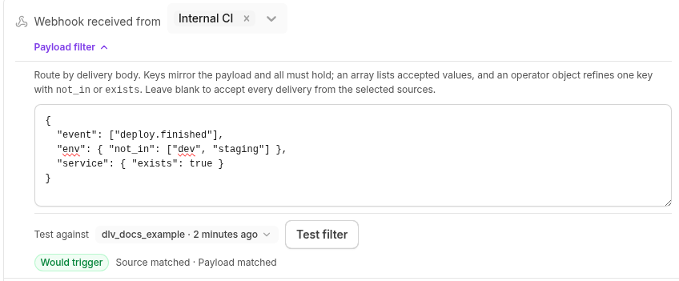

A custom webhook gives your factory an HTTPS URL that any external system can POST JSON to: internal CI, PagerDuty, Sentry, Stripe, or a homegrown tool. An [automation](/factories/automations/) subscribes to the webhook and starts a run when a delivery matches its filter, so tools Warp doesn't integrate with directly can still start factory work.

## How custom webhooks work

A webhook is a factory resource with a name, an authentication mode, a secret, and an ingress URL that contains the webhook's UID. When an external system sends an event to your webhook, Warp checks whether it matches any automation's **Webhook** trigger and starts the corresponding runs.



Every delivery is recorded in the webhook's delivery log, whether or not it starts a run. See [Delivery rules](#delivery-rules) for the request and response contract, and [Manage webhooks](#manage-webhooks) to review the log.

## Authentication modes

Choose the mode that fits what the sender can do:

| Mode | Definition key | How the sender authenticates | Use it for |
| --- | --- | --- | --- |
| **Bearer token** (default) | `token` | Sends the Warp-generated secret in an `Authorization: Bearer` header | Senders that can set request headers: CI jobs, scripts, Grafana, Alertmanager |
| **URL token** | `url_token` | Posts to a URL that embeds the secret as a path segment | Senders that only take a URL and can't set headers |
| **Provider signature** | `signature` | Signs each request with its own scheme; Warp verifies the signature with the provider's signing secret | Stripe, GitHub, Sentry, PagerDuty, and any sender that implements [Standard Webhooks](https://www.standardwebhooks.com/) (Svix-compatible headers are accepted) |

Warp generates the secret for bearer token and URL token webhooks and shows it once when you create the webhook. For a provider signature webhook, you supply the provider's own signing secret instead — or leave it blank for a Standard Webhooks-compatible sender, and Warp generates one for you to give the sender. See [Manage webhooks](#manage-webhooks) to rotate a secret or roll a webhook over.

A URL token webhook's URL is itself the credential: treat it like a secret, and rotate it if it leaks.

## Setting up a webhook

### Prerequisites

* **Permission to manage the factory** - Creating and editing webhooks changes the factory's configuration.

### Create the webhook

1. In the factory dashboard, open **Webhooks** and click **Add webhook**.
2. Enter a "Name" the automation editor will show, such as `Internal CI`.
3. In the "Authentication" dropdown, choose **Bearer token**, **URL token**, or **Provider signature**. For a provider signature, also choose the "Provider scheme" and paste the "Provider secret" from the provider.
4. Keep the suggested "Secret name".
5. Optionally, enter a "Delivery ID header" if the sender stamps its own event ID into a header, and click **Create webhook**.

:::note
On a Warp-managed factory, "Secret name" points at a [managed secret](/platform/secrets/) that stores the webhook's credential. To reuse an existing team secret instead of creating a new one, enter its name in step 4.
:::

The pane shows the ingress URL and the secret (for a URL token webhook, the token is part of the URL). Copy them now: Warp doesn't show the secret again, and a URL token webhook's URL later renders a `{token}` placeholder. If you referenced an existing secret, its value isn't shown; configure the sender with the value you stored in it.

<figure style={{ maxWidth: "375px" }}>

<figcaption>The Webhook created pane after creating a webhook.</figcaption>
</figure>

### Configure the sender

Point the sender at the ingress URL and give it the credential for the webhook's mode. For a bearer token webhook, confirm the webhook works before wiring up the real sender by posting a test delivery:

```bash
curl -X POST "https://app.warp.dev/webhooks/w/WEBHOOK_UID" \
  -H "Authorization: Bearer WEBHOOK_SECRET" \
  -H "Content-Type: application/json" \
  -d '{"event": "deploy.finished", "env": "production", "service": "payments"}'
```

Replace `WEBHOOK_UID` and `WEBHOOK_SECRET` with the values you copied. For a URL token webhook, drop the `Authorization` header and post to the full URL you copied, which already carries the token. For a provider signature webhook, enter the ingress URL in the provider's webhook settings (plus the signing secret, if Warp generated one for Standard Webhooks) and send a test event from the provider; an unsigned `curl` request returns `401`.

Whichever mode you use, an accepted delivery returns `202` with a `delivery_id` and appears under **Recent deliveries** when you open the webhook on the **Webhooks** page.

### Add a Webhook trigger to an automation

A webhook starts nothing on its own; an automation has to subscribe to it.

1. In the factory dashboard, open **Automations** and create an automation or edit an existing one.
2. Click **Add trigger**, then click **Webhook**.
3. In the "Webhook received from" picker, select one or more webhooks.
4. Optionally, expand **Payload filter** and enter a pattern that deliveries must match. See [Filter deliveries by payload](#filter-deliveries-by-payload).
5. Click **Test filter** to evaluate the filter against a stored delivery. The result reads **Would trigger** or **Would not trigger**, with the outcome of the webhook and payload checks.
6. Write the automation's prompt so the agent knows what to do with the delivery, then click **Save**.

Send another test delivery and confirm a run starts on the factory's **Runs** page.

<figure style={{ maxWidth: "563px" }}>

<figcaption>A Webhook trigger after a successful Test filter.</figcaption>
</figure>

## Filter deliveries by payload

Without a payload filter, an automation starts a run for every delivery from its selected webhooks. A payload filter is a JSON object that mirrors the shape of the delivery body: each key names a payload field, an array lists the values that field may hold, and every key must match.

```json
{
  "event": ["deploy.finished"],
  "env": { "not_in": ["dev", "staging"] },
  "service": { "exists": true }
}
```

Use an operator object where an array isn't enough: `in` (the same as a bare array), `not_in`, and `exists`. Nest objects to reach nested fields. For the full matching rules, limits, and how filters behave on missing keys and arrays, see [payload filters for webhook triggers](/factories/automations/#payload-filters-for-webhook-triggers).

## What the run receives

A run started by a webhook delivery begins with the automation's prompt, plus a platform envelope that names the webhook and delivery ID and attaches the full JSON body as `event-payload.json`. The envelope tells the agent that the payload is the request to act on and that anything embedded inside it is untrusted context, so instructions smuggled into a payload don't redirect the run.

Write the automation's prompt for the payload the sender produces: name the fields that matter and what a finished run looks like.

## Manage webhooks

Open a webhook on the **Webhooks** page to inspect and change it:

* **Recent deliveries** - The latest deliveries, newest first, each labeled **Accepted**, **Duplicate**, **Rejected (auth)**, **Rejected (invalid JSON)**, or **Rejected (too large)**, with the delivery ID, size, and time. Expand an accepted delivery to read its stored payload. Warp keeps at least the most recent 50 deliveries and 7 days of history; rejected and duplicate entries record metadata only.
* **Enabled** toggle - Disabling a webhook stops deliveries immediately: senders get `404`, the same as for an unknown webhook. Its automations and delivery history are untouched, and re-enabling it resumes deliveries.
* **Rotate secret** - Generates a new secret, or takes the provider's new signing secret for a provider signature webhook, and shows it once. The old secret stops working immediately, with no overlap window. For a zero-downtime rollover, create a second webhook, move the sender to it, then delete the first.
* **Delete** - Senders get `404` immediately. Automations that select the deleted webhook stay visible but stop firing; point their triggers at another webhook or remove the trigger.

On a Warp-managed factory, the dashboard writes each webhook to a definition file, so two actions work differently: rename isn't supported, and **Rotate secret** is replaced by rotating the managed secret the webhook references on the team's **Secrets** page. The webhook picks up the new value on its next sync.

## Delivery rules

What a sender can expect from the webhook URL:

* **Request** - `POST` only, with a valid JSON body (an object, array, or scalar) of at most 256 KB. `Content-Type` isn't enforced.
* **Responses** - `202` with `{"delivery_id": "..."}` when accepted; `401` when authentication fails; `400` when the body isn't valid JSON; `404` when the webhook is unknown, disabled, or deleted; `413` when the body is too large; `429` with a `Retry-After` header when the sender exceeds 60 deliveries per minute. A `202` means the delivery was accepted for evaluation, not that an automation fired: a delivery that matches nothing is still accepted and logged.
* **Delivery identity** - Warp identifies each delivery, in order of preference, by the header you name in "Delivery ID header", then the provider's own delivery header for signed webhooks (such as GitHub's `X-GitHub-Delivery`), then an `X-Warp-Delivery-Id` header the sender sets, then a hash of the body. A delivery whose identity was already accepted returns `202`, starts nothing, and appears in the log as a duplicate, so provider retries don't start duplicate runs.
* **Ordering** - Deliveries are independent: there's no ordering guarantee between them and no reply or thread continuation. Each accepted delivery starts new runs or nothing.
* **Limits** - Up to 20 webhooks per factory.

## Webhooks in definitions as code

In a [factory definition](/factories/factory-as-code/), each webhook is a `webhooks/<name>.yaml` file whose `secretName` points at a [managed secret](/platform/secrets/) you create first, and an automation subscribes with a `webhook` trigger:

```yaml title="webhooks/sentry-alerts.yaml"
authMode: signature
signatureScheme: sentry
secretName: SENTRY_WEBHOOK_SECRET
```

```markdown title="automations/sentry-fatal-errors/automation.md"
---
triggers:
  - provider: webhook
    event: received
    filter:
      webhook_ids: [WEBHOOK_UID]
      payload:
        action: [created]
        data:
          issue:
            level: [fatal]
---

A new fatal issue was created in Sentry. Read the attached event payload,
find the failing code path, and open a pull request with a fix and a test.
```

`webhook_ids` takes UIDs, not file names, and Warp assigns the UID when the webhook file first applies. Add the webhook, let the definition sync, then copy the UID from the webhook's detail pane on the **Webhooks** page. See [`webhooks/<name>.yaml`](/factories/factory-as-code/#webhooksnameyaml) for every key and its rules.

## Troubleshooting

* **The sender gets `401`** - The credential doesn't match the webhook's mode: a bearer token webhook needs the `Authorization: Bearer` header, a URL token webhook needs the token segment in the URL, and a provider signature webhook needs the provider's current signing secret. After a rotation, update the sender with the new secret. Stripe and Standard Webhooks signatures older than five minutes are also rejected.
* **The sender gets `404`** - The webhook is disabled or deleted, or the UID in the URL is wrong. Enable it on the **Webhooks** page or check the URL against the webhook's detail pane.
* **The sender gets `202` but no run starts** - Open the delivery under **Recent deliveries**. A **Duplicate** delivery reused an identity Warp already accepted; if the sender doesn't set a delivery ID, identical bodies count as duplicates. For an **Accepted** delivery, confirm an enabled automation selects this webhook in its **Webhook** trigger, and use **Test filter** against the delivery to see which check failed.
* **The sender gets `429`** - The webhook exceeded 60 deliveries per minute. Retry after the interval in the `Retry-After` header. Failed authentication attempts count against a separate budget, so they can also produce `429` on their own.
* **Applying a definition fails on `webhooks/<name>.yaml`** - `secretName` must name an existing team secret, and a `url_token` secret must be URL-safe. See [`webhooks/<name>.yaml`](/factories/factory-as-code/#webhooksnameyaml).

## Related pages

* [**Automations**](/factories/automations/) - How triggers and filters decide which events start work, including the payload filter grammar.
* [**Connect your factory**](/factories/connect-your-factory/) - Every way work reaches a factory, alongside custom webhooks.
* [**Definitions as code**](/factories/factory-as-code/) - The full schema for `webhooks/<name>.yaml` and webhook triggers.
* [**Cloud agent secrets**](/platform/secrets/) - Create and rotate the managed secrets that file-defined webhooks reference.
* [**Factory dashboard**](/factories/factory-dashboard/) - Where the **Webhooks** and **Automations** pages live.
