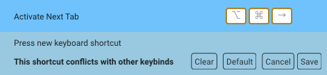

import { Tabs, TabItem } from '@astrojs/starlight/components';

Warp opens with a shortcut screen showing some of the most commonly used keyboard shortcuts. Hide the shortcut screen by clicking the x button. Quickly view keyboard shortcuts via the [Command Palette](/terminal/command-palette/) or the Resource Center keyboard shortcut sidebar.

## Custom keyboard shortcuts

Set custom, clear, or default keyboard shortcuts by navigating to **Settings** > **Keyboard shortcuts**. Search through the re-mappable actions or existing shortcuts using the search bar.

Remap the keyboard shortcuts using a file. See our [keysets repository](https://github.com/warpdotdev/keysets/tree/main) for instructions.

:::note
On macOS, [system keyboard shortcuts](https://support.apple.com/en-us/HT201236) like `⌘+Esc`, `` ⌘+` ``, `⌘+Tab`, `⌘+.`, and `⌘+~` need to be [unbound](https://support.apple.com/guide/mac-help/keyboard-shortcuts-mchlp2262/mac) before you can use them in Warp.
:::

:::caution
Keybinds that conflict with others are highlighted with an orange border.
:::

<figure>

<figcaption>An example of a keybinding conflict warning.</figcaption>
</figure>

## All available shortcuts

<Tabs>
  <TabItem label="macOS">
    **Warp Essentials**

    | Shortcut       | Command                      | Action                                         |
    | -------------- | ---------------------------- | ---------------------------------------------- |
    | `⌘+D`        | Split Pane Right             | `pane_group:add_right`                         |
    | `Ctrl+⌘+L`   | Launch Configuration Palette | `workspace:toggle_launch_config_palette`       |
    | `Ctrl+⌘+T`   | Open Theme Picker            | `workspace:show_theme_chooser`                 |
    | `Ctrl+R`       | Command Search               | `workspace:show_command_search`                |
    | `Ctrl+Shift+R` | Workflows                    | `input:toggle_workflows`                       |
    | `` Ctrl+` ``   | Generate                     | `input:toggle_natural_language_command_search` |
    | `⌘+L`        | Focus Terminal Input         | `terminal:focus_input`                         |
    | `Ctrl+I`       | Warpify Subshell             | `terminal:warpify_subshell`          |
    | `⌘+\`        | Warp Drive                   | `workspace:toggle_warp_drive`                   |
    | `⌘+O`        | File search                  |                                                |
    | `⌘+P`        | Open Command Palette         |

    **Blocks**

    | Shortcut          | Command                           | Action                                                 |
    | ----------------- | --------------------------------- | ------------------------------------------------------ |
    | `Option+↓`        | Select the Closest Bookmark Down  | `terminal:select_bookmark_down`                        |
    | `Option+Shift+⌘+C` | Copy Command Output               | `terminal:copy_outputs`                                |
    | `Option+↑`          | Select the Closest Bookmark Up    | `terminal:select_bookmark_up`                          |
    | `⌘+A`           | Select All Blocks                 | `terminal:select_all_blocks`                           |
    | `⌘+K`           | Clear Blocks                      | `terminal:clear_blocks`                                |
    | `⌘+B`           | Bookmark Selected Block           | `terminal:bookmark_selected_block`                     |
    | `⌘+↓`        | Select Next Block                 | `terminal:select_next_block`                           |
    | `⌘+I`           | Reinput Selected Commands         | `terminal:reinput_commands`                            |
    | `⌘+↑`          | Select Previous Block             | `terminal:select_previous_block`                       |
    | `Ctrl+M`          | Open Block Context Menu           | `terminal:open_block_list_context_menu_via_keybinding` |
    | `Shift+⌘+C`     | Copy Command                      | `terminal:copy_commands`                               |
    | `Shift+⌘+I`     | Reinput Selected Commands as Root | `terminal:reinput_commands_with_sudo`                  |
    | `Shift+⌘+S`     | Share Selected Block              | `terminal:open_share_block_modal`                            |
    | `Shift+↓`      | Expand Selected Blocks Below      | `terminal:expand_block_selection_below`                |
    | `Shift+↑`        | Expand Selected Blocks Above      | `terminal:expand_block_selection_above`                |

    **Scrolling**

    | Shortcut         | Command                                      | Action                                                    |
    | ---------------- | -------------------------------------------- | --------------------------------------------------------- |
    | `Page Up`        | Scroll Up One Page                           | `terminal:scroll_up_one_page`                                        |
    | `Page Down`      | Scroll Down One Page                         | `terminal:scroll_down_one_page`                                      |
    | `Home`           | Scroll to Top                                |                                            |
    | `End`            | Scroll to Bottom                             |                                             |
    | `Shift+⌘+↑`   | Scroll to Top of Selected Block              | `terminal:scroll_to_top_of_selected_block`                |
    | `Shift+⌘+↓` | Scroll to Bottom of Selected Block           | `terminal:scroll_to_bottom_of_selected_block`             |
    |                  | Scroll Terminal Output Up One Line           | `terminal:scroll_up_one_line`                             |
    |                  | Scroll Terminal Output Down One Line         | `terminal:scroll_down_one_line`                           |

    :::note
    "Scroll Terminal Output Up/Down One Line" has no default keybinding. You can assign one in **Settings** > **Keyboard shortcuts** or trigger it from the [Command Palette](/terminal/command-palette/). During long-running or full-screen commands, `Page Up`, `Page Down`, `Home`, and `End` are forwarded to the running program.
    :::

    **Input Editor**

    | Shortcut          | Command                                   | Action                                     |
    | ----------------- | ----------------------------------------- | ------------------------------------------ |
    | `Option+Backspace`   | Delete Word Left                          | `editor:delete_word_left`                  |
    | `Option+⌘+F`       | Fold Selected Ranges                      | `editor_view:fold_selected_ranges`         |
    | `Option+⌘+[`       | Fold                                      | `editor_view:fold`                         |
    | `Option+⌘+]`       | Unfold                                    | `editor_view:unfold`                       |
    | `Option+Delete`      | Delete Word Right                         | `editor:delete_word_right`                 |
    | `⌘+A`           | Select All                                | `editor_view:select_all`                   |
    | `⌘+Backspace`   | Delete All Left                           | `editor_view:delete_all_left`              |
    | `⌘+Delete`      | Delete All Right                          | `editor_view:delete_all_right`             |
    | `⌘+↓`        | Move Cursor to the Bottom                 | `editor_view:cmd_down`                     |
    | `⌘+I`           | Inspect Command                           | `editor_view:inspect_command`                        |
    | `⌘+←`        | Home                                      | `editor_view:home`                         |
    | `⌘+→`       | End                                       | `editor_view:end`                          |
    | `Ctrl+A`          | Move to Start of Line                     | `editor_view:move_to_line_start`           |
    | `Ctrl+B`          | Move Cursor Left                          | `editor_view:left`                         |
    | `Ctrl+C`          | Clear Command Editor                      | `editor_view:clear_buffer`                 |
    | `Ctrl+D`          | Delete                                    | `editor_view:delete`                       |
    | `Ctrl+E`          | Move to End of Line                       | `editor_view:move_to_line_end`             |
    | `Ctrl+F`          | Move Cursor Right / Accept Autosuggestion | `editor_view:right`                        |
    | `Ctrl+G`          | Add Selection for Next Occurrence         | `editor_view:add_next_occurrence`          |
    | `Ctrl+H`          | Remove the Previous Character             | `editor_view:backspace`                    |
    | `Ctrl+J`          | Insert Newline                            | `editor_view:insert_newline`               |
    | `Ctrl+K`          | Cut All Right                             | `editor_view:cut_all_right`                |
    | `Ctrl+L`          | Clear Screen                              | `input:clear_screen`                       |
    | `Ctrl+N`          | Move Cursor Down                          | `editor_view:down`                         |
    | `Ctrl+P`          | Move Cursor Up                            | `editor_view:up`                           |
    | `Ctrl+Shift+A`    | Select to Start of Line                   | `editor_view:select_to_line_start`         |
    | `Ctrl+Shift+B`    | Select One Character to the Left          | `editor_view:select_left`                  |
    | `Ctrl+Shift+↓` | Add Cursor Below                          | `editor_view:add_cursor_below`             |
    | `Ctrl+Shift+E`    | Select to End of Line                     | `editor:select_to_line_end`                |
    | `⌘+Z`           | Undo                                      |                               |
    | `⌘+Shift+Z`     | Redo                                      |                               |
    | `Ctrl+Shift+F`    | Select One Character to the Right         | `editor_view:select_right`                      |
    | `Ctrl+Shift+N`    | Select Down                               | `editor_view:select_down`                  |
    | `Ctrl+Shift+P`    | Select Up                                 | `editor_view:select_up`                    |
    | `Ctrl+Shift+↑`   | Add Cursor Above                          | `editor_view:add_cursor_above`             |
    | `Ctrl+U`          | Copy and Clear Selected Lines             | `editor_view:clear_and_copy_lines`         |
    | `Ctrl+W`          | Cut Word Left                             | `editor_view:cut_word_left`                |
    | `Meta+.`          | Insert Last Word of Previous Command      | `editor:insert_last_word_previous_command` |
    | `Meta+A`          | Move to the Start of the Paragraph        | `editor_view:move_to_paragraph_start`      |
    | `Meta+B`          | Move Backward One Word                    | `editor_view:move_backward_one_word`       |
    | `Meta+D`          | Cut Word Right                            | `editor_view:cut_word_right`               |
    | `Meta+E`          | Move to the End of the Paragraph          | `editor_view:move_to_paragraph_end`        |
    | `Meta+F`          | Move Forward One Word                     | `editor_view:move_forward_one_word`        |
    | `Ctrl+Option+←`   | Move Backward One Subword                 | `editor_view:move_backward_one_subword`    |
    | `Ctrl+Option+→`  | Move Forward One Subword                  | `editor_view:move_forward_one_subword`     |
    | `Shift+⌘+K`     | Clear Selected Lines                      | `editor_view:clear_lines`                  |
    | `Shift+Meta+<`    | Move to the Start of the Buffer           | `editor_view:move_to_buffer_start`         |
    | `Shift+Meta+>`    | Move to the End of the Buffer             | `editor_view:move_to_buffer_end`           |
    | `Shift+Meta+B`    | Select One Word to the Left               | `editor_view:select_left_by_word`          |
    | `Shift+Meta+F`    | Select One Word to the Right              | `editor_view:select_right_by_word`         |

    **Terminal**

    | Shortcut          | Command                                           | Action                                       |
    | ----------------- | ------------------------------------------------- | -------------------------------------------- |
    | `Option+⌘+↓`    | Switch Panes Down                                 | `pane_group:navigate_down`                   |
    | `Option+⌘+←`    | Switch Panes Left                                 | `pane_group:navigate_left`                   |
    | `Option+⌘+→`   | Switch Panes Right                                | `pane_group:navigate_right`                  |
    | `Option+⌘+↑`      | Switch Panes Up                                   | `pane_group:navigate_up`                     |
    | `Option+⌘+V`       | \[a11y] Set Concise Accessibility Announcements   | `workspace:set_a11y_concise_verbosity_level` |
    | `Option+⌘+V`       | \[a11y] Set Verbose Accessibility Announcements   | `workspace:set_a11y_verbose_verbosity_level` |
    | `⌘+,`           | Open Settings                                     | `workspace:show_settings`              |
    | `⌘+,`           | Open Settings: Account                            | `workspace:show_settings_account_page`       |
    | `⌘+G`           | Find the Next Occurrence of Your Search Query     | `find:find_next_occurrence`                  |
    | `⌘+P`           | Toggle Command Palette                            | `workspace:toggle_command_palette`           |
    |                   | Toggle Mouse Reporting                            | `workspace:toggle_mouse_reporting`           |
    | `⌘+[`           | Activate Previous Pane                            | `pane_group:navigate_prev`                   |
    | `⌘+]`           | Activate Next Pane                                | `pane_group:navigate_next`                   |
    | `Ctrl+⌘+↓`   | Resize Pane > Move Divider Down                   | `pane_group:resize_down`                     |
    | `Ctrl+⌘+K`      | Open Keybindings Editor                           | `workspace:show_keybinding_settings`         |
    | `Ctrl+⌘+←`   | Resize Pane > Move Divider Left                   | `pane_group:resize_left`                     |
    | `Ctrl+⌘+→`  | Resize Pane > Move Divider Right                  | `pane_group:resize_right`                    |
    | `Ctrl+⌘+↑`     | Resize Pane > Move Divider Up                     | `pane_group:resize_up`                       |
    | `Ctrl+Shift+?`    | Open Resource Center                              | `workspace:toggle_resource_center`           |
    | `Shift+⌘+D`     | Split Pane Down                                   | `pane_group:add_down`                        |
    | `Shift+⌘+Enter` | Toggle Maximize Active Pane                       | `pane_group:toggle_maximize_pane`            |
    | `Shift+⌘+G`     | Find the Previous Occurrence of Your Search Query | `find:find_prev_occurrence`                  |
    | `Shift+⌘+P`     | Toggle Navigation Palette                         | `workspace:toggle_navigation_palette`        |

    **Fundamentals**

    | Shortcut           | Command                    | Action                           |
    | ------------------ | -------------------------- | -------------------------------- |
    | `⌘+-`            | Decrease Font Size         | `workspace:decrease_font_size`   |
    | `⌘+0`            | Reset Font Size to Default | `workspace:reset_font_size`      |
    | `⌘+1`            | Switch to 1st Tab          | `workspace:activate_first_tab`   |
    | `⌘+2`            | Switch to 2nd Tab          | `workspace:activate_second_tab`  |
    | `⌘+3`            | Switch to 3rd Tab          | `workspace:activate_third_tab`   |
    | `⌘+4`            | Switch to 4th Tab          | `workspace:activate_fourth_tab`  |
    | `⌘+5`            | Switch to 5th Tab          | `workspace:activate_fifth_tab`   |
    | `⌘+6`            | Switch to 6th Tab          | `workspace:activate_sixth_tab`   |
    | `⌘+7`            | Switch to 7th Tab          | `workspace:activate_seventh_tab` |
    | `⌘+8`            | Switch to 8th Tab          | `workspace:activate_eighth_tab`  |
    | `⌘+9`            | Switch to Last Tab         | `workspace:activate_last_tab`    |
    | `⌘+=`            | Increase Font Size         | `workspace:increase_font_size`   |
    | `⌘+C`            | Copy                       | `terminal:copy`                  |
    | `⌘+F`            | Find                       | `terminal:find`                  |
    | `⌘+V`            | Paste                      | `terminal:paste`                 |
    | `⌘+T`            | Open New Tab               | `workspace:new_tab`         |
    | `Shift+⌘+T`      | Reopen Closed Tab          | `app:reopen_closed_session`    |
    | `Ctrl+Shift+←`  | Move Tab Left              | `workspace:move_tab_left`        |
    | `Ctrl+Shift+→` | Move Tab Right             | `workspace:move_tab_right`       |
    | `Shift+⌘+{`      | Activate Previous Tab      | `workspace:activate_prev_tab`    |
    | `Shift+⌘+}`      | Activate Next Tab          | `workspace:activate_next_tab`    |
  </TabItem>
  <TabItem label="Windows">
    **Warp Essentials**

    | Shortcut       | Command                      | Action                                         |
    | -------------- | ---------------------------- | ---------------------------------------------- |
    | `Ctrl+Shift+D` | Split Pane Right             | `pane_group:add_right`                         |
    |                | Launch Configuration Palette | `workspace:toggle_launch_config_palette`       |
    |                | Open Theme Picker            | `workspace:show_theme_chooser`                 |
    | `Ctrl+R`       | Command Search               | `workspace:show_command_search`                |
    | `Ctrl+Shift+R` | Workflows                    | `input:toggle_workflows`                       |
    | `` Ctrl+` ``   | Generate                     | `input:toggle_natural_language_command_search` |
    | `Ctrl+Shift+L` | Focus Terminal Input         | `terminal:focus_input`                         |
    | `Ctrl+I`       | Warpify Subshell             | `terminal:warpify_subshell`          |
    | `Ctrl+Shift+\` | Warp Drive                   | `workspace:toggle_warp_drive`                   |

    **Blocks**

    | Shortcut           | Command                           | Action                                                 |
    | ------------------ | --------------------------------- | ------------------------------------------------------ |
    | `Alt+↓`         | Select the Closest Bookmark Down  | `terminal:select_bookmark_down`                        |
    | `Ctrl+Shift+Alt+C` | Copy Command Output               | `terminal:copy_outputs`                                |
    | `Alt+↑`           | Select the Closest Bookmark Up    | `terminal:select_bookmark_up`                          |
    | `Ctrl+Shift+A`     | Select All Blocks                 | `terminal:select_all_blocks`                           |
    | `Ctrl+Shift+K`     | Clear Blocks                      | `terminal:clear_blocks`                                |
    | `Ctrl+Shift+B`     | Bookmark Selected Block           | `terminal:bookmark_selected_block`                     |
    | `Ctrl+↓`        | Select Next Block                 | `terminal:select_next_block`                           |
    | `Ctrl+Shift+I`     | Reinput Selected Commands         | `terminal:reinput_commands`                            |
    | `Ctrl+↑`          | Select Previous Block             | `terminal:select_previous_block`                       |
    |                    | Open Block Context Menu           | `terminal:open_block_list_context_menu_via_keybinding` |
    | `Ctrl+Shift+C`     | Copy Command                      | `terminal:copy_commands`                               |
    |                    | Reinput Selected Commands as Root | `terminal:reinput_commands_with_sudo`                  |
    | `Ctrl+Shift+S`     | Share Selected Block              | `terminal:open_share_block_modal`                            |
    | `Shift+↓`       | Expand Selected Blocks Below      | `terminal:expand_block_selection_below`                |
    | `Shift+↑`         | Expand Selected Blocks Above      | `terminal:expand_block_selection_above`                |

    **Scrolling**

    | Shortcut           | Command                                      | Action                                                    |
    | ------------------ | -------------------------------------------- | --------------------------------------------------------- |
    | `Page Up`          | Scroll Up One Page                           | `terminal:scroll_up_one_page`                                        |
    | `Page Down`        | Scroll Down One Page                         | `terminal:scroll_down_one_page`                                      |
    | `Home`             | Scroll to Top                                |                                            |
    | `End`              | Scroll to Bottom                             |                                             |
    | `Ctrl+Shift+↑`   | Scroll to Top of Selected Block              | `terminal:scroll_to_top_of_selected_block`                |
    | `Ctrl+Shift+↓` | Scroll to Bottom of Selected Block           | `terminal:scroll_to_bottom_of_selected_block`             |
    |                    | Scroll Terminal Output Up One Line           | `terminal:scroll_up_one_line`                             |
    |                    | Scroll Terminal Output Down One Line         | `terminal:scroll_down_one_line`                           |

    :::note
    "Scroll Terminal Output Up/Down One Line" has no default keybinding. You can assign one in **Settings** > **Keyboard shortcuts** or trigger it from the [Command Palette](/terminal/command-palette/). During long-running or full-screen commands, `Page Up`, `Page Down`, `Home`, and `End` are forwarded to the running program.
    :::

    **Input Editor**

    | Shortcut           | Command                                   | Action                                     |
    | ------------------ | ----------------------------------------- | ------------------------------------------ |
    | `Ctrl+Backspace`   | Delete Word Left                          | `editor:delete_word_left`                  |
    | `Ctrl+Alt+F`       | Fold Selected Ranges                      | `editor_view:fold_selected_ranges`         |
    | `Ctrl+Alt+[`       | Fold                                      | `editor_view:fold`                         |
    | `Ctrl+Alt+]`       | Unfold                                    | `editor_view:unfold`                       |
    | `Ctrl+Delete`      | Delete Word Right                         | `editor:delete_word_right`                 |
    | `Ctrl+A`           | Select All                                | `editor_view:select_all`                   |
    | `Ctrl+Y`           | Delete All Left                           | `editor_view:delete_all_left`              |
    |                    | Delete All Right                          | `editor_view:delete_all_right`             |
    | `Ctrl+End`         | Move Cursor to the Bottom                 | `editor_view:cmd_down`                     |
    | `Ctrl+I`           | Inspect Command                           | `editor_view:inspect_command`                        |
    | `Home`             | Home                                      | `editor_view:home`                         |
    | `End`              | End                                       | `editor_view:end`                          |
    | `Ctrl+A`           | Move to Start of Line                     | `editor_view:move_to_line_start`           |
    | `Ctrl+B`           | Move Cursor Left                          | `editor_view:left`                         |
    | `Ctrl+C`           | Clear Command Editor                      | `editor_view:clear_buffer`                 |
    | `Ctrl+D`           | Delete                                    | `editor_view:delete`                       |
    | `Ctrl+E`           | Move to End of Line                       | `editor_view:move_to_line_end`             |
    | `Ctrl+F`           | Move Cursor Right / Accept Autosuggestion | `editor_view:right`                        |
    | `Ctrl+G`           | Add Selection for Next Occurrence         | `editor_view:add_next_occurrence`          |
    | `Ctrl+H`           | Remove the Previous Character             | `editor_view:backspace`                    |
    | `Ctrl+J`           | Insert Newline                            | `editor_view:insert_newline`               |
    | `Ctrl+K`           | Cut All Right                             | `editor_view:cut_all_right`                |
    | `Ctrl+L`           | Clear Screen                              | `input:clear_screen`                       |
    | `Ctrl+N`           | Move Cursor Down                          | `editor_view:down`                         |
    | `Ctrl+P`           | Move Cursor Up                            | `editor_view:up`                           |
    |                    | Select to Start of Line                   | `editor_view:select_to_line_start`         |
    | `Ctrl+Shift+B`     | Select One Character to the Left          | `editor_view:select_left`                  |
    | `Ctrl+Shift+↓`  | Add Cursor Below                          | `editor_view:add_cursor_below`             |
    |                    | Select to End of Line                     | `editor:select_to_line_end`                |
    | `Ctrl+Z`           | Undo                                      |                               |
    | `Ctrl+Shift+Z`     | Redo                                      |                               |
    | `Ctrl+Shift+F`     | Select One Character to the Right         | `editor_view:select_right`                      |
    |                    | Select Down                               | `editor_view:select_down`                  |
    | `Ctrl+Shift+P`     | Select Up                                 | `editor_view:select_up`                    |
    | `Ctrl+Shift+↑`    | Add Cursor Above                          | `editor_view:add_cursor_above`             |
    | `Ctrl+U`           | Copy and Clear Selected Lines             | `editor_view:clear_and_copy_lines`         |
    | `Ctrl+W`           | Cut Word Left                             | `editor_view:cut_word_left`                |
    | `Meta+.`           | Insert Last Word of Previous Command      | `editor:insert_last_word_previous_command` |
    | `Meta+A`           | Move to the Start of the Paragraph        | `editor_view:move_to_paragraph_start`      |
    | `Ctrl+←`        | Move Backward One Word                    | `editor_view:move_backward_one_word`       |
    | `Alt+D`            | Cut Word Right                            | `editor_view:cut_word_right`               |
    | `Meta+E`           | Move to the End of the Paragraph          | `editor_view:move_to_paragraph_end`        |
    | `Ctrl+→`       | Move Forward One Word                     | `editor_view:move_forward_one_word`        |
    | `Ctrl+Alt+←`    | Move Backward One Subword                 | `editor_view:move_backward_one_subword`    |
    | `Ctrl+Alt+→`   | Move Forward One Subword                  | `editor_view:move_forward_one_subword`     |
    | `Shift+Meta+<`     | Move to the Start of the Buffer           | `editor_view:move_to_buffer_start`         |
    | `Shift+Meta+>`     | Move to the End of the Buffer             | `editor_view:move_to_buffer_end`           |
    | `Ctrl+Shift+←`  | Select One Word to the Left               | `editor_view:select_left_by_word`          |
    | `Ctrl+Shift+→` | Select One Word to the Right              | `editor_view:select_right_by_word`         |

    **Terminal**

    | Shortcut           | Command                                           | Action                                       |
    | ------------------ | ------------------------------------------------- | -------------------------------------------- |
    | `Ctrl+Alt+↓`    | Switch Panes Down                                 | `pane_group:navigate_down`                   |
    | `Ctrl+Alt+←`    | Switch Panes Left                                 | `pane_group:navigate_left`                   |
    | `Ctrl+Alt+→`   | Switch Panes Right                                | `pane_group:navigate_right`                  |
    | `Ctrl+Alt+↑`      | Switch Panes Up                                   | `pane_group:navigate_up`                     |
    | `Ctrl+Alt+V`       | \[a11y] Set Concise Accessibility Announcements   | `workspace:set_a11y_concise_verbosity_level` |
    | `Ctrl+Alt+V`       | \[a11y] Set Verbose Accessibility Announcements   | `workspace:set_a11y_verbose_verbosity_level` |
    | `Ctrl+,`           | Open Settings                                     | `workspace:show_settings`              |
    | `Ctrl+,`           | Open Settings: Account                            | `workspace:show_settings_account_page`       |
    | `F3`               | Find the Next Occurrence of Your Search Query     | `find:find_next_occurrence`                  |
    | `Ctrl+Shift+P`     | Toggle Command Palette                            | `workspace:toggle_command_palette`           |
    |                    | Toggle Mouse Reporting                            | `workspace:toggle_mouse_reporting`           |
    | `Ctrl+Shift+[`     | Activate Previous Pane                            | `pane_group:navigate_prev`                   |
    | `Ctrl+Shift+]`     | Activate Next Pane                                | `pane_group:navigate_next`                   |
    |                    | Resize Pane > Move Divider Down                   | `pane_group:resize_down`                     |
    | `Ctrl+⌘+K`       | Open Keybindings Editor                           | `workspace:show_keybinding_settings`         |
    |                    | Resize Pane > Move Divider Left                   | `pane_group:resize_left`                     |
    |                    | Resize Pane > Move Divider Right                  | `pane_group:resize_right`                    |
    |                    | Resize Pane > Move Divider Up                     | `pane_group:resize_up`                       |
    | `Ctrl+Shift+/`     | Open Resource Center                              | `workspace:toggle_resource_center`           |
    | `Ctrl+Shift+E`     | Split Pane Down                                   | `pane_group:add_down`                        |
    | `Ctrl+Shift+Enter` | Toggle Maximize Active Pane                       | `pane_group:toggle_maximize_pane`            |
    | `Shift+F3`         | Find the Previous Occurrence of Your Search Query | `find:find_prev_occurrence`                  |
    |                    | Toggle Navigation Palette                         | `workspace:toggle_navigation_palette`        |

    **Fundamentals**

    | Shortcut           | Command                    | Action                           |
    | ------------------ | -------------------------- | -------------------------------- |
    | `Ctrl+-`           | Decrease Font Size         | `workspace:decrease_font_size`   |
    | `Ctrl+0`           | Reset Font Size to Default | `workspace:reset_font_size`      |
    | `Ctrl+1`           | Switch to 1st Tab          | `workspace:activate_first_tab`   |
    | `Ctrl+2`           | Switch to 2nd Tab          | `workspace:activate_second_tab`  |
    | `Ctrl+3`           | Switch to 3rd Tab          | `workspace:activate_third_tab`   |
    | `Ctrl+4`           | Switch to 4th Tab          | `workspace:activate_fourth_tab`  |
    | `Ctrl+5`           | Switch to 5th Tab          | `workspace:activate_fifth_tab`   |
    | `Ctrl+6`           | Switch to 6th Tab          | `workspace:activate_sixth_tab`   |
    | `Ctrl+7`           | Switch to 7th Tab          | `workspace:activate_seventh_tab` |
    | `Ctrl+8`           | Switch to 8th Tab          | `workspace:activate_eighth_tab`  |
    | `Ctrl+9`           | Switch to Last Tab         | `workspace:activate_last_tab`    |
    | `Ctrl+=`           | Increase Font Size         | `workspace:increase_font_size`   |
    | `Ctrl+Shift+C`     | Copy                       | `terminal:copy`                  |
    | `Ctrl+Shift+F`     | Find                       | `terminal:find`                  |
    | `Ctrl+Shift+V`     | Paste                      | `terminal:paste`                 |
    | `Ctrl+Shift+T`     | Open New Tab               | `workspace:new_tab`         |
    | `Ctrl+Alt+T`       | Reopen Closed Tab          | `app:reopen_closed_session`    |
    | `Ctrl+Shift+←`  | Move Tab Left              | `workspace:move_tab_left`        |
    | `Ctrl+Shift+→` | Move Tab Right             | `workspace:move_tab_right`       |
    | `Ctrl+Page Up`      | Activate Previous Tab      | `workspace:activate_prev_tab`    |
    | `Ctrl+Page Down`    | Activate Next Tab          | `workspace:activate_next_tab`    |
  </TabItem>
  <TabItem label="Linux">
    **Warp Essentials**

    | Shortcut       | Command                      | Action                                         |
    | -------------- | ---------------------------- | ---------------------------------------------- |
    | `Ctrl+Shift+D` | Split Pane Right             | `pane_group:add_right`                         |
    |                | Launch Configuration Palette | `workspace:toggle_launch_config_palette`       |
    |                | Open Theme Picker            | `workspace:show_theme_chooser`                 |
    | `Ctrl+R`       | Command Search               | `workspace:show_command_search`                |
    | `Ctrl+Shift+R` | Workflows                    | `input:toggle_workflows`                       |
    | `` Ctrl+` ``   | Generate                     | `input:toggle_natural_language_command_search` |
    | `Ctrl+Shift+L` | Focus Terminal Input         | `terminal:focus_input`                         |
    | `Ctrl+I`       | Warpify Subshell             | `terminal:warpify_subshell`          |
    | `Ctrl+Shift+\` | Warp Drive                   | `workspace:toggle_warp_drive`                   |

    **Blocks**

    | Shortcut           | Command                           | Action                                                 |
    | ------------------ | --------------------------------- | ------------------------------------------------------ |
    | `Alt+↓`         | Select the Closest Bookmark Down  | `terminal:select_bookmark_down`                        |
    | `Ctrl+Shift+Alt+C` | Copy Command Output               | `terminal:copy_outputs`                                |
    | `Alt+↑`           | Select the Closest Bookmark Up    | `terminal:select_bookmark_up`                          |
    | `Ctrl+Shift+A`     | Select All Blocks                 | `terminal:select_all_blocks`                           |
    | `Ctrl+Shift+K`     | Clear Blocks                      | `terminal:clear_blocks`                                |
    | `Ctrl+Shift+B`     | Bookmark Selected Block           | `terminal:bookmark_selected_block`                     |
    | `Ctrl+↓`        | Select Next Block                 | `terminal:select_next_block`                           |
    | `Ctrl+Shift+I`     | Reinput Selected Commands         | `terminal:reinput_commands`                            |
    | `Ctrl+↑`          | Select Previous Block             | `terminal:select_previous_block`                       |
    |                    | Open Block Context Menu           | `terminal:open_block_list_context_menu_via_keybinding` |
    | `Ctrl+Shift+C`     | Copy Command                      | `terminal:copy_commands`                               |
    |                    | Reinput Selected Commands as Root | `terminal:reinput_commands_with_sudo`                  |
    | `Ctrl+Shift+S`     | Share Selected Block              | `terminal:open_share_block_modal`                            |
    | `Shift+↓`       | Expand Selected Blocks Below      | `terminal:expand_block_selection_below`                |
    | `Shift+↑`         | Expand Selected Blocks Above      | `terminal:expand_block_selection_above`                |

    **Scrolling**

    | Shortcut           | Command                                      | Action                                                    |
    | ------------------ | -------------------------------------------- | --------------------------------------------------------- |
    | `Page Up`          | Scroll Up One Page                           | `terminal:scroll_up_one_page`                                        |
    | `Page Down`        | Scroll Down One Page                         | `terminal:scroll_down_one_page`                                      |
    | `Home`             | Scroll to Top                                |                                            |
    | `End`              | Scroll to Bottom                             |                                             |
    | `Ctrl+Shift+↑`   | Scroll to Top of Selected Block              | `terminal:scroll_to_top_of_selected_block`                |
    | `Ctrl+Shift+↓` | Scroll to Bottom of Selected Block           | `terminal:scroll_to_bottom_of_selected_block`             |
    |                    | Scroll Terminal Output Up One Line           | `terminal:scroll_up_one_line`                             |
    |                    | Scroll Terminal Output Down One Line         | `terminal:scroll_down_one_line`                           |

    :::note
    "Scroll Terminal Output Up/Down One Line" has no default keybinding. You can assign one in **Settings** > **Keyboard shortcuts** or trigger it from the [Command Palette](/terminal/command-palette/). During long-running or full-screen commands, `Page Up`, `Page Down`, `Home`, and `End` are forwarded to the running program.
    :::

    **Input Editor**

    | Shortcut           | Command                                   | Action                                     |
    | ------------------ | ----------------------------------------- | ------------------------------------------ |
    | `Ctrl+Backspace`   | Delete Word Left                          | `editor:delete_word_left`                  |
    | `Ctrl+Alt+F`       | Fold Selected Ranges                      | `editor_view:fold_selected_ranges`         |
    | `Ctrl+Alt+[`       | Fold                                      | `editor_view:fold`                         |
    | `Ctrl+Alt+]`       | Unfold                                    | `editor_view:unfold`                       |
    | `Ctrl+Delete`      | Delete Word Right                         | `editor:delete_word_right`                 |
    | `Ctrl+A`           | Select All                                | `editor_view:select_all`                   |
    | `Ctrl+Y`           | Delete All Left                           | `editor_view:delete_all_left`              |
    |                    | Delete All Right                          | `editor_view:delete_all_right`             |
    | `Ctrl+End`         | Move Cursor to the Bottom                 | `editor_view:cmd_down`                     |
    | `Ctrl+I`           | Inspect Command                           | `editor_view:inspect_command`                        |
    | `Home`             | Home                                      | `editor_view:home`                         |
    | `End`              | End                                       | `editor_view:end`                          |
    | `Ctrl+A`           | Move to Start of Line                     | `editor_view:move_to_line_start`           |
    | `Ctrl+B`           | Move Cursor Left                          | `editor_view:left`                         |
    | `Ctrl+C`           | Clear Command Editor                      | `editor_view:clear_buffer`                 |
    | `Ctrl+D`           | Delete                                    | `editor_view:delete`                       |
    | `Ctrl+E`           | Move to End of Line                       | `editor_view:move_to_line_end`             |
    | `Ctrl+F`           | Move Cursor Right / Accept Autosuggestion | `editor_view:right`                        |
    | `Ctrl+G`           | Add Selection for Next Occurrence         | `editor_view:add_next_occurrence`          |
    | `Ctrl+H`           | Remove the Previous Character             | `editor_view:backspace`                    |
    | `Ctrl+J`           | Insert Newline                            | `editor_view:insert_newline`               |
    | `Ctrl+K`           | Cut All Right                             | `editor_view:cut_all_right`                |
    | `Ctrl+L`           | Clear Screen                              | `input:clear_screen`                       |
    | `Ctrl+N`           | Move Cursor Down                          | `editor_view:down`                         |
    | `Ctrl+P`           | Move Cursor Up                            | `editor_view:up`                           |
    |                    | Select to Start of Line                   | `editor_view:select_to_line_start`         |
    | `Ctrl+Shift+B`     | Select One Character to the Left          | `editor_view:select_left`                  |
    | `Ctrl+Shift+↓`  | Add Cursor Below                          | `editor_view:add_cursor_below`             |
    |                    | Select to End of Line                     | `editor:select_to_line_end`                |
    | `Ctrl+Z`           | Undo                                      |                               |
    | `Ctrl+Shift+Z`     | Redo                                      |                               |
    | `Ctrl+Shift+F`     | Select One Character to the Right         | `editor_view:select_right`                      |
    |                    | Select Down                               | `editor_view:select_down`                  |
    | `Ctrl+Shift+P`     | Select Up                                 | `editor_view:select_up`                    |
    | `Ctrl+Shift+↑`    | Add Cursor Above                          | `editor_view:add_cursor_above`             |
    | `Ctrl+U`           | Copy and Clear Selected Lines             | `editor_view:clear_and_copy_lines`         |
    | `Ctrl+W`           | Cut Word Left                             | `editor_view:cut_word_left`                |
    | `Meta+.`           | Insert Last Word of Previous Command      | `editor:insert_last_word_previous_command` |
    | `Meta+A`           | Move to the Start of the Paragraph        | `editor_view:move_to_paragraph_start`      |
    | `Ctrl+←`        | Move Backward One Word                    | `editor_view:move_backward_one_word`       |
    | `Alt+D`            | Cut Word Right                            | `editor_view:cut_word_right`               |
    | `Meta+E`           | Move to the End of the Paragraph          | `editor_view:move_to_paragraph_end`        |
    | `Ctrl+→`       | Move Forward One Word                     | `editor_view:move_forward_one_word`        |
    | `Ctrl+Alt+←`    | Move Backward One Subword                 | `editor_view:move_backward_one_subword`    |
    | `Ctrl+Alt+→`   | Move Forward One Subword                  | `editor_view:move_forward_one_subword`     |
    | `Shift+Meta+<`     | Move to the Start of the Buffer           | `editor_view:move_to_buffer_start`         |
    | `Shift+Meta+>`     | Move to the End of the Buffer             | `editor_view:move_to_buffer_end`           |
    | `Ctrl+Shift+←`  | Select One Word to the Left               | `editor_view:select_left_by_word`          |
    | `Ctrl+Shift+→` | Select One Word to the Right              | `editor_view:select_right_by_word`         |

    **Terminal**

    | Shortcut           | Command                                           | Action                                       |
    | ------------------ | ------------------------------------------------- | -------------------------------------------- |
    | `Ctrl+Alt+↓`    | Switch Panes Down                                 | `pane_group:navigate_down`                   |
    | `Ctrl+Alt+←`    | Switch Panes Left                                 | `pane_group:navigate_left`                   |
    | `Ctrl+Alt+→`   | Switch Panes Right                                | `pane_group:navigate_right`                  |
    | `Ctrl+Alt+↑`      | Switch Panes Up                                   | `pane_group:navigate_up`                     |
    | `Ctrl+Alt+V`       | \[a11y] Set Concise Accessibility Announcements   | `workspace:set_a11y_concise_verbosity_level` |
    | `Ctrl+Alt+V`       | \[a11y] Set Verbose Accessibility Announcements   | `workspace:set_a11y_verbose_verbosity_level` |
    | `Ctrl+,`           | Open Settings                                     | `workspace:show_settings`              |
    | `Ctrl+,`           | Open Settings: Account                            | `workspace:show_settings_account_page`       |
    | `F3`               | Find the Next Occurrence of Your Search Query     | `find:find_next_occurrence`                  |
    | `Ctrl+Shift+P`     | Toggle Command Palette                            | `workspace:toggle_command_palette`           |
    |                    | Toggle Mouse Reporting                            | `workspace:toggle_mouse_reporting`           |
    | `Ctrl+Shift+[`     | Activate Previous Pane                            | `pane_group:navigate_prev`                   |
    | `Ctrl+Shift+]`     | Activate Next Pane                                | `pane_group:navigate_next`                   |
    |                    | Resize Pane > Move Divider Down                   | `pane_group:resize_down`                     |
    | `Ctrl+⌘+K`       | Open Keybindings Editor                           | `workspace:show_keybinding_settings`         |
    |                    | Resize Pane > Move Divider Left                   | `pane_group:resize_left`                     |
    |                    | Resize Pane > Move Divider Right                  | `pane_group:resize_right`                    |
    |                    | Resize Pane > Move Divider Up                     | `pane_group:resize_up`                       |
    | `Ctrl+Shift+/`     | Open Resource Center                              | `workspace:toggle_resource_center`           |
    | `Ctrl+Shift+E`     | Split Pane Down                                   | `pane_group:add_down`                        |
    | `Ctrl+Shift+Enter` | Toggle Maximize Active Pane                       | `pane_group:toggle_maximize_pane`            |
    | `Shift+F3`         | Find the Previous Occurrence of Your Search Query | `find:find_prev_occurrence`                  |
    |                    | Toggle Navigation Palette                         | `workspace:toggle_navigation_palette`        |

    **Fundamentals**

    | Shortcut           | Command                    | Action                           |
    | ------------------ | -------------------------- | -------------------------------- |
    | `Ctrl+-`           | Decrease Font Size         | `workspace:decrease_font_size`   |
    | `Ctrl+0`           | Reset Font Size to Default | `workspace:reset_font_size`      |
    | `Ctrl+1`           | Switch to 1st Tab          | `workspace:activate_first_tab`   |
    | `Ctrl+2`           | Switch to 2nd Tab          | `workspace:activate_second_tab`  |
    | `Ctrl+3`           | Switch to 3rd Tab          | `workspace:activate_third_tab`   |
    | `Ctrl+4`           | Switch to 4th Tab          | `workspace:activate_fourth_tab`  |
    | `Ctrl+5`           | Switch to 5th Tab          | `workspace:activate_fifth_tab`   |
    | `Ctrl+6`           | Switch to 6th Tab          | `workspace:activate_sixth_tab`   |
    | `Ctrl+7`           | Switch to 7th Tab          | `workspace:activate_seventh_tab` |
    | `Ctrl+8`           | Switch to 8th Tab          | `workspace:activate_eighth_tab`  |
    | `Ctrl+9`           | Switch to Last Tab         | `workspace:activate_last_tab`    |
    | `Ctrl+=`           | Increase Font Size         | `workspace:increase_font_size`   |
    | `Ctrl+Shift+C`     | Copy                       | `terminal:copy`                  |
    | `Ctrl+Shift+F`     | Find                       | `terminal:find`                  |
    | `Ctrl+Shift+V`     | Paste                      | `terminal:paste`                 |
    | `Ctrl+Shift+T`     | Open New Tab               | `workspace:new_tab`         |
    | `Ctrl+Alt+T`       | Reopen Closed Tab          | `app:reopen_closed_session`    |
    | `Ctrl+Shift+←`  | Move Tab Left              | `workspace:move_tab_left`        |
    | `Ctrl+Shift+→` | Move Tab Right             | `workspace:move_tab_right`       |
    | `Ctrl+Page Up`      | Activate Previous Tab      | `workspace:activate_prev_tab`    |
    | `Ctrl+Page Down`    | Activate Next Tab          | `workspace:activate_next_tab`    |
  </TabItem>
</Tabs>
