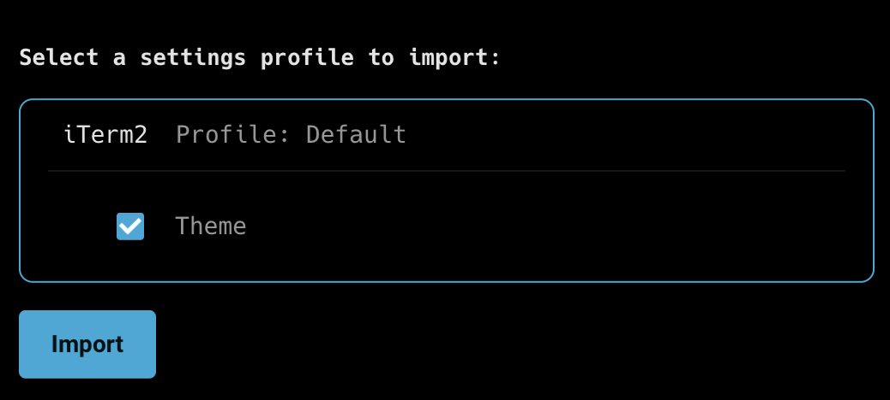

Warp imports your iTerm2 profile automatically, bringing over theme, font, keybindings, hotkey window, and more in a few clicks. This page walks through the importer, what it covers, and what to reconfigure manually after.

## What transfers automatically

Warp ships a built-in iTerm2 importer that reads your default profile from `~/Library/Preferences/com.googlecode.iterm2.plist`. It imports:

* **Theme** - foreground, background, cursor, and all 16 ANSI colors (light and dark variants if configured).
* **Font** - family and size (when the font exists on your system and is supported by Warp).
* **Default shell** - if you've set a custom Command in your iTerm2 profile.
* **Working directory behavior** - Warp translates iTerm2's "Reuse previous session's directory" and similar options.
* **Window dimensions** - rows and columns.
* **Opacity and blur.**
* **Copy-on-select, mouse and scroll reporting, and Option-as-Meta settings.**
* **Global hotkey** - if you use a hotkey window or hotkey activation, Warp maps it.

To run the importer:

1. In Warp, open the [Command Palette](/terminal/command-palette/).
2. Search for **Import External Settings**.
3. Select **iTerm2 Profile: Default**. Warp only imports the profile marked as your Default Bookmark in iTerm2.
4. Choose which settings to keep or skip on the preview screen.

## Use Warp's agent for follow-up settings

If the importer doesn't pick up something you care about — a non-default profile, an unusual keybinding, a specific setting — ask Warp's agent to translate it directly. Warp ships a [`settings.toml` file](/terminal/settings/) and a bundled `modify-settings` skill that lets the agent read your iTerm2 plist and write equivalent values into Warp's settings.

1. In Warp, switch to [Agent Mode](/agent-platform/local-agents/overview/) with `⌘+I`.
2. Paste a prompt like:

   > Read my iTerm2 preferences with `defaults read com.googlecode.iterm2` and port any settings that the importer didn't cover (extra profiles, custom keybindings) into my Warp `settings.toml` using the `modify-settings` skill. Show me a diff before applying.

3. Review the proposed diff and approve. Warp hot-reloads `settings.toml`.

## What to reconfigure manually

A few iTerm2 features don't map directly and need a manual pass after import:

* **Multiple profiles.** Warp imports only your Default profile. If you rely on multiple iTerm2 profiles, create equivalent [tab configs](/terminal/windows/tab-configs/) in Warp.
* **Keyboard shortcuts.** Warp's [keyboard shortcuts](/getting-started/keyboard-shortcuts/) cover most iTerm2 bindings out of the box, but custom bindings need to be recreated in **Settings** > **Keyboard shortcuts**.
* **Split panes and arrangements.** Rebuild using [split panes](/terminal/windows/split-panes/) and [tab configs](/terminal/windows/tab-configs/).
* **Triggers.** Warp doesn't have a direct equivalent. Reach similar outcomes through [YAML workflows](/terminal/entry/yaml-workflows/) or Agent Mode.

### Choose your prompt

After the import, choose which [prompt](/terminal/appearance/prompt/) to use:

1. [**Warp prompt**](/terminal/appearance/prompt/#warp-prompt) - Warp's native prompt with drag-and-drop context chips for git branch, directory, timestamps, and more. Configure in **Settings** > **Appearance** > **Prompt**.
2. [**Shell prompt (PS1)**](/terminal/appearance/prompt/#custom-prompt) - inherits your existing shell prompt configuration unchanged. Pick this if you want Warp to match your iTerm2 prompt exactly.

## Warp-native equivalents

Features switchers commonly look for after leaving iTerm2, and where they live in Warp:

| From iTerm2 | In Warp |
| --- | --- |
| Hotkey window (Quake mode) | [Global hotkey](/terminal/windows/global-hotkey/) (imported automatically when detected in your iTerm2 profile) |
| Triggers | [YAML workflows](/terminal/entry/yaml-workflows/) for repeatable actions; Agent Mode for pattern-based automation |
| Profiles | [Tab configs](/terminal/windows/tab-configs/) for layouts; [Warp Drive](/knowledge-and-collaboration/warp-drive/) for shared team setups |
| Autocomplete menu | [Autosuggestions](/terminal/command-completions/autosuggestions/) + [tab completions](/terminal/command-completions/completions/) |
| Instant replay | [Session restoration](/terminal/sessions/session-restoration/) |
| Password manager integration | [Warp Drive environment variables](/knowledge-and-collaboration/warp-drive/environment-variables/) |

For more on what you can configure after migrating, see the [Warp quickstart](/quickstart/) and [Customizing Warp](/getting-started/quickstart/customizing-warp/).
