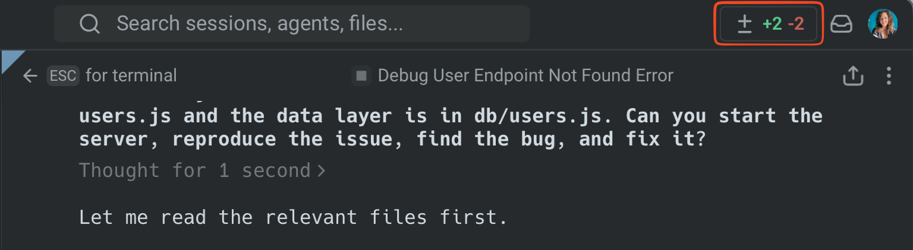
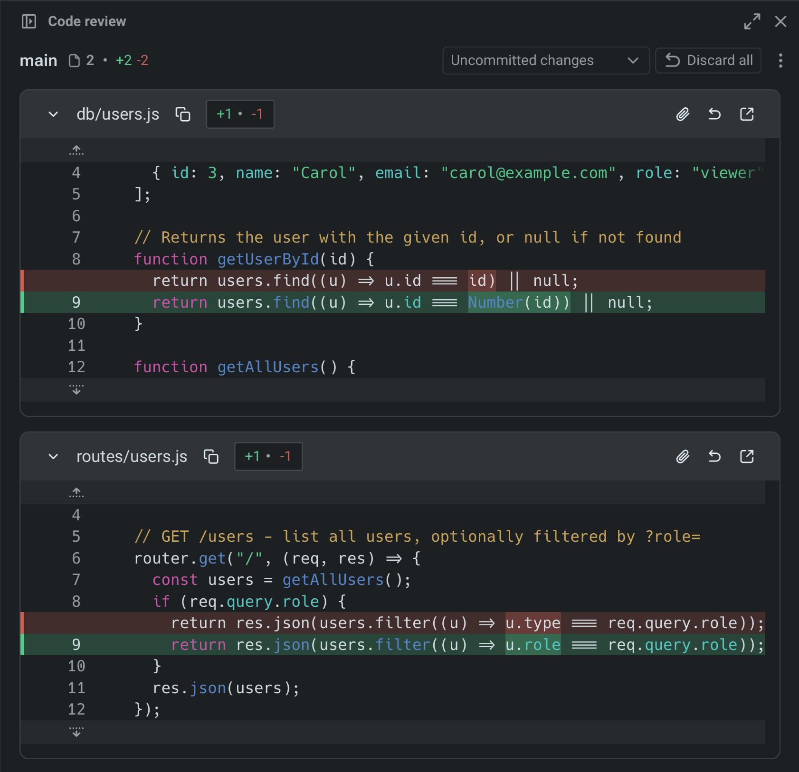
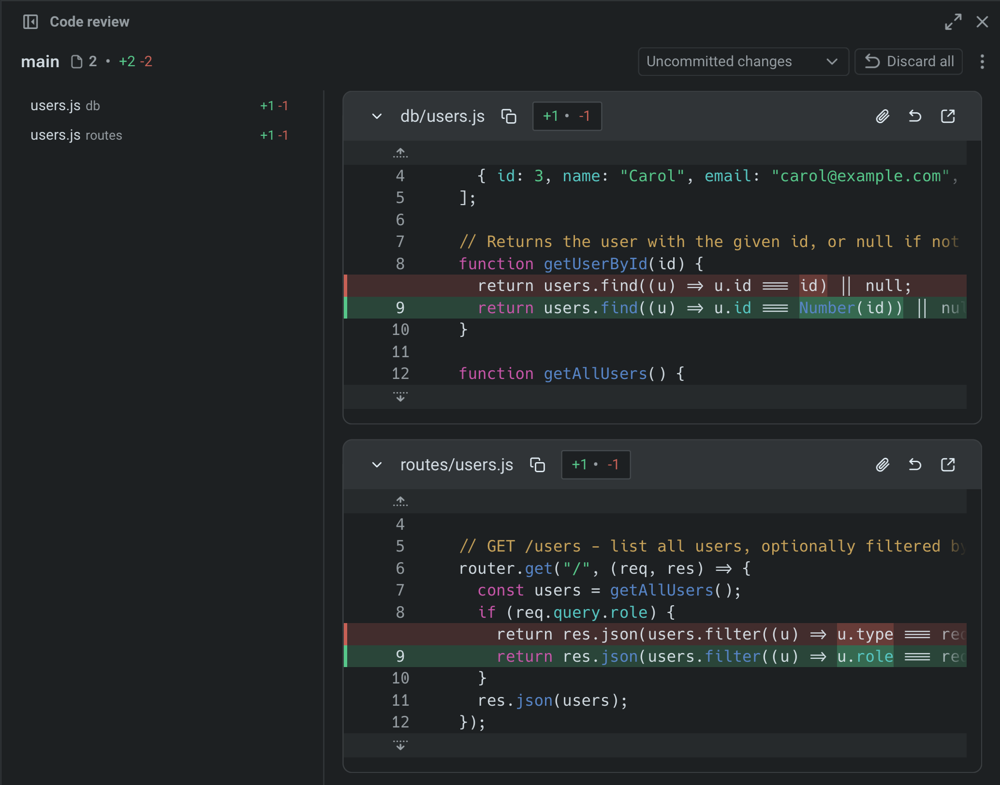
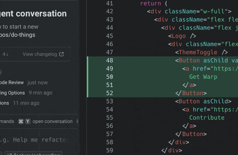

Coding agents can produce hundreds of lines of code in seconds, but shipping that code without review is risky. This guide provides a practical workflow for reviewing agent-generated code in Warp, catching common issues, and giving structured feedback that the agent can act on. Plan on about 10 minutes to complete.

## Prerequisites

* **A Git-tracked project** — Code review in Warp works on any Git repository.
* **An AI coding agent** — This workflow applies to any CLI agent: [Claude Code](/guides/external-tools/how-to-set-up-claude-code/), [Codex](/guides/external-tools/how-to-set-up-codex-cli/), OpenCode, or Warp's built-in agent. See [Third-party CLI agents](/agent-platform/cli-agents/overview/) for setup.

## Why review matters

AI agents are fast but imperfect. They hallucinate imports, introduce subtle logic errors, make bad architectural decisions, and duplicate code. Reviewing agent output is the step that turns agentic development from vibe coding into a workflow you can trust.

Common issues in AI-generated code:

* **Hallucinated imports** — referencing packages or modules that don't exist in your project
* **Redundant logic** — duplicating existing functionality instead of reusing it
* **Questionable architectural decisions** — adding new patterns instead of following existing ones, or restructuring code in ways that conflict with your project's architecture
* **Security gaps** — hardcoded credentials, missing input validation, or overly permissive permissions
* **Style drift** — ignoring your project's conventions for naming, error handling, or file structure
* **Incomplete error handling** — happy-path code that crashes on edge cases

## 1. Give the agent a task

Whether you're using Claude Code, Codex, or Warp's built-in agent, start by giving your agent a task. For example:

```
Fix the authentication middleware to handle expired tokens gracefully
```

The agent will modify one or more files.

## 2. Open the Code Review panel

Once the agent has finished the task, open Warp's [Code Review panel](/code/code-review/) to see every file that changed. You can open it in several ways:

* **Keyboard shortcut**: `⌘+Shift++` (macOS) or `Ctrl+Shift++` (Windows/Linux)
* **Git diff chip**: Click the diff chip in the terminal input that shows files modified and lines changed
* **Review changes button**: After an agent conversation, click **Review changes** at the bottom of the conversation
* **Tab bar**: Click the Code Review button in the top-right corner of Warp



The panel shows all uncommitted changes as a visual diff, grouped by file. Additions are highlighted in green with a `+` prefix, removals in red with a `-` prefix.



## 3. Review diffs by file

With the Code Review panel, you can review changes file-by-file:

* **Browse all changed files** using the file sidebar.
* **Switch diff views** to compare against uncommitted changes or against `main`/`master` to see the full scope of what would land in a PR.
* **Click anywhere in the code** to edit diffs directly in the panel.

Focus on the areas where agents are most likely to make mistakes: imports, error handling, and anything that touches security or authentication.



## 4. Leave inline comments on issues

Click the "Add comment" button on any line or block of code and add a comment describing what needs to change. Warp anchors each comment to the exact file and line, so any agent understands precisely what to fix.
You can add as many comments as you need before submitting — Warp batches them so the agent receives all your feedback at once instead of processing changes one at a time.



## 5. Submit all comments to the agent

Once you've reviewed each file and left comments, submit the complete batch. The agent receives all your feedback, applies the requested changes in one pass, and returns an updated diff.

Review the updated diff to verify the fixes. Repeat this cycle until the code meets your standards:  comment, submit, review.

:::note
This workflow applies to **any CLI agent** running in Warp, not just the built-in agent. You can leave inline comments on diffs generated by Claude Code, Codex, or OpenCode and send them back to the running agent session.
:::

## 6. Run your project's checks before committing

Before accepting the changes, run your project's test suite, linter, and type checker. Agent-generated code might pass a visual review but fail automated checks.

```bash
# Example: run tests and lint
npm test && npm run lint
```

If checks fail, you can either fix the issues manually in the Code Review panel or send the error output back to the agent as context for another iteration.

:::note
**Quick review checklist**: When reviewing agent-generated changes, check that imports resolve, new code doesn't duplicate existing functionality, credentials aren't hardcoded, error handling covers failure cases, style matches your project, tests still pass, and the agent only changed what was asked.
:::

## Productivity tips

* **Attach diffs as context** — Select a diff hunk in the Code Review panel and attach it to your next prompt. This grounds the agent's response in your actual code changes. See [Selection as context](/agent-platform/local-agents/agent-context/selection-as-context/) for details.
* **Revert individual hunks** — Don't like one specific change? Revert just that hunk from the Code Review panel without undoing the rest of the agent's work.
* **Compare against main** — Switch the diff view to "Changes vs. main" to see how the agent's work fits into the full scope of your branch, not just the latest edits.
* **Use rules to prevent recurring issues** — If you notice the agent repeatedly making the same mistake (wrong import paths, incorrect naming conventions), add a [Rule](/agent-platform/capabilities/rules/) so it learns your project's standards.

## Next steps

You now have a structured workflow for reviewing AI-generated code in Warp: visual diff review, inline comments that feed back to the agent, and batch feedback submission. This workflow works with any CLI coding agent: Claude Code, Codex, OpenCode, or Warp's built-in agent.

Explore related guides and features:

* [Set up Claude Code](/guides/external-tools/how-to-set-up-claude-code/) or [Set up Codex CLI](/guides/external-tools/how-to-set-up-codex-cli/) to start using third-party agents in Warp
* [Run multiple agents at once](/guides/agent-workflows/how-to-run-multiple-ai-coding-agents/) to compare outputs from different agents on the same task
* [Claude Code in Warp](https://warp.dev/agents/claude-code) | [Codex in Warp](https://warp.dev/agents/codex) | [Gemini CLI in Warp](https://warp.dev/agents/gemini-cli) | [OpenCode in Warp](https://warp.dev/agents/opencode) — agent-specific overviews on the Warp marketing site
* [Code Review panel](/code/code-review/) — full reference for all Code Review features
* [Interactive Code Review](/agent-platform/local-agents/interactive-code-review/) — detailed docs on inline comments and batch feedback
* [Third-party CLI agents](/agent-platform/cli-agents/overview/) — all supported agents and Warp's universal agent features
