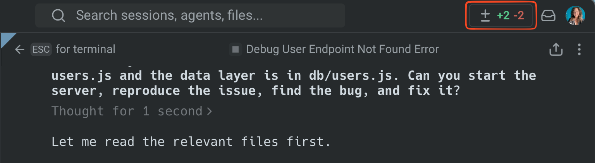
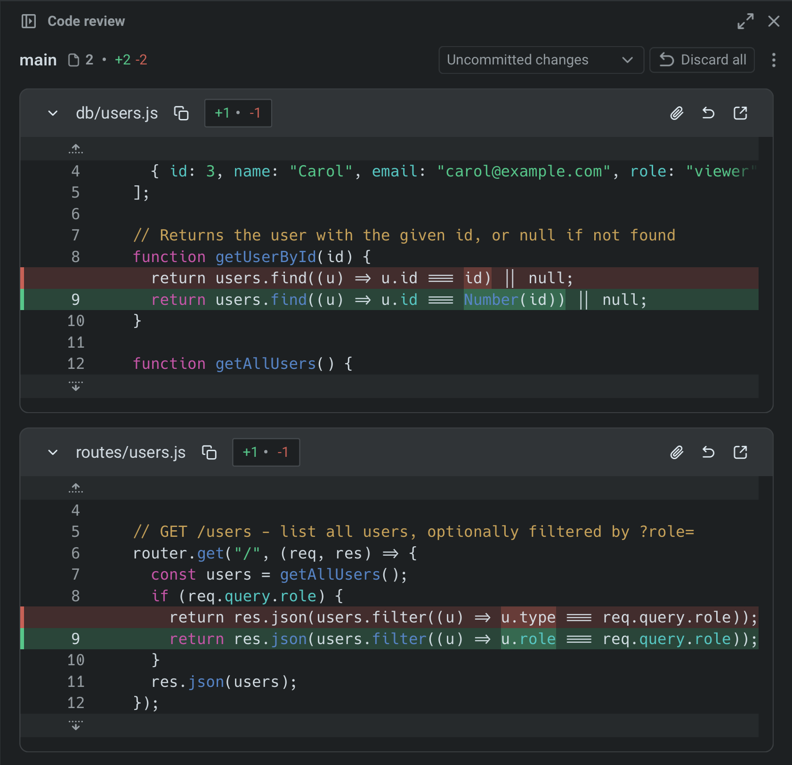
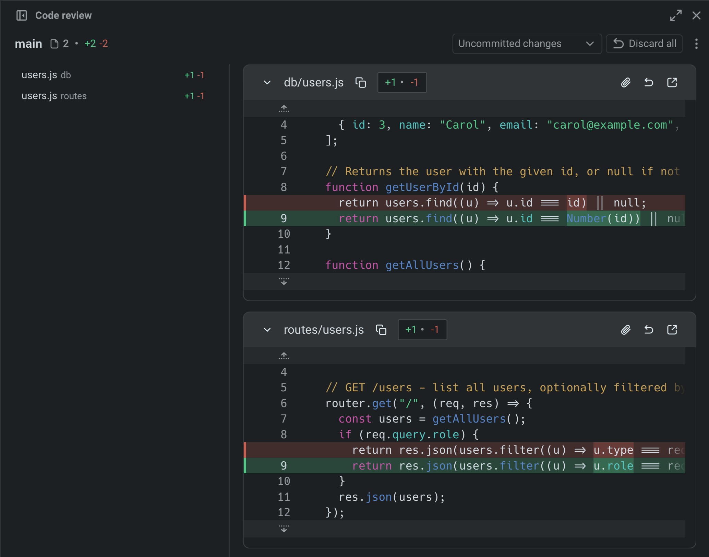
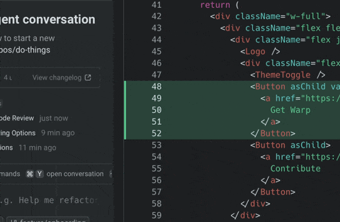

Coding agents can produce hundreds of lines of code in seconds, but shipping that code without review is risky. In Warp, you can use visual diffs and inline comments to catch common issues and give the agent structured feedback it can act on. Plan on about 10 minutes to complete.

## Prerequisites

* **A Git-tracked project** - Code Review in Warp works with any Git repository.
* **A coding agent** - Use the Warp Agent or a supported third-party CLI agent: [Claude Code](/guides/external-tools/how-to-set-up-claude-code/), [Codex](/guides/external-tools/how-to-set-up-codex-cli/), [Gemini CLI](/guides/external-tools/how-to-set-up-gemini-cli/), or [OpenCode](/guides/external-tools/how-to-set-up-opencode/). See [Third-party CLI agents](/agents/cli-agents/overview/) for the full list.

## Why review matters

Agents are fast but imperfect. An agent can hallucinate imports, introduce subtle logic errors, make poor architectural decisions, or duplicate code. Reviewing agent output turns agent-assisted development into a workflow you can trust.

Review AI-generated code for the following issues.

* **Hallucinated imports** - Referencing packages or modules that don't exist in your project.
* **Redundant logic** - Duplicating existing functionality instead of reusing it.
* **Questionable architectural decisions** - Adding new patterns instead of following existing ones, or restructuring code in ways that conflict with your project's architecture.
* **Security gaps** - Hardcoding credentials, omitting input validation, or granting overly permissive permissions.
* **Style drift** - Ignoring your project's conventions for naming, error handling, or file structure.
* **Incomplete error handling** - Writing happy-path code that crashes on edge cases.

## 1. Give the agent a task

Start by giving the agent a task. For example, try the following prompt:

```text
Fix the authentication middleware to handle expired tokens gracefully
```

The agent will modify one or more files.

## 2. Open the Code Review panel

Once the agent has finished the task, open Warp's [Code Review panel](/code/code-review/) to see every file that changed. Open the panel in any of the following ways:

* **Keyboard shortcut** - Press `⌘+Shift++` (macOS) or `Ctrl+Shift++` (Windows/Linux).
* **Git diff chip** - Click the diff chip in the terminal input that shows files modified and lines changed.
* **Review changes button** - After an agent conversation, click **Review changes** at the bottom of the conversation.
* **Tab bar** - Click the Code Review button in the top-right corner of Warp.

<figure style={{ maxWidth: "350px" }}>

<figcaption>The Code Review button.</figcaption>
</figure>

The panel shows all uncommitted changes as a visual diff, grouped by file. Additions are highlighted in green with a `+` prefix, removals in red with a `-` prefix.

<figure style={{ maxWidth: "563px" }}>

<figcaption>Code Review panel with diffs.</figcaption>
</figure>

## 3. Review diffs by file

Use the Code Review panel to review changes file by file.

* **Browse all changed files** - Use the file sidebar.
* **Switch diff views** - Compare against uncommitted changes or `main`/`master` to see the full scope of what would land in a PR.
* **Edit a diff** - Click anywhere in the code to edit directly in the panel.

Pay particular attention to imports, error handling, and code that touches security or authentication.

<figure style={{ maxWidth: "375px" }}>

<figcaption>Changed files sidebar.</figcaption>
</figure>

## 4. Leave inline comments on issues

Click **Add comment** on any line or block of code, then describe what needs to change. Warp anchors each comment to the exact file and line, so the agent knows precisely what to fix.
Add as many comments as you need before you submit. Warp sends the complete batch at once, rather than asking the agent to process changes one at a time.

<figure style={{ maxWidth: "563px" }}>

<figcaption>Inline comments on specific diff lines.</figcaption>
</figure>

## 5. Submit all comments to the agent

Once you've reviewed each file and left comments, submit the complete batch. The agent applies the requested changes in one pass and returns an updated diff.

Review the updated diff to verify the fixes. Repeat the cycle until the code meets your standards: comment, submit, then review.

:::note
This workflow applies to any running CLI agent session in Warp. You can leave inline comments on a diff and send them back to the agent session.
:::

## 6. Run your project's checks before committing

Before accepting the changes, run your project's test suite, linter, and type checker. Agent-generated code can pass a visual review and still fail automated checks.

```bash
# Example: run tests and lint
npm test && npm run lint
```

If checks fail, you can either fix the issues manually in the Code Review panel or send the error output back to the agent as context for another iteration.

:::note
**Quick review checklist:**

* [ ] Imports resolve.
* [ ] New code doesn't duplicate existing functionality.
* [ ] Credentials aren't hardcoded.
* [ ] Error handling covers failure cases.
* [ ] Style matches your project.
* [ ] Tests pass.
* [ ] The agent changed only what you asked.
:::

## Productivity tips

* **Attach diffs as context** - Select a diff hunk in the Code Review panel and attach it to your next prompt. This grounds the agent's response in your actual code changes. See [Selection as context](/agents/local-agents/agent-context/selection-as-context/) for details.
* **Revert individual hunks** - Revert one change from the Code Review panel without undoing the rest of the agent's work.
* **Compare against main** - Switch the diff view to "Changes vs. main" to see how the agent's work fits into the full scope of your branch, not just the latest edits.
* **Use Rules to prevent recurring issues** - If the agent repeatedly makes the same mistake, such as using incorrect import paths or naming conventions, add a [Rule](/agents/capabilities/rules/) with your project's standards.

## Next steps

You now have a structured workflow for reviewing AI-generated code in Warp. It combines visual diff review, inline comments, and batch feedback.

Explore related guides and features:

* [Attach agent session context to GitHub PRs](/guides/agent-workflows/how-to-attach-agent-session-context-to-github-prs/) to give reviewers the prompt, plan, commands, logs, and validation behind agent-generated changes.
* [Run multiple agents at once](/guides/agent-workflows/how-to-run-multiple-ai-coding-agents/) to compare outputs from different agents on the same task.
* [Code Review panel](/code/code-review/) for a full reference to Code Review features.
* [Interactive Code Review](/agents/local-agents/interactive-code-review/) for detailed instructions on inline comments and batch feedback.
