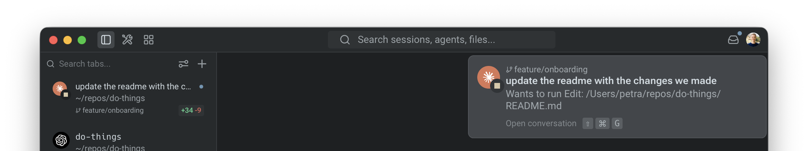

Different agents have different strengths. Claude Code might handle refactoring well while Codex might excel at test generation. Instead of choosing one, you can run them in parallel. Assign different tasks to different agents, compare their outputs on the same problem, or have one agent build while another reviews. This guide shows you how to set up a multi-agent workflow in Warp and manage it effectively. Plan on about 15 minutes.

## Prerequisites

* **Any coding agent** — For example, Warp's built-in agent, [Claude Code](/guides/external-tools/how-to-set-up-claude-code/), or [Codex CLI](/guides/external-tools/how-to-set-up-codex-cli/). Any combination of supported agents works well: Oz by Warp, Claude Code, Codex, OpenCode, Gemini CLI, Amp, Pi, Droid, and others.
* **A Git-tracked project** — Notifications and code review work best in a Git repository.

## 1. Switch to vertical tabs

Vertical tabs are the foundation of a multi-agent workflow. Unlike horizontal tabs, they show rich metadata for each session: which agent is running, which branch you're on, which directory, and the current status.

To enable vertical tabs:
1. In the Warp app, go to **Settings** > **Appearance** > **Tabs**.
2. Select **Use vertical tab layout**. 

You can configure what information to display for each tab:
* The running agent (Oz, Claude Code, Codex, etc.)
* The current Git branch
* The working directory
* A status indicator showing whether the agent is active, waiting for input, or idle


## 2. Launch agents in separate tabs

Open a new tab for each agent session. Within each tab, navigate to your project directory and start an agent:

**Tab 1 — Claude Code:**

```bash
cd ~/your-project
claude
```

**Tab 2 — Codex:**

```bash
cd ~/your-project
codex
```

Give each agent a different task, or give them the same task to compare approaches:

```
# Claude Code: refactor the authentication module
Refactor src/auth/ to use async/await instead of callbacks

# Codex: write tests for the same module
Write comprehensive tests for src/auth/ covering edge cases
```


## 3. Monitor agents with notifications

When you have multiple agents running, you don't need to watch each tab. Warp sends notifications when an agent needs your attention, for example, when it needs permission to run a command or approval to apply a code diff.

Look for the attention-needed indicator on the tab in the vertical sidebar. Click the tab to jump directly to the agent that needs input.

Notification setup varies by agent:

* **Claude Code** — Install the [Warp notification plugin](https://github.com/warpdotdev/claude-code-warp). Warp shows a one-click install chip when you first run Claude Code, or you can install manually. See the [Claude Code guide](/guides/external-tools/how-to-set-up-claude-code/) for details.
* **Codex** — Warp automatically sets up notifications when you first run Codex. No manual setup required.
* **OpenCode** — Add the [Warp notification plugin](https://github.com/warpdotdev/opencode-warp) to your `opencode.json` configuration.

:::note
Agent notifications are currently supported for Claude Code, Codex, and OpenCode. For setup details, see [Agent notifications](/agent-platform/capabilities/agent-notifications/). For a full breakdown of which features work with each agent, see the [third-party CLI agents feature matrix](/agent-platform/cli-agents/overview/).
:::



## 4. Compare outputs from different agents

A practical use of parallel agents is running the same task in different Git worktrees, with different agents, to compare their approaches. For example, prompt both Claude Code and Codex with the following:

```
Optimize the database query in src/api/users.ts to reduce response time
```

After both agents complete, open the [Code Review panel](/code/code-review/) (`⌘+Shift++`) in each tab to compare their diffs side-by-side. You might find one agent produces cleaner code while the other catches an edge case the first missed.

## 5. Save your workspace with tab configs

If you regularly work with the same multi-agent setup, save it as a tab config so you can recreate it with one click:

1. Hover over the tab and click the three dots on the right-hand side.
2. Click **Save as new config**.


Tab configs are TOML files that define the directory, startup commands, and layout for a tab. For example, you might create a config that:

* Opens two panes side-by-side
* Drops you into your project repo automatically
* Starts Claude Code in one pane and Codex in the other

:::note
Tab configs pair well with [Git worktrees](/code/git-worktrees/). Create a worktree for each agent so they work on isolated branches, then merge the best results.
:::

## 6. Use Git worktrees for isolated agent workspaces

When multiple agents modify the same files, they can create conflicts. Git worktrees solve this by giving each agent its own copy of your repo on a separate branch.

Create worktrees for each agent:

```bash
git worktree add ../your-project-claude feature/claude-refactor
git worktree add ../your-project-codex feature/codex-refactor
```

Then point each agent tab at its own worktree directory. Tab configs complement this workflow. Define each worktree directory and agent startup command in a config, then recreate the full setup with one click.

After both agents finish, compare the branches and merge the best results:

```bash
git diff feature/claude-refactor..feature/codex-refactor
```

## Productivity tips

* **Use the Agent Management Panel** — Open the Agent Management Panel to see all active agents across tabs. This gives you a dashboard view of what's running, what's waiting, and what's finished.
* **Color-code your tabs** — Assign different themes or colors to agent tabs so you can visually distinguish them at a glance in the vertical sidebar.
* **Compose with `Ctrl+G`** — Use Warp's rich input editor (`Ctrl+G`) when composing prompts for third-party agents. This gives you click-to-edit instead of arrow-key navigation in the raw CLI.
* **Review all changes before committing** — After running multiple agents, open the Code Review panel to see the combined diff across all files. Use "Changes vs. main" view to see the full scope of all agent-generated changes on your branch.

## Next steps

You set up a multi-agent workspace with vertical tabs, launched different agents in parallel, monitored them with notifications, compared their outputs, and learned how to use tab configs and Git worktrees for isolated, reproducible multi-agent workflows.

Explore related guides and features:

* [How to review AI-generated code](/guides/agent-workflows/how-to-review-ai-generated-code/) — review and refine the code your agents produced
* [Set up Claude Code](/guides/external-tools/how-to-set-up-claude-code/) or [Set up Codex CLI](/guides/external-tools/how-to-set-up-codex-cli/) if you haven't installed both yet
* [Claude Code in Warp](https://warp.dev/agents/claude-code) — overview of Claude Code support in Warp
* [Codex in Warp](https://warp.dev/agents/codex) — overview of Codex support in Warp
* [Gemini CLI in Warp](https://warp.dev/agents/gemini-cli) — overview of Gemini CLI support in Warp
* [OpenCode in Warp](https://warp.dev/agents/opencode) — overview of OpenCode support in Warp
* [Third-party CLI agents](/agent-platform/cli-agents/overview/) — all supported agents and universal agent features
* [Vertical tabs](/terminal/windows/vertical-tabs/) — full reference for tab features
