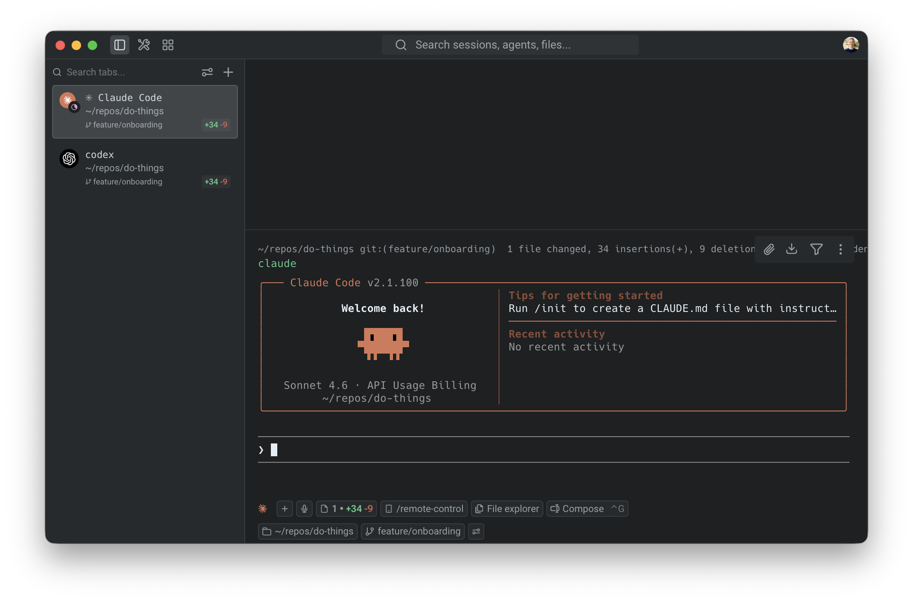
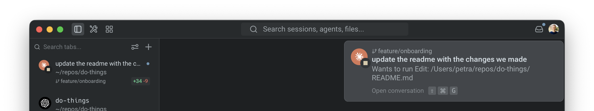

import VideoEmbed from '@components/VideoEmbed.astro';
import { VARS } from '@data/vars';

Use multiple coding agents, including Warp Agent, Claude Code, Codex, and other CLI agents, when work can be split into independent tasks, reviewed from separate branches, or delegated to cloud agents while you keep working locally. In Warp, you can coordinate agents in three ways:

* **Local parallel sessions** - run Warp Agent, Claude Code, Codex, OpenCode, or another CLI agent in separate tabs or panes.
* **Isolated worktrees** - give each agent its own Git worktree and branch so parallel edits do not collide.
* **{VARS.WARP_AUTOMATION_PLATFORM} cloud orchestration** - use `/orchestrate`, `/plan`, the {VARS.WARP_AGENT_CLI}, the {VARS.WEB_APP}, or the {VARS.API_SDK_NAME} to fan work out to child agents in cloud environments.

The best multi-agent workflows have one thing in common: each agent owns a clear slice of work, reports back with validation results, and hands off a branch, diff, PR, or concise finding you can review.

Plan on about 15 minutes for the local setup. Cloud orchestration takes longer only if you need to create or select an [environment](/platform/environments/) first.

## Prerequisites

* **Any coding agent** — Any combination of supported agents works well: Warp Agent, [Claude Code](/guides/external-tools/how-to-set-up-claude-code/), [Codex CLI](/guides/external-tools/how-to-set-up-codex-cli/), OpenCode, Gemini CLI, Amp, Pi, Droid, and others.
* **A Git-tracked project** — Notifications and code review work best in a Git repository.

## Choose a multi-agent pattern

| Pattern | Use it when | How to run it in Warp |
| ------- | ----------- | --------------------- |
| Same task, different agents | You want to compare approaches or pick the best implementation. | Run each agent in a separate tab and worktree, then compare diffs in the [Code Review panel](/code/code-review/). |
| Split by file or subsystem | A feature spans independent modules that can be changed in parallel. | Assign each agent a worktree, branch, file boundary, and validation command. |
| Builder plus reviewer | One agent implements while another reviews, writes tests, or checks edge cases. | Put the reviewer in a read-only or review-focused tab, or use a separate branch for test-only changes. |
| Cloud fan-out | The work is large, slow, or can run away from your laptop. | Use [Multi-agent orchestration](/platform/orchestration/) or [Running orchestrated agents](/platform/orchestration/multi-agent-runs/) to spawn cloud children. |
| Repeatable fleet workflow | You want the same agent pattern on every PR, issue, schedule, or release. | Use a cloud agent with a trigger, skill, or API workflow, then inspect parent and child runs in the [{VARS.WEB_APP}](/platform/oz-web-app/). |

## Plan the split before launching agents

Before you start agents, decide:

* **Task ownership** - Which files, packages, tests, issues, or PRs each agent owns.
* **Workspace ownership** - Which branch or Git worktree each agent uses.
* **Validation ownership** - Which agent runs unit tests, typechecks, lint, smoke tests, or manual verification.
* **Handoff format** - Whether each agent should leave a local diff, branch, PR, patch, summary, or code review comments.
* **Merge strategy** - Whether you will keep one winner, cherry-pick changes, merge multiple branches, or open separate PRs.

Use boundaries that minimize overlapping edits. For example, assign one agent to `packages/api`, another to `packages/web`, and a third to tests or docs. If two agents must touch the same files, make one the owner and ask the other to review or propose changes without editing.

## 1. Switch to vertical tabs

Vertical tabs are the foundation of a multi-agent workflow. Unlike horizontal tabs, they show rich metadata for each session: which agent is running, which branch you're on, which directory, and the current status.

To enable vertical tabs:
1. In the Warp app, go to **Settings** > **Appearance** > **Tabs**.
2. Select **Use vertical tab layout**. 

You can configure what information to display for each tab:
* The running agent (Warp Agent, Claude Code, Codex, etc.)
* The current Git branch
* The working directory
* A status indicator showing whether the agent is active, waiting for input, or idle

<figure style={{ maxWidth: "375px" }}>

<figcaption>Vertical tabs overview.</figcaption>
</figure>

## 2. Launch agents in separate tabs

Open a new tab for each agent session. Within each tab, navigate to your project directory and start an agent:

**Tab 1 — Claude Code:**

```bash
cd ~/your-project
claude
```

**Tab 2 — Codex:**

```bash
cd ~/your-project
codex
```

Give each agent a different task, or give them the same task to compare approaches:

```
# Claude Code: refactor the authentication module
Refactor src/auth/ to use async/await instead of callbacks

# Codex: write tests for the same module
Write comprehensive tests for src/auth/ covering edge cases
```

For split work, include the same operating contract in every prompt:

```
You own src/auth/ and tests/auth/.
Do not edit src/billing/ or src/api/payments/.
Work on branch feature/auth-refactor-claude in ../your-project-claude.
Run npm test -- auth and npm run typecheck before handing off.
When done, report changed files, validation results, and any risks.
```

If one agent depends on another, do not let both edit at once. Ask the first agent to finish and report its branch, patch, or PR before starting the dependent work.

<figure style={{ maxWidth: "563px" }}>

<figcaption>Vertical tab with agent details.</figcaption>
</figure>

## 3. Monitor agents with notifications

When you have multiple agents running, you don't need to watch each tab. Warp sends notifications when an agent needs your attention, for example, when it needs permission to run a command or approval to apply a code diff.

Look for the attention-needed indicator on the tab in the vertical sidebar. Click the tab to jump directly to the agent that needs input.

Notification setup varies by agent:

* **Claude Code** — Install the [Warp notification plugin](https://github.com/warpdotdev/claude-code-warp). Warp shows a one-click install chip when you first run Claude Code, or you can install manually. See the [Claude Code guide](/guides/external-tools/how-to-set-up-claude-code/) for details.
* **Codex** — Warp automatically sets up notifications when you first run Codex. No manual setup required.
* **OpenCode** — Add the [Warp notification plugin](https://github.com/warpdotdev/opencode-warp) to your `opencode.json` configuration.

:::note
Agent notifications are currently supported for Claude Code, Codex, and OpenCode. For setup details, see [Agent notifications](/agents/capabilities/agent-notifications/). For a full breakdown of which features work with each agent, see the [third-party CLI agents feature matrix](/agents/cli-agents/overview/).
:::

<figure style={{ maxWidth: "350px" }}>

<figcaption>Agent approval notification.</figcaption>
</figure>

<VideoEmbed url="https://youtu.be/w0bJFC0u0pE?si=XdP88cSCMXTK6Ec5" title="Running multiple agents at once in Warp" />

## 4. Compare outputs from different agents

A practical use of parallel agents is running the same task in different Git worktrees, with different agents, to compare their approaches. For example, prompt both Claude Code and Codex with the following:

```
Optimize the database query in src/api/users.ts to reduce response time
```

After both agents complete, open the [Code Review panel](/code/code-review/) (`⌘+Shift++`) in each tab to compare their diffs side-by-side. You might find one agent produces cleaner code while the other catches an edge case the first missed.

## 5. Save your workspace with tab configs

If you regularly work with the same multi-agent setup, save it as a tab config so you can recreate it with one click:

1. Hover over the tab and click the three dots on the right-hand side.
2. Click **Save as new config**.

<figure style={{ maxWidth: "375px" }}>

<figcaption>Saving a tab config.</figcaption>
</figure>

Tab configs are TOML files that define the directory, startup commands, and layout for a tab. For example, you might create a config that:

* Opens two panes side-by-side
* Drops you into your project repo automatically
* Starts Claude Code in one pane and Codex in the other

:::note
Tab configs pair well with [Git worktrees](/code/git-worktrees/). Create a worktree for each agent so they work on isolated branches, then merge the best results.
:::

## 6. Use Git worktrees for isolated agent workspaces

When multiple agents modify the same files, they can create conflicts. Git worktrees give each agent its own copy of your repo on a separate branch.

1. Create one worktree per agent so each agent has an isolated branch.

   ```bash
   git worktree add ../your-project-claude feature/claude-refactor
   git worktree add ../your-project-codex feature/codex-refactor
   ```
2. Point each agent tab at its assigned worktree directory.
3. Give every worktree a branch name that makes ownership obvious:
   * `agent/claude-auth-refactor`
   * `agent/codex-auth-tests`
   * `agent/warp-review-pass`

4. Keep a merge note somewhere lightweight, such as your parent Warp Agent conversation or PR description:
   * Which branch each agent owns.
   * Which tests each agent ran.
   * Which branch should be merged first.
   * Which conflicts or follow-up decisions remain.
5. After both agents finish, compare the branches and merge the best results.
   ```bash
   git diff feature/claude-refactor..feature/codex-refactor
   ```

6. Remove worktrees after you merge or discard the branch.
   ```bash
   git worktree remove ../your-project-claude
   git worktree remove ../your-project-codex
   ```

## 7. Fan out work to cloud agents

Use cloud agents when the work is long-running, resource-intensive, easy to shard, or better handled away from your local machine. For example:

* Review every open PR in a repo.
* Run a migration across many packages.
* Ask one child agent per service to inspect logs, tests, or incidents.
* Let a parent agent coordinate a plan while children research, implement, or validate.

1. Start in the Warp app with `/orchestrate` when you want a parent agent to propose the child-agent breakdown.

   ```text
   /orchestrate Split this TypeScript monorepo migration by package. Use one child agent per package, require each child to run package tests, and summarize changed files and risks before merge.
   ```

2. Use `/plan` for larger changes where you want to review the plan, orchestration config, child ownership, and merge strategy before agents launch.
3. For repeatable or unattended workflows, start the parent from the {VARS.WARP_AGENT_CLI}, the {VARS.WEB_APP}, or the {VARS.API_SDK_NAME}. See [Running orchestrated agents](/platform/orchestration/multi-agent-runs/) for launch options.
4. Inspect parent and child runs from the [{VARS.WEB_APP}](/platform/oz-web-app/) or the [Agent Management Panel](/platform/managing-cloud-agents/) in the Warp app.

Cloud orchestration is the best fit when you need:

* **Parallel fan-out** across many files, packages, PRs, issues, or services.
* **Clear observability** across parent and child runs.
* **Durable handoff** through child run summaries, session links, artifacts, PRs, or messages.
* **Team-scale execution** from Slack, Linear, schedules, GitHub Actions, the CLI, or the API.

## 8. Validate, merge, and hand off

Do not merge every agent's output automatically. Use a fan-in pass:

1. Review each agent's summary, changed files, and validation results.
2. Open the [Code Review panel](/code/code-review/) for local branches, or inspect cloud run artifacts and session links for cloud children.
3. Merge or cherry-pick one branch at a time.
4. Re-run the full validation suite from the final integrated branch.
5. Attach context for reviewers: agent session links, changed files, validation commands, known risks, and reviewer asks.

For GitHub handoff, see [Attach agent session context to GitHub PRs](/guides/agent-workflows/how-to-attach-agent-session-context-to-github-prs/). For reviewing the generated code itself, see [How to review AI-generated code](/guides/agent-workflows/how-to-review-ai-generated-code/).

## Productivity tips

* **Use the Agent Management Panel** — Open the Agent Management Panel to see all active agents across tabs. This gives you a dashboard view of what's running, what's waiting, and what's finished.
* **Color-code your tabs** — Assign different themes or colors to agent tabs so you can visually distinguish them at a glance in the vertical sidebar.
* **Compose with `Ctrl+G`** — Use Warp's rich input editor (`Ctrl+G`) when composing prompts for third-party agents. This gives you click-to-edit instead of arrow-key navigation in the raw CLI.
* **Review all changes before committing** — After running multiple agents, open the Code Review panel to see the combined diff across all files. Use "Changes vs. main" view to see the full scope of all agent-generated changes on your branch.

## Next steps

You set up a multi-agent workspace with vertical tabs, launched different agents in parallel, monitored them with notifications, compared their outputs, and learned how to use tab configs and Git worktrees for isolated, reproducible multi-agent workflows.

Explore related guides and features:

* [How to review AI-generated code](/guides/agent-workflows/how-to-review-ai-generated-code/) — review and refine the code your agents produced
* [Attach agent session context to GitHub PRs](/guides/agent-workflows/how-to-attach-agent-session-context-to-github-prs/) — give reviewers the agent context behind a PR
* [Multi-agent orchestration](/platform/orchestration/) — coordinate parent and child agents across local and cloud runs
* [Running orchestrated agents](/platform/orchestration/multi-agent-runs/) — start orchestrated runs from Warp, the {VARS.WARP_AGENT_CLI}, the {VARS.WEB_APP}, or the {VARS.API_SDK_NAME}
* [Set up Claude Code](/guides/external-tools/how-to-set-up-claude-code/) or [Set up Codex CLI](/guides/external-tools/how-to-set-up-codex-cli/) — install both agents if you haven't already
* [Claude Code in Warp](https://www.warp.dev/agents/claude-code) — overview of Claude Code support in Warp
* [Codex in Warp](https://www.warp.dev/agents/codex) — overview of Codex support in Warp
* [Gemini CLI in Warp](https://www.warp.dev/agents/gemini-cli) — overview of Gemini CLI support in Warp
* [OpenCode in Warp](https://www.warp.dev/agents/opencode) — overview of OpenCode support in Warp
* [Third-party CLI agents](/agents/cli-agents/overview/) — all supported agents and universal agent features
* [Vertical tabs](/terminal/windows/vertical-tabs/) — full reference for tab features
