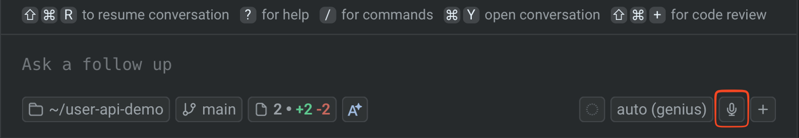
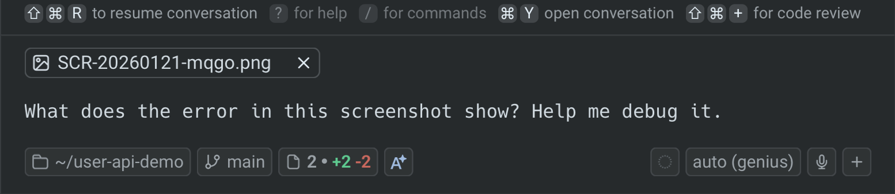

Typing detailed prompts for coding agents can be slow. Describing a bug from a screenshot, dictating a complex refactoring plan, or explaining a UI change from a design mockup are examples of tasks that are faster with voice and images than with text alone. This guide shows you how to use multimodal input with any CLI coding agent running in Warp in about 5 minutes.

## Prerequisites

* **Warp** — Voice and image input are built into Warp's agent interface. Download from [warp.dev](https://warp.dev).
* **A CLI coding agent** — Voice and image input work with any supported agent: [Claude Code](/guides/external-tools/how-to-set-up-claude-code/), [Codex CLI](/guides/external-tools/how-to-set-up-codex-cli/), OpenCode, Gemini CLI, Amp, or Droid. See [Third-party CLI agents](/agent-platform/cli-agents/overview/) for the full list.
* **A working microphone** (for voice) — Built-in or external, including Bluetooth audio devices.

## 1. Enable voice input

Voice transcription is available in Warp's agent input. To use it:

1. Click the **microphone icon** in the input area, or use the voice input keyboard shortcut.



2. Speak your prompt naturally. Warp transcribes your speech and places the text in the input field.
3. Review the transcription, edit if needed, then submit your prompt.

Voice input works for both Warp's built-in agent and third-party CLI agents when the agent utility bar is active.

:::note
You can configure the voice input keybinding in the Warp app under **Settings** > **Agents** > **Warp Agent** > **Voice**. The default uses the `fn` key.
:::

## 2. Prompt with voice instead of typing

Voice is fastest for prompts that are easy to say but tedious to type, such as complex descriptions, multi-step plans, or explanations that reference what you're looking at.

Try prompts like:

```
Refactor the authentication middleware to handle three cases: 
valid token, expired token, and missing token. For expired tokens, 
return a 401 with a refresh token hint. For missing tokens, return 
a 403. Add unit tests for each case.
```

The transcription appears in your input field where you can review and edit before submitting.

## 3. Attach screenshots as context

Paste (`⌘+V`) or drag images directly into the input area to give the agent visual context. This is useful for:

* **Bug reports** — Screenshot the error in your browser and ask the agent to fix it.
* **Design mockups** — Paste a Figma screenshot and ask the agent to implement the UI.
* **Error messages** — Screenshot a stack trace instead of copying and reformatting it.
* **Visual diffs** — Show the agent what the UI looks like now vs. what it should look like.



## 4. Combine voice and images for design-to-code workflows

The most powerful use of multimodal input is combining voice and images. For example:

1. Take a screenshot of a design mockup from Figma.
2. Paste it into the input area.
3. Use voice to describe what you want:

```
This is the login page design. Implement it using React and Tailwind. 
Match the spacing and colors exactly. The form should validate email 
format on blur and show inline error messages.
```

The agent sees the design and hears your implementation requirements at the same time — much faster than writing a detailed specification by hand.

## 5. Use voice and images with third-party agents

Voice and image input work with any CLI agent that Warp detects, not just the built-in agent. When you run Claude Code, Codex, or another supported agent, Warp shows the **agent utility bar** with controls for voice, images, and files.

To use with a third-party agent:

1. Start the agent in your terminal (e.g., `claude` or `codex`).
2. The agent utility bar appears automatically when Warp detects the agent session.
3. Use the microphone icon for voice input or paste images as context.
4. Press `Ctrl+G` to open the rich input editor for composing complex prompts with attached images.

The voice transcription and image context are sent to the running agent session just as if you had typed and pasted them manually.

:::note
If you don't see the utility bar, make sure you're on the latest Warp version and that the agent is running inside Warp (not an external terminal).
:::

## Productivity tips

* **Use voice for code review feedback** — Instead of typing inline comments, use voice to describe what needs to change while looking at the diff in the [Code Review panel](/code/code-review/).
* **Screenshot UI issues** — When you want to change a UI component, just screenshot it, send it to the agent, and describe what you want changed.
* **Dictate commit messages** — After reviewing your changes, use voice to describe what you did. The agent can format it as a proper commit message.
* **Use with Rules for consistent results** — Combine image context with [Rules](/agent-platform/capabilities/rules/) that define your project's UI patterns. The agent will match the mockup while following your existing design system.

## Next steps

You can now prompt coding agents using voice transcription and image context — whether you're using Claude Code, Codex, or any other CLI agent in Warp. Voice and images make complex prompts faster to create and more accurate, especially for design-to-code workflows, bug reproduction, and multi-step refactoring plans.

Explore related guides and features:
* [Set up Claude Code](/guides/external-tools/how-to-set-up-claude-code/) or [Set up Codex CLI](/guides/external-tools/how-to-set-up-codex-cli/) to start using third-party agents
* [How to review AI-generated code](/guides/agent-workflows/how-to-review-ai-generated-code/) — review the code your agents produce
* [Run multiple agents at once](/guides/agent-workflows/how-to-run-multiple-ai-coding-agents/) — combine voice/image prompting with parallel agents
* [Voice input](/agent-platform/local-agents/interacting-with-agents/voice/) — full reference for voice features
* [Images as context](/agent-platform/local-agents/agent-context/images-as-context/) — full reference for image input
* [Third-party CLI agents](/agent-platform/cli-agents/overview/) — all supported agents and universal features
