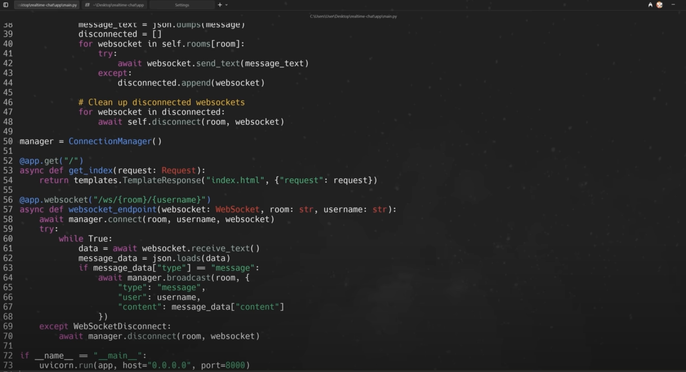

import VideoEmbed from '@components/VideoEmbed.astro';
import { Steps } from '@astrojs/starlight/components';

:::note
In this tutorial, we’ll follow along with Tech With Tim’s _Advanced Vibe Coding Tutorial w/ Warp_ video.\
\
You’ll learn how to use **Warp**, the _agentic development environment_, to build and deploy a fullstack AI-driven app from scratch — including setup, debugging, and deployment using **GitHub MCP servers**.
:::

<VideoEmbed url="https://www.youtube.com/watch?v=Pxp9mB51U-A" title="Advanced Vibe Coding Tutorial w/ Warp (Build & Deploy Apps)" />

### Overview

This video shows how to go from **idea → working web app → production deployment**, all inside Warp.\
The project: a **real-time chat application** built with **Python (FastAPI)** and a **JavaScript frontend**, deployed through **Railway**, and integrated with **GitHub** via **MCP (Model Context Protocol)**.

<Steps>

1. #### Setup & Installation

   :::note
   Warp is free for Mac, Linux, and Windows. Download it from [https://warp.dev](https://warp.dev/) and sign in with an account.
   :::

   Once you open Warp, you’ll see three core modes:

   * **Auto Mode** – Detects whether you’re typing a command or an AI prompt
   * **Terminal Mode** – For standard shell commands only (`ls`, `pwd`, etc.)
   * **Agent Mode** – For conversational AI prompts (`build me an app`, `add feature X`, etc.)

   You can switch modes using the top-bar buttons.

   Pro tip: Enable voice input for natural prompting or attach screenshots when debugging UI issues.

2. #### Generate an App Idea

   Warp supports _planning models_, where the AI generates a detailed roadmap before coding.

   ```
   I would like to make something of simple to medium complexity that I could finish in about 30 minutes. I want this to be web based. I want to have some kind of interface and some kind of backend. Can you give me a fun idea that's not going to be too complicated to build out and to eventually deploy?
   ```

   The AI suggested several projects, like a personal mood tracker, quick poll creator, recipe randomizer, and more.\
   \
   Chosen idea we went with: **a real-time chat application**.

3. #### Create a Development Plan

   Prompt:

   ```bash
   I like idea one. Can you come up with a detailed plan on how to build this?
   ```

   Warp’s agent generated a plan for:

   * A **frontend** (UI for chat rooms and messages)
   * A **backend** (FastAPI server for real-time communication)
   * Database integration and planned deployment steps

   You can refine or expand the plan interactively by prompting:

   ```
   Make this more detailed.
   ```

   And get back something like this:

   ```

   Here's your development roadmap:

   🏗️ Architecture Decisions
   Frontend Options:
   •  React + Socket.IO Client (recommended for rich UI)
   •  Vue.js + Socket.IO Client 
   •  Vanilla JS + WebSockets (simpler but limited)

   Backend Options:
   •  Node.js + Socket.IO + Express (most popular for real-time)
   •  Python + Flask-SocketIO
   •  Go + Gorilla WebSocket

   Database:
   •  MongoDB (flexible for chat messages)
   •  PostgreSQL (structured data with JSON fields)
   •  Redis (for session management and caching)

   🚀 Recommended Tech Stack
   📋 Core Features to Implement
   1. Real-time messaging (Socket.IO)
   2. User authentication (JWT)
   3. Multiple chat rooms
   4. Online user presence
   5. Message history
   6. Typing indicators
   7. File/image sharing (optional)

   🛠️ Development Steps
   1. Create project in ~/Documents/Coding_Projects/realtime-chat
   2. Set up Node.js backend with Socket.IO
   3. Create React frontend with real-time connection
   4. Implement user auth and room management
   5. Add message persistence and history
   6. Style UI and add advanced features
   ```

   At any point, you can go into the plan and start directly modifying it. And when you're ready, you can tell Warp to:

   ```bash
   Please execute this plan.
   ```

4. #### Allow Autonomous Execution

   Once Warp starts executing, you can let Warp run commands automatically:

   1. Go to **Settings → AI → Agents**
   2. Change **“Always Ask”** → **“Always Allow”**
   3. Ensure restricted commands (e.g., `rm -rf`) remain blocked

   This enables autonomous execution for safe, fast iteration. Warp will run shell commands, create directories, initialize files, and write code.

5. #### Running the App

   First, you can click into any file, like `main.py` to edit it directly in Warp. Warp displays your file directly in the app for easy editing, similar to any regular IDE experience.

   

   You can also ask Warp to run the app and test locally:

   ```
   Can you run this app for me so I can test it? Tell me how to view it.
   ```

   It's possible (like in the video) for an error to occur (e.g., Internal Server Error). If that happens, y you can simply debug conversationally:

   ```bash
   I’m getting an internal server error. Can you fix this?
   ```

   And Warp can fix the issue and rerun the app automatically.

6. #### Adding New Features

   To enhance the app, request features conversationally:

   ```
   Can you add emoji reactions to the messages?
   ```

   Warp will modify frontend and backend code, updating WebSocket logic for real-time reactions. After testing, multiple users can now react to messages in the chat interface.

7. #### Preparing for Deployment

   Warp integrates directly with version control and cloud deployers via **MCP servers**.

   Connect GitHub MCP:

   1. Go to **Settings → AI → MCP Servers → Add**
   2. Add a JSON block for GitHub MCP:

   ```json
   {
     "github": {
       "command": "docker",
       "args": [
         "run",
         "-i",
         "--rm",
         "-e",
         "GITHUB_PERSONAL_ACCESS_TOKEN",
         "ghcr.io/github/github-mcp-server"
       ],
       "env": {
         "GITHUB_PERSONAL_ACCESS_TOKEN": "${<INSERT_YOURS_HERE>}"
       }
     }
   }
   ```

   3. Generate a GitHub personal access token (Settings → Developer Settings → Tokens)
      * Enable scopes for: `repo`, `workflow`, `secrets`, `pull_request`, and `environments`.

   Save and restart Warp.

   Then tell the agent:

   ```
   Can you make a new remote repo for me and upload my code?
   ```

   Warp uses Git commands automatically:

   ```bash
   git init
   git add .
   git commit -m "Initial commit"
   git remote add origin ...
   git push
   ```

8. #### Deploying via Railway

   Prompt:

   ```
   I have a FastAPI application built with Python. I want to deploy this. It just has an integrated frontend with JavaScript, HTML, and CSS. What’s the easiest way to do that? Can you assist me?
   ```

   Warp recommends **Railway** and walks through:

   * Creating a Railway account
   * Connecting your GitHub repo
   * Deploying directly from GitHub
   * Generating a public domain

   Once deployed, test it in your browser — you’ll see your live chat app with emoji reactions working in real time.

</Steps>

### Appendix

* [Github MCP Server](https://github.com/github/github-mcp-server)
* [Docker Desktop download](https://www.docker.com/products/docker-desktop/)
* [Railway](https://railway.com/)
