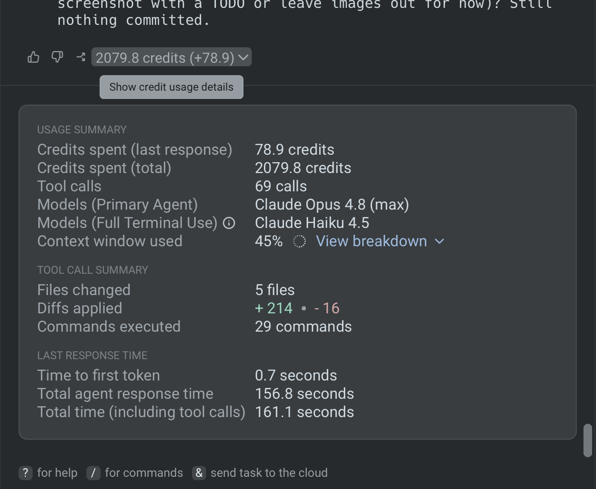

Every agent task consumes tokens. Tokens are the unit of text a model reads and generates. The more tokens a task uses, the more it costs and the longer it takes, so using tokens efficiently keeps your agent workflows lean and fast.

In Warp, this usage is measured in credits. Credits package tokens into a single, consistent unit that accounts for the different token rates and prices across models and providers, so you don't have to track raw tokens per model yourself.

This guide covers practical ways to get more out of every token in Warp. You'll learn how to choose the right model, route tasks to cost-appropriate models, keep context tight, manage conversations, and configure your agents to work efficiently.

Token usage is non-deterministic, so treat these as habits that make your tokens go further over time, not exact per-task guarantees. For a full breakdown of what drives usage, see [what affects usage](/support-and-community/plans-and-billing/credits/).

## Track your usage first

You can't improve what you can't see. Before optimizing, get a sense of which prompts, models, and workflows use the most tokens.

* **Per-turn breakdown** - Expand the usage chip at the bottom of any agent response to open its **Usage Summary**, which shows the model, tool calls, context window used, and diffs applied for that turn.
* **In-conversation details** - Run `/cost` to toggle usage details directly in the conversation.
* **Total usage and reset date** - In the Warp app, open **Settings** > **Billing and usage**, or run `/usage`, to track your overall consumption and when your usage resets.

<figure style={{ maxWidth: "563px" }}>

<figcaption>The per-turn Usage Summary, opened from the usage chip on an agent response.</figcaption>
</figure>

{/* NOTE: usage-summary-panel.png is credit-labeled; swap for a token-labeled capture once the credits-to-tokens UI ships. */}

Once you know where your tokens go, the techniques below help you make each one go further.

## Match the model to the task

Larger reasoning models process more tokens per turn than lighter ones, so the model you choose has one of the biggest effects on usage.

* **Use a cost-efficient model for routine work** - Switch to **Auto (Cost-efficient)** (`auto-efficient`), which optimizes for lower token consumption while keeping output quality high. Lightweight models like Claude Haiku also use fewer tokens for simple edits, lookups, and quick questions.
* **Prefer open-weight models** - If you'd rather run open-source models, choose **Auto (Open-weights)** (`auto-open`), which routes among the best open-weight models for low cost and fast speed.
* **Reserve high-reasoning models for hard problems** - Save heavier models like Claude Opus for deep debugging, architecture decisions, and planning, where the extra reasoning is worth the cost.
* **Pick a model and stay with it** - Switching models mid-conversation can reset prompt caching and reprocess your context. Choose a model at the start of a task and keep it for the duration when you can.

Change models with the model picker in the input, or run `/model`. See [Agent model choice](/agents/inference/model-choice/) for the full model list.

## Automate model selection with custom routers

Use a custom router to automatically choose a model. You define the routing logic once, and Warp resolves a concrete model for each prompt instead of defaulting every task to your most expensive model.

* **Route by complexity** - Warp classifies each task as easy, medium, or hard and routes to the model you mapped to that level. Simple tasks run on a lightweight model; only difficult tasks reach a high-reasoning model.
* **Route by rules** - Write natural-language rules that pair a description (such as "debugging or fixing failing tests") with a model. Warp matches rules top to bottom and uses the first one that fits.
* **Set a cost-efficient default** - Every router falls back to a default model for anything your tiers or rules don't cover, so choose a lighter model for the default.

A router appears in the model picker like any other model and resolves per conversation, so token usage matches whichever model it picks. Create one in the Warp app under **Settings** > **Agents** > **Warp Agent** in the **Custom Routers** section. See [Custom routers](/agents/inference/custom-routers/) for setup steps and YAML examples.

## Keep each conversation focused

Because every turn re-sends the current conversation to the model, long or unfocused threads keep paying for the same context. Tight, well-scoped conversations keep token usage low.

* **Scope tasks and work incrementally** - Break large changes into smaller, contained steps instead of one sprawling request. Well-scoped tasks need less back-and-forth and fewer correction cycles.
* **Start a new conversation for a new task** - Run `/new` when you switch topics so unrelated history doesn't ride along in every turn.
* **Compact long conversations** - When a useful thread grows long, run `/compact` to summarize the history and free up the context window. Use `/fork-and-compact` to branch into a fresh, summarized copy that keeps the relevant context and trims the rest.

See [Conversation forking](/agents/local-agents/interacting-with-agents/conversation-forking/) and the full [Slash Commands](/agents/capabilities/slash-commands/) reference for more.

## Be selective about the context you add

Context you attach becomes tokens the model has to process. Adding only what's relevant keeps each turn lean.

* **Attach focused snippets, not full dumps** - When sharing logs, code, or command output, include only the relevant portion instead of an entire file or output.
* **Add context deliberately** - Attach the specific [blocks](/agents/local-agents/agent-context/blocks-as-context/), files, or images the agent needs for the task, rather than broad, just-in-case context.

## Let Codebase Context retrieve code for you

When an agent explores your repository by reading files one by one, each read is a tool call that consumes tokens. Indexing your codebase lets Warp find the right code with semantic search instead.

* **Index your repository** - Run `/index` so Warp can locate relevant code by meaning, reducing the number of exploratory tool calls and the amount of code you paste in manually.
* **Let the agent search instead of pasting** - With an indexed codebase, ask about a feature or file directly rather than copying large sections into the prompt.

Learn more in [Codebase Context](/agents/capabilities/codebase-context/).

## Set up Rules and AGENTS.md

Without persistent guidance, agents re-derive your preferences every session and sometimes drift off course, which wastes tokens on corrections and rework. Rules encode that guidance once.

* **Capture preferences as Rules** - Store your tools, conventions, and standards as [Rules](/agents/capabilities/rules/) so you don't re-explain them in every conversation. Add one with `/add-rule`.
* **Add a project AGENTS.md** - Run `/init` to generate a project `AGENTS.md` that gives agents the context they need up front, reducing exploration and missteps.

For examples, see [Set coding best practices with Rules](/guides/configuration/how-to-set-coding-best-practices/).

## Plan large or complex tasks first

For big or ambiguous tasks, jumping straight to implementation often leads to wrong turns and expensive rework. A short planning pass keeps execution on track.

* **Create a plan before executing** - Run `/plan` to have the agent research and outline the work in phases before it changes code. A clear plan reduces wasted exploratory work and backtracking on large tasks.

See [Planning](/agents/capabilities/planning/) for details.

## Next steps

Together, these habits help you get more out of every token: match the model to the task, keep conversations and context tight, and configure Rules and Codebase Context. Pair them with the right Agent Profile, and keep an eye on your usage as you go.

Explore these related guides and references:

* [Use Agent Profiles efficiently](/guides/configuration/how-to-use-agent-profiles-efficiently/)
* [Agent model choice](/agents/inference/model-choice/)
* [Custom routers](/agents/inference/custom-routers/)
* [Slash Commands](/agents/capabilities/slash-commands/)
