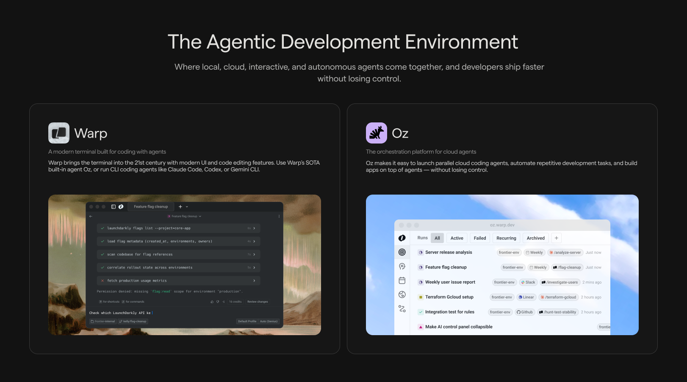

import VideoEmbed from '@components/VideoEmbed.astro';

Warp is an [open source](https://github.com/warpdotdev/warp) **Agentic Development Environment**, a modern terminal combined with powerful agents that help you build, test, deploy, and debug code. Warp's AI is powered by **Oz**, the orchestration platform for cloud agents.

---

## Warp

Warp is where you work — a fast, modern terminal built for coding with agents.

**Key capabilities:**

* [**Terminal and Agent modes**](/agent-platform/local-agents/interacting-with-agents/terminal-and-agent-modes/): Switch between a clean terminal for commands and a dedicated conversation view for multi-turn agent workflows.
* [**Modern terminal UX**](/terminal/editor/): Cursor movement, block-based navigation, multi-line editing, syntax highlighting, and rich completions. Built with Rust for high performance.
* [**Code editor**](/code/overview/): File tree, code editor with LSP support, and interactive code review experience.
* [**Third-Party CLI Agents**](/agent-platform/cli-agents/overview/): Run third-party CLI agents like Claude Code, Codex, and OpenCode with Warp's agent toolbelt — rich input, code review, notifications, and more.

<VideoEmbed url="https://www.youtube.com/watch?v=xhkoXsE9Wqc" title="Deep dive into Warp's core features" />

---

## Oz: The orchestration platform for cloud agents

Oz is the orchestration platform for cloud agents that powers all of Warp's intelligent features. Oz is designed to coordinate agents at scale—understanding your codebase, executing tasks autonomously, and adapting to your workflows. Oz is multi-model by design, giving you flexibility to choose the best LLM for each task.

Oz operates in two modes:

### Local agents

Run directly in the Warp app for real-time, interactive coding assistance.

* Write and refactor code across your codebase
* Debug issues and fix errors
* Run commands and interpret results
* Plan and execute multi-step tasks

Local agents keep you in control. You can review changes, steer the agent mid-task, and approve actions before they execute.

→ [Get started with local agents](/agent-platform/local-agents/overview/)

### Cloud agents

Oz Cloud Agents run in the background on Warp's infrastructure (or your own) for automation at scale.

* **Triggers**: React to events from Slack, Linear, GitHub, or custom webhooks
* **Schedules**: Run recurring tasks like dependency updates or dead code removal
* **Parallelism**: Run many agents concurrently across repos or tasks
* **Observability**: Every run is tracked, auditable, and shareable with your team

Cloud agents are ideal for work that doesn't need your immediate attention, like PR reviews, issue triage, routine maintenance, and integration-driven workflows.

→ [Learn about cloud agents](/agent-platform/cloud-agents/overview/)

---

## How they work together

Warp and Oz provide a unified experience across local and cloud development:

* **Same agent, anywhere**: Whether you're working interactively in Warp or running agents in the cloud, you're using the same underlying agent capabilities.
* **Seamless handoff**: Start a task in the cloud and take over locally in Warp when you want hands-on control, without losing progress or context.
* **Shared context**: [Warp Drive](/knowledge-and-collaboration/warp-drive/), [Rules](/agent-platform/capabilities/rules/), and [MCP servers](/agent-platform/capabilities/mcp/) work across both local and cloud agents, so your team's knowledge and tools are always available.
* **Team collaboration**: Share agent sessions, review agents' actions, and steer running tasks, regardless of who started them.

---

## Multi-model support

Oz is multi-model by design. You can [choose your preferred LLM](/agent-platform/capabilities/model-choice/) from a curated set of top models.

---

## Open source

Warp's client is open source under [AGPL v3](https://github.com/warpdotdev/warp/blob/master/LICENSE). The source lives at [`warpdotdev/warp`](https://github.com/warpdotdev/warp), where you can read the code, file issues, and contribute alongside the Warp team. Development happens in the open with an agent-first workflow managed by Oz.

→ [Contributing to Warp](/support-and-community/community/contributing/) explains how to file issues, claim work, and ship code or themes.

---

## Privacy and security

Warp is **SOC 2 compliant** and has **Zero Data Retention** policies with all contracted LLM providers. No customer AI data is retained, stored, or used for training.

Warp's AI features can be globally disabled in **Settings** > **Agents** > **Warp Agent**.

→ [Read more about data privacy](https://www.warp.dev/privacy)

---

## Next steps

* [**Quickstart**](/quickstart/): Get Warp installed and start coding
* [**Warp Agents overview**](/agent-platform/local-agents/overview/): Explore all AI features available in Warp
* [**Cloud Agents Overview**](/agent-platform/cloud-agents/overview/): Set up background automation
* [**Oz Platform**](/agent-platform/cloud-agents/platform/): Learn about the CLI, API, SDK, and infrastructure
