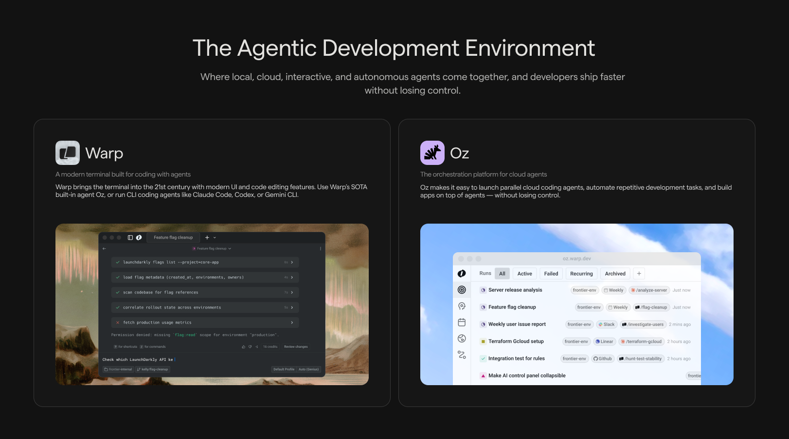

import VideoEmbed from '@components/VideoEmbed.astro';

Warp is an [open source](https://github.com/warpdotdev/warp) **Agentic Development Environment** that combines a modern, high-performance terminal with powerful agents to help you build, test, deploy, and debug code. Agents in Warp are powered by **Oz**, the orchestration platform for running agents locally or in the cloud at scale.

<figure>

<figcaption>Warp terminal with Oz orchestration.</figcaption>
</figure>

---

## Warp

Warp is where you work — a fast, modern terminal built for coding with agents.

**Key capabilities:**

* [**Terminal and Agent modes**](/agents/local-agents/interacting-with-agents/terminal-and-agent-modes/): Switch between a clean terminal for commands and a dedicated conversation view for multi-turn agent workflows.
* [**Modern terminal UX**](/terminal/editor/): Cursor movement, block-based navigation, multi-line editing, syntax highlighting, and rich completions. Built with Rust for high performance.
* [**Code editor**](/code/overview/): File tree, code editor with LSP support, and interactive code review experience.
* [**Third-party CLI agents**](/agents/cli-agents/overview/): Run third-party CLI agents like Claude Code, Codex, and OpenCode with the agent toolbelt — rich input, code review, notifications, and more.

<VideoEmbed url="https://www.youtube.com/watch?v=xhkoXsE9Wqc" title="Deep dive into Warp's core features" />

---

## Three ways to use the Warp Agent

The **Warp Agent** writes and edits code, debugs issues, runs commands, and works through multi-step tasks. You reach the same agent three ways, and your account, rules, skills, and model access carry across all of them.

### In the Warp app

Real-time, interactive coding assistance alongside your terminal.

* Write and refactor code across your codebase
* Debug issues and fix errors
* Run commands and interpret results
* Plan and execute multi-step tasks

You stay in control. Review changes, steer the agent mid-task, and approve actions before they execute.

→ [Get started with agents in Warp](/agents/local-agents/overview/)

### In any terminal, with the Warp Agent CLI

The Warp Agent CLI is a standalone terminal program that runs the same agent without the Warp app. Run the `warp` command to start a conversation in whichever terminal you already use, over SSH, or on a machine where Warp isn't installed.

→ [Get started with the Warp Agent CLI](/agents/cli/quickstart/)

### In the cloud, as a cloud agent

Cloud agents run in the background on Warp's infrastructure (or your own) for automation at scale.

* **Triggers**: React to events from Slack, Linear, GitHub, or custom webhooks
* **Schedules**: Run recurring tasks like dependency updates or dead code removal
* **Parallelism**: Run many agents concurrently across repos or tasks
* **Observability**: Every run is tracked, auditable, and shareable with your team

Cloud agents are ideal for work that doesn't need your immediate attention, like PR reviews, issue triage, routine maintenance, and integration-driven workflows.

→ [Learn about cloud agents](/platform/)

### The platform behind them

**Oz** is Warp's programmable platform for running and coordinating agents at scale. It provides the environments, triggers, integrations, orchestration, and observability that cloud agents run on, plus a CLI, API, and SDK.

→ [Learn about the Oz platform](/platform/overview/)

---

## How they work together

Warp and Oz provide a unified experience across local and cloud development:

* **Same agent, anywhere**: Whether you're working in the Warp app, in another terminal through the Warp Agent CLI, or running agents in the cloud, you're using the same underlying agent capabilities.
* **Seamless handoff**: Start a task in the cloud and take over locally in Warp when you want hands-on control, without losing progress or context.
* **Shared context**: [Warp Drive](/knowledge-and-collaboration/warp-drive/), [Rules](/agents/capabilities/rules/), and [MCP servers](/agents/capabilities/mcp/) work across both local and cloud agents, so your team's knowledge and tools are always available.
* **Team collaboration**: Share agent sessions, review agents' actions, and steer running tasks, regardless of who started them.

---

## Multi-model support

Oz is multi-model by design. You can [choose your preferred LLM](/agents/inference/model-choice/) from a curated set of top models.

---

## Open source

Warp's client is open source under [AGPL v3](https://github.com/warpdotdev/warp/blob/master/LICENSE-AGPL). The source lives at [`warpdotdev/warp`](https://github.com/warpdotdev/warp), where you can read the code, file issues, and contribute alongside the Warp team. Development happens in the open with an agent-first workflow managed by Oz.

→ [Contributing to Warp](/support-and-community/community/contributing/) explains how to file issues, claim work, and ship code or themes.

---

## Privacy and security

Warp is **SOC 2 compliant** and has **Zero Data Retention** policies with all contracted LLM providers. No customer AI data is retained, stored, or used for training.

Warp's AI features can be globally disabled in **Settings** > **Agents** > **Warp Agent**.

→ [Read more about data privacy](https://www.warp.dev/privacy)

---

## Next steps

* [**Quickstart**](/quickstart/): Get Warp installed and start coding
* [**Using the Warp Agent**](/agents/local-agents/overview/): Explore all AI features available in Warp
* [**Warp Agent CLI**](/agents/cli/): Run the Warp Agent in any terminal
* [**Cloud Agents overview**](/platform/): Set up background automation
* [**Oz Platform**](/platform/overview/): Learn about the CLI, API, SDK, and infrastructure
