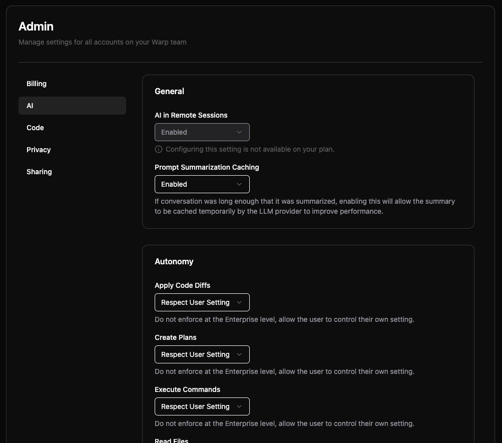

## What is the Admin Panel?

The [Admin Panel](https://app.warp.dev/admin/) provides team administrators with centralized control over organization-wide settings in Warp. It allows you to manage workspace settings that are enforced across all members of your team.

:::note
Admin Panel access is restricted to team administrators. Right now, only the creator of a team is the designated admin. If your admin has setup styles that override user preferences, you will not be able to control them inside of Warp, and you'll see a note that your admin has configured this setting.
:::

**Key features:**

* **AI Settings** - Control agent autonomy, permissions, and allowlists across your team
* **Privacy Controls** - Configure data collection and enterprise secret redaction
* **Billing Management** - Set spending limits and manage usage-based pricing
* **Code Settings** - Control codebase indexing and context features
* **Sharing Policies** - Manage link sharing and collaboration permissions

## Accessing the Admin Panel

Team administrators can access the Admin Panel directly at https://app.warp.dev/admin/

## How settings enforcement works

The Admin Panel uses a tier-based policy system to determine which settings administrators can control:

### Toggleable vs. fixed settings

**Toggleable settings** can be modified by team administrators. These appear as dropdown menus with options like:

* Enabled/Disabled for boolean settings
* Specific autonomy levels for AI settings
* Respect User Setting to allow individual control

**Fixed settings** are determined by your billing tier and cannot be changed. These appear with a message: "Configuring this setting is not available on your plan."

### Setting Inheritance

When administrators configure organization-wide settings:

1. **Organization enforced** - Setting applies to all team members regardless of individual preferences
2. **Respect user setting** - Allows individual team members to control the setting themselves
3. **Tier restricted** - Setting is locked to default values based on billing plan

### User Experience

:::note
Any changes made in the Admin Panel can take effect immediately for all team members. Consider testing settings in Warp before applying organization-wide policies.
:::

When organization settings override individual preferences:

* Users see their personal settings grayed out
* A message indicates "your organization has configured this setting"
* Users cannot modify settings that are organizationally enforced

## Plan Limitations

The features available in the Admin Panel vary by billing tier:

**Free Tier**

* Most settings are fixed and non-toggleable
* Limited Codebase Context and sharing features

**Business Plans**

* Most settings become toggleable by administrators
* Enhanced AI autonomy control
* Advanced sharing and privacy features

**Enterprise Plans**

* Full admin control over all settings
* Enterprise secret redaction
* Custom LLM integration
* Advanced compliance features

For complete details about what's included in each plan, visit [warp.dev/pricing](https://www.warp.dev/pricing).

## Admin Panel sections

The Admin Panel is organized into five main sections, each focused on a specific area of team management:

### AI Settings

Configure how Agents behave across your organization, including autonomy levels and command permissions.

#### General AI Settings

**AI in Remote Sessions** Controls whether AI features are available during SSH sessions and remote connections. Enterprise plans can toggle this setting, while Free tier teams have it enabled by default.

**Prompt Summarization Caching** When conversations become long enough to require summarization, this setting allows the summary to be cached temporarily by the LLM provider to improve performance.

#### Autonomy Settings

Configure how much independence Agents have when performing different actions:

**Apply Code Diffs**

* Agent Decides - Prompt for review before applying code diffs (currently behaves the same as Always Ask)
* Always Ask - Require explicit approval before applying any code changes
* Always Allow - Apply code diffs without confirmation
* Respect User Setting - Allow individual users to control this setting

**Create Plans** Controls whether Agents can create structured task plans without user approval.

**Execute Commands** Manages Agent's ability to run terminal commands autonomously.

**Read Files** Controls Agent access to reading files in the codebase.

#### Directory and Command Control

**Directory Allowlist** Specify directories where Agents can read files without restriction. Use paths like `~/git/repo1` to grant access to specific project folders.

**Command Allowlist** Regular expressions matching commands that Agent Mode can execute without asking permission. Common examples:

* `grep .*` - Text search commands
* `ls(\\s.*)?` - Directory listing
* `which .*` - Finding executable locations

**Command Denylist** Regular expressions for commands that always require explicit user approval, even if they would normally be allowed. Examples:

* `rm -rf.*` - Recursive file deletion
* `sudo.*` - Administrative commands
* `curl.*` - Network requests

:::caution
Command denylist rules take precedence over allowlist rules and agent autonomy settings. If a command matches the denylist, user permission will always be required.
:::

### Privacy Settings

Manage data collection and security policies for your organization.

**UGC Data Collection** Controls how Warp collects and uses user-generated content to improve the service:

* Disabled - No UGC data collection
* Enabled - Allow data collection for service improvement
* Respect User Setting - Let individual users decide

**Enterprise Secret Redaction** When enabled, applies regex patterns to prevent secrets from being sent to Warp servers or LLM providers. This feature is available on Enterprise plans and includes:

* Automatic detection of common secret patterns
* Custom regex patterns for organization-specific secrets
* Unconditional application across all team members

### Code Settings

Control codebase indexing and AI code features for your team.

**Codebase Context** Determines whether Warp indexes your team's Git repositories to provide context for AI features:

* Disabled - No codebase indexing
* Enabled - Index codebases for improved AI responses
* Respect User Setting - Allow individual control

Higher tier plans support more indexed repositories and larger file limits per codebase.

### Billing Settings

Configure billing preferences and spending controls.

**Usage Based Pricing** Enable pay-as-you-go billing for credits beyond your plan's included quota. When enabled, you can set:

**Monthly Spending Limit** Set a maximum monthly overage spending limit to control costs. The system displays current overage usage including:

* Total overage credits used
* Current month's overage costs

### Sharing Settings

Control how team members can share Warp Drive objects and collaborate.

**Direct Link Sharing** Allow team members to share Notebooks, Workflows, and other objects via direct links.

**Anyone with Link Sharing** Enable public access to shared objects - anyone with the link can view the content without being a team member.
