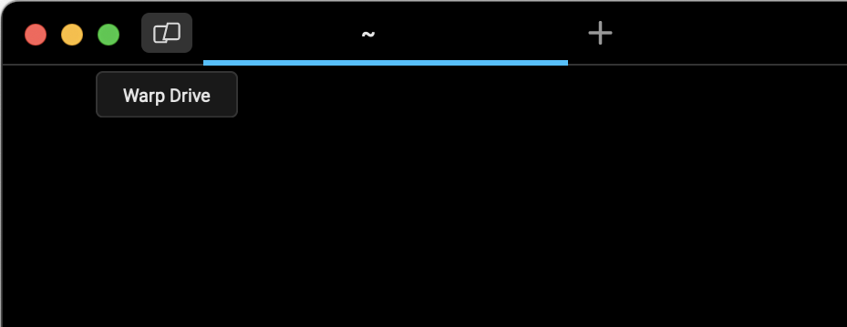
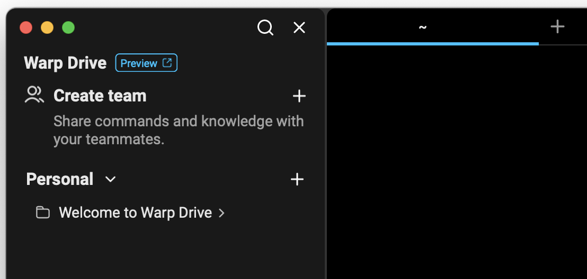
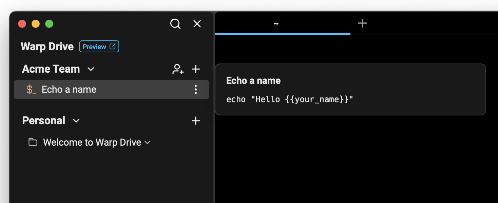
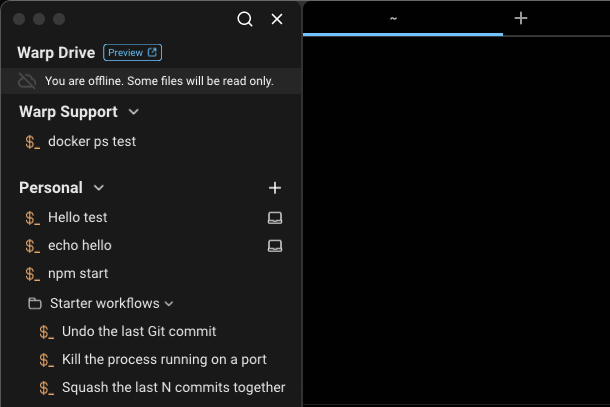
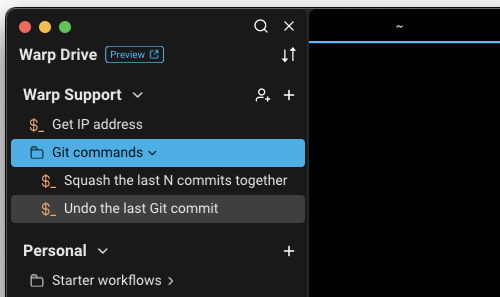
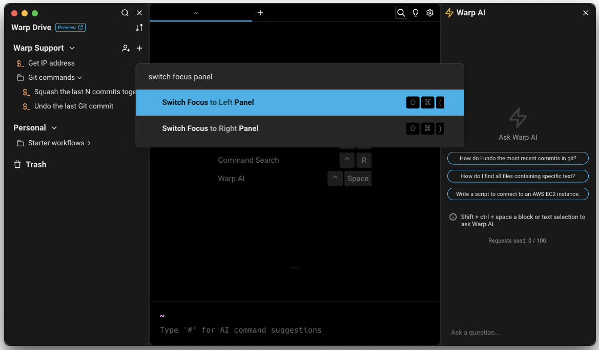
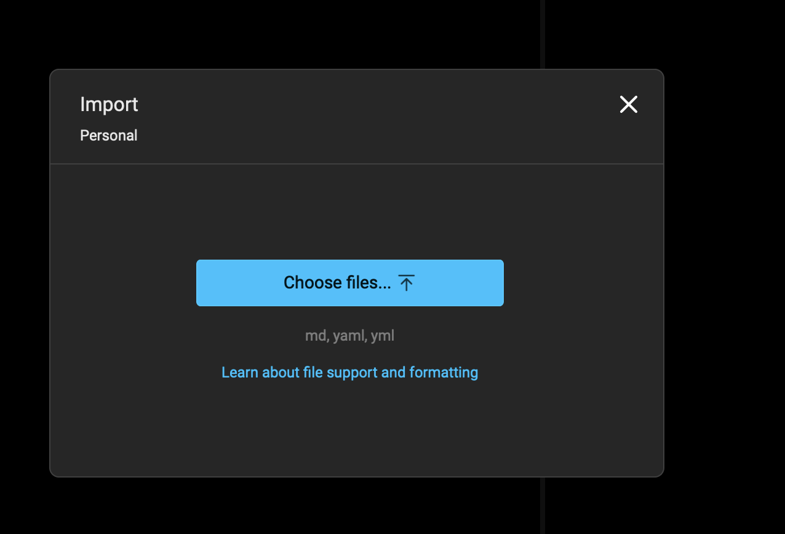
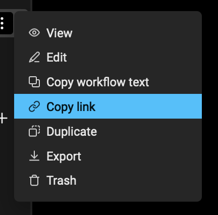
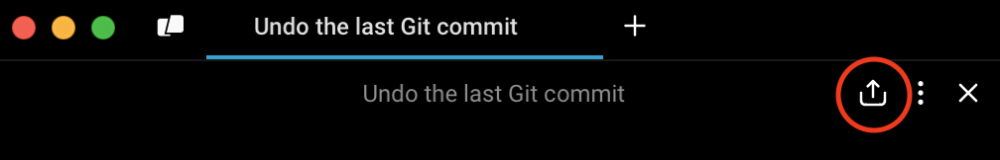
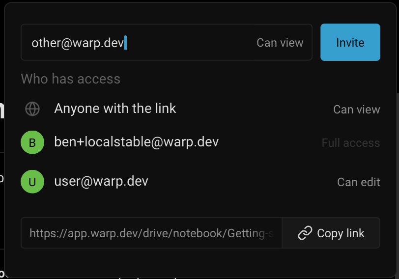

import { Tabs, TabItem } from '@astrojs/starlight/components';
import VideoEmbed from '@components/VideoEmbed.astro';

## What is Warp Drive?

All objects stored in Warp Drive sync immediately as they’re updated, so you and your team will always have access to the latest versions.

<VideoEmbed url="https://youtu.be/AGL0YcRj5-o" title="Warp Drive Overview" />

## How to access it

<Tabs>
  <TabItem label="macOS">
    Warp Drive is accessible from the status bar in Warp or you can toggle the Warp Drive side panel with `CMD-\`.
  </TabItem>
  <TabItem label="Windows">
    Warp Drive is accessible from the status bar in Warp or you can toggle the Warp Drive side panel with `CTRL-SHIFT-\`.
  </TabItem>
  <TabItem label="Linux">
    Warp Drive is accessible from the status bar in Warp or you can toggle the Warp Drive side panel with `CTRL-SHIFT-\`.
  </TabItem>
</Tabs>

## Workspaces in Warp Drive

When you open the Warp Drive panel, you will find a personal workspace where you can store your Workflows, Notebooks, Prompts, and Environment Variables and organize them into folders.

If you are a member of a team using Warp Drive, your team’s workspace will also be available in the side panel.

## Organizing objects in Warp Drive with your team

* Objects (e.g. Workflows, Notebooks, Prompts, and Environment Variables) and folders in Warp Drive can be sorted alphabetically and by the last updated
* Any objects moved from your personal workspace into a team’s workspace will be shared with all members of your team
* It is not currently possible to move an item back from a team’s workspace into a personal workspace; if you shared something inadvertently, you should copy the contents of the object to your clipboard, recreate it in your personal workspace, and then delete the object from your team workspace
* It is not currently possible to drag a folder of personal Workflows into a team workspace; you will need to move objects one at a time

## Using Warp Drive offline

In offline mode, some files will be read-only. You can still create and edit files while offline in your personal space. They will only be saved locally and will not be synced. They cannot be moved into a team or deleted until you are back online.

## Navigating Warp Drive with your keyboard

To avoid going back and forth between your mouse and keyboard, you can use your keyboard to navigate through Warp Drive once you have either opened Warp Drive or switched focus to the Warp Drive panel. (You can also click on a blank area within Warp Drive.) The object you are navigating with your keyboard will be highlighted in an accented color.

You can take these keyboard actions within Warp Drive:

<Tabs>
  <TabItem label="macOS">
    * Press `UP`/`DOWN` or `j`/`k` to navigate to the object you want.
    * Press `Enter` to 1) execute an object, 2) open/collapse a workspace or folder, or 3) open the trash.
    * Press `CMD-ENTER` to open an object’s context menu.
    * Press `CMD-SHIFT-(` and `CMD-SHIFT-)` to switch focus between the terminal and Warp Drive.
    * Press `LEFT-ARROW` to collapse a workspace or folder
    * Press `RIGHT-ARROW` to open a workspace or folder
    * Press `Esc` to return to Warp Drive from your trash.
  </TabItem>
  <TabItem label="Windows">
    * Press `UP`/`DOWN` or `j`/`k` to navigate to the object you want.
    * Press `Enter` to 1) execute an object, 2) open/collapse a workspace or folder, or 3) open the trash.
    * Press `CTRL-ENTER` to open an object’s context menu.
    * Press `CTRL-SHIFT-(` and `CTRL-SHIFT-)` to switch focus between the terminal and Warp Drive.
    * Press `LEFT-ARROW` to collapse a workspace or folder
    * Press `RIGHT-ARROW` to open a workspace or folder
    * Press `Esc` to return to Warp Drive from your trash.
  </TabItem>
  <TabItem label="Linux">
    * Press `UP`/`DOWN` or `j`/`k` to navigate to the object you want.
    * Press `Enter` to 1) execute an object, 2) open/collapse a workspace or folder, or 3) open the trash.
    * Press `CTRL-ENTER` to open an object’s context menu.
    * Press `CTRL-SHIFT-(` and `CTRL-SHIFT-)` to switch focus between the terminal and Warp Drive.
    * Press `LEFT-ARROW` to collapse a workspace or folder
    * Press `RIGHT-ARROW` to open a workspace or folder
    * Press `Esc` to return to Warp Drive from your trash.
  </TabItem>
</Tabs>

To switch between panels using your keyboard, you can use the “Switch Focus to Left Panel” and “Switch Focus to Right Panel” commands in the [Command Palette](/terminal/command-palette/).

## Import and Export

Every object in Warp Drive can be exported to or imported from a file. When importing or exporting, objects are converted as follows:

* [Workflows](/knowledge-and-collaboration/warp-drive/workflows/) import from and export to YAML (.yaml, .yml)
* [Prompts](/knowledge-and-collaboration/warp-drive/prompts/) import isn't supported at this time, but you can export to YAML (.yaml, .yml)
* [Notebooks](/knowledge-and-collaboration/warp-drive/notebooks/) import from and export to MARKDOWN (.md)
* [Environment Variables](/knowledge-and-collaboration/warp-drive/environment-variables/) import isn't supported at this time, but you can export to DOTENV (.env)

### Importing files into Warp Drive

To import a local file or directory, `RIGHT-CLICK` on a folder or click **+** on a workspace and choose "Import." If importing a directory, supported files in the directory and its sub-directories will be imported into a matching folder structure.

### Exporting files from Warp Drive

To export a single Warp Drive object, `RIGHT-CLICK` on an object and choose "Export" from the menu, then select a directory for export. To export all Warp Drive objects, Open the [Command Palette](/terminal/command-palette/#how-to-access-it), search for and select "Export all Warp Drive objects", then select a directory for export.

## Sharing your drive objects

Every object in Warp Drive can be shared. There are three ways to share objects:

* **Teams:** All members of a Warp team have full access to the objects in its Drive.
* **Direct Sharing:** Objects can be shared directly with individuals by email.
* **Link-based Sharing:** You can make an object public to anyone with the link, including those without Warp accounts.

### Sharing a drive object using links

To share a Drive object, navigate to the object's overflow menu, and choose "Copy link". Once the link is successfully copied to your clipboard, you can share it with teammates and reference your object in your codebase, documentation, or communication channels like Slack.

:::note
To access an object, link-followers must have permission to open it through one of the sharing methods above. If they do not have permission, they can automatically request access from the object owner or team admin.
:::

### Managing permissions

To manage a Drive object's permissions, navigate to its overflow menu and choose "Share". If the object is open, you can also use the [Command Palette](/terminal/command-palette/#how-to-access-it) and search for "Share pane", or click the share button in the pane header:

This opens a dialog that lists the current sharing settings and allows you to change them:

In this dialog, you can:

* Invite other users directly using the email input at the top.
* Change or remove the public link-based access level.
* Update the access level for individual users, or remove their access.

Permissions are inherited from parent folders. For example, if a folder was shared with edit permissions, then the user would also be able to edit all objects inside the folder or its subfolders.

Owners and their teammates always have full access. When sharing an object, you can choose between view and edit access.

|                                     | Can view | Can edit | Full access |
| ----------------------------------- | -------- | -------- | ----------- |
| Read a notebook                     | ✓        | ✓        | ✓           |
| Execute a Workflow                  | ✓        | ✓        | ✓           |
| Use env vars                        | ✓        | ✓        | ✓           |
| Edit contents                       |          | ✓        | ✓           |
| Create objects in a folder          |          | ✓        | ✓           |
| Trash or untrash                    |          | ✓        | ✓           |
| Delete permanently                  |          |          | ✓           |
| Modify permissions                  |          |          | ✓           |
| Move to a different folder or drive |          |          | ✓           |

## Troubleshooting Warp Drive

* If you were previously using Warp on your own and were later invited to join a team, you may need to exit, update, and restart the Warp app to gain access to your team’s shared drive and commands
* Navigating to Settings > Teams in Warp should also force a metadata update for you, which will ensure you have access to the latest versions of Workflows in your team's drive
