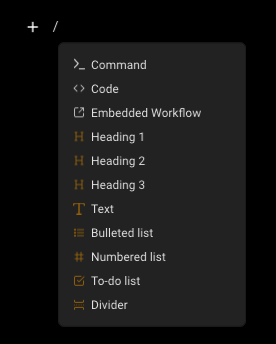
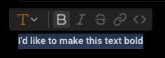
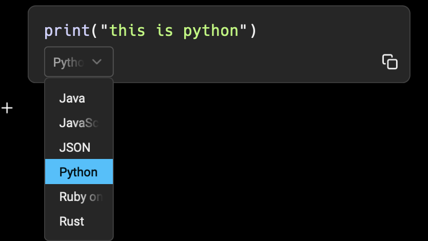
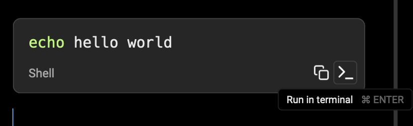
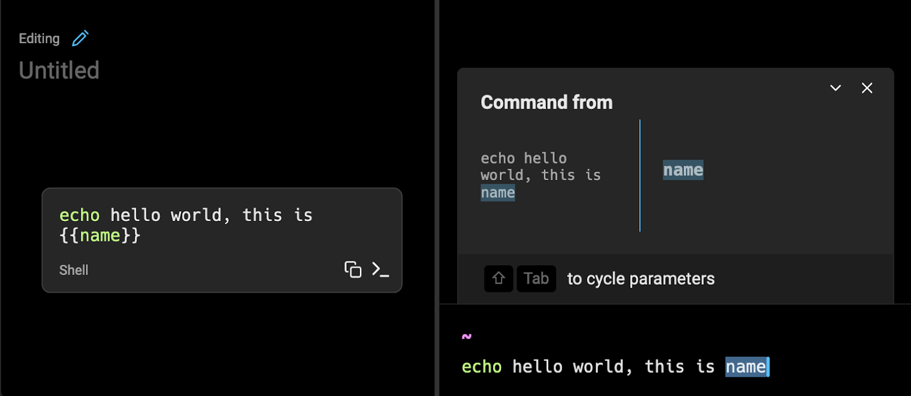
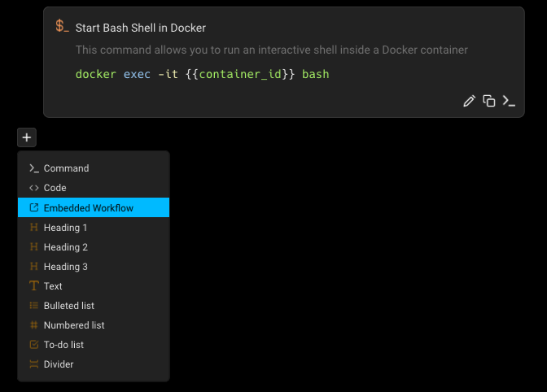

import { Tabs, TabItem } from '@astrojs/starlight/components';

### What is a Notebook?

Notebooks are runnable documentation consisting of markdown text and list elements, code blocks, and runnable shell snippets that can be automatically executed in your terminal session. Notebooks are searchable and accessible through the [Command Palette](/terminal/command-palette/) so you can access and run your documentation without ever leaving the terminal. You can also export Notebooks in .md format at any time.

### How to save and edit notebooks

You can create a new notebook from various entry points in Warp

<Tabs>
  <TabItem label="macOS">
    * From Warp Drive, + > New notebook
    * From the [Command Palette](/terminal/command-palette/), create a new team or personal notebook.
  </TabItem>
  <TabItem label="Windows">
    * From Warp Drive, + > New notebook
    * From the [Command Palette](/terminal/command-palette/), create a new team or personal notebook.
  </TabItem>
  <TabItem label="Linux">
    * From Warp Drive, + > New notebook
    * From the [Command Palette](/terminal/command-palette/), create a new team or personal notebook.
  </TabItem>
</Tabs>

Any of these entry points will open the notebook editor where you can:

* Title your notebook.
* Start adding text and code elements.

:::note
Note: The notebook will not be saved until either title or body text is added.
:::


### Working with Notebooks

#### Adding new elements

Notebook elements (text, code, list items) can be added in several ways:

* Using the appropriate markdown shortcut (e.g. ### for Heading 3).
* Typing /, which will open up a selection menu of supported elements.
* Pressing the + icon which appears when hovering over a line and selecting from the menu of supported elements.



#### Styling existing elements

Existing notebook elements can be styled in several ways:

* Selecting an existing element and selecting text decorations (like bold, italics, or inline code) from the hover menu.
* Using markdown syntax for text stylings like \*\*bold\*\* or \*italic\*.
* Selecting an existing element and changing the overall type of the element via the dropdown element menu.

<div data-full-width="true"></div>

#### Using Command and Code Blocks

Command and code blocks have several unique properties such as syntax highlighting and quick actions that make working with code-based documentation simple. You can create a code or command block by either:

* Selecting Command or Code from the new element menu
* Typing ` ``` ` (triple backticks)

Once you’ve inserted your code block you can select the language at the bottom of the block from numerous options which will apply the appropriate syntax highlighting if available (or default to Code if your language is not found). All code and command blocks will apply syntax highlighting and provide a quick copy button for easy access.



#### Special properties of command blocks

If you insert a Command block or specify the language as “Shell”, Warp provides extra functionality to simplify terminal work.

#### Executing Command Blocks

Developers can execute shell command blocks by:

<Tabs>
  <TabItem label="macOS">
    * Using the insert button at the bottom of the block
    * Pressing `CMD-ENTER` while the block is selected (a blue highlight will appear)
  </TabItem>
  <TabItem label="Windows">
    * Using the insert button at the bottom of the block
    * Pressing `CTRL-ENTER` while the block is selected (a blue highlight will appear)
  </TabItem>
  <TabItem label="Linux">
    * Using the insert button at the bottom of the block
    * Pressing `CTRL-ENTER` while the block is selected (a blue highlight will appear)
  </TabItem>
</Tabs>

The command text will be inserted into the developer’s active terminal session, or a new session if none are active.



#### Adding arguments to Command Blocks

Command blocks accept parameters in the same format as [Workflows](/knowledge-and-collaboration/warp-drive/workflows/). To add an argument to your command block, use `{{double_curly_brackets}}` to specify your argument term.



#### Navigating command blocks with the keyboard

Command Blocks also support keyboard navigation. There are two ways to enter the keyboard navigation mode:

<Tabs>
  <TabItem label="macOS">
    * Clicking on a shell block.
    * Pressing `CMD-UP` or `CMD-DOWN.`

    Once a command block is selected, press `CMD-ENTER` to insert it into the terminal input. You can also use `UP, DOWN, CMD-UP`, and `CMD-DOWN` to navigate between command blocks. While the Notebook is focused, press `CMD-L` to switch focus back to the terminal without inserting a command.
  </TabItem>
  <TabItem label="Windows">
    * Clicking on a shell block.
    * Pressing `CTRL-UP` or `CTRL-DOWN.`

    Once a command block is selected, press `CTRL-ENTER` to insert it into the terminal input. You can also use `UP, DOWN, CTRL-UP,` and `CTRL-DOWN` to navigate between command blocks. While the Notebook is focused, press `CTRL-L` to switch focus back to the terminal without inserting a command.
  </TabItem>
  <TabItem label="Linux">
    * Clicking on a shell block.
    * Pressing `CTRL-UP` or `CTRL-DOWN.`

    Once a command block is selected, press `CTRL-ENTER` to insert it into the terminal input. You can also use `UP, DOWN, CTRL-UP,` and `CTRL-DOWN` to navigate between command blocks. While the Notebook is focused, press `CTRL-L` to switch focus back to the terminal without inserting a command.
  </TabItem>
</Tabs>

#### Adding existing Workflows to notebooks

If you have existing [Workflows](/knowledge-and-collaboration/warp-drive/workflows/) that you’d like to insert into your notebook rather than duplicating their content, you can select Embedded Workflow from the new element menu and select from the available Workflows. Once embedded in a notebook, the workflow will be executable like a regular command block. To edit the content of the embedded workflow, you will need to edit the source workflow which can be found by searching for the title in the [Command Palette](/terminal/command-palette/).



### Working with Notebooks in a team

If the notebook is shared with a team, all team members will have access to edit the notebook and updates will sync immediately for all members of the team.

:::note
Note that only one editor is allowed at a given time. Opening the notebook while there is an active editor will open the notebook in Viewing mode. Your mode (view vs edit) can be toggled above the notebook’s title.
:::


### Import and export notebooks in Warp Drive

Please see our [Warp Drive Import and Export](/knowledge-and-collaboration/warp-drive/#import-and-export) instructions.
