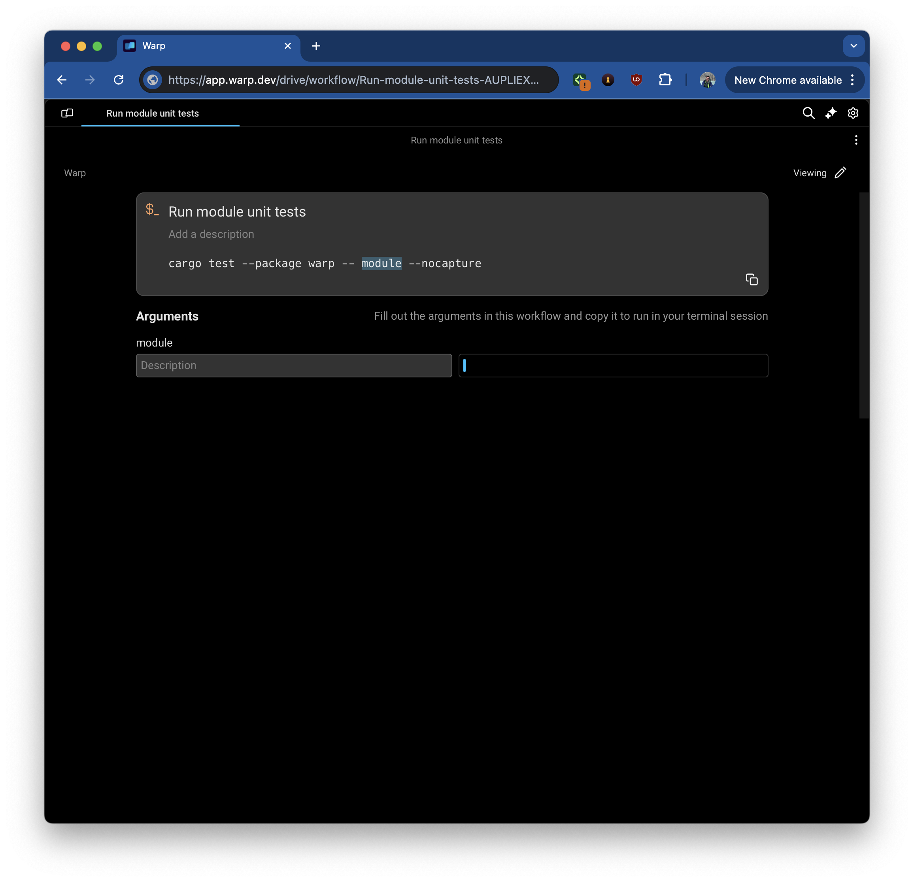
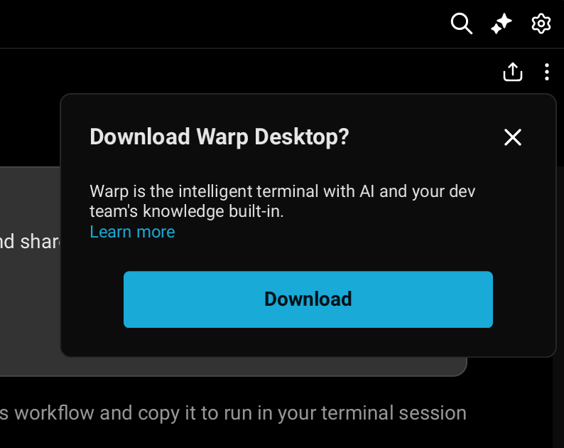
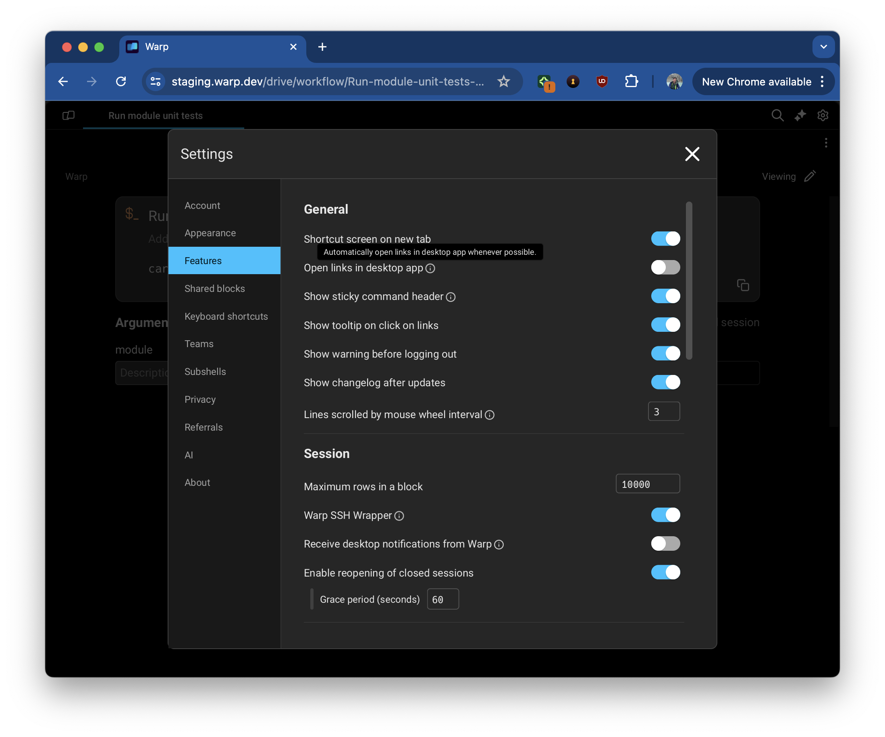
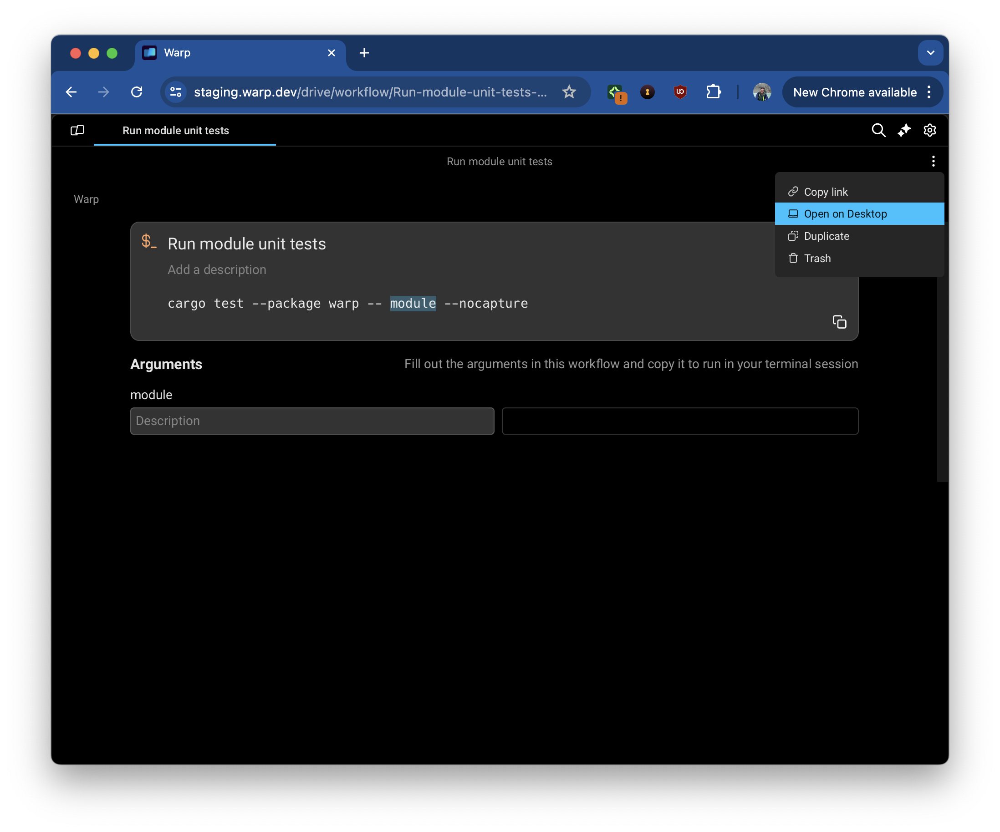
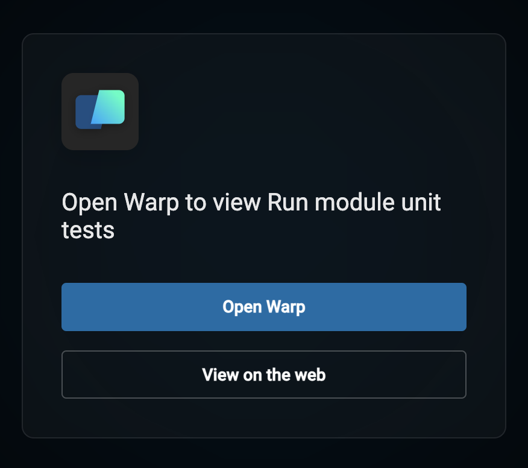

## What is Warp on the web?

Warp Drive on the Web lets you view and edit your Warp Drive objects and shared sessions directly in the browser, on any device.

## How to access Warp on the web

Warp's web-based viewing experience can currently be accessed via:

* The [`app.warp.dev/app` homepage](https://app.warp.dev/app)
* [Drive Object](/knowledge-and-collaboration/warp-drive/#sharing-your-drive-objects) Links
* [Session Sharing](/knowledge-and-collaboration/session-sharing/#how-to-allow-access-to-collaborators-in-your-session) Links

:::caution
You can edit and view web-based objects and sessions as normal. The one exception is executing a command from a workflow or notebook since there is no shell session running on the web.
:::

## Managing your view preferences - web or desktop

If the Warp app is installed, links will open on the desktop by default. You can manage whether Warp links open in Warp's desktop app or the browser in multiple ways:

:::note
The desktop option is only presented if Warp's web service is able to detect the Warp app installed locally. Warp desktop opens localhost port 9277 to accomplish this detection. This is done in a separate process that does not have access to your terminal contents.\
\
If you would like to use Warp locally and do not have it installed, please visit our [installation guide.](/getting-started/quickstart/installation-and-setup/)
:::

1. The first time you follow a link, if Warp is not installed, you will be prompted to download it. You can dismiss the popup to stay on the web.

2.  This preference can be changed at any point in **Settings** > **Features** > **General** > **Open links in desktop app** Note that this setting is only available while on the web-based version of Warp.

    
3. You can always switch between web and desktop views on a case-by-case basis.
   1.  To switch from a web-view to Desktop for a given object, open the _overflow menu > Open link on Desktop._

       
   2.  To stay on the web for a given object despite a global Desktop preference, follow the _View on the web_ option that is part of the redirect screen to Desktop.

       

## Supported Browsers

Warp on the web supports all modern browsers, including:

**Desktop**

* Chrome
* Firefox
* Safari

**Mobile**

* iOS Safari 15+
* Android Chrome 58+
* Samsung Internet 7.2+

:::note
These mobile browser versions are the minimum required for WebGL 2.0 support. Most up-to-date devices meet these requirements.
:::

## Touch screen and mobile support

Warp supports all touch screen devices, including mobile phones, tablets, and touch-enabled laptops. Touch input works on both the web and the desktop app.

### Supported gestures

* **Touch and scroll** - Vertical and horizontal scrolling work as expected
* **Double tap** - Select text or elements
* **Long press (hold)** - Open context menu (equivalent to right-click)

## Related features

* [Warp Drive](/knowledge-and-collaboration/warp-drive/) - Store and share workflows, prompts, and environment variables
* [Session Sharing](/knowledge-and-collaboration/session-sharing/) - Collaborate with others in real-time terminal sessions
