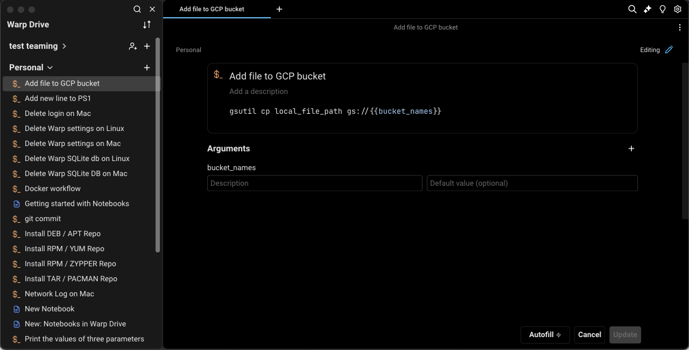
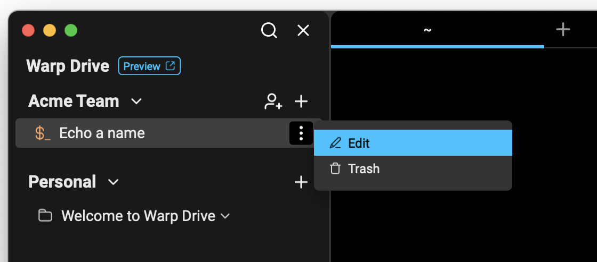
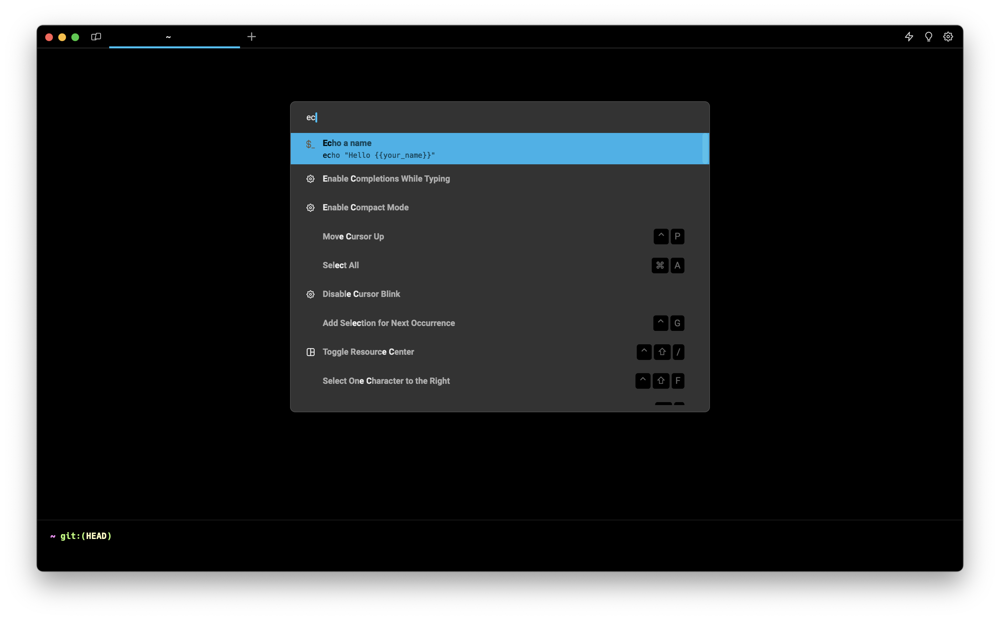
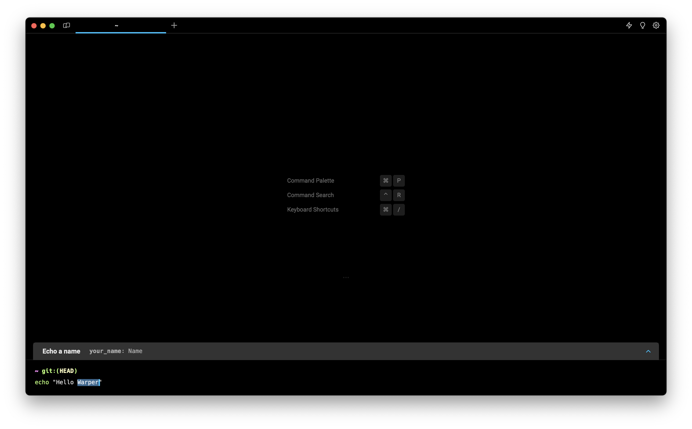

import DemoVideo from '@components/DemoVideo.astro';
import VideoEmbed from '@components/VideoEmbed.astro';

## What is a workflow?

A workflow is a parameterized command you can name and save in Warp with descriptions and arguments. Workflows are searchable and easily accessed from the [Command Palette](/terminal/command-palette/) so you can find and execute them without switching contexts.

## How to save and edit workflows

You can create a new workflow from various entry points in Warp:

* From Warp Drive, + > New workflow
* Using Block Actions, Save as Workflow
* From Oz agent results, Save as Workflow
* From the [Command Palette](/terminal/command-palette/), Create a New Personal Workflow

Any of these entry points will open the workflow editor where you can:

* Name your workflow
* Edit the command along with any arguments (also known as parameters)
* Add a meaningful description that will be indexed for search (optional)
* Add arguments, descriptions for arguments, and default values (optional)

<VideoEmbed url="https://www.youtube.com/watch?v=8UmreUTTrkg&start=9s&end=198s" title="Save Workflow Demo" />

### Working with arguments

In the workflow editor, you can add arguments manually with "New argument" or by typing in double curly braces (`{{argument}}`) within the command field. If you select "New argument" while you have text selected, Warp will wrap that text in curly braces to create an argument.

There are some rules for creating valid arguments:

* Argument names can only include characters `A-Za-z0-9`, hyphens `-` and underscores `_`
* The first character of an argument cannot be a number

Arguments can be one of two types: text or enum. By default, all new arguments are text type.

#### Enum type arguments

Enums allow you to specify expected inputs to a workflow argument. When you insert a workflow with enums into the input editor, you will be prompted with suggestions for filling in the argument. You can open the suggestions menu by pressing `SHIFT-TAB` while selecting an argument.

<VideoEmbed url="https://www.loom.com/share/b2f54eeef2f247a8bbcf87698b2a4287?hideEmbedTopBar=true&hide_owner=true&hide_share=true&hide_title=true" title="Enum Input Suggestions Demo" />

To create an enum type argument:

1. Navigate to the "default value" field of an argument.
2. Select the "Enum" type.
3. Click "New" to create a new enum, or select an existing one from the dropdown menu.
4. If you selected "New", you can choose to create a "Static" enum or "Dynamic" enum. Dynamic enums are associated with a shell command whose output is parsed to determine the set of valid values for that argument.

<VideoEmbed url="https://www.loom.com/share/b429ab7f7014418e9591e505fd71af83?hideEmbedTopBar=true&hide_owner=true&hide_share=true&hide_title=true" title="Enum Creation Demo" />

### Working with aliases

Workflow aliases allow you to create personalized shortcuts and custom configurations for your frequently used workflows. These aliases provide enhanced flexibility in how you use and configure workflows. Aliases are personal to your account, not shared with everyone who has the workflow. If settings sync is enabled, they'll be synced across devices logged in to your account. Aliases can set default values for each [argument](/knowledge-and-collaboration/warp-drive/workflows/#working-with-arguments), but don't have to. Aliases can have [Environmental Variables](/knowledge-and-collaboration/warp-drive/environment-variables/) associated with them.

:::note
Workflow aliases are not compatible with [YAML Workflows](/terminal/entry/yaml-workflows/). They can only be used with Workflows created in [Warp Drive](/knowledge-and-collaboration/warp-drive/).
:::

### Editing workflows

Once a workflow has been created, you can edit it at any time, as long as you have access to an internet connection.

#### AI Autofill

Workflows also have the option to use an [Oz agent](/agent-platform/local-agents/overview/) to automatically generate a title, descriptions, or parameters.

* Create or edit a Workflow, in the edit view you should see the option to AutoFill.
* Warp will fill in the fields based on the Workflow you're creating.

<DemoVideo src="/assets/terminal/Edit-workflows-autofill.mp4" label="Edit Workflows - Autofill" />

### Editing workflows with a team

If the workflow is shared with a team, all team members will have access to edit the workflow and updates will sync immediately for all members of the team.

If a workflow in the Warp Drive has been edited by another team member or a user on another device while you are attempting to edit the same workflow, you will not be able to save changes; you will need to check out the latest version and try again.

## How to execute workflows

You can execute a workflow in several ways:

* From Warp Drive, click the workflow
* From the [Command Palette](/terminal/command-palette/), search for a workflow you’d like to execute, click or select, and enter
* From [Command Search](/terminal/entry/command-search/), search for a workflow you'd like to execute, click or select, and enter.
* When a workflow is selected, you can use `SHIFT-TAB` to cycle through the arguments.

:::note
When you create two or more arguments with the same name, Warp automatically selects and puts multiple cursors over the arguments in the input editor so they are synced.\
\
Also, tailor your Command Search experience by toggling off "Show Global Workflows" in **Settings** > **Features**. When disabled, your search will exclusively encompass YAML and Warp Drive Workflows.
:::

These options will paste the workflow into your active terminal input. Workflow names and any relevant descriptions and arguments will be displayed in a dialog, so you can understand how to use the workflow.

You make any adjustments you need to the arguments (or the command itself) before running the command in your input editor.

<VideoEmbed url="https://www.youtube.com/watch?v=8UmreUTTrkg&start=344s&end=370s" title="Running Workflow Demo" />

## Support for YAML Workflows

Warp will indefinitely support the [YAML Workflows](/terminal/entry/yaml-workflows/), which includes personal and community workflows sourced from an open-source repository.

If needed, you can continue to access your `.yaml` file workflows using [Command Search](/terminal/entry/command-search/) or the [Command Palette](/terminal/command-palette/). However, these file-based workflows will not be available to access, organize, or share in Warp Drive.

### Import and export workflows in Warp Drive

Please see our [Warp Drive Import and Export](/knowledge-and-collaboration/warp-drive/#import-and-export) instructions.
