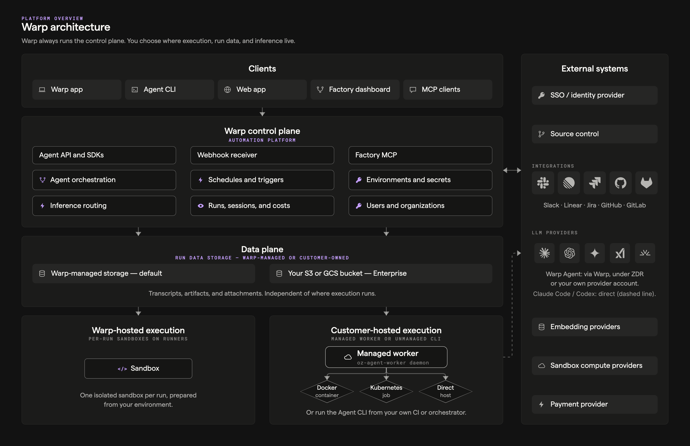
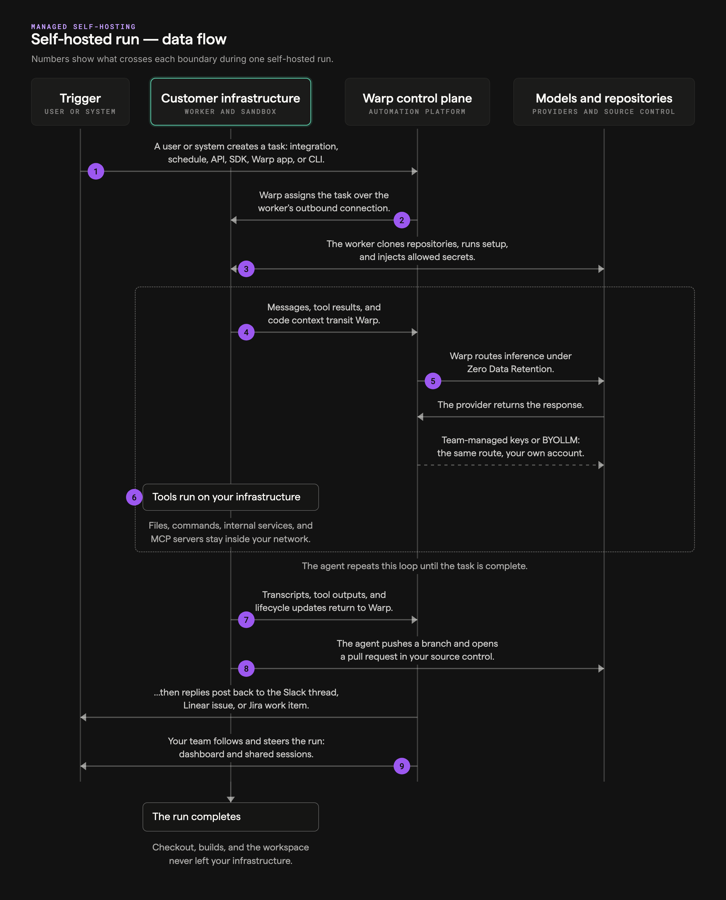

import { VARS } from '@data/vars';

This page describes how the {VARS.WARP_AUTOMATION_PLATFORM} is put together and how data moves through it. Each section pairs a diagram with a numbered walkthrough. Use it to evaluate the platform, plan a deployment, or answer security questions.

The diagrams describe the Warp-operated platform. Deployment choices such as [self-hosted execution](/platform/self-hosting/), [Bring Your Own LLM](/enterprise/enterprise-features/bring-your-own-llm/), and customer-owned storage move specific boundaries; each section notes where those options apply.

## Stack overview

The platform splits into a small number of layers: clients that people and programs use, a Warp-operated control plane that coordinates everything, execution planes where agents actually run, and the external systems agents read from and write to.

1. **Clients** - The surfaces that start and observe work: the Warp app, the {VARS.WARP_AGENT_CLI}, the web app and cloud agent dashboard, the [factory dashboard](/factories/factory-dashboard/) (the control room in the diagram), and MCP clients connected through the [Factory MCP](/factories/factory-mcp/). All clients talk to the same control plane APIs.
2. **APIs** - The control plane's entry points: the REST [Agent API and SDKs](/reference/api-and-sdk/), a webhook receiver for [integration](/platform/integrations/) events, and the hosted Factory MCP endpoint.
3. **Control plane services** - The coordination layer. Agent orchestration owns run workflows and state; triggers evaluate [schedules](/platform/triggers/scheduled-agents/) and automations; identity and configuration manage teams, [secrets](/platform/secrets/), [environments](/platform/environments/), and [runners](/platform/runners/); inference routing brokers every model call; and run history, sessions, and costs keep every run observable. Run data — transcripts and selected outputs — is retained by Warp, with an optional export copy to customer-owned S3 or GCS on Enterprise plans.
4. **Warp-hosted execution** - The default execution plane. Each cloud agent run gets an isolated, per-run sandbox provisioned on a runner's compute shape (OS, architecture, vCPUs, memory), with the workspace prepared from an environment. See [Warp-hosted execution](/platform/warp-hosting/).
5. **Customer-hosted execution** - The Enterprise execution plane on your infrastructure. A managed worker (the `oz-agent-worker` daemon) connects outbound and executes tasks in Docker containers, Kubernetes Jobs, or directly on the host; unmanaged setups run the {VARS.WARP_AGENT_CLI} inside your own CI or orchestrator. See [Self-hosting](/platform/self-hosting/).
6. **External systems** - Everything the platform integrates with: your SSO or identity provider for authentication, source control (GitHub, GitLab, Bitbucket, Azure DevOps), integration providers (Slack, Linear, Jira), LLM providers under [Zero Data Retention](/enterprise/security-and-compliance/security-overview/#zero-data-retention-zdr) (Anthropic, OpenAI, Google, xAI, Fireworks), embedding providers, the compute providers that host Warp-hosted sandboxes, and billing.

## Cloud agent run lifecycle

Every cloud agent run follows the same lifecycle, no matter what started it or where it executes. A trigger creates a task, the Warp control plane resolves its configuration and dispatches it to an execution host, the agent works in a loop until it's done, and the run leaves durable records behind. The numbers in the diagram match the steps below.

1. **A trigger fires** - Work starts from a [schedule](/platform/triggers/scheduled-agents/), an [integration](/platform/integrations/) event such as a Slack mention or GitHub comment, an [API or SDK](/reference/api-and-sdk/) call, a CLI command like `oz agent run-cloud`, or a [Handoff](/platform/handoff/) from the Warp app.
2. **The task is created** - The control plane opens a run record that tracks the task's state, inputs, and provenance for its entire life.
3. **Configuration is resolved** - The platform determines the run's [environment](/platform/environments/), [runner](/platform/runners/) shape, execution host (Warp-hosted or a self-hosted worker), and [model and harness](/platform/harnesses/).
4. **The sandbox is provisioned** - The execution host prepares an isolated workspace on the runner's compute: it clones the environment's repositories with scoped repository credentials, runs setup commands, and injects only the [secrets](/platform/secrets/) the run is allowed to use.
5. **The agent loop runs** - The harness repeats a cycle until the task is done: gather context, call the model, and run tools (files, commands, MCP servers, and optionally [computer use](/agents/capabilities/computer-use/)). Every model call routes through Warp's inference routing to LLM providers under [Zero Data Retention](/enterprise/security-and-compliance/security-overview/#zero-data-retention-zdr), with known secret values redacted in transit. Tool calls execute inside the sandbox, not on Warp's control plane.
6. **Outputs land at their targets** - The agent pushes branches and opens pull requests on your source control, and posts replies back to the Slack thread, Linear issue, or Jira work item that started the task.
7. **The run record persists** - Transcripts, artifacts, and cost data attach to the run record, encrypted at rest.
8. **The team has visibility** - Anyone authorized can follow the run in the {VARS.DASHBOARD} or attach to it with [Agent Session Sharing](/agents/local-agents/session-sharing/) to monitor and steer while it's live.
9. **The sandbox tears down** - When the run ends, the platform captures a [workspace snapshot](/platform/handoff/snapshots/) so the work can be continued later — in the cloud or [handed off](/platform/handoff/) to a local session — and then destroys the sandbox.

Self-hosted runs follow the same lifecycle; steps 4 through 6 execute on your managed worker instead of a Warp-hosted sandbox. See [Self-hosted execution flow](#self-hosted-execution-flow) for that variant.

### Sequence view

The same lifecycle as a request/response sequence between the trigger, the per-run sandbox, the Warp control plane, and providers:

## Self-hosted execution flow

Self-hosted execution keeps checkout, commands, and the sandbox filesystem on your infrastructure while the {VARS.WARP_AUTOMATION_PLATFORM} keeps orchestrating, observing, and routing inference. The split is a worker daemon that dials out to Warp — no inbound firewall ports — and executes tasks locally. The numbers in the diagram match the steps below.

1. **The worker connects and waits for work** - You run the managed worker (the `oz-agent-worker` daemon) on your infrastructure. It authenticates to Warp with an agent API key and holds an outbound-only connection, waiting for tasks routed to its [`--host`](/platform/self-hosting/#routing-runs-to-self-hosted-workers) ID.
2. **Warp delivers the task** - When a Slack mention, Linear or Jira event, schedule, API call, or `oz agent run-cloud` command targets your worker, the control plane sends the task with its resolved configuration and scoped runtime credentials over that same encrypted connection.
3. **The task executes on your backend** - The worker prepares the workspace from the run's [environment](/platform/environments/) — cloning repositories from your source control, running setup, and injecting allowed [secrets](/platform/secrets/) — then executes in a Docker container, a Kubernetes Job, or directly on the host, depending on the [backend](/platform/self-hosting/#managed-architecture) you chose. Code, build artifacts, and execution workspaces stay on your machines.
4. **Results stream back to the control plane** - Status, transcripts, artifacts, attachments, and telemetry flow to Warp for the run record. Content the agent puts into prompts, results, or transcripts can include code context, so review [security and networking](/platform/self-hosting/security-and-networking/) if that matters for your data classification.
5. **Inference routes through Warp** - The agent's model calls go from your worker to Warp's inference routing and on to LLM providers under [Zero Data Retention](/enterprise/security-and-compliance/security-overview/#zero-data-retention-zdr), with known secret values redacted in transit. Enterprise teams can route inference through their own provider accounts with [Bring Your Own LLM](/enterprise/enterprise-features/bring-your-own-llm/).
6. **Your team watches from the usual surfaces** - Runs on self-hosted workers appear in the {VARS.DASHBOARD} and support [Agent Session Sharing](/agents/local-agents/session-sharing/), the same as Warp-hosted runs.

### Self-hosted sequence view

The same flow as a request/response sequence between your infrastructure, the Warp control plane, and providers:

1. **Create task** - A trigger fires: an integration event, a schedule, an API or SDK call, a CLI command, or a Handoff.
2. **Assign task** - The control plane delivers the task over the worker's authenticated WebSocket, with resolved configuration and scoped runtime credentials.
3. **Prepare workspace** - The worker clones repositories with scoped credentials, runs setup commands, and injects allowed secrets.
4. **Prompt and context** - The agent gathers context inside the sandbox and sends it for inference.
5. **Inference** - Model calls route through Warp to LLM providers under ZDR with secrets redacted; [Bring Your Own LLM](/enterprise/enterprise-features/bring-your-own-llm/) can route eligible calls through your own provider account instead.
6. **Run tools** - Tool calls execute locally: files, commands, internal services, and MCP servers.
7. **Results** - Transcripts, artifacts, and telemetry stream back to the run record.
8. **Outputs** - The agent pushes branches and opens pull requests on your source control.
9. **Observability** - Your team follows and steers the run from the dashboard and shared sessions; teardown captures a workspace snapshot for handoff.

## Warp Factories work-item flow

A software factory assembles the {VARS.WARP_AUTOMATION_PLATFORM}'s primitives — runs, environments, runners, integrations, and secrets — into one measurable workflow. Work enters from the tools your team already uses, a foreman coordinates specialized agents through the stages each work item needs, and a human makes the final call.

1. **Work sources** - Work items arrive from [Slack](/factories/integrations/slack/), [GitHub](/factories/integrations/github/), [GitLab](/factories/integrations/gitlab/), [Linear](/factories/integrations/linear/), or [Jira](/factories/integrations/jira/), from local coding agents through the [Factory MCP](/factories/factory-mcp/), or from direct runs and schedules.
2. **Automations** - Each provider event runs through [automations](/factories/automations/), whose filters decide which events start work and which agent handles them. Schedules fire automations on a timer; direct requests skip this step and go straight to the foreman.
3. **The foreman** - The factory's coordinator holds one continuous conversation per work item, decides which stage the work needs next, dispatches the right agent, relays questions to the requester, and pauses at human checkpoints. See [factory agents](/factories/factory-agents/).
4. **Stage agents** - Triage scopes the request and gathers evidence, Spec writes product and technical specifications in a draft pull request (a human approves the spec by default), Implement writes the code with tests and visual evidence, and Review checks the result with fresh eyes and returns an advisory verdict. Review can send work back to Implement for revision, and the foreman skips stages the work doesn't need.
5. **Human handoff** - The factory presents the finished pull request with its evidence and posts results back at the source. Agents never merge; your repository permissions and branch protection govern who does.
6. **The factory definition** - Version-controlled files — `factory.yaml` plus `agents/`, `automations/`, `runners/`, and `skills/` directories — define the whole factory. Definitions are Warp-managed or live in a GitHub repository your team owns, where changes arrive as reviewed pull requests. See [definitions as code](/factories/factory-as-code/).
7. **Platform execution** - Every stage runs as a cloud agent run: in a Warp-hosted sandbox or on a [self-hosted worker](/platform/self-hosting/), with the workspace from the factory's repositories and compute from its [runners](/platform/runners/). Each role can use its own model and [harness](/platform/harnesses/) — the Warp Agent, Claude Code, or Codex.
8. **The factory dashboard** - The Warp Factories web app (the control room in the diagram) shows the factory's metrics (autonomy, PR cycle time, cost per PR), work items by stage, runs, costs, and definition files. See the [factory dashboard](/factories/factory-dashboard/).
9. **The outer loop** - [Scorers](/factories/measure-and-improve/) judge completed work against your criteria, benchmarks compare model, harness, and runner configurations, and Self-improvement turns repeated failures into follow-up pull requests against the application code or the factory definition itself. Nothing is adopted without your review.

## Data security and boundaries

Every run moves a few distinct classes of data, and each class has its own boundary. This section maps them across the three zones involved: your infrastructure, the Warp platform, and model providers. All communication is encrypted in transit (TLS 1.2+), all stored data is encrypted at rest (AES-256), and known secret values are redacted at output boundaries.

1. **Source code** - For Warp-hosted runs, repositories are cloned into an isolated per-run sandbox and destroyed with it; Warp does not persistently store your source code or train on it. For [self-hosted execution](/platform/self-hosting/), checkout and the workspace stay on your infrastructure, and the worker's connection to Warp is outbound-only. Either way, code context the agent puts into prompts and transcripts still transits Warp.
2. **Prompts and context** - The agent's model calls route through Warp's inference routing to LLM providers under [Zero Data Retention](/enterprise/security-and-compliance/security-overview/#zero-data-retention-zdr) agreements: providers don't retain or train on the traffic, except for provider-specific models the ZDR terms don't cover.
3. **Run data** - Transcripts, artifacts, run metadata, and costs persist in Warp's stores, encrypted at rest and access-controlled by your team's roles. Enterprise teams can additionally export the supported classes — transcripts, artifacts, and run attachments — to a customer-owned Amazon S3 or Google Cloud Storage bucket; Warp retains the primary run record, configuration, and other control-plane state.
4. **Execution secrets** - [Managed secrets](/platform/secrets/) are stored encrypted and injected into the sandbox at runtime, scoped by allowlist to the runs that need them. [Secret redaction](/support-and-community/privacy-and-security/secret-redaction/) at output boundaries is a backstop, not a substitute for narrow scopes and rotation.
5. **Inference credentials** - Model provider keys are used only at the inference boundary and are never injected into sandboxes. With [Bring Your Own LLM](/enterprise/enterprise-features/bring-your-own-llm/), inference routes through your own provider account, so billing and provider-side retention follow your contract.
6. **Repository identity** - Agents check out and push with scoped repository credentials, and pull requests are attributed to the creating user or to the agent itself depending on the configured [credential strategy](/factories/factory-as-code/#credentialstrategy). Branch protection and repository permissions apply as usual.

### With self-hosted execution

[Self-hosted execution](/platform/self-hosting/) moves the execution boundary: checkout, builds, and command execution stay on your infrastructure, and no Warp-hosted sandbox is involved. The control plane still holds orchestration, session data, run records, and inference routing, and an optional customer-owned bucket can hold an exported copy of run data.

## Related pages

* [Deployment patterns](/platform/deployment-patterns/) - Choose between CLI-only, Warp-hosted, and self-hosted deployments.
* [Self-hosting overview](/platform/self-hosting/) - Managed vs unmanaged architectures and setup guides.
* [Self-hosting security and networking](/platform/self-hosting/security-and-networking/) - The data model and egress requirements for self-hosted workers.
* [Security overview](/enterprise/security-and-compliance/security-overview/) - Warp's data handling, encryption, and compliance posture.
* [How Warp Factories work](/factories/how-factories-work/) - The work-item lifecycle in depth.
* [Warp Factories infrastructure and security](/factories/infrastructure-and-security/) - The same boundaries applied to factories.
