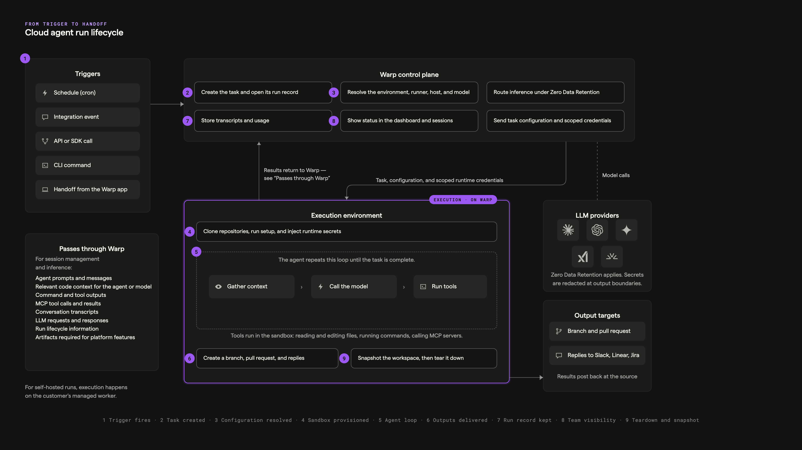
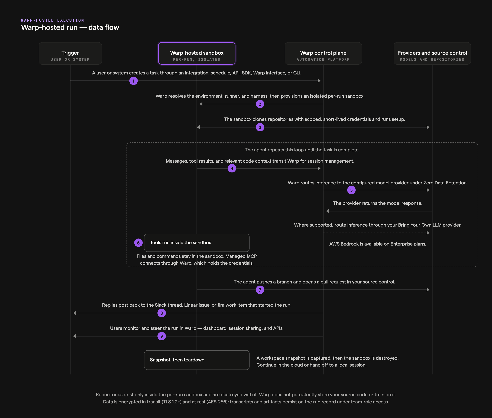

import { VARS } from '@data/vars';

Every cloud agent run follows the same lifecycle, no matter what started it or where it executes. A trigger creates a task, the Warp control plane resolves its configuration and dispatches it to an execution host, the agent works in a loop until it's done, and the run leaves durable records behind. The numbers in the diagram match the steps below.

## How a run works

1. **A trigger fires** - Work starts from a [schedule](/platform/triggers/scheduled-agents/), an [integration](/platform/integrations/) event such as a Slack mention or GitHub comment, an [API or SDK](/reference/api-and-sdk/) call, a CLI command like `oz agent run-cloud`, or a [Handoff](/platform/handoff/) from the Warp app.
2. **The task is created** - The control plane opens a run record that tracks the task's state, inputs, and provenance for its entire life.
3. **Configuration is resolved** - The platform determines the run's [environment](/platform/environments/), [runner](/platform/runners/) shape, execution host (Warp-hosted or a self-hosted worker), and [model and harness](/platform/harnesses/).
4. **The sandbox is provisioned** - The execution host prepares an isolated workspace on the runner's compute: it clones the environment's repositories with scoped repository credentials, runs setup commands, and injects only the [secrets](/platform/secrets/) the run is allowed to use.
5. **The agent loop runs** - The harness repeats a cycle until the task is done: gather context, call the model, and run tools (files, commands, MCP servers, and optionally [computer use](/agents/capabilities/computer-use/)). Every model call routes through Warp's inference routing to LLM providers under [Zero Data Retention](/enterprise/security-and-compliance/security-overview/#zero-data-retention-zdr), with known secret values redacted in transit. Tool calls execute inside the sandbox, not on Warp's control plane.
6. **Outputs land at their targets** - The agent pushes branches and opens pull requests on your source control, and posts replies back to the Slack thread, Linear issue, or Jira work item that started the task.
7. **The run record persists** - Transcripts, artifacts, and cost data attach to the run record, encrypted at rest.
8. **The team has visibility** - Anyone authorized can follow the run in the {VARS.DASHBOARD} or attach to it with [Agent Session Sharing](/agents/local-agents/session-sharing/) to monitor and steer while it's live.
9. **The sandbox tears down** - When the run ends, the platform captures a [workspace snapshot](/platform/handoff/snapshots/) so the work can be continued later — in the cloud or [handed off](/platform/handoff/) to a local session — and then destroys the sandbox.

Self-hosted runs follow the same lifecycle; steps 4 through 6 execute on your managed worker instead of a Warp-hosted sandbox. See the [self-hosted execution flow](/platform/architecture/self-hosted-execution/) for that variant.

## Sequence view

The same lifecycle as a request/response sequence between the trigger, the per-run sandbox, the Warp control plane, and providers:

## Related pages

* [Stack overview](/platform/architecture/stack-overview/) - The components this lifecycle moves through.
* [Multi-agent orchestration](/platform/orchestration/) - How parent runs coordinate child runs.
* [Managing cloud agents](/platform/managing-cloud-agents/) - Start, monitor, and manage runs day to day.
