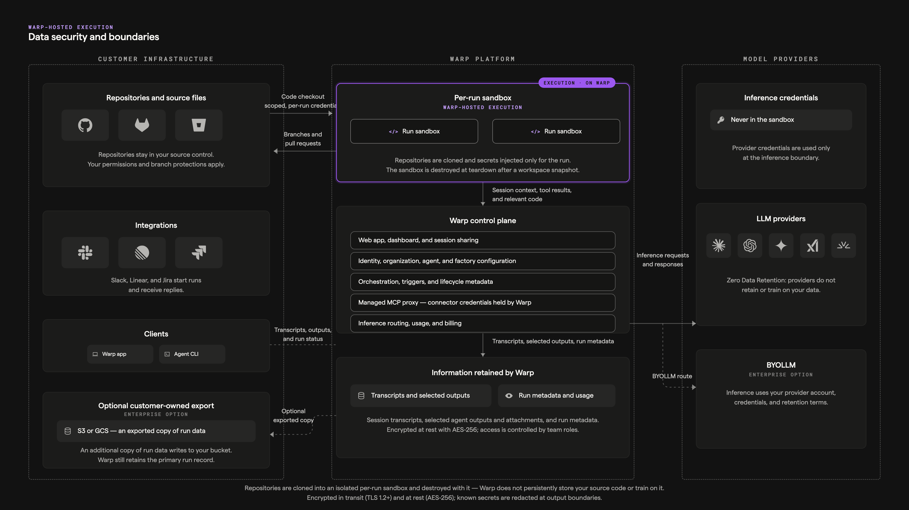

import { VARS } from '@data/vars';

Every run moves a few distinct classes of data, and each class has its own boundary. This page maps them across the three zones involved: your infrastructure, the Warp platform, and model providers. All communication is encrypted in transit (TLS 1.2+), all stored data is encrypted at rest (AES-256), and known secret values are redacted at output boundaries.

## The data classes

1. **Source code** - For Warp-hosted runs, repositories are cloned into an isolated per-run sandbox and destroyed with it; Warp does not persistently store your source code or train on it. For [self-hosted execution](/platform/self-hosting/), checkout and the workspace stay on your infrastructure, and the worker's connection to Warp is outbound-only. Either way, code context the agent puts into prompts and transcripts still transits Warp.
2. **Prompts and context** - The agent's model calls route through Warp's inference routing to LLM providers under [Zero Data Retention](/enterprise/security-and-compliance/security-overview/#zero-data-retention-zdr) agreements: providers don't retain or train on the traffic, except for provider-specific models the ZDR terms don't cover.
3. **Run data** - Transcripts, artifacts, run metadata, and costs persist in Warp's stores, encrypted at rest and access-controlled by your team's roles. Enterprise teams can keep the supported classes — transcripts, artifacts, and run attachments — in a customer-owned Amazon S3 or Google Cloud Storage bucket instead; configuration and other control-plane state stay with Warp.
4. **Execution secrets** - [Managed secrets](/platform/secrets/) are stored encrypted and injected into the sandbox at runtime, scoped by allowlist to the runs that need them. [Secret redaction](/support-and-community/privacy-and-security/secret-redaction/) at output boundaries is a backstop, not a substitute for narrow scopes and rotation.
5. **Inference credentials** - Model provider keys are used only at the inference boundary and are never injected into sandboxes. With [Bring Your Own LLM](/enterprise/enterprise-features/bring-your-own-llm/), inference routes through your own provider account, so billing and provider-side retention follow your contract.
6. **Repository identity** - Agents check out and push with scoped repository credentials, and pull requests are attributed to the creating user or to the agent itself depending on the configured [credential strategy](/factories/factory-as-code/#credentialstrategy). Branch protection and repository permissions apply as usual.

## With self-hosted execution

[Self-hosted execution](/platform/self-hosting/) moves the execution boundary: checkout, builds, and command execution stay on your infrastructure, and no Warp-hosted sandbox is involved. The control plane still holds orchestration, session data, run records, and inference routing, and an optional customer-owned bucket can hold an exported copy of run data.

## Related pages

* [Security overview](/enterprise/security-and-compliance/security-overview/) - Encryption, ZDR, compliance, and data handling in full.
* [Self-hosting security and networking](/platform/self-hosting/security-and-networking/) - The data model for self-hosted workers.
* [Warp Factories infrastructure and security](/factories/infrastructure-and-security/) - The same boundaries applied to factories.
